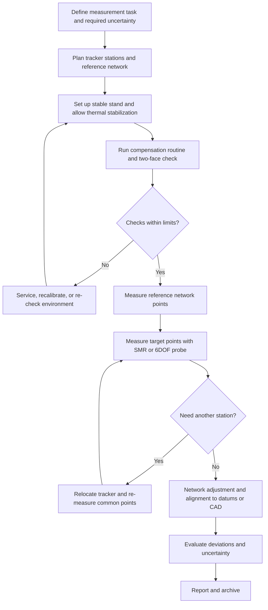

## Laser Trackers

### Overview and Purpose

A laser tracker is a portable, large-volume coordinate measuring instrument that determines the three-dimensional position of a retroreflective target by combining **one distance measurement** with **two angle measurements** in a spherical coordinate system. A laser beam leaves the tracker head, travels to a retroreflector (most commonly a spherically mounted retroreflector, or SMR), returns along the same path, and is used to measure the range. Two rotary axes (azimuth and elevation) steer the beam and are fitted with high-resolution angle encoders. A position-sensing detector in the tracker senses any lateral movement of the returning beam and drives servo motors so the beam **follows the moving target**, which is the origin of the word "tracker".

Laser trackers occupy the large-volume end of dimensional metrology. Where a bridge CMM measures within a few cubic meters and an articulated arm within a sphere of roughly one to four meters, a tracker commonly measures at ranges of tens of meters with micrometer-level uncertainty per meter of distance. They are used in aerospace assembly, shipbuilding, power generation, large machine tool alignment and calibration, particle accelerator alignment, antenna and telescope manufacture, and automotive tooling.

**Key Points**

- A tracker is a **spherical coordinate measuring system**: one range and two angles produce $(x, y, z)$. The range measurement is far more accurate than the angle measurements, so tracker uncertainty is strongly direction-dependent (see the uncertainty section).
- The range measurement uses **interferometry (IFM)** and/or **absolute distance measurement (ADM)**. Modern trackers rely primarily on ADM and use interferometry, where fitted, for high-accuracy relative distances.
- Measurements require **line of sight** between the tracker and each target. Occlusion by structure, personnel, or the part itself is the dominant practical limitation.
- Performance is verified under **ISO 10360-10** (laser trackers for measuring point-to-point distance), and by the ASME B89.4.19 standard in the United States. Test details depend on the edition, so confirm the edition applied.

### Operating Principle

#### Spherical Coordinate Measurement

The tracker measures a range $\rho$, an azimuth angle $\theta$ (rotation about the vertical standing axis), and an elevation angle $\varphi$ (rotation about the horizontal transit axis). The Cartesian position of the target in the tracker frame is:

$$x = \rho \cos\varphi \cos\theta$$

$$y = \rho \cos\varphi \sin\theta$$

$$z = \rho \sin\varphi$$

The exact axis and sign conventions differ among manufacturers (for example, whether elevation is measured from the horizontal plane or from the vertical axis), so verify the convention before combining tracker data with other sources.

#### Beam Steering and Tracking

The beam exits through an aperture in the head and is steered by rotating the head about the standing axis and the beam-steering mirror or optical assembly about the transit axis. Two general architectures exist:

- **Rotating-head (gimbal) design**: the whole optical head rotates about the transit axis, carrying the laser, interferometer, and detector with it.
- **Mirror-steered design**: the laser and optics are fixed, and a rotating mirror (and yoke) directs the beam to the target, which reduces the moving mass.

In both, the return beam from the retroreflector passes back through the optics. A **position-sensing detector (PSD)**, a quadrant detector or a camera-based sensor, reports the lateral offset of the returning beam relative to the optical axis. The control loop drives the axes to null that offset, keeping the beam centered on the retroreflector as it moves.

(svg_diagram)

<svg xmlns="http://www.w3.org/2000/svg" viewBox="0 0 680 400" width="680" height="400" font-family="Arial, sans-serif" font-size="13">
<title>Laser Tracker Spherical Measurement Geometry (svg_diagram)</title>
<rect x="0" y="0" width="680" height="400" fill="#ffffff" stroke="#cccccc" />
<text x="340" y="24" text-anchor="middle" font-size="15" font-weight="bold">Laser Tracker Spherical Measurement Geometry (svg_diagram)</text>

<line x1="120" y1="320" x2="600" y2="320" stroke="#888" stroke-width="1.5" />
<line x1="120" y1="320" x2="120" y2="70" stroke="#888" stroke-width="1.5" />
<text x="606" y="325" fill="#666">X</text>
<text x="126" y="78" fill="#666">Z (standing axis)</text>

<rect x="100" y="300" width="40" height="30" fill="#9aa9b8" stroke="#345" stroke-width="2" />
<circle cx="120" cy="300" r="12" fill="#345" />
<text x="120" y="358" text-anchor="middle">Tracker</text>

<line x1="120" y1="300" x2="500" y2="140" stroke="#d33" stroke-width="2.5" />
<text x="290" y="200" fill="#d33" transform="rotate(-22 290 200)">Range (rho) from IFM/ADM</text>

<circle cx="500" cy="140" r="12" fill="#e8c36a" stroke="#543" stroke-width="2" />
<text x="500" y="118" text-anchor="middle">SMR target</text>

<line x1="500" y1="140" x2="500" y2="320" stroke="#28a" stroke-width="1.5" stroke-dasharray="5,4" />
<line x1="120" y1="300" x2="500" y2="320" stroke="#28a" stroke-width="1.5" stroke-dasharray="5,4" />

<path d="M220 262 A100 100 0 0 1 220 300" fill="none" stroke="#3a3" stroke-width="2" />
<text x="235" y="290" fill="#3a3">Elevation (phi)</text>

<text x="330" y="345" fill="#28a" text-anchor="middle">Azimuth (theta) measured in the horizontal plane</text>
<text x="340" y="385" text-anchor="middle" font-size="11">Range, azimuth, and elevation are converted to Cartesian coordinates in the tracker frame.</text>
</svg>

#### Range Measurement Technologies

##### Interferometer (IFM)

A helium-neon (HeNe) or similar stabilized laser drives a Michelson-type interferometer. A fringe counter tracks the change in path length as the target moves. The displacement is:

$$\Delta \rho = \frac{N \, \lambda_{vac}}{2 \, n_{air}}$$

where $N$ is the fringe count, $\lambda_{vac}$ the vacuum wavelength, and $n_{air}$ the refractive index of air along the path. The factor of 2 reflects the double pass (out and back).

The interferometer measures **relative displacement** with very high resolution (sub-micrometer), but the beam must remain **unbroken** between the tracker and the target. If the beam is interrupted, the fringe count is lost and the distance must be re-established from a known reference point (a "birdbath" or home position on the tracker).

##### Absolute Distance Meter (ADM)

An ADM measures the **absolute distance** to the target at each point without needing an unbroken beam, so the operator can move the target between points with the beam blocked. Several ADM principles exist, including modulated-intensity phase measurement, frequency-modulated or swept-wavelength techniques, and combinations. The specific principle depends on the manufacturer.

For a phase-based ADM using an intensity modulation frequency $f_m$, the round-trip phase shift $\Delta\phi$ relates to distance as:

$$\rho = \frac{c}{2 \, n_{group} \, f_m} \left( \frac{\Delta\phi}{2\pi} + m \right)$$

where $c$ is the speed of light in vacuum, $n_{group}$ the group refractive index of air, and $m$ an integer ambiguity resolved by using multiple modulation frequencies. Different ADM architectures use different equations, so this expression is illustrative of the phase-based approach rather than a description of any specific instrument.

**Key Points**

- Modern trackers often have **ADM-only** or **IFM-plus-ADM** configurations. Interferometers were historically more accurate over short distances, and ADM performance has narrowed the difference for many uses. [Unverified] The relative advantage of IFM versus ADM depends on the model and generation, so consult the specific instrument's stated accuracy.
- ADM enables **point-to-point measuring** with beam breaks allowed, which speeds work in complex structures. IFM is used for dynamic tracking or where the lowest range uncertainty is needed.

### Instrument Components

| Component | Function |
| --- | --- |
| **Laser source** | Provides the measurement beam (stabilized HeNe or laser diode) with a known wavelength |
| **Range measuring unit** | IFM and/or ADM electronics and optics |
| **Beam steering optics** | Aim the beam and return signal along the same path |
| **Azimuth and elevation axes** | Precision bearings with servo motors |
| **Angle encoders** | High-resolution rotary encoders (optical circular scales) on both axes |
| **Position-sensing detector (PSD)** | Detects the lateral offset of the return beam for tracking control |
| **Environmental sensors** | Temperature, pressure, and humidity sensors to compute the refractive index of air |
| **Controller and communications** | Real-time control, data output, wired or wireless connection |
| **Stand or tripod** | Provides a stable platform, with height adjustment |
| **Reference features** | Birdbath (IFM home position), reference sockets, and internal calibration references |

#### Retroreflectors and Targets

| Target | Description | Typical Use |
| --- | --- | --- |
| **Spherically mounted retroreflector (SMR)** | A corner-cube retroreflector embedded in a precision steel sphere, whose center coincides (within tolerance) with the cube's vertex | The standard tracker target. The sphere can be seated in a nest or held against a surface, and the tracker measures the sphere center |
| **Cat's eye retroreflector** | Two glass hemispheres and a mirror, giving a wide acceptance angle | Wide-angle tracking |
| **Glass-cube corner reflector** | Larger acceptance angle in some designs | Special applications |
| **Reflective tape and photogrammetric targets** | Used with other sensors | Not for tracker range measurement |
| **Probes with active or passive retroreflectors** | Hand-held tools carrying a reflector and a stylus (for example, 6DOF probes) | Measuring hidden points and features |

The SMR's **centering error** (the offset between the sphere's geometric center and the optical vertex of the corner cube) and its **sphere form error** contribute directly to measurement error, and SMRs are graded and supplied with specified tolerances (for example, a few micrometers for high-grade units). SMRs also rotate in their nests during use, so an eccentricity in the reflector causes a position error that depends on its orientation. Measurement procedures that require the highest accuracy orient SMRs consistently or average over rotation.

**Key Points**

- The SMR is measured at the **sphere center**, not at the touched surface. As with a CMM stylus, the software applies an offset equal to the sphere radius along the surface normal when the SMR is touched against a workpiece, and the offset is an inherent part of the procedure.
- The SMR has a limited **acceptance angle** (typically a half-angle on the order of tens of degrees, depending on the design). Rotating the SMR beyond this angle relative to the beam loses the signal.
- Keep reflector surfaces clean, since contamination degrades the returned signal and can introduce measurement error.

### Measurement Modes and Accessories

#### Static Point Measurement

The most common mode: place the SMR at a point (in a nest, on a feature, or against a surface), hold it steady for a brief averaging interval, and record the coordinates. Averaging over a short time reduces noise.

#### Dynamic (Tracking) Measurement

The tracker follows a moving target and streams coordinates at a specified rate. Applications include machine tool path verification, robot path measurement, and structural deflection monitoring. Dynamic accuracy is lower than static accuracy and depends on the target speed, the tracker's latency, and the timing synchronization.

#### Scanning with a Tracker

A tracker can build a point cloud by moving an SMR (or a probe) over a surface and recording points at high rate. The result is less dense and less accurate per point than a laser line scanner, but it is useful for large surfaces where the tracker's volume is essential.

#### Six-Degree-of-Freedom (6DOF) Systems

Standard tracking yields a three-dimensional position. A **6DOF** system also determines the target's **orientation** (three rotations), by adding a camera-based or other sensing system that images an orientation-sensitive target (an active or passive marker pattern on a probe or tool).

Applications include:

- **Hand-held probes** with a stylus tip, which allow measurement of points not accessible to a line-of-sight SMR (for example, hidden features or inside a bore).
- **Scanner attachments** (laser line scanners tracked by the laser tracker) for scanning over the tracker's large volume.
- **Robot end-effector tracking** and calibration.

**Key Points**

- The orientation accuracy of a 6DOF system is generally lower than the position accuracy, and the effective accuracy at the stylus tip grows with the stylus length through the lever-arm effect: an angular error $\delta\theta$ produces a tip error of about $\delta\theta \cdot L$.
- Accuracy statements for 6DOF systems are separate from the base tracker specification and depend on the probe design and its calibration.

#### Multi-Tracker and Multilateration Configurations

By measuring the same target from **several tracker positions**, the redundant distance measurements enable **multilateration**. Because the range measurement is much more accurate than the angle measurements, multilateration using ranges only (ignoring angles) yields higher accuracy than single-tracker spherical measurement. Systems with a tracker that measures only distance (sometimes called a laser tracer or a tracking interferometer) exploit this.

The multilateration equation for a target at unknown position $\vec{p}$, measured from stations at positions $\vec{s}_k$ with measured distances $d_k$, is:

$$\left\| \vec{p} - \vec{s}_k \right\| = d_k + e_k, \qquad k = 1, \ldots, K$$

With $K \ge 4$ non-coplanar stations, the position is found by least squares. With more stations than the minimum, the **station coordinates themselves can be estimated** in a self-calibrating manner from the redundant data (self-calibrating multilateration). This approach underlies volumetric error mapping of CMMs and machine tools.

#### Tracker Networks and Multi-Station Measurements

For large structures or when line of sight is blocked, the tracker is **moved to a new position** and the new station is related to the first through **common reference points** (fixed monuments or targets seen from both positions). The transformations are chained and optimized in a bundle-type adjustment.

### Uncertainty Characteristics of Laser Trackers

#### Direction-Dependent Uncertainty

Because the tracker measures range with high accuracy and angles with lower accuracy, the uncertainty ellipsoid is **elongated across the line of sight** (transverse to the beam) and **shortest along the beam**. For a target at distance $\rho$ with an angular standard uncertainty $\sigma_\theta$, the transverse position uncertainty is approximately:

$$\sigma_{transverse} \approx \rho \, \sigma_\theta$$

and the radial (range) uncertainty is $\sigma_\rho$, which is typically much smaller than the transverse component at long range.

**Example: Transverse Uncertainty vs. Range**

An angle standard uncertainty of $1.5$ arcseconds is about $7.3 \ \mu\text{rad}$. At a target distance of $10$ m:

$$\sigma_{transverse} \approx 7.3 \times 10^{-6} \times 10\,000 \ \text{mm} = 73 \ \mu\text{m}$$

At $2$ m, the same angular uncertainty gives about $15 \ \mu\text{m}$. The range uncertainty at these distances (often quoted at the level of a few micrometers plus a small ppm term) is far smaller. This shows why the position uncertainty in a tracker's measurement grows roughly linearly with distance in the transverse directions, and why the best practice is to keep targets close to the tracker whenever possible.

#### Typical Specification Form

Manufacturers usually state accuracy as a **maximum permissible error (MPE)** for the 3D position, of the form:

$$\text{MPE}_{3D} = \pm \left( A + B \cdot \rho \right)$$

where $A$ is a constant term in micrometers, $B$ is a coefficient in micrometers per meter, and $\rho$ is the distance in meters. Range-only (IFM/ADM) specifications use a separate expression, typically with a smaller $B$. The specific values depend on the model, so refer to the manufacturer's data sheet, and note that these are stated for specified conditions.

#### Error Sources

| Category | Sources |
| --- | --- |
| **Range measurement** | Refractive index error (temperature, pressure, humidity), laser wavelength stability, ADM electronic errors, dead-path effects, SMR centering |
| **Angle measurement** | Encoder graduation and eccentricity errors, axis wobble, bearing runout, tilt, non-orthogonality of axes |
| **Instrument geometry** | Transit axis offset, beam offset (the beam not intersecting the axes' crossing point), axis non-perpendicularity, collimation errors |
| **Target** | SMR centering and sphere form, target orientation dependence, contamination |
| **Environment** | Air temperature gradients, turbulence, vibration, thermal effects on the instrument |
| **Mounting** | Stand stability, floor vibration, drift |
| **Procedural** | Operator technique, nest quality, network design, alignment |

The instrument geometry errors are determined through **self-compensation** (also called *two-face* or *front-sight/back-sight* measurement) routines: the tracker measures the same target in both "faces" (the head is rotated 180 degrees in azimuth and flipped in elevation), and the differences are used to determine and correct geometric misalignment parameters (for example, collimation, transit axis tilt, and offsets). Trackers that can automatically perform such tests are often described as having an **on-board compensation** routine.

#### Refractive Index Compensation

The wavelength of light in air depends on its refractive index, which depends on temperature, pressure, humidity, and CO$_2$ concentration. The range is corrected using an estimate of $n_{air}$ computed from the tracker's environmental sensors, with equations such as the **Edlen** or **Ciddor** formulas (the Ciddor equation is generally considered more accurate over a wider range of conditions, and the choice can depend on the instrument).

A change in $n_{air}$ of 1 ppm produces a range error of about 1 micrometer per meter. A temperature error of about 1 K corresponds to roughly 1 ppm of change in refractive index (a rule of thumb for air near standard conditions), so a $1$ K error in the assumed air temperature along a $10$ m path yields an error on the order of $10 \ \mu\text{m}$ in the range measurement. Because the environmental sensors measure conditions at the instrument, not along the whole path, temperature gradients over long paths are an important uncertainty source in shop environments. [Inference] The effect of such gradients can be several ppm in poorly controlled spaces, which is why stable environments and shorter paths yield better results.

**Key Points**

- The range uncertainty is influenced by the **environmental compensation** as much as by the instrument, so environmental sensor accuracy and air stability matter.
- The tracker's interferometer or ADM measures the **optical path**, which is corrected to a geometric path length using the refractive index. Errors in the index correction are proportional to distance.
- **Heat sources**, drafts, and sunlight along the beam path cause local refractive index variations and beam wander. Avoid measuring through hot exhaust, over machinery that has just run, or above radiators.

### Performance Verification and Calibration

#### ISO 10360-10 and ASME B89.4.19

**ISO 10360-10** defines the acceptance and reverification tests for laser trackers used to measure point-to-point distances, and **ASME B89.4.19** is the corresponding US standard. The specific tests and their parameters differ in detail among editions, so verify the edition when performing or interpreting the results.

Typical test elements:

| Test | Purpose |
| --- | --- |
| **Ranging (length) tests** | Measure calibrated lengths (with a reference bar, a calibrated rail with an interferometer, or a calibrated length artefact) in different positions and orientations to evaluate the range error |
| **Two-face system test** | Compare measurements from the front and back sights of the tracker, revealing geometric misalignments (transit axis offset, collimation, etc.) |
| **Length measurement (bar) tests** | Measure a calibrated scale bar at defined positions and orientations in the working volume, comparing measured and reference lengths |
| **Repeatability tests** | Repeated measurement of the same points, to determine random error |

The results are compared with the manufacturer's stated MPE for the parameters ($E_{L,MPE}$ for length, $R_{0,MPE}$ for repeatability, and $E_{Bi,MPE}$ etc., depending on the edition's notation). The number of test positions and orientations, and the acceptance rule, are specified in the standard.

**Example: Length Test with a Scale Bar**

A calibrated carbon-fiber scale bar of nominal length $2.300$ m is placed at multiple positions and orientations (horizontal, vertical, diagonal) around the tracker at different ranges. For each placement, the tracker measures the SMR positions at the two ends, and the length error is:

$$E_L = L_{measured} - L_{calibrated}$$

where the calibrated length has been corrected for the bar's temperature. The set of errors is compared with the MPE for that length. Errors that vary with the bar orientation or position point to angular encoder or geometric errors, while errors that grow with range point to refractive index compensation or range scale errors.

#### Calibration Levels

- **Factory or service calibration**: the manufacturer or an accredited laboratory determines instrument parameters using a calibrated reference (for example, a long interferometer rail for range, and a calibration against a reference angle standard or a multi-tracker approach for the angle and geometry parameters).
- **Field compensation (self-calibration)**: the user runs the tracker's compensation routine (two-face measurements and internal checks) periodically, which updates the geometric parameters. It is generally recommended after transport, temperature changes, or when errors are suspected.
- **Interim checks**: regular checks with a scale bar or reference length, and inspection of the two-face measurements, to detect drift or damage.

**Key Points**

- Two-face measurements act as a rapid **health check** of the instrument, since the front-sight and back-sight results should agree within the specified tolerance, and disagreement points to a misalignment or a fault.
- A tracker is a precision optical instrument. Shocks, transport, and rough handling can misalign the optics and axes, so a check after transportation is prudent.
- Recalibration intervals depend on the manufacturer's recommendation, the usage, and the required accuracy.

### Measurement Planning and Network Design

#### Station Placement

Good planning improves accuracy and reduces occlusion problems:

- Place the tracker **close to the measurement region**, since transverse uncertainty grows with range.
- Position the tracker so the working volume is in the **region of best accuracy** (often at moderate elevation angles, avoiding extreme angles near the vertical axis where azimuth becomes ill-defined).
- Ensure a **stable mount**, either a rigid stand on a stable floor or a fixed pillar, and avoid areas with vibration.
- Select station locations with **clear lines of sight** to the required targets and to the common reference points used for relocation.
- Consider **temperature stability**: avoid placing the beam path over heat sources and airflow.

#### Reference Network and Common Points

For measurements requiring multiple stations, establish a **network of stable reference points** (monuments, nests, or fixed targets) visible from the stations. The station-to-station transformation is computed from the common points using a rigid-body registration (see the alignment topic), and the registration accuracy depends on the number and spatial distribution of the common points.

A network adjustment (least squares, often called a bundle adjustment when angles and ranges are included) estimates the station positions and the target coordinates simultaneously and yields an uncertainty estimate for each point.

The observation model for the adjustment is:

$$\rho_{ik} = \left\| \vec{p}_i - \vec{s}_k \right\| + e_{\rho}, \quad \theta_{ik} = f_\theta(\vec{p}_i, \vec{s}_k, R_k) + e_\theta, \quad \varphi_{ik} = f_\varphi(\vec{p}_i, \vec{s}_k, R_k) + e_\varphi$$

where $\vec{p}_i$ is the position of target $i$, $\vec{s}_k$ and $R_k$ are the position and orientation of station $k$, and $e_\rho$, $e_\theta$, $e_\varphi$ are the measurement errors. The functions $f_\theta$ and $f_\varphi$ express the azimuth and elevation measured at station $k$ of point $i$. The weights in the adjustment reflect the different uncertainties of range and angles.

**Example: Network Benefit**

If a target is measured from two stations placed roughly at right angles to each other, the transverse uncertainty seen from one station is along the other station's line of sight, where the range uncertainty (small) dominates. The combined estimate is much better than either station alone across the transverse directions. This is the geometric reason why multi-station measurement and multilateration improve the overall accuracy.

### Applications

#### Alignment and Assembly

- **Aerospace**: aircraft wing and fuselage assembly, jig and fixture alignment, and final position verification of large components.
- **Shipbuilding and heavy structures**: block alignment, hull fairness checks, and large weldment inspection.
- **Power generation**: turbine and generator alignment, and large casting inspection.
- **Particle accelerators and telescopes**: high-precision alignment of magnets and optical structures over long distances.

#### Machine Tool and CMM Calibration

- **Volumetric error mapping** using multilateration with one or several trackers (or a tracker used as a distance-only device), yielding the geometric error field used in compensation.
- **Axis positioning and straightness checks** on large machine tools using the tracker as a reference.
- **Robot calibration**: tracking the end-effector position as the robot moves through a set of poses, for identifying the kinematic parameters (for example, the DH parameters) of industrial robots and improving their absolute accuracy.

#### Reverse Engineering and Inspection

- Measuring large tooling, patterns, and dies where a bridge CMM is too small.
- Inspecting large formed panels, molds, and fixtures against CAD.
- Combining tracker-tracked scanners for large-surface scanning.

#### Dynamic Measurement

- Machine motion path testing and accuracy evaluation.
- Structural deflection measurements, as in load tests.
- Robot path accuracy and repeatability under ISO 9283-style testing.

### Comparison with Other Large-Volume Systems

| Attribute | Laser Tracker | Articulated Arm | Photogrammetry | Laser Radar (Lidar-type) | Indoor GPS-type Systems |
| --- | --- | --- | --- | --- | --- |
| Typical range | Tens of meters | A few meters | Meters to tens of meters | Tens of meters | Tens of meters (network-based) |
| Typical accuracy level | High over large volumes (micrometers per meter scale) | Moderate | Good, depends on camera network | Moderate to good, non-contact | Lower than trackers |
| Target requirement | Retroreflector (SMR) | None (contact probe) | Coded or retroreflective targets | None (surface reflectivity) | Receivers |
| Line of sight | Required | Not applicable (contact) | Required from cameras | Required | Required from transmitters |
| Multi-point speed | Sequential | Sequential | Many points simultaneously | Scanning, many points | Multiple simultaneous targets |
| Best use | Precision large-scale alignment and calibration | Portable inspection and scanning | Large numbers of targets, dynamic deformation | Non-contact large-part inspection | Large-scale positioning of multiple objects |

Accuracy comparisons depend on the specific product and configuration, so the table shows general relationships and not quoted values.

### Safety Considerations

Laser trackers use laser radiation classified by the standard IEC 60825-1 (and equivalent regulations), commonly in classes with limited hazard (for example, Class 2 or a similar low-power classification, depending on the model and its optical power). Users should:

- Follow the manufacturer's laser safety instructions and the site's laser safety program.
- Avoid directing the beam at people's eyes, and avoid staring into the beam.
- Be aware of **reflective surfaces** that may redirect the beam unexpectedly.
- Use warning signs and controlled access in areas where required by the classification and local regulations.

The actual class and requirements depend on the instrument, so consult the product documentation and local regulations.

### Common Problems and Troubleshooting

| Symptom | Likely Cause | Corrective Action |
| --- | --- | --- |
| Beam loses the target frequently | Occlusion, target outside the acceptance angle, SMR dirty, fast movement | Improve line of sight, orient the SMR toward the tracker, clean the SMR, and move more slowly |
| Range errors growing with distance | Refractive index error, temperature gradients, or a faulty environmental sensor | Stabilize the environment, check the sensors, shorten the beam path |
| Front-sight and back-sight measurements disagree | Instrument misalignment or a need for compensation | Run the compensation routine, and service the instrument if the disagreement persists |
| Scatter in repeated measurements | Vibration, unstable stand, air turbulence, or a loose SMR nest | Stabilize the stand, reduce the turbulence, and improve the SMR seating |
| Systematic offset between stations after relocation | Poor common points, movement of monuments, or a network geometry weakness | Use more and better-distributed stable references, and check for reference movement |
| Errors depend on the SMR's orientation | SMR centering error | Use a higher-grade SMR, maintain a consistent orientation, or average over rotation |
| Drifting readings after warm-up | Thermal drift of the instrument or the environment | Allow adequate warm-up, avoid direct heat sources, and monitor temperature |
| Poor 6DOF probe accuracy | Calibration error, the camera view of the markers is obstructed or angled poorly, or a long stylus lever arm | Recalibrate the probe, improve the orientation of the probe toward the tracker, and use a shorter stylus |
| Disagreement with a CMM measurement | Different alignment, SMR offset or sphere compensation error, thermal difference | Compare on a common calibrated artefact, and check the offset compensation and the alignment |

### Best Practices

**Key Points**

- Place the tracker **as close to the measured region as practical**, on a stable stand or pillar, and away from heat sources and vibration.
- Allow the instrument to reach **thermal equilibrium**, and run the manufacturer's **compensation and two-face checks** before critical work and after transport.
- Verify the **environmental sensors** and keep beam paths free from gradients and turbulence.
- Use **high-quality, clean SMRs** and consistent nests, and account for the SMR radius offset when measuring against surfaces.
- Design a **reference network** with stable, well-distributed common points, and minimize the number of relocations.
- Use **network adjustment** and evaluate the resulting uncertainty, rather than relying on the nominal instrument specification alone.
- Apply **multilateration** or multi-station strategies when the highest accuracy is required.
- Choose 6DOF probes and scanners with awareness of their **separate accuracy specifications** and lever-arm effects.
- Perform **periodic verification** with a calibrated scale bar or reference length in accordance with ISO 10360-10 or ASME B89.4.19, and after any shock or fault.
- Follow **laser safety** requirements, and control access as needed.
- Document the **setup, environment, station positions, reference points, and software settings** so results can be reproduced and audited.

### Conclusion

Laser trackers measure a target's three-dimensional position from one high-accuracy range measurement and two angle measurements, using a retroreflector, servo-controlled beam tracking, and environmental compensation of the refractive index of air. Their principal strength is precision over large volumes with a portable instrument, and their principal limitations are the need for line of sight, the growth of transverse uncertainty with distance, and sensitivity to air conditions. Accuracy is maintained through factory calibration, field compensation using two-face measurements, verification against ISO 10360-10 or ASME B89.4.19, careful station and network planning, and disciplined handling of targets and environment. Multilateration and multi-station networks exploit the superior accuracy of the range measurement to reduce the direction-dependent uncertainty, and 6DOF probes and tracked scanners extend the tracker to hidden features and surface scanning. Selecting the tracker, targets, network geometry, and procedures to fit the required uncertainty is what makes large-volume measurement results defensible.

**Related Topics**

- Interferometer and absolute distance meter (ADM) measurement principles
- Refractive index of air: Edlen and Ciddor equations and environmental compensation
- SMR grades, centering error, and nest design
- Two-face compensation and tracker geometric error models
- ISO 10360-10 and ASME B89.4.19 verification tests
- Multilateration, self-calibrating networks, and volumetric error mapping
- Network adjustment and bundle adjustment for multi-station measurements
- 6DOF probing and tracked laser scanners
- Robot calibration and dynamic path measurement with trackers
- Large-volume metrology alternatives: photogrammetry, laser radar, and indoor positioning systems
- Laser safety classification (IEC 60825-1) for measurement instruments