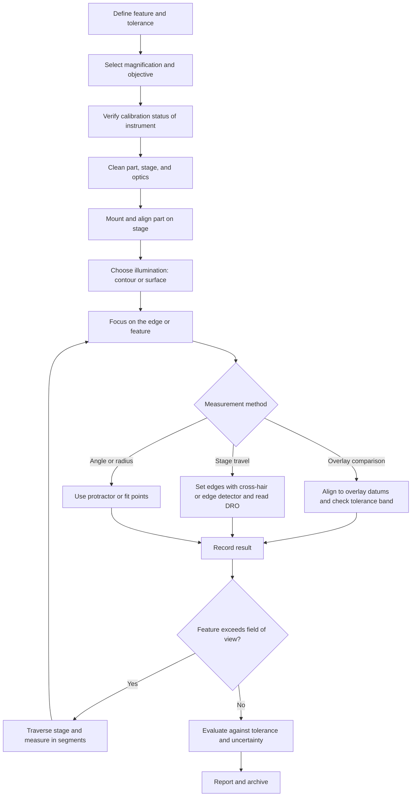

## Optical Profile Projectors

### Overview and Purpose

An optical profile projector (also called an **optical comparator** or **shadowgraph**) is a non-contact measuring instrument that magnifies the silhouette or surface image of a small workpiece and projects it onto a ground-glass screen. The operator compares the magnified outline against a **tolerance overlay (chart)** or measures features directly using stage travel, screen protractors, and reticles. Because the workpiece is never touched, delicate, soft, thin, or micro-scale parts (gaskets, springs, gears, threads, stampings, electronic contacts, cutting tool inserts, watch components, and rubber seals) can be inspected without deformation.

The method rests on simple geometrical optics: a collimated or near-collimated light beam passes around the part, an objective lens forms a real, magnified image, and mirrors fold the light path so that the image lands on a screen at a convenient viewing position. Modern instruments add digital readouts (DRO), edge detectors, video cameras, and measurement software, blurring the boundary between the classical comparator and the **video measuring machine (VMM)**. The classical projector, however, remains widely used because it is fast, intuitive, robust, and inexpensive for 2D profile inspection.

**Key Points**

- A profile projector measures **2D geometry** (silhouette outlines and, with surface illumination, top-view features). It does not directly measure height, depth, or form in the viewing direction unless combined with a focus or height sensor.
- Accuracy depends on **magnification accuracy, optical distortion, stage accuracy, edge definition, illumination, and operator technique**.
- Typical uses include profile comparison against overlays, thread and gear form checks, angle and radius measurement, and dimensional measurement of small parts.
- Instrument performance for digital versions is often verified through methods derived from ISO 10360 practice (for example, imaging probing tests in ISO 10360-7 for video systems), and calibration relies on glass scales, stage micrometers, and reference artefacts. The standards applied depend on the instrument type and the customer's quality system.

### Optical Principles

#### Image Formation and Magnification

The objective lens forms a magnified real image of the workpiece. For a thin lens, the lateral magnification is:

$$M = -\frac{s'}{s} = \frac{f}{f - s}$$

where $s$ is the object distance, $s'$ is the image distance, and $f$ is the focal length (the negative sign indicates an inverted real image). In a projector, the total screen magnification is the product of the objective magnification and the magnification of the projection relay (mirrors and any field lens):

$$M_{total} = M_{obj} \times M_{relay}$$

Standard projector objectives are provided at fixed magnifications (commonly $5\times$, $10\times$, $20\times$, $50\times$, and $100\times$), and changing the objective is the primary way to change the field of view and the resolution.

The **field of view (FOV)** on the workpiece is the screen diameter (or the useful screen size) divided by the total magnification:

$$FOV_{object} = \frac{D_{screen}}{M_{total}}$$

**Example: Field of View**

A projector has a $300$ mm diameter screen. At $10\times$ magnification, the field of view on the workpiece is:

$$FOV = \frac{300}{10} = 30 \ \text{mm}$$

At $50\times$, the field of view shrinks to $6$ mm. Higher magnification improves the ability to resolve small details but limits the size of the part that can be seen at once, so larger parts must be measured in segments by traversing the stage.

#### Resolution and Diffraction Limits

The smallest resolvable feature is limited by diffraction and by the numerical aperture (NA) of the objective. The Rayleigh criterion gives:

$$d_{min} = \frac{0.61 \, \lambda}{NA}$$

For visible light ($\lambda \approx 0.55 \ \mu\text{m}$) and a typical projector objective with a low numerical aperture (for example, NA $\approx 0.05$ to $0.1$), the diffraction-limited resolution is on the order of several micrometers. This is normally not the dominant limitation for a shop-floor projector, because screen viewing acuity, edge blur, and distortion limit the practical measurement uncertainty more than diffraction does, but it sets the theoretical limit for very small features and for edge localization.

The relationship between numerical aperture and depth of field is important:

$$DOF \approx \frac{\lambda \, n}{NA^2}$$

where $n$ is the refractive index of the medium (approximately 1 for air). Because projector objectives have low NA, the **depth of field is relatively large**, which is one reason the projector is forgiving of small focusing errors on thin silhouettes, but it also means the edge position is influenced by focus setting, since slight defocus blurs the edge.

#### Telecentricity

A **telecentric** objective has its entrance or exit pupil at infinity, so that the chief rays are parallel to the optical axis in object space (object-space telecentric) and the image magnification does not vary with small changes in object distance. Telecentric optics are important in measuring projectors because otherwise a change in the object's height (or a focusing adjustment) changes the apparent size of the part, producing a magnification error.

For a non-telecentric objective, a small object-distance change $\Delta s$ produces a fractional magnification change of approximately:

$$\frac{\Delta M}{M} \approx \frac{\Delta s}{s - f}$$

which can be significant when $s - f$ is small (short working distance). In a telecentric system, this change is reduced to a small residual determined by the telecentricity error. [Inference] Most quality measuring projectors and video systems use object-space telecentric objectives for this reason, though budget and older instruments may not be fully telecentric.

**Key Points**

- Telecentric optics **reduce perspective error** and make the measurement less sensitive to focusing and to part height differences.
- Even with telecentric optics, the finite telecentric range limits the size of the height variation that can be tolerated, and errors increase as the part is defocused.
- For surface illumination measurements of features at different heights, focusing on each feature separately is still necessary.

### Instrument Architecture

Projectors are built in **two principal configurations**, classified by the orientation of the optical axis.

| Configuration | Optical Axis | Typical Use | Characteristics |
| --- | --- | --- | --- |
| **Horizontal (bench-top, horizontal-axis) projector** | Horizontal, with light passing horizontally through the part and the screen on the front | Shafts, long slender parts, thread checks, parts held between centers | The part is often mounted between centers or on V-blocks. The screen is at eye height |
| **Vertical (inverted) projector** | Vertical, with the part lying flat on a horizontal stage | Flat parts, stampings, gaskets, PCB features | The part rests under its own weight on a glass stage. Convenient for flat and irregular parts |

#### Main Subsystems

| Subsystem | Function |
| --- | --- |
| **Light source** | Provides transmitted (contour) and reflected (surface) illumination. Common sources are halogen lamps and LEDs, with LEDs increasingly preferred for stable output, long life, and low heat |
| **Condenser optics** | Collect and collimate the light from the source to provide uniform illumination and a controlled beam |
| **Stage** | A precision XY table carrying the part, with fine adjustment, a glass plate, and often a rotary attachment. A vertical focus axis may be provided |
| **Objective lens (turret or interchangeable)** | Forms the magnified image, with a range of magnifications |
| **Projection relay and mirrors** | Fold the beam and deliver the image to the screen |
| **Ground-glass screen** | Displays the magnified image, with a reticle or an overlay chart |
| **Screen protractor (rotating screen)** | Enables angle measurement through rotation of a reticle or of the screen itself |
| **Measuring aids** | Digital readouts (DRO), edge detectors, cameras, height gauges, and software |

(svg_diagram)

<svg xmlns="http://www.w3.org/2000/svg" viewBox="0 0 700 420" width="700" height="420" font-family="Arial, sans-serif" font-size="13">
<title>Horizontal Optical Profile Projector Light Path (svg_diagram)</title>
<rect x="0" y="0" width="700" height="420" fill="#ffffff" stroke="#cccccc" />
<text x="350" y="24" text-anchor="middle" font-size="15" font-weight="bold">Horizontal Optical Profile Projector Light Path (svg_diagram)</text>

<rect x="30" y="180" width="40" height="40" fill="#f2d16b" stroke="#543" stroke-width="2" />
<text x="50" y="240" text-anchor="middle">Lamp</text>

<ellipse cx="120" cy="200" rx="10" ry="34" fill="#cfe6f5" stroke="#345" stroke-width="2" />
<text x="120" y="256" text-anchor="middle">Condenser</text>

<line x1="70" y1="190" x2="230" y2="190" stroke="#d33" stroke-width="1.5" />
<line x1="70" y1="210" x2="230" y2="210" stroke="#d33" stroke-width="1.5" />

<rect x="235" y="185" width="14" height="30" fill="#444" stroke="#000" stroke-width="2" />
<text x="242" y="235" text-anchor="middle">Part</text>

<ellipse cx="310" cy="200" rx="10" ry="30" fill="#cfe6f5" stroke="#345" stroke-width="2" />
<text x="310" y="252" text-anchor="middle">Objective</text>

<line x1="250" y1="190" x2="440" y2="200" stroke="#d33" stroke-width="1.5" />
<line x1="250" y1="210" x2="440" y2="200" stroke="#d33" stroke-width="1.5" />

<line x1="425" y1="215" x2="455" y2="185" stroke="#345" stroke-width="5" />
<text x="440" y="235" text-anchor="middle">Mirror</text>

<line x1="440" y1="200" x2="440" y2="90" stroke="#d33" stroke-width="1.5" />

<line x1="425" y1="75" x2="455" y2="105" stroke="#345" stroke-width="5" />
<text x="440" y="66" text-anchor="middle">Mirror</text>

<line x1="440" y1="90" x2="600" y2="90" stroke="#d33" stroke-width="1.5" />

<rect x="600" y="50" width="16" height="80" fill="#dfe8f2" stroke="#345" stroke-width="2" />
<text x="608" y="150" text-anchor="middle">Screen</text>
<text x="608" y="166" text-anchor="middle" font-size="11">(magnified image)</text>

<text x="350" y="395" text-anchor="middle" font-size="11">Transmitted illumination silhouettes the part. Mirrors fold the path to the viewing screen.</text>
</svg>

#### Screen Types and Overlays

- **Ground-glass or frosted screens** provide a diffuse image, often with cross-hairs, a scale, or a rotating protractor.
- **Overlay charts** (tolerance charts) are transparent or translucent sheets, printed or engraved, drawn at the projector's magnification, showing the nominal profile and the tolerance boundaries. They are placed over the screen so the operator can judge visually whether the projected outline lies inside the tolerance band. Overlays exist for standard forms (thread profiles, radii, angles, gear teeth) and custom parts.
- **Screen reticles** include crosshairs, radius gauges, angle gauges, and grid patterns.

Because the overlay is drawn at a specific magnification, the projector's **magnification must be accurate** (and verified) for the overlay comparison to have meaning. A magnification error of $0.1\%$ on a $100$ mm feature shifts the apparent size by $0.1$ mm, which is noticeable against a tight tolerance band.

### Illumination Methods

Lighting drives edge definition, so it strongly affects measurement quality.

#### Contour (Transmitted, Diascopic) Illumination

Light from behind the part passes around it and creates a dark silhouette on a bright background. This method is used for measuring outlines, external diameters, edge-to-edge distances, threads, and profiles.

**Advantages**: high contrast, sharp silhouettes, least dependent on surface finish.

**Limitations**: sees only the outer contour (holes are seen only if they go through the part), and any features not visible in silhouette are not measured. Parts with a taper or with rounded edges give edge positions that depend on the position of the silhouette's tangent line.

#### Surface (Reflected, Episcopic) Illumination

Light from the objective side illuminates the top surface, and the reflected light forms an image of surface features (marks, edges, patterns, printed features). It is used for blind holes, printed marks, engraved features, and surface details that are not visible in silhouette.

**Advantages**: reveals features on the top surface.

**Limitations**: more dependent on surface reflectivity, color, and texture, and can suffer from glare or low contrast. Edge position may be less well defined than in contour lighting.

#### Oblique and Ring Illumination

Angled or ring-shaped lights highlight surface relief and edges, which helps with textured or low-contrast surfaces.

**Key Points**

- Combining contour and surface illumination can help when a part has both silhouette and surface features.
- **Uniform, stable illumination** is essential, and lamp aging or intensity variations can shift the apparent edge position by changing the blur threshold.
- LED sources offer more stable intensity and less heat than halogen lamps, which reduces thermal drift of the part and the instrument.

### Edge Definition and Measurement Principle

The measurement of a silhouette dimension depends on **where the operator or software judges the edge to lie**. The optical edge in the image is not a perfect step function but a blurred transition, described by the **edge spread function (ESF)**, whose shape depends on diffraction, defocus, illumination coherence, and detector or eye response.

For an ideal, incoherently illuminated, diffraction-limited system, the 50% intensity point of the edge transition corresponds to the true geometrical edge position. For partially coherent illumination (as in many projectors), the apparent edge position can shift depending on the coherence and the threshold used, so the **edge threshold setting** in an automated system (or the operator's visual judgement) introduces a systematic bias. This is one reason why the instrument is calibrated with standards of similar geometry to those measured. [Inference] The size of this bias can reach a few micrometers for small features at high magnification, so calibration on a comparable standard is advisable for tight tolerances.

#### Edge Location by Threshold

For a digital system with pixel intensity $I(x)$, an edge at threshold level $T$ is found by interpolating between adjacent pixels bracketing $T$:

$$x_{edge} = x_i + \frac{T - I_i}{I_{i+1} - I_i} \, \Delta x$$

where $\Delta x$ is the pixel pitch in object space. A common choice is $T$ at $50\%$ of the difference between the bright background and the dark part. Other edge detectors use the maximum gradient position, which can be more robust to illumination changes.

#### Visual Edge Setting

With a screen and a cross-hair, the operator aligns the reticle line to the edge of the shadow and reads the stage position. The technique depends on the operator's judgement of the edge and on parallax, so consistent practice and training are needed. Typically the reticle line is aligned to the position where the shadow's edge appears to begin, or to the center of the blurred edge. The operator should follow a consistent method, and the same method should be used for calibration and for measurement.

### Measurement Techniques

#### Comparison with an Overlay

The simplest method is a go/no-go visual comparison. The workpiece is placed on the stage, focused, and aligned to the overlay, and the projected outline is checked against the tolerance band.

- Align the part to the overlay's datum lines or reference points by translating and rotating the stage or screen.
- Check that the outline stays within the tolerance band along the entire profile.

**Advantages**: extremely fast for production inspection of profiles, and requires little skill after setup.

**Limitations**: qualitative, and the numerical deviation is not recorded (unless the overlay has a graduated scale). The comparison accuracy is limited by the visual acuity, the overlay line width, and the screen parallax.

#### Dimensional Measurement with Stage Travel

The stage moves in X and Y with micrometer heads, glass scales, or encoders, and the part edges are aligned to the cross-hair. The dimension is the difference between the stage readings when the cross-hair is aligned on each edge.

$$D = X_2 - X_1$$

This method's accuracy is determined by the stage accuracy (scale accuracy, straightness, and squareness), the edge setting repeatability, and the effect of the alignment of the part to the stage axes. If the part's measurement direction is not aligned with the stage axis, a cosine error results:

$$D_{measured} = D_{true} \cos\gamma$$

where $\gamma$ is the misalignment angle. For $\gamma = 1°$, the fractional error is $1 - \cos(1°) \approx 1.5 \times 10^{-4}$, that is, $15 \ \mu\text{m}$ on a $100$ mm dimension. The effect is second order in the angle, but it is measurable at tight tolerances, so parts should be aligned to the axis.

#### Angle Measurement

The screen or a reticle is rotated to align a line to the part edge, and the rotation angle is read from a vernier or a digital protractor. Angle resolution of typically one minute of arc or better is available on standard screen protractors, depending on the model. The angle between two edges is the difference of the two readings:

$$\alpha = \theta_2 - \theta_1$$

The accuracy of the angle measurement depends on the protractor calibration, the edge straightness, the edge setting repeatability, and, for short edges, the localization uncertainty. For a straight edge of length $L$ with an edge location uncertainty $\sigma$ at each end, the angular uncertainty is approximately:

$$\sigma_\alpha \approx \frac{\sqrt{2} \, \sigma}{L}$$

so longer edges give better angular accuracy.

**Example: Angle Uncertainty**

For $\sigma = 5 \ \mu\text{m}$ at each end of an edge that is $2$ mm long in object space:

$$\sigma_\alpha \approx \frac{\sqrt{2} \times 0.005}{2} \approx 3.5 \times 10^{-3} \ \text{rad} \approx 12 \ \text{arcmin}$$

A $20$ mm edge with the same edge uncertainty gives $\approx 1.2 \ \text{arcmin}$. Short edges therefore yield poor angular results even when the protractor itself is precise.

#### Radius Measurement

- **Overlay comparison** with radius templates.
- **Three-point method**: measure the coordinates of three points on the arc and compute the radius of the circle passing through them.
- **Best-fit circle** from multiple points (in software-equipped systems).

For three points on a circle, the radius is:

$$R = \frac{abc}{4K}$$

where $a$, $b$, and $c$ are the distances between the three points and $K$ is the area of the triangle formed by them. The estimate is sensitive to point location errors when the points are close together, so the points should be spread as widely as the arc allows.

#### Thread Measurement

Profile projectors are classically used to check screw threads:

- **Thread form (flank angle and pitch)**: project the thread silhouette and compare against the thread overlay or measure the angle and pitch directly.
- **Pitch**: measure the distance over several threads and divide by the number of pitches.
- **Major, minor, and pitch diameters**: contour measurements on the crests and roots, with the pitch diameter derived using the thread form geometry (or by measuring with wires, though wire methods are usually done on other instruments).

The thread axis must be **aligned with the measurement direction**, and the helix angle produces a systematic difference between the projected profile (in an axial plane) and the normal-plane profile if the part is tilted. A tilt of the thread axis, or a helix angle, therefore affects the measured flank angles, and the standard procedure is to tilt the part (or the projector's optical axis) by the helix angle to view the axial profile.

The helix (lead) angle $\psi$ is given by:

$$\tan\psi = \frac{L}{\pi d_2}$$

where $L$ is the lead and $d_2$ the pitch diameter. This value is used to determine the tilt setting for an accurate thread form projection.

#### Gear Tooth Inspection

Gear tooth profiles can be compared with overlay charts, with limitations for high-precision gear inspection, which normally uses dedicated gear measuring instruments (involute profile, lead, pitch, and runout). The projector is suitable for small gears, watch gears, and quick profile checks.

### Accuracy and Error Sources

#### Instrument Errors

| Source | Description | Typical Mitigation |
| --- | --- | --- |
| **Magnification error** | The actual magnification differs from the nominal | Calibrate with a glass scale or a stage micrometer at each magnification |
| **Optical distortion** | Barrel or pincushion distortion of the image, increasing toward the edge of the field | Measure near the screen center, use a distortion-corrected objective, apply software correction |
| **Screen and reticle errors** | Alignment and graduation errors of the screen, reticle, and protractor | Calibrate the reticle and screen with standards |
| **Stage errors** | Scale accuracy, straightness, squareness, and stage flatness/tilt | Calibrate the stage with a calibrated line scale or a grid plate, and apply corrections |
| **Illumination non-uniformity** | Uneven brightness affects the apparent edge position | Use stable, uniform light and check the alignment of the condenser |
| **Focus error** | Defocus blurs edges and, for non-telecentric systems, changes the magnification | Focus carefully on the edge, and use a telecentric objective |
| **Parallax** | The screen and the overlay are not exactly in the same plane as the image, or the viewing angle changes | View perpendicular to the screen, use a screen with a thin overlay in contact |
| **Thermal effects** | Instrument and part temperature variations | Allow soak, use LED lighting, keep the room within specifications |

#### Workpiece and Setup Errors

- **Part alignment**: misalignment of the part relative to the stage axis (cosine error).
- **Part tilt or flatness**: a tilted part changes the projected dimension by foreshortening.
- **Edge quality**: burrs, rounded edges, and tapered surfaces make the silhouette edge ambiguous. A rounded or chamfered edge shows a silhouette at the tangent point of the illumination, which may not coincide with the design edge.
- **Part height**: for non-telecentric systems, features at different heights have different magnification.
- **Contamination**: dust, oil, or fingerprints on the part, stage glass, or optics produce noise and false edges.
- **Deformation and clamping**: fixturing can distort thin or soft parts.

#### Combined Uncertainty

An indicative uncertainty budget for a length measurement includes:

$$u_c = \sqrt{u_{mag}^2 + u_{dist}^2 + u_{stage}^2 + u_{edge}^2 + u_{align}^2 + u_{temp}^2 + u_{op}^2}$$

with contributions for magnification calibration, distortion, stage accuracy, edge setting (repeatability and bias), part alignment, temperature, and operator effects.

**Example: Simplified Uncertainty Budget**

For a $25$ mm dimension measured on a projector, the following standard uncertainty contributions are assumed (illustrative):

| Component | Standard Uncertainty ($\mu$m) |
| --- | --- |
| Magnification calibration | 2.0 |
| Optical distortion (residual) | 1.5 |
| Stage accuracy | 2.0 |
| Edge setting (repeatability and bias) | 3.0 |
| Part alignment (cosine) | 0.5 |
| Temperature | 0.5 |
| Operator/reading | 1.5 |

$$u_c = \sqrt{2.0^2 + 1.5^2 + 2.0^2 + 3.0^2 + 0.5^2 + 0.5^2 + 1.5^2} = \sqrt{4 + 2.25 + 4 + 9 + 0.25 + 0.25 + 2.25} = \sqrt{22.0} \approx 4.7 \ \mu\text{m}$$

The expanded uncertainty with $k = 2$ is about $9.4 \ \mu\text{m}$. This is illustrative, and the actual budget depends on the specific instrument and procedure. It also indicates that a tolerance tighter than roughly $\pm 40 \ \mu\text{m}$ would leave a test uncertainty ratio below the commonly cited $4{:}1$ guideline for this hypothetical setup.

### Calibration and Verification

#### Magnification Calibration

For each objective, measure a calibrated **glass scale (stage micrometer)** or a **grid plate** and compare the screen measurement with the certified value:

$$M_{actual} = \frac{L_{screen}}{L_{scale}}$$

where $L_{screen}$ is the measured length on the screen (in the same units) and $L_{scale}$ is the certified length of the scale. The correction factor is $M_{nominal}/M_{actual}$ and is applied to measurements or used to adjust the instrument where an adjustment is provided.

The calibration should be performed with the scale at the **same focus position and orientation** as measurement. Checking several positions across the screen also evaluates distortion.

#### Stage and Encoder Calibration

- Compare the stage indication with a calibrated line scale or gauge blocks over the travel.
- Check the axis **squareness** with a calibrated square or a grid plate.
- Check **straightness** and **repeatability** at several positions.

#### Screen Protractor and Angle Calibration

- Check the rotating reticle or screen using a calibrated **angle standard** (for example, a precision polygon or an angle gauge) at several angular positions.
- Verify that the rotation axis is centered on the screen to avoid eccentricity error.

#### Overlay and Screen Checks

- Verify that the overlay is drawn at the actual magnification (check the overlay against a calibrated reference).
- Check the screen flatness and the overlay's fit.

#### Performance Verification for Digital and Video-Based Projectors

Where the projector includes camera-based edge detection and software measurement, verification typically follows methods used for video measuring machines: measure calibrated artefacts (a glass grid, step or circular features, a reference ring or line scale) at several positions in the field and over the stage travel, and evaluate the deviations against the instrument's stated maximum permissible errors. The **ISO 10360-7** approach for CMMs with imaging probing systems is a common reference framework, and national or industry standards may apply. Verify which standard and edition your quality system specifies.

**Key Points**

- Calibrate at each magnification actually used, since each objective has its own magnification error and distortion.
- Use artefacts whose **edge type matches the workpiece** (for example, a chrome-on-glass line scale for transmitted-light edge measurements) so that the edge-setting bias is captured in the calibration.
- Keep records of calibration results and check intervals, and re-verify after any impact, lamp or objective replacement, or maintenance.

### Digital Projectors and Video Measuring Systems

Modern projectors combine optical projection with electronics.

| Feature | Description |
| --- | --- |
| **Digital readout (DRO)** | Displays the stage coordinates from linear encoders or glass scales, with a resolution typically of $1 \ \mu\text{m}$ or finer |
| **Edge detector (photoelectric)** | A sensor on the screen detects the edge and triggers the coordinate capture, reducing operator subjectivity |
| **Video camera and software** | A camera images the workpiece, and software performs edge detection, feature fitting, and reporting |
| **Programmable stage and lighting** | Motorized stages and multi-zone or programmable LED light for automated measurement |
| **Data output** | Export to SPC or quality software, and generation of reports |
| **Digital overlays** | CAD or DXF outlines are overlaid on the live image for comparison, replacing physical overlay charts |

The distinction between a digital profile projector and a video measuring machine is one of degree: video machines generally have larger stages, automated stage motion, autofocus, multi-sensor options (laser, touch probes), and comprehensive software. The measurement principles (edge detection, calibration, distortion, telecentricity) are the same.

Camera-based edge detection depends on the pixel size in object space. If the camera's sensor pixel pitch $p$ and the total optical magnification $M$ give an object-space pixel size:

$$p_{obj} = \frac{p}{M}$$

then, for example, a $5 \ \mu\text{m}$ pixel at $10\times$ magnification corresponds to $0.5 \ \mu\text{m}$ in object space. Sub-pixel edge interpolation improves the numerical resolution, but the practical uncertainty is generally larger because of edge definition, optical blur, and distortion. [Inference] A sub-pixel estimate that appears to be $0.05 \ \mu\text{m}$ does not indicate that the measurement is accurate to that level.

### Measurement Workflow

### Selection Criteria and Comparison

#### Comparison with Other Measurement Systems

| Attribute | Optical Profile Projector | Video Measuring Machine | Bridge CMM (Tactile) | Toolmaker's Microscope |
| --- | --- | --- | --- | --- |
| Measurement dimension | 2D (profile) | 2D, plus height with sensors | 3D | 2D, plus focus height |
| Contact with part | None | None (optical), optional probe | Yes | None |
| Speed for profile checks | Very fast (overlay) | Fast (automated) | Slower | Slow to moderate |
| Automation | Low (manual or semi-automatic) | High | High | Low |
| Suitable part size | Small to medium | Small to medium, larger on big stages | Medium to large | Small |
| Typical use | Quick shop-floor profile inspection | Precision small-part inspection, electronics | Prismatic parts with 3D features | Tool and thread inspection, lab measurement |
| Operator dependence | Moderate to high (visual) | Low to moderate | Low | High |
| Cost | Low to moderate | Moderate to high | High | Low to moderate |

#### Selection Guidance

- Choose a **projector with overlay comparison** for high-volume, go/no-go profile checks on small parts.
- Choose a **digital projector or video measuring machine** when numerical results, traceable data, and reduced operator dependence are required.
- Choose the **magnification** to make the smallest feature of interest a substantial part of the screen while keeping the required region inside the field of view.
- Prefer **telecentric optics** when part height variation or focusing differences matter.
- Consider a **horizontal projector** for shafts and parts held between centers, and a **vertical projector** for flat parts.

### Limitations

- **2D only**: the projector sees projected outlines and cannot directly evaluate 3D form, depth, or features hidden from the optical axis.
- **Edge ambiguity**: rounded edges, burrs, and tapered walls create an edge position that depends on the silhouette definition and does not necessarily match the drawing definition of the feature.
- **Limited field of view at high magnification**, requiring stitching or segmented measurement for larger parts.
- **Operator dependence** in visual and manual systems, affecting reproducibility.
- **Surface-illumination challenges**: glare, low contrast, and reflectivity dependence limit top-surface measurements.
- **Translucent or reflective parts** may not produce a clean silhouette, and light leaking through thin translucent materials can shrink the apparent size.
- **Accuracy ceiling**: for the tightest tolerances (a few micrometers or below), higher-grade instruments such as CMMs with optical sensors or dedicated metrology systems are more appropriate.

### Common Problems and Troubleshooting

| Symptom | Likely Cause | Corrective Action |
| --- | --- | --- |
| Measured dimensions consistently too large or small | Magnification error, wrong objective setting, or a mis-scaled overlay | Recalibrate the magnification with a glass scale at each objective |
| Distortion near the screen edge | Optical distortion of the objective and relay | Measure near the center, apply distortion correction, or use a better objective |
| Fuzzy edges or an unstable reading | Defocus, dirty optics, or unstable lighting | Refocus, clean the optics and the stage glass, check the lamp |
| Different results between operators | Different edge-setting practice and parallax | Standardize the procedure, train operators, and use an edge detector |
| Dimension changes with focus | Non-telecentric optics or the focus plane shifting | Use telecentric objectives, and focus consistently |
| Angle readings inconsistent | Short edges, poor edge definition, or a protractor error | Use longer edges, improve the illumination, and recalibrate the protractor |
| Thread flank angles wrong | The thread axis is tilted or the helix angle is not compensated | Tilt the part to the helix angle, and align the axis |
| Shadow edges appear shifted | Illumination misalignment or a partially coherent illumination effect | Align the condenser, standardize the threshold, and calibrate on a standard with similar edges |
| Drift during a session | Thermal warming of the lamp or the stage | Use LED illumination, allow warm-up, and control the temperature |
| Digital edge detection misses edges | Low contrast, incorrect threshold, or a dirty lens | Adjust the light, set the threshold, and clean the optics |

### Best Practices

**Key Points**

- **Calibrate at every magnification used**, with a certified glass scale, and check the distortion across the field.
- **Match the calibration artefact to the measurement**: use edges and illumination similar to the workpiece.
- **Keep the optics, stage glass, and part clean**, and handle parts to avoid contamination and deformation.
- **Align the part** to the stage axes to minimize cosine error, and level or support it to avoid tilt.
- **Focus on the edge of interest** each time, and prefer telecentric objectives for dimensional work.
- Use **stable, uniform illumination**, and prefer LED sources for lower thermal drift.
- **Measure near the center of the screen** where distortion is smallest, and traverse the stage for larger parts.
- **Use an edge detector or a digital system** where possible to reduce operator subjectivity, and standardize the edge threshold.
- **Verify overlays** at the actual magnification, and view the screen perpendicularly to reduce parallax.
- **Evaluate uncertainty** and the test uncertainty ratio against the tolerance before accepting or rejecting parts near the limits.
- **Allow the instrument and parts to stabilize thermally**, and record the ambient temperature for tight-tolerance work.
- **Document the procedure** (magnification, illumination, edge setting method, alignment) and follow a periodic calibration schedule, with re-verification after maintenance or impact.

### Conclusion

Optical profile projectors magnify a part's silhouette or surface image onto a screen for quick, non-contact inspection of 2D geometry, using overlay comparison, stage-based measurement, and screen protractors. Their performance follows directly from the optics: magnification accuracy, distortion, telecentricity, illumination, and edge definition determine how faithfully the projected outline represents the true part. Accuracy is maintained by calibrating each magnification with certified glass scales, verifying stage and angle scales, aligning the part carefully, and following consistent edge-setting practice. Digital readouts, edge detectors, and video-based systems reduce operator dependence and enable numerical reporting, and they converge with video measuring machines. Understanding the sources of edge bias, distortion, and alignment error, and combining them in an uncertainty budget, allows the projector to be used appropriately for shop-floor profile checks and to be recognized as insufficient where tighter tolerances or 3D measurements are required.

**Related Topics**

- Video measuring machines and multi-sensor optical systems
- Telecentric optics and edge spread function analysis
- Illumination design: diascopic, episcopic, ring, and structured lighting
- Edge detection algorithms and sub-pixel interpolation
- Glass scale, grid plate, and stage micrometer calibration
- Thread and gear form measurement on optical instruments
- Toolmaker's microscopes and measuring microscopes
- Imaging probing verification (ISO 10360-7) and video system uncertainty
- Overlay chart design and tolerance band construction
- Test uncertainty ratio and decision rules for optical measurements
- Optical distortion correction and camera calibration