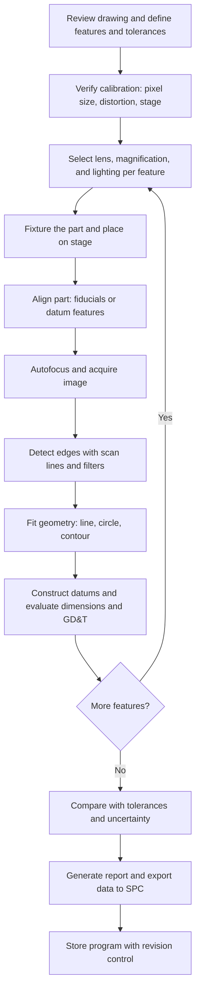

## Vision Measuring Systems

### Overview and Purpose

A vision measuring system (VMS), often called a **video measuring machine (VMM)** or **optical CMM**, is a non-contact coordinate measuring instrument that determines the geometry of a workpiece from digital images. A camera and telecentric or calibrated optics image the part, illumination is controlled to create measurable edges, and software locates features in the image at **sub-pixel** resolution. The image coordinates are converted to physical coordinates using a calibrated magnification and the position of a precision motion stage (or, on fixed-field systems, using the calibrated pixel grid alone).

Vision measuring systems occupy the space between the classical optical profile projector and the multi-sensor CMM. Compared with a projector, they replace the operator's eye with a camera and edge-detection algorithms, add motorized stages, autofocus, programmable lighting, and full geometric evaluation software, and can run unattended inspection programs. Compared with a tactile CMM, they are faster for small, delicate, thin, or two-dimensional parts, but they measure mainly **edges and surface features visible to the camera**, and they see the "optical edge" rather than the mechanical envelope touched by a stylus.

Typical applications include printed circuit boards and flex circuits, stamped and etched metal parts, connector contacts, molded plastic parts, lead frames, medical device components, watch and micro-mechanical parts, gaskets, glass and display components, and tools and inserts.

**Key Points**

- Vision systems are primarily **2D measuring instruments** (XY plane). The third axis (Z) is measured by autofocus, a laser or chromatic sensor, or a touch probe in multi-sensor configurations.
- Measurement quality depends on the whole chain: **illumination, optics, camera, edge detection algorithm, calibration, stage accuracy, and environment**.
- Performance is specified and verified through **ISO 10360-7** (CMMs equipped with imaging probing systems) and, for multi-sensor machines, **ISO 10360-9**. Test details depend on the edition, and manufacturer specifications should be interpreted against the edition cited.
- The optical edge is not identical to the mechanical edge. Comparing vision and tactile results requires an understanding of this difference (see Optical versus Tactile Edges).

### System Architecture

A vision measuring system consists of the following subsystems.

| Subsystem | Function |
| --- | --- |
| **Optical head (objective, zoom, or turret lens)** | Forms the image of the workpiece at defined magnifications, ideally telecentric |
| **Camera (sensor and electronics)** | Converts the optical image into a digital image. Typically monochrome CMOS or CCD for measurement, with color cameras used where color features matter |
| **Illumination system** | Programmable LED lights: backlight (diascopic), coaxial, ring (with multiple zones), and sometimes structured or dark-field lighting |
| **Motion system** | Precision XY stage, a Z axis for focus, and optionally rotary stages. Linear scales or encoders provide position feedback |
| **Structure and base** | Granite or cast base, bridge or gantry, with vibration isolation |
| **Controller and software** | Image acquisition, edge detection, feature fitting, alignment, geometric tolerancing, CNC programming, reporting |
| **Secondary sensors (optional)** | Laser displacement sensors, chromatic confocal sensors, touch-trigger probes, white-light sensors |

#### Machine Configurations

| Configuration | Description | Typical Use |
| --- | --- | --- |
| **Manual or semi-automatic benchtop** | Operator moves the stage by hand or with a joystick, software captures features | Low volume, general purpose, laboratory |
| **CNC video measuring machine** | Motorized XYZ axes, automated programs, autofocus | Production inspection, repeated measurements |
| **Gantry or bridge multi-sensor system** | Larger travel, optical head carried on a moving bridge, often with several sensors | Large flat parts, panels, multi-sensor inspection |
| **Fixed-field (instant, one-shot) systems** | A telecentric camera with a large field images the whole part at once, with no stage motion required for the measurement | High-throughput inspection of small parts, production lines |
| **Inline or in-process vision gauges** | Cameras integrated into a production line or fixture | 100% inspection, automated sorting |

The two main measuring philosophies are:

- **Stage-referenced measurement**: the camera field is used to locate features near the field center, and the stage scales provide the coordinates. Accuracy is governed by the stage and by the calibration of the camera-to-stage relationship.
- **Image-referenced (field) measurement**: coordinates are computed entirely from the pixel positions and the calibrated pixel size within a single image. Accuracy is governed by the optical distortion, the pixel calibration, and the edge detection.

(svg_diagram)

<svg xmlns="http://www.w3.org/2000/svg" viewBox="0 0 700 430" width="700" height="430" font-family="Arial, sans-serif" font-size="13">
<title>Vision Measuring System Signal and Optical Chain (svg_diagram)</title>
<rect x="0" y="0" width="700" height="430" fill="#ffffff" stroke="#cccccc" />
<text x="350" y="24" text-anchor="middle" font-size="15" font-weight="bold">Vision Measuring System Signal and Optical Chain (svg_diagram)</text>

<rect x="290" y="50" width="120" height="44" fill="#cfe6f5" stroke="#345" stroke-width="2" />
<text x="350" y="77" text-anchor="middle">Camera sensor</text>

<rect x="290" y="118" width="120" height="50" fill="#dfe8f2" stroke="#345" stroke-width="2" />
<text x="350" y="140" text-anchor="middle">Telecentric objective</text>
<text x="350" y="157" text-anchor="middle" font-size="11">(zoom or turret)</text>

<rect x="470" y="118" width="120" height="50" fill="#f2d16b" stroke="#543" stroke-width="2" />
<text x="530" y="140" text-anchor="middle">Coaxial light</text>
<line x1="470" y1="143" x2="412" y2="143" stroke="#d33" stroke-width="2" />

<rect x="250" y="192" width="200" height="16" rx="8" fill="#f2d16b" stroke="#543" stroke-width="2" />
<text x="350" y="228" text-anchor="middle">Ring light (multi-zone)</text>

<rect x="290" y="250" width="120" height="16" fill="#9db7a0" stroke="#354" stroke-width="2" />
<text x="350" y="284" text-anchor="middle">Workpiece</text>

<rect x="220" y="266" width="260" height="10" fill="#e6f0f5" stroke="#345" />
<text x="150" y="276" text-anchor="middle" font-size="11">Glass stage</text>

<rect x="250" y="330" width="200" height="26" fill="#f2d16b" stroke="#543" stroke-width="2" />
<text x="350" y="348" text-anchor="middle">Backlight (contour)</text>

<line x1="350" y1="330" x2="350" y2="266" stroke="#d33" stroke-width="2" />
<line x1="350" y1="250" x2="350" y2="168" stroke="#d33" stroke-width="2" stroke-dasharray="5,4" />
<line x1="350" y1="118" x2="350" y2="94" stroke="#d33" stroke-width="2" />

<line x1="590" y1="60" x2="590" y2="300" stroke="#28a" stroke-width="2" />
<text x="600" y="185" fill="#28a">Z (focus)</text>

<rect x="30" y="50" width="160" height="44" fill="#e8eef5" stroke="#345" stroke-width="2" />
<text x="110" y="70" text-anchor="middle">Software:</text>
<text x="110" y="86" text-anchor="middle" font-size="11">edge detection, fitting</text>
<line x1="290" y1="72" x2="192" y2="72" stroke="#345" stroke-width="2" />
<text x="350" y="410" text-anchor="middle" font-size="11">Lighting is selected per feature. The camera image is processed into edges, then fitted geometry, in stage coordinates.</text>
</svg>

### Optical Fundamentals

#### Magnification, Field of View, and Object-Space Pixel Size

The total optical magnification $M$ between object and sensor determines the size of one pixel in object space:

$$p_{obj} = \frac{p_{sensor}}{M}$$

where $p_{sensor}$ is the sensor pixel pitch. The field of view (FOV) in each direction is the sensor dimension divided by the magnification:

$$FOV = \frac{N_{pix} \, p_{sensor}}{M} = N_{pix} \, p_{obj}$$

where $N_{pix}$ is the number of pixels along that direction.

**Example: Field of View and Pixel Size**

A camera with a $2448 \times 2048$ pixel sensor and $3.45 \ \mu\text{m}$ pixels is used with a lens at $M = 2\times$:

- Object-space pixel size: $3.45 / 2 = 1.725 \ \mu\text{m}$
- FOV (horizontal): $2448 \times 1.725 \ \mu\text{m} = 4.22 \ \text{mm}$
- FOV (vertical): $2048 \times 1.725 \ \mu\text{m} = 3.53 \ \text{mm}$

Increasing magnification reduces the pixel size (finer resolution) and the FOV. Measuring a larger part requires stitching multiple fields using stage motion, and the stage accuracy then enters the measurement.

#### Resolution Limits: Optical and Sampling

The optical resolution is limited by diffraction and by the numerical aperture (NA). The Rayleigh criterion for the minimum resolvable separation of two points is:

$$d_{min} = \frac{0.61 \, \lambda}{NA}$$

For $\lambda = 0.55 \ \mu\text{m}$ and an NA of $0.1$, this gives about $3.4 \ \mu\text{m}$. The sensor sampling must be fine enough to capture the optical resolution, and the Nyquist criterion requires at least two pixels per smallest resolvable period (in practice, 2.5 to 3 pixels is often used to avoid aliasing). If the object-space pixel size is much larger than the optical resolution, the system is **sampling-limited**, and if it is much smaller, the system is **optics-limited** (the image is oversampled, and extra pixels add data without adding information).

#### Depth of Field and Focus

For a low-NA objective, the depth of field (DOF) is approximately:

$$DOF \approx \frac{\lambda \, n}{NA^2} + \frac{n \, e}{M \cdot NA}$$

where $n$ is the refractive index of the medium and $e$ is the smallest resolvable distance of the detector (roughly the pixel size). The first term is the wave-optical contribution and the second is the geometric contribution from the detector's finite resolution. [Inference] For typical measurement objectives, the DOF ranges from a few tens of micrometers at high magnification to a few millimeters at low magnification. The precise value depends on the specific optics and the acceptance criterion for blur.

The edge position is influenced by focus. A slightly defocused edge is blurred, and for asymmetric edges, the apparent position can shift with defocus. Consistent, repeatable focusing (through autofocus or fixed focus positions) is therefore central to accuracy.

#### Telecentricity

**Object-space telecentric** lenses have the aperture stop at the back focal plane, so the chief rays in object space are parallel to the optical axis. Two benefits follow:

- Magnification is essentially **independent of object distance** within the depth of field, so a small change in focus or part height does not change the measured size.
- There is no perspective effect: features at different heights appear at the same scale, and vertical walls do not show their sidewalls.

For a non-telecentric lens, a change $\Delta s$ in object distance changes the apparent size by a fraction of roughly $\Delta s / (s - f)$, which can cause significant errors. Most precision vision measuring systems use telecentric lenses (either fixed-magnification telecentric objectives or zoom systems with telecentric behavior over the range), though some zoom systems have residual telecentricity error that must be characterized. [Unverified] The residual telecentricity error specification differs by lens design and manufacturer, so consult the lens data.

**Key Points**

- Telecentric lenses trade a large front element (the lens must be at least as large as the field) and a limited working distance for constant magnification.
- **Optical distortion** is a separate property, and a telecentric lens can still have distortion that must be calibrated and corrected.

#### Optical Distortion

Distortion is a deviation of the image from a perfect scaled copy of the object, commonly radial (barrel or pincushion). A standard radial model relates the distorted radius $r_d$ to the ideal radius $r_u$:

$$r_d = r_u \left( 1 + k_1 r_u^2 + k_2 r_u^4 + \ldots \right)$$

where $k_1$, $k_2$ are distortion coefficients determined by calibration. Distortion is typically smallest at the field center, so measurements at the center have the lowest distortion error. Precision systems characterize the distortion with a calibrated grid plate and apply a correction map, or measure primarily near the field center and use stage motion to bring features there.

### Illumination

Lighting is the single largest influence on edge quality, and often the deciding factor in whether a measurement is reliable. Programmable LED systems allow the light to be set per feature and stored in the program.

| Lighting Type | Geometry | Best For | Watch For |
| --- | --- | --- | --- |
| **Backlight (diascopic, contour)** | Light from beneath the part passes around it | Silhouettes, outer contours, through-holes, thin parts | Translucent parts, edge rounding, light wrap |
| **Coaxial (on-axis) light** | Light passes through the objective and reflects from flat surfaces normal to the axis | Flat, reflective surfaces, surface marks, blind holes, edges of flat features | Glare on curved surfaces, low contrast on matte surfaces |
| **Ring light (episcopic)** | A ring of LEDs around the objective, often with several angular zones | General surface features, textured surfaces, and edges. Adjustable angle shows steps and relief | Shadows and glare, sensitivity to surface finish |
| **Dark-field light** | Very oblique light so that only scattered light reaches the objective | Scratches, edges, and surface defects on smooth surfaces | Low signal, unsuitable for precise edge location on some parts |
| **Structured or patterned light (projected grid)** | Projected pattern on the surface | Focus on featureless surfaces, height measurement | Requires additional calibration and processing |
| **Diffuse dome** | Uniform illumination from all directions | Shiny curved surfaces with minimal glare | Reduced contrast for edges |

#### Illumination Effects on Edge Position

The apparent edge position depends on the lighting configuration because the edge of a real part has a physical profile (rounded, chamfered, tapered) and light interacts with it differently under different geometries.

- With **backlight**, the silhouette edge is determined by the **outermost tangent** of the part in the viewing direction. A rounded edge appears at the widest extent, and a tapered wall appears at the widest (largest) section.
- With **coaxial light**, the bright reflection from a flat top surface ends where the surface curves away, so the visible edge corresponds to the **end of the flat**, not the outer extreme.
- Consequently, the same feature can be measured to different sizes depending on the light, and the specification (which edge is meant by the drawing) determines the correct lighting choice.

**Key Points**

- The measurement program should **store the light settings** (each zone's intensity) per feature, and the light intensity should be verified since LED output can drift with temperature and age.
- Light intensity is chosen so the image is **not saturated** and the edge transition spans a suitable number of gray levels.
- Wavelength matters: blue or shorter-wavelength lighting slightly improves diffraction-limited resolution, and monochromatic lighting reduces chromatic aberration effects. Color effects also arise on colored parts. [Inference] The practical benefit depends on the optics and the part.

### Image Acquisition and the Camera

#### Sensor Characteristics

| Property | Impact on Measurement |
| --- | --- |
| **Pixel pitch and count** | Sets the object-space sampling and the field size |
| **Sensor type (CMOS, CCD)** | Noise, dynamic range, readout, and speed. Modern CMOS sensors are widely used |
| **Global vs. rolling shutter** | Global shutter avoids motion distortion in on-the-fly measurements |
| **Dynamic range and bit depth** | Determines the number of gray levels available for edge interpolation (8-bit is common, with 10 to 12-bit available) |
| **Noise (read noise, shot noise, fixed pattern)** | Affects the edge location repeatability. Averaging multiple frames reduces temporal noise |
| **Linearity and gain** | Affects the accuracy of threshold-based edge locations |

#### On-the-Fly and Strobed Measurement

To speed up measurement, the stage can move continuously while the camera captures images triggered by the stage position, with a **strobed light** freezing the motion. The motion blur during exposure is:

$$b = v \, t_{exp}$$

where $v$ is the stage speed and $t_{exp}$ the exposure (or strobe) time. For $v = 100$ mm/s and a strobe of $10 \ \mu\text{s}$, the blur is $1 \ \mu\text{m}$. Accurate timing between the image capture and the scale reading (**latency compensation**) is needed, or the position error is $v \, \Delta t$, where $\Delta t$ is the timing uncertainty.

### Edge Detection and Sub-Pixel Measurement

#### The Edge as an Image Feature

An edge in the image is a transition from bright to dark, described by the **edge spread function (ESF)**. The image of an ideal step edge is blurred by the optics (diffraction and aberrations), by defocus, and by the finite pixel size. The location of the edge is estimated by an algorithm operating on the pixel intensities.

#### Common Edge Location Methods

| Method | Description | Notes |
| --- | --- | --- |
| **Threshold crossing** | The edge is at the position where the interpolated intensity crosses a threshold (for example, 50% between the bright and the dark levels) | Simple and widely used, sensitive to illumination level changes if the threshold is fixed as an absolute gray value |
| **Maximum gradient** | The edge is at the position of the maximum intensity derivative | Less dependent on absolute intensity, more sensitive to noise |
| **Zero crossing of the second derivative** | Locates the inflection point of the edge | Equivalent to maximum gradient in the ideal case |
| **Model fitting (ESF fit)** | A parametric edge model (for example, an error function) is fitted to the pixel profile | Can be more accurate and give sub-pixel results with an estimate of the edge width |
| **Centroid or moment-based** | Intensity moments locate the edge or a small feature | Used for small features such as dots and points |
| **Correlation and pattern matching** | Locates a known pattern or feature by cross-correlation | Used for alignment, fiducials, and feature finding |

For a threshold method, the sub-pixel position between pixels $i$ and $i+1$ is found by linear interpolation:

$$x_{edge} = x_i + \frac{T - I_i}{I_{i+1} - I_i} \, p_{obj}$$

where $T$ is the threshold level, $I_i$ and $I_{i+1}$ are the pixel intensities bracketing the threshold, and $p_{obj}$ is the pixel pitch in object space.

Edge detection tools usually work as **scan-line tools** (a set of parallel intensity profiles across the expected edge, each producing one edge point) so that a line, circle, or arc is fitted to many edge points, which averages out random noise. Along each scan line, a smoothing filter (for example, a Gaussian or a moving average) reduces noise before edge location.

#### Edge Point Averaging and Repeatability

If each edge point has a random location error with standard deviation $\sigma_p$ and $N$ independent points are used to fit a feature, the location uncertainty of the fitted feature improves roughly as:

$$\sigma_{fit} \approx \frac{\sigma_p}{\sqrt{N}}$$

for a simple mean position. The improvement is limited by **systematic errors** (edge bias, distortion, calibration), which do not average out. [Inference] A quoted repeatability at the nanometer scale reflects noise averaging and does not indicate accuracy.

**Example: Sub-Pixel Resolution**

At an object-space pixel size of $1.7 \ \mu\text{m}$ and sub-pixel interpolation that resolves $1/20$ of a pixel, the numerical resolution is about $0.085 \ \mu\text{m}$. Real edge repeatability is typically larger and depends on the signal-to-noise ratio, the edge sharpness, and the stability of illumination and focus. The numerical resolution of the algorithm should not be confused with the measurement uncertainty.

#### Edge Detection Parameters

Key parameters in the software include:

- **Threshold or gradient level** and the choice of relative (percentage) versus absolute threshold.
- **Edge polarity** (bright-to-dark or dark-to-bright) and the edge direction.
- **Filter strength** (smoothing).
- **Scan-line spacing and length**, the number of edge points, and outlier rejection criteria.
- **Search region** (the region of interest, ROI) size and position.

Poor settings produce false edges (dust, scratches, texture) or unstable results, so programs typically use robust settings verified on several parts.

### Focus and the Z Axis

#### Autofocus

The software estimates the sharpness of the image (a focus metric such as the variance of the intensity, the sum of gradient magnitudes, or the Laplacian energy) while moving the Z axis, then finds the peak. Autofocus enables two uses:

1. **Focusing** at the best contrast position before edge detection.
2. **Height measurement**: the Z position at best focus on a feature gives its height, with an uncertainty tied to the depth of field, the surface texture, and the focus metric's peak sharpness.

The uncertainty of a focus-based height is generally much larger than the XY uncertainty of the edge measurement, and it depends on surface texture. Smooth, featureless surfaces have little contrast, so a projected pattern or a laser or chromatic sensor is used instead.

#### Additional Height Sensors

| Sensor | Principle | Notes |
| --- | --- | --- |
| **Laser displacement (triangulation) sensor** | Laser spot triangulation | Fast, moderate accuracy, sensitive to surface reflectivity |
| **Chromatic confocal sensor** | Wavelength-coded focus | Very high axial resolution, works on many surfaces, small range |
| **Touch-trigger probe** | Mechanical contact | Provides tactile edge and height data, allows measurement of hidden or undercut features, links to tactile datums |
| **White-light interferometric or focus-variation sensors** | Coherence or focus scanning | High-resolution surface topography, small field |

The multi-sensor configuration allows both optical and tactile measurements in one coordinate system, but requires **sensor-to-sensor offset calibration** using a common artefact (for example, a reference sphere or a multi-sensor calibration artefact). ISO 10360-9 addresses the verification of multiple probing systems.

### Calibration of Vision Measuring Systems

Calibration establishes the relationship between pixels, the stage, and physical units. A vision system requires several layers of calibration.

#### Pixel Size and Magnification Calibration

A calibrated **glass grid plate** or **line scale** (chrome on glass, with lines or dots at known positions) is imaged, the positions of the features are measured in pixels, and the ratio to the certified distance gives the pixel size:

$$p_{obj} = \frac{L_{cert}}{N_{pixels}}$$

where $L_{cert}$ is the certified distance between features and $N_{pixels}$ the measured distance in pixels. Calibration must be repeated for each magnification (or zoom position) used, as the pixel size differs.

#### Distortion Calibration

A grid of dots or lines of known spacing is imaged over the field, the deviations of the measured positions from a perfect grid are computed, and a correction map or a distortion model (for example, a polynomial) is fitted. The residual after correction indicates the remaining distortion error.

#### Camera-to-Stage Alignment

The camera axes must be related to the stage axes, since the camera may be rotated slightly relative to the stage. The rotation angle $\gamma$ is measured by moving the stage a known distance along X and observing the shift of a feature in the image, and the measurement software then corrects for this rotation. A residual rotation causes a cosine-type error in stage-referenced measurements and a shear error in image-based measurements.

$$\gamma = \arctan\left( \frac{\Delta y_{img}}{\Delta x_{img}} \right)$$

where $\Delta x_{img}$ and $\Delta y_{img}$ are the image displacements of a feature after an X-only stage move.

#### Stage Calibration

The XY stage (and the Z axis) is calibrated against a calibrated line scale, grid plate, or with a laser interferometer to determine the scale errors, straightness, and squareness. Many systems store a **volumetric or area error map** (a computer-aided accuracy map) to compensate for repeatable stage errors, in the same manner as for a CMM.

#### Illumination and Edge Bias Calibration

Because the edge position depends on lighting and threshold, a **calibration with artefacts of similar edge type** (for example, a chrome-on-glass line scale for backlight edge measurements, or a calibrated ring gauge or a step or slot artefact for the parts in question) detects the bias and allows a correction. In the ideal case, the calibration artefact resembles the workpiece in material, edge geometry, and illumination response.

**Key Points**

- Perform calibration at **every magnification and lens configuration** used, and repeat after the lens, camera, or light is changed or serviced.
- Use artefacts whose **traceability** is documented (certificates from an accredited laboratory, ISO/IEC 17025).
- **Warm up** the instrument (lights, cameras, drives) to a stable state before calibration and measurement.

### Coordinate Systems and Alignment

The software constructs a **part coordinate system** from measured features in the same way as a CMM: for example, a primary line or plane, a secondary line, and an origin point (a 2D analog of the 3-2-1 alignment), or from fiducial marks and best-fit alignment to CAD.

A 2D rigid transformation from machine (stage) coordinates to part coordinates uses a rotation angle $\theta$ and a translation $(t_x, t_y)$:

$$\begin{bmatrix} x_p \\ y_p \end{bmatrix} = \begin{bmatrix} \cos\theta & \sin\theta \\ -\sin\theta & \cos\theta \end{bmatrix} \begin{bmatrix} x_m - t_x \\ y_m - t_y \end{bmatrix}$$

For a batch of parts, an **automatic alignment** step uses **pattern recognition** (fiducials, edges, or a reference feature), so each part is located regardless of its placement on the stage. Best-fit alignment to a CAD model can be used for freeform outlines and PCB layouts.

Fiducial-based alignment on PCBs and panels uses circular or cross-shaped marks. The location of a circular fiducial by fitting a circle to the edge points gives a center with sub-pixel repeatability, and using at least two fiducials provides translation and rotation, while three or more allow scale or shear compensation (relevant for substrates that expand or distort).

### Measurement Features and Geometric Evaluation

The software supports the following 2D measurements, with points from edge scan lines fitted with an appropriate algorithm.

| Feature | Fit | Notes |
| --- | --- | --- |
| **Point** | Single edge point or the centroid of a small feature | Sensitive to noise |
| **Line** | Least-squares line through edge points | Uses many points along the edge. Outliers are rejected |
| **Circle / arc** | Least-squares circle | Center and diameter, requires an adequate angular span for arcs |
| **Ellipse, slot, rectangle** | Parametric fit | Slot width and length, rounded rectangles |
| **Distance** | Point-to-point, point-to-line, line-to-line | Includes projected distances along a specified direction |
| **Angle** | Between two lines | Better accuracy with longer lines |
| **Contour / profile** | Set of edge points along the outline | Compared with CAD nominal or tolerance band |
| **Height/Z** | Autofocus or height sensor | Lower accuracy than XY |

The circle fit minimizes the sum of squared radial deviations:

$$\min_{x_c, y_c, r} \sum_{i=1}^{N} \left( \sqrt{(x_i - x_c)^2 + (y_i - y_c)^2} - r \right)^2$$

Geometric tolerances (position, concentricity, roundness, straightness, parallelism, perpendicularity in the plane) are evaluated according to the drawing standard (ASME Y14.5 or ISO GPS), with the caveat that vision systems in 2D can evaluate only the characteristics visible in the projected plane. Form tolerances requiring 3D data (for example, flatness or cylindricity) generally need additional sensors.

#### Contour Comparison to CAD

An outline measured from the image (a sequence of edge points) is compared with a CAD polyline or curve. The deviation of each point from the nominal is the signed distance to the nearest point on the nominal curve. The report shows a color-coded deviation map, the maximum deviation, and the percentage of points within the tolerance band. As in other best-fit alignments, the choice of alignment (datum-based or best-fit) changes the reported deviations, so it should match the drawing's intent.

### Optical versus Tactile Edges

An important practical topic is that a vision measurement does not report the same "size" as a tactile measurement of the same feature.

- A **stylus** contacts the surface and reports the position of the tip center offset by the tip radius, so it senses the **mechanical surface** at the contact point, effectively filtered by the finite tip size.
- A **camera** reports an **optical edge**, determined by the illumination, the edge geometry (radius, chamfer, burr), the surface finish, the optics, and the edge detection algorithm.

Consequently:

- **Backlit silhouettes** of a hole in a part with a chamfer or a rounded entry edge report a smaller or larger diameter than a tactile probe, depending on which edge is seen as the tightest constriction.
- **Rough or textured surfaces** produce blurred edges whose optical position may differ by several micrometers from the tactile envelope, since the stylus ball bridges the roughness peaks.
- **Thin or compliant parts** can deform under tactile contact, so the optical measurement may be the more representative one.

The correlation between vision and tactile measurement should be established by measuring the **same feature on the same part** with both methods, with the alignments, filtering, and datum definitions harmonized, and then determining any systematic offset. [Inference] For parts with well-defined sharp edges and matching illumination, agreement to within a few micrometers can often be achieved, but the results depend strongly on part and setup, and should be confirmed experimentally.

### Performance Verification: ISO 10360-7 and Related Practice

**ISO 10360-7** specifies acceptance and reverification tests for CMMs equipped with imaging probing systems, defining the tests and the way the maximum permissible errors are stated. The main test elements are described below in general terms, and the edition in force should be consulted for the exact procedures and symbols.

| Test | Purpose | Artefact |
| --- | --- | --- |
| **Probing error tests (form, size, location)** | Evaluate the imaging probe's ability to measure simple geometry | A calibrated reference feature such as a circle (a chrome-on-glass circle, a ring, or a sphere) measured at defined positions in the field |
| **Length measurement error test** | Evaluate the volumetric (XY, and Z where applicable) length measurement accuracy | Calibrated length artefacts: a line scale, a step gauge, a grid plate, or a ball bar |
| **Field-related tests** | Evaluate performance across the camera field (distortion, field-position dependence) | Grid plates or arrays of features |
| **Multi-sensor tests (ISO 10360-9)** | Evaluate the coherence between different sensors in a multi-sensor machine | A common artefact measured by each sensor |

The manufacturer states the **maximum permissible error (MPE)** for the length measurement error, commonly in the form:

$$E_{MPE} = \pm \left( A + \frac{L}{K} \right) \ \mu\text{m}$$

with $L$ the measured length, and $A$ and $K$ constants for the machine (for example, an $A$ value of around 1 to 3 micrometers and a divisor $K$ of a few hundred are typical of precision systems). These values are only indicative, and the actual specification depends on the model.

**Key Points**

- The MPE applies for the **specified optical configuration** (lens, magnification, lighting, edge detection settings, and artefact type). A different configuration or feature type may perform differently.
- The artefact used should have a **known edge behavior** in the specified illumination, and the standard specifies the type of artefact to use for the test.
- Verification should be performed at least at the magnifications and lighting conditions that are used in production, in addition to the manufacturer's reference conditions.

### Uncertainty of Vision Measurements

The uncertainty of a vision measurement includes, at least, the following contributions:

| Component | Description |
| --- | --- |
| **Pixel and magnification calibration** | Uncertainty of the calibration artefact and the calibration procedure |
| **Distortion (residual)** | Remaining distortion after correction, position-dependent in the field |
| **Stage accuracy** | Scale and geometry errors for stage-referenced measurement |
| **Camera-to-stage alignment** | Residual rotation |
| **Edge detection bias and repeatability** | Edge model differences, noise, threshold choice, illumination |
| **Focus** | Defocus effects on edge position |
| **Illumination stability** | Drift in the light intensity and angle |
| **Workpiece effects** | Edge form (radius, burr, taper), surface finish, translucency, contamination |
| **Sampling and fitting** | The number and distribution of edge points, the fitting algorithm, and outlier handling |
| **Temperature** | Part and instrument thermal expansion, thermal drift |
| **Vibration** | Movement during exposure |

The combined standard uncertainty for independent contributions is:

$$u_c = \sqrt{\sum_{i=1}^{n} u_i^2}$$

**Example: Uncertainty Budget for a Hole Diameter**

For a $2.000$ mm hole in a stamped part measured with backlight at moderate magnification (illustrative values):

| Component | Standard Uncertainty ($\mu$m) |
| --- | --- |
| Pixel size calibration | 0.30 |
| Residual distortion | 0.25 |
| Edge detection bias (calibrated) | 0.50 |
| Edge repeatability (averaged over many points) | 0.15 |
| Part edge form effects (burr, radius) | 0.60 |
| Temperature (part at $20 \pm 0.5$ °C, aluminum) | 0.03 |
| Focus and illumination | 0.20 |

$$u_c = \sqrt{0.30^2 + 0.25^2 + 0.50^2 + 0.15^2 + 0.60^2 + 0.03^2 + 0.20^2}$$

$$u_c = \sqrt{0.09 + 0.0625 + 0.25 + 0.0225 + 0.36 + 0.0009 + 0.04} = \sqrt{0.8259} \approx 0.91 \ \mu\text{m}$$

The expanded uncertainty with $k = 2$ is about $1.8 \ \mu\text{m}$. The dominant contributors are the part's edge form effects and the edge bias, which illustrates that for small features, workpiece characteristics often dominate over instrument repeatability. The values are illustrative and do not represent a specific instrument.

The task-specific uncertainty for vision measurements can be evaluated by **substitution with a calibrated reference part** of similar geometry (in the spirit of ISO 15530-3), by simulation, or through a gauge R&R study. For parts where the optical edge is ambiguous, the substitution or comparison approach with a well-characterized reference part is generally the most defensible.

### Measurement Workflow and Programming

#### Program Development Practices

- **Feature-by-feature lighting and lens selection**: store the magnification, the light zones and intensities, the focus position, and the edge tool settings with each feature.
- **Fixturing**: use fixtures that hold the part flat and stable without distortion, and use **glass or open-frame fixtures** for backlit measurements so that the fixture does not block the light path.
- **Alignment strategy**: use robust fiducials or datum features, and verify alignment for each part by pattern recognition.
- **Tool robustness**: define search regions large enough to tolerate part placement variation, and use edge filters and outlier rejection to handle dust and scratches.
- **Simulation and dry run**: check the program on a golden part, and verify that the stage motion and the focus travel are collision-free (particularly for multi-sensor systems with touch probes).
- **Validation**: repeat measurements on the same part and reposition the part between runs, compare with an independent method for critical features, and perform a gauge R&R.
- **Revision control**: record the program revision, the software version, the calibration status, and the drawing revision.

### Applications by Industry

| Industry | Typical Measurements | Notes |
| --- | --- | --- |
| **Electronics and PCB** | Trace width, pad position, hole diameter and position, solder mask registration, layer-to-layer registration | Fiducial alignment, panel scaling, large fields, backlight and coaxial lighting |
| **Semiconductor packaging and lead frames** | Lead pitch, coplanarity (with Z sensors), wire bond features | High magnification, fine pitch |
| **Automotive and precision stamping** | Blanked and formed part profiles, hole patterns, connector terminals | Contour comparison to CAD, high throughput |
| **Medical devices** | Stents, needles, catheters, orthopedic components, micro-molded parts | Small features, non-contact for delicate parts |
| **Watch and micro-mechanics** | Gear teeth, springs, jewels | High magnification, form measurement |
| **Plastics and molding** | Small molded parts, flash detection, overall dimensions | Translucent parts may need special lighting |
| **Glass and displays** | Cover glass dimensions, edge quality, printed features | Backlight and coaxial techniques |
| **Cutting tools** | Insert geometry, edge radius, tool profile | Profile comparison to nominal |

### Comparison with Related Systems

| Attribute | Vision Measuring System | Optical Profile Projector | Tactile CMM | Multi-Sensor CMM |
| --- | --- | --- | --- | --- |
| Primary measurement | 2D edges, features (and Z with sensors) | 2D silhouette and outline | 3D points, features | 3D, with optical and tactile |
| Contact | None | None | Yes | Optional |
| Automation | High (CNC programs) | Low to moderate | High | High |
| Numerical output | Yes, full software | Limited (with DRO) | Yes | Yes |
| Small and delicate parts | Excellent | Good | Risky | Excellent |
| Hidden or deep features | Limited | Limited | Good (with styli) | Good (with a tactile sensor) |
| Operator dependence | Low | Moderate to high | Low | Low |
| Typical accuracy | High in 2D for suitable parts | Moderate | High in 3D | High |

### Limitations and Considerations

- **2D-centric**: vision systems measure the projection of the part onto the image plane and cannot see undercuts, hidden features, or vertical walls (with telecentric optics, vertical walls appear as lines).
- **Optical edge ambiguity**: the measured edge depends on illumination and part geometry, and may differ from the functional or drawing-defined edge.
- **Surface dependence**: reflective, translucent, transparent, or very dark surfaces reduce contrast or produce unwanted reflections and subsurface scattering, so lighting choice and sometimes surface preparation are needed.
- **Z measurement limits**: focus-based Z measurement has larger uncertainty than the XY measurement and depends on the surface texture.
- **Field-of-view versus resolution trade-off**: high magnification limits the field size, requiring stitching.
- **Cleanliness sensitivity**: dust and fingerprints create false edges, and stage glass must be kept clean.
- **Thermal sensitivity** for the tightest tolerances, since parts and the machine must be in thermal equilibrium.

### Common Problems and Troubleshooting

| Symptom | Likely Cause | Corrective Action |
| --- | --- | --- |
| Measurements drift over time | Thermal warm-up, LED intensity drift | Warm up the machine, stabilize the temperature, verify and control the illumination |
| Dimensions differ between magnifications | Pixel size calibration error, residual distortion | Recalibrate each magnification, apply the distortion correction, and measure near the field center |
| Edge results unstable | Poor contrast, wrong threshold, dust or debris, vibration | Adjust the lighting, set a relative threshold, clean the part and stage, isolate the vibration |
| Different results from a tactile CMM | Optical versus mechanical edge, alignment differences, and different datum construction | Compare with matching alignment and edge definition, and correct with a calibrated reference part |
| Errors grow with distance moved between fields | Stage scale error, camera-to-stage misalignment | Calibrate the stage, recalibrate the camera rotation, and apply the error map |
| Autofocus hunting or inconsistent Z | Low-contrast surface, reflections | Use a projected pattern, change the lighting, or use a laser or chromatic sensor |
| Hole diameter measured too small in backlight | Chamfer or burr constricting the light path | Understand the required edge definition and choose coaxial or a tactile sensor if needed |
| Ghost edges or double edges | Reflections, glass fixture reflections, or a translucent part | Change the light angle, use a matte fixture, and adjust the ROI |
| Position errors at the field edges | Optical distortion | Recalibrate the distortion map, bring features to the center by stage motion |
| Fiducial alignment failures | Poor contrast, contaminated fiducials, ROI too small | Improve the lighting, widen the search region, and clean the part |
| Repeatability worse than expected | Vibration, air turbulence, or an unstable light | Improve the isolation, shield the air, and stabilize the light |

### Best Practices

**Key Points**

- **Calibrate at every magnification** with traceable artefacts (glass grid or line scale), and verify distortion, stage geometry, and camera-to-stage alignment.
- **Choose the lighting to match the drawing's edge definition** for each feature, and store the light settings in the program.
- **Use telecentric optics** and calibrate their residual errors, and measure near the field center where practical.
- **Verify with artefacts resembling the workpiece** (edge type, material, surface) to capture edge bias, and correct or account for it.
- **Use many edge points** for each fitted feature, with filtering and outlier rejection, but do not treat averaging as a substitute for accuracy.
- **Keep the part, the stage, and the optics clean**, and fixture the part flat without distortion, using backlight-compatible fixtures.
- **Allow thermal stabilization** of the machine, lights, and parts, and monitor the ambient temperature for tight tolerances.
- **Control vibration and air movement**, particularly at high magnification.
- **Establish a correlation** with a tactile method for features where the optical and mechanical edges may differ.
- **Evaluate task-specific uncertainty**, using calibrated reference parts and gauge R&R studies, and apply the decision rule that matches the quality system.
- **Perform periodic ISO 10360-7 type verification**, interim checks with a reference artefact, and re-verification after service, lens or camera changes, and any impact.
- **Manage programs under revision control**, with documented illumination, edge tool parameters, and calibration status.

### Conclusion

Vision measuring systems turn images into coordinates by combining calibrated telecentric optics, controlled illumination, digital cameras, precision stages, and sub-pixel edge detection software. Their strengths are non-contact access to small, delicate, thin, and flat parts, high throughput through CNC programs and fixed-field imaging, and rich software for feature fitting, alignment, and CAD comparison. Their accuracy is governed by the complete measurement chain: pixel and distortion calibration, stage geometry, lighting choice, focus, edge definition, and workpiece characteristics. Because the optical edge depends on illumination and edge geometry, a vision result is not automatically equivalent to a tactile one, so correlation studies, artefacts resembling the workpiece, and a documented uncertainty budget are central to producing defensible results. Verification under ISO 10360-7 (and ISO 10360-9 for multi-sensor systems), routine interim checks, and disciplined programming practice sustain the instrument's performance in production use.

**Related Topics**

- Telecentric lens design, distortion, and camera calibration
- Illumination engineering for machine vision metrology
- Sub-pixel edge detection algorithms and edge spread function modeling
- Autofocus algorithms and focus metrics
- Multi-sensor systems: laser, chromatic confocal, and touch-probe integration
- ISO 10360-7 and ISO 10360-9 verification procedures
- Glass scale, grid plate, and calibration artefact design
- Optical versus tactile measurement correlation studies
- PCB and fiducial-based alignment strategies
- Task-specific uncertainty for optical measurements (ISO 15530 series)
- Fixed-field and inline vision gauging for high-volume production