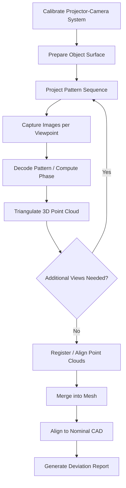

## Structured Light 3D Scanning

### Overview

Structured light 3D scanning is a non-contact optical metrology technique that determines the three-dimensional shape of an object by projecting known patterns of light onto its surface and analyzing the deformation of those patterns as captured by one or more cameras. The geometric distortion of the projected pattern, caused by the object's surface topology, is used to triangulate precise surface coordinates. It is widely used in reverse engineering, dimensional inspection, quality control, and digitization of complex freeform geometries.

Compared to tactile coordinate measuring machines (CMMs), structured light systems acquire dense point clouds (often millions of points) across an entire surface in seconds, rather than sequential discrete point sampling.

### Working Principle

A projector casts a known pattern (stripes, fringes, or coded patterns) onto the object surface. A camera (or camera pair), positioned at a fixed, calibrated angular offset from the projector, captures the pattern as it appears distorted by the object's shape. Because the geometric relationship between the projector and camera is known through calibration, the system can compute depth at each point via triangulation.

The basic triangulation relationship is analogous to stereo vision:

$$Z = \frac{f \cdot B}{d}$$

where $Z$ is depth, $f$ is the effective focal length, $B$ is the baseline distance between projector and camera, and $d$ is the observed disparity (pattern displacement) at a given pixel. Smaller baselines improve access into recesses but reduce depth resolution; larger baselines improve depth resolution but increase occlusion (shadowing) risk.

### Pattern Projection Methods

#### Fringe Projection (Phase-Shifting)

- Projects a series of sinusoidal fringe patterns, each phase-shifted by a known increment (commonly 3 to 12 phase steps)
- Surface height modulates the phase of the captured fringe pattern relative to a reference plane
- Phase is computed pixel-by-pixel using a standard phase-shifting algorithm, e.g. for a 4-step method:

$$\phi(x,y) = \arctan\left(\frac{I_4 - I_2}{I_1 - I_3}\right)$$

- Provides sub-pixel accuracy and is the most common method in high-precision industrial scanners
- Requires phase unwrapping to resolve ambiguity from the arctangent's periodic nature, typically achieved using multi-frequency (heterodyne) fringe sets or Gray code sequences

#### Gray Code / Binary Coded Patterns

- Projects a sequence of black-and-white binary stripe patterns of increasing spatial frequency
- Each pixel accumulates a unique binary code identifying its corresponding projector column/row
- Robust against ambiguity but generally lower resolution than phase-shifting alone
- Frequently combined with phase-shifting (Gray code for coarse unwrapping, phase for fine sub-pixel precision) in a hybrid approach

#### Single-Shot / Coded Pattern Methods

- Projects a single, spatially encoded pattern (color-coded stripes, pseudo-random dot patterns, or grid patterns) allowing 3D capture from one frame
- Enables capture of moving objects or dynamic/real-time scanning applications
- Generally lower point density and accuracy than multi-shot phase-shifting methods [Inference: accuracy gap is design-dependent and narrows with modern high-resolution single-shot systems]

### System Components

- **Projector**: DLP (Digital Light Processing) projectors are standard due to precise, repeatable pattern control; LED or laser-based projectors are also used
- **Camera(s)**: high-resolution digital cameras, often in a stereo pair configuration to improve robustness and reduce reliance on projector calibration alone
- **Calibration target**: a flat or 3D reference panel with known feature geometry, used to establish the intrinsic and extrinsic camera-projector geometric model
- **Mounting/positioning system**: tripod, rotary stage, robotic arm, or handheld configuration, depending on application
- **Processing software**: performs pattern decoding, triangulation, point cloud generation, mesh reconstruction, noise filtering, and multi-scan registration/alignment

### Calibration Procedure

1. Position a calibration target (typically a flat panel with a precise dot or checkerboard grid) at multiple orientations and distances within the scanner's working volume
2. Capture calibration images at each position; software computes camera intrinsic parameters (focal length, lens distortion) and extrinsic parameters (projector-camera relative pose)
3. Validate calibration using a certified reference artifact (sphere, step gauge, or calibrated plate) to verify measurement accuracy against traceable standards
4. Store the calibration profile; recalibrate periodically or after any mechanical disturbance to the projector-camera assembly

**Key Points**

- Calibration accuracy directly limits measurement accuracy — no software correction can fully compensate for a poor calibration
- Recalibration is required after transport, thermal cycling, or mechanical shock to the rig
- Ambient lighting control matters: strong ambient light reduces pattern contrast and increases noise, particularly for phase-shifting methods

### Scanning Workflow

1. Prepare the object surface — apply anti-glare/matting spray or powder if the surface is highly reflective, transparent, or glossy, since specular reflection disrupts pattern detection
2. Position the object within the calibrated working volume
3. Project pattern sequence and capture images from one or more viewpoints
4. Software decodes the pattern and computes a 3D point cloud for that view
5. Reposition the object or scanner (or use a turntable) to capture additional views covering occluded regions
6. Register (align) multiple point clouds into a common coordinate system, typically using overlapping reference features or an Iterative Closest Point (ICP) algorithm
7. Merge into a unified polygon mesh; perform hole-filling, smoothing, and decimation as needed
8. Export as a mesh (STL, OBJ, PLY) or point cloud (ASCII, PTX) for downstream inspection or CAD comparison

### Applications in Quality Control

- **First article inspection (FAI)**: full-surface comparison of a manufactured part against nominal CAD geometry, generating color-mapped deviation reports
- **Reverse engineering**: converting physical parts or prototypes into CAD-compatible surface models
- **GD&T verification**: extracting surface, profile, and form data for geometric dimensioning and tolerancing evaluation
- **Automated in-line inspection**: integrated with robotic arms for 100% part inspection on production lines
- **Sheet metal and casting inspection**: capturing large-scale, complex freeform surfaces impractical for point-by-point tactile probing
- **Wear and deformation analysis**: comparing scans over time to quantify surface change

### Advantages

- Very high data density — captures full-field surface geometry rather than discrete points
- Fast acquisition, often seconds per scan, enabling high-throughput inspection
- Non-contact — suitable for soft, delicate, or flexible parts that cannot tolerate probe contact
- Captures complex freeform and organic geometries that are difficult to program for tactile CMM probing
- Readily generates visual, color-mapped deviation reports for intuitive interpretation by non-metrology personnel

### Limitations

- Struggles with highly reflective, transparent, or very dark/absorptive surfaces without surface preparation
- Accuracy is generally lower than high-end tactile CMMs for single-point critical dimensions, though high-end structured light systems can achieve accuracies in the single-digit micrometer range under controlled conditions [Inference: exact achievable accuracy is system- and application-dependent]
- Deep holes, undercuts, and occluded features may require multiple scan angles or remain inaccessible
- Sensitive to ambient lighting conditions and vibration during capture
- Large datasets (dense meshes) require significant processing power and storage
- Measurement uncertainty can vary across the field of view, typically increasing toward the edges of the projector/camera frustum

### Example

A cast aluminum turbine housing with complex internal fillets is scanned for first-article inspection:

1. The surface is lightly dusted with anti-glare powder due to as-cast surface sheen
2. The part is mounted on a rotary table; six scan positions are captured to cover all accessible surfaces
3. Phase-shifting fringe patterns (using a Gray-code-assisted unwrapping scheme) are projected and captured at each position
4. Point clouds are registered using common reference spheres placed in the field of view
5. The merged mesh is aligned (best-fit) to the nominal CAD model
6. A color deviation map highlights a fillet radius that is 0.15 mm undersized relative to nominal, flagged for review against tolerance

### Illustration: Structured Light Scanning Setup (svg_diagram)

<svg xmlns="http://www.w3.org/2000/svg" viewBox="0 0 700 360" font-family="Arial, sans-serif">
<text x="350" y="24" font-size="16" text-anchor="middle" font-weight="bold">Structured Light Scanning Setup (svg_diagram)</text>

<rect x="80" y="150" width="80" height="50" fill="#f2d9a8" stroke="#333" />
<text x="120" y="140" font-size="11" text-anchor="middle">Projector</text>

<rect x="500" y="150" width="70" height="50" fill="#a8c9f2" stroke="#333" />
<text x="535" y="140" font-size="11" text-anchor="middle">Camera</text>

<line x1="160" y1="175" x2="500" y2="175" stroke="#999" stroke-dasharray="4,3" />
<text x="330" y="195" font-size="10" text-anchor="middle" fill="#666">Baseline (B)</text>

<path d="M 300 250 Q 330 190 360 250 Q 390 300 330 300 Q 280 300 300 250 Z" fill="#cfe8cf" stroke="#333" />
<text x="330" y="320" font-size="11" text-anchor="middle">Object Surface</text>

<line x1="165" y1="180" x2="310" y2="245" stroke="#e07b39" stroke-width="1.5" />
<line x1="165" y1="195" x2="315" y2="270" stroke="#e07b39" stroke-width="1.5" />
<line x1="165" y1="210" x2="330" y2="290" stroke="#e07b39" stroke-width="1.5" />

<line x1="500" y1="180" x2="340" y2="250" stroke="#3a6ea5" stroke-width="1.5" stroke-dasharray="3,2" />
<line x1="500" y1="195" x2="335" y2="270" stroke="#3a6ea5" stroke-width="1.5" stroke-dasharray="3,2" />
<line x1="500" y1="210" x2="330" y2="288" stroke="#3a6ea5" stroke-width="1.5" stroke-dasharray="3,2" />

<text x="330" y="230" font-size="9" text-anchor="middle" fill="#333">Fringe pattern deforms</text>

<text x="330" y="242" font-size="9" text-anchor="middle" fill="#333">with surface shape</text>

<text x="40" y="345" font-size="10" font-weight="bold">Depth Z = (f · B) / d</text>

<text x="450" y="345" font-size="10" fill="#666">d = pattern disparity at camera</text>

</svg>

### Illustration: Structured Light Scan-to-Report Pipeline

### Comparison with Other Noncontact Methods

| Method | Data Density | Typical Accuracy | Best Suited For |
| --- | --- | --- | --- |
| Structured light | Very high (full-field) | Micrometer to tens of micrometers | Freeform surfaces, reverse engineering |
| Laser line scanning | High (line-by-line) | Comparable to structured light | Larger parts, continuous scanning |
| Photogrammetry | Medium-high | Depends on setup/markers | Large-scale, texture-rich objects |
| Tactile CMM probing | Low (discrete points) | Sub-micrometer to micrometer | Critical single-point/feature dimensions |
| X-ray CT scanning | Very high (internal + external) | Micrometer range | Internal features, assemblies |

*(Comparative accuracy figures are general industry ranges; actual performance depends on specific equipment, calibration, and environmental conditions.)* [Inference]

### Best Practices

- Maintain a stable, controlled lighting environment; avoid direct sunlight or strong ambient light on the scanning volume
- Use certified reference artifacts to periodically verify system accuracy (volumetric performance verification), consistent with standards such as VDI/VDE 2634
- Apply minimal, uniform anti-glare coating on reflective or transparent surfaces, and account for coating thickness in critical measurements
- Minimize vibration and ensure rigid mounting of both scanner and part during capture
- Use overlapping scan regions with sufficient common geometric features to ensure robust point cloud registration
- Document and version-control calibration files alongside inspection data for traceability

**Related Topics**

- Laser line (laser triangulation) scanning
- Photogrammetry-based 3D metrology
- Point cloud to CAD best-fit alignment algorithms (ICP)
- GD&T-based automated inspection software workflows
- White light interferometry for surface metrology
- X-ray computed tomography (CT) for internal dimensional inspection
- VDI/VDE 2634 guideline for optical 3D measuring systems
- Coordinate measuring machine (CMM) hybrid tactile-optical systems