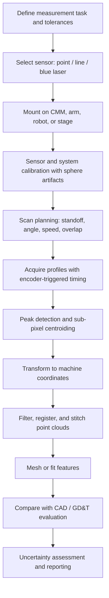

## Laser Triangulation Scanning

Laser triangulation scanning is a noncontact optical measurement technique in which a laser spot or line is projected onto a surface, and the position of its reflected image on a photosensitive detector is used to compute surface height (range) through the geometry of a triangle formed by the emitter, the object point, and the receiver. It is one of the most widely deployed noncontact techniques in dimensional metrology, reverse engineering, inline inspection, and surface profiling because it combines high data rates, micrometer-class resolution, and compact sensor packaging.

### Fundamental Principle

A laser source projects a beam onto the target. A receiving lens images the illuminated spot onto a position-sensitive detector (a linear CCD/CMOS array, a 2D CMOS imager, or a position-sensitive detector, PSD). As the target moves along the measurement axis, the imaged spot shifts laterally on the detector. Because the source-to-receiver baseline and the angles are known from sensor calibration, the shift maps to a target distance.

<svg xmlns="http://www.w3.org/2000/svg" viewBox="0 0 720 420" width="720" height="420" font-family="Arial, Helvetica, sans-serif" font-size="13">
<rect x="0" y="0" width="720" height="420" fill="#ffffff" stroke="#cccccc" />
<text x="360" y="26" text-anchor="middle" font-size="16" font-weight="bold">Laser Triangulation Geometry (svg_diagram)</text>

<rect x="90" y="60" width="60" height="34" fill="#f4d6d6" stroke="#a33" />
<text x="120" y="82" text-anchor="middle">Laser</text>

<line x1="120" y1="94" x2="120" y2="300" stroke="#d00" stroke-width="2" />

<line x1="40" y1="300" x2="400" y2="300" stroke="#333" stroke-width="3" />
<text x="330" y="322" text-anchor="middle">Reference plane (z = 0)</text>
<line x1="40" y1="250" x2="400" y2="250" stroke="#777" stroke-width="2" stroke-dasharray="6,4" />
<text x="330" y="242" text-anchor="middle" fill="#555">Displaced surface (z = Δz)</text>

<circle cx="120" cy="300" r="5" fill="#d00" />
<circle cx="120" cy="250" r="5" fill="#e88" />

<rect x="470" y="60" width="80" height="34" fill="#d6e4f4" stroke="#36a" />
<text x="510" y="82" text-anchor="middle">Receiver lens</text>
<line x1="120" y1="300" x2="500" y2="94" stroke="#36a" stroke-width="1.5" />
<line x1="120" y1="250" x2="480" y2="94" stroke="#36a" stroke-width="1.5" stroke-dasharray="6,4" />

<rect x="440" y="130" width="150" height="14" fill="#dfe8d0" stroke="#585" />
<text x="515" y="164" text-anchor="middle">Detector (CMOS / CCD / PSD)</text>
<line x1="500" y1="94" x2="505" y2="130" stroke="#36a" stroke-width="1.5" />
<line x1="480" y1="94" x2="470" y2="130" stroke="#36a" stroke-width="1.5" stroke-dasharray="6,4" />
<circle cx="505" cy="137" r="3" fill="#36a" />
<circle cx="470" cy="137" r="3" fill="#69c" />

<line x1="120" y1="40" x2="510" y2="40" stroke="#333" stroke-width="1" />
<text x="315" y="36" text-anchor="middle">Baseline b</text>

<path d="M 120 275 A 25 25 0 0 1 145 288" fill="none" stroke="#333" />
<text x="160" y="278">θ</text>

<line x1="60" y1="250" x2="60" y2="300" stroke="#333" stroke-width="1" />
<text x="66" y="280">Δz</text>
<text x="520" y="192" text-anchor="middle">Spot shift Δx on detector</text>
</svg>

### Governing Geometry and Equations

#### Basic Triangulation Relation

For a simple configuration with the laser beam perpendicular to the reference plane and the receiver optical axis at an angle $\theta$ to the beam, the detector-side spot position $x$ relates to the height displacement $\Delta z$ by:

$$x = \frac{m \, \Delta z \sin\theta}{1 + \frac{\Delta z \cos\theta}{L}}$$

where $m$ is the lateral magnification of the receiving optics and $L$ is the object distance along the receiver axis at the reference plane. This form makes explicit that the mapping is **nonlinear** in $\Delta z$, which is why practical sensors apply calibration lookup tables or polynomial correction.

For small displacements ($\Delta z \ll L$), the relation linearizes to:

$$x \approx m \, \Delta z \sin\theta$$

#### Sensitivity and Resolution

The sensitivity of the sensor is the detector shift per unit of height change:

$$S = \frac{\partial x}{\partial z} \approx m \sin\theta$$

The height resolution is set by the smallest detectable spot displacement $\delta x$ on the detector:

$$\delta z = \frac{\delta x}{m \sin\theta}$$

Key implications:

- A larger triangulation angle $\theta$ increases sensitivity (better resolution) but enlarges occlusion and shadowing effects.
- A larger magnification $m$ improves resolution but reduces the measuring range.
- Sub-pixel centroiding lets $\delta x$ be a small fraction of the pixel pitch (commonly 1/10 to 1/100 pixel under good conditions; actual figures depend on signal quality).

#### Measuring Range

The usable range is bounded by the detector length $D$ and the field of view of the receiver:

$$R \approx \frac{D}{m \sin\theta}$$

#### Scheimpflug Condition

To keep the entire laser line or beam path in focus across the depth range while the receiver is tilted relative to the beam, the detector plane is tilted so the object plane (the laser beam), the lens plane, and the image plane intersect along a common line:

$$\tan\alpha' = m \tan\alpha$$

where $\alpha$ is the angle between the object plane and the lens plane and $\alpha'$ is the angle between the image plane and the lens plane. Most commercial triangulation heads implement this tilt internally.

<svg xmlns="http://www.w3.org/2000/svg" viewBox="0 0 720 340" width="720" height="340" font-family="Arial, Helvetica, sans-serif" font-size="13">
<rect x="0" y="0" width="720" height="340" fill="#ffffff" stroke="#cccccc" />
<text x="360" y="26" text-anchor="middle" font-size="16" font-weight="bold">Scheimpflug Arrangement (svg_diagram)</text>

<line x1="60" y1="290" x2="300" y2="60" stroke="#d00" stroke-width="2" />
<text x="70" y="270" fill="#d00">Object plane (laser beam)</text>

<line x1="360" y1="80" x2="360" y2="280" stroke="#333" stroke-width="3" />
<text x="372" y="100">Lens plane</text>

<line x1="470" y1="250" x2="620" y2="100" stroke="#36a" stroke-width="2" />
<text x="560" y="270" fill="#36a">Tilted image plane (detector)</text>

<circle cx="360" cy="330" r="0" fill="none" />
<line x1="360" y1="280" x2="360" y2="316" stroke="#999" stroke-dasharray="4,3" />
<line x1="60" y1="290" x2="360" y2="316" stroke="#999" stroke-dasharray="4,3" />
<line x1="470" y1="250" x2="360" y2="316" stroke="#999" stroke-dasharray="4,3" />
<text x="372" y="322">Common intersection line</text>
</svg>

### Sensor Architectures

#### Point (Spot) Triangulation

A single laser spot is imaged onto a 1D detector. It outputs one distance value per sample.

- Typical use: displacement, thickness (two opposed sensors), vibration, runout, gap, and flatness point checks.
- Data rates reach tens to hundreds of kHz.
- Spot diameters range from a few tens of micrometers to a few hundred micrometers.

#### Line (Profile) Triangulation

A cylindrical or Powell lens fans the beam into a line. A 2D imager captures the deformed line, and each detector column yields one height value, producing a full 2D profile per frame.

- Typical output: 640 to 4096 points per profile.
- Profile rates from hundreds of Hz to tens of kHz, depending on the region of interest read out.
- Motion of the part or sensor along the third axis builds a 3D point cloud.

#### Multi-Line and Structured-Light Variants

- **Multiple laser lines** cover wider fields or improve coverage of steep surfaces.
- **Dual-sensor (opposed or side-by-side) heads** reduce occlusion.
- **Blue laser (405 to 450 nm)** variants reduce speckle and improve performance on hot, glowing, or organic/translucent materials because of shorter wavelength and smaller diffraction-limited spot.

#### Comparison Table

| Attribute | Point Sensor | Line Profile Sensor | Area Structured Light |
| --- | --- | --- | --- |
| Output per frame | 1 distance | 1 profile (hundreds to thousands of points) | Full 3D patch |
| Typical scan needs | 2D motion for surfaces | 1D motion | Often static or stop-and-go |
| Speed | Highest sample rate | High profile rate | Moderate |
| Typical use | Gap, thickness, runout | Inline inspection, weld seams, CMM scanning | Whole-part digitization |

### Signal Processing

#### Peak Detection and Sub-Pixel Estimation

The laser line intensity across each detector column approximates a Gaussian profile. Sub-pixel localization is the primary contributor to resolution. Common algorithms:

- **Center of gravity (CoG / centroid):**

$$x_c = \frac{\sum_i x_i I_i}{\sum_i I_i}$$

- **Gaussian fit** to the peak neighborhood (more robust to asymmetry, higher computation cost).
- **Linear interpolation of threshold crossings** (fast, lower accuracy).
- **Center-of-mass with thresholding** to suppress background pixels.

#### Exposure and Dynamic Range Control

Surface reflectance varies over orders of magnitude. Practical sensors provide:

- **Automatic exposure control (AEC)** per frame or per column.
- **High dynamic range (HDR) modes** combining multiple exposures.
- **Laser power modulation** to keep the peak below saturation.

Saturation flattens the peak and biases the centroid, while low signal increases noise.

#### Spatial and Temporal Filtering

- Median filters remove spikes from specular flash or outliers.
- Moving average or Gaussian smoothing reduces noise at the cost of lateral resolution.
- Peak-width or intensity-based validity rejection removes unreliable points.

### Calibration

Calibration converts detector coordinates $(u, v)$ into metric coordinates $(X, Z)$ in the sensor frame, and eventually into the machine or part frame.

#### Sensor-Level Calibration

- Manufacturer calibration uses precision stages and known targets to build a lookup table or polynomial mapping $Z = f(u)$ and $X = g(u, v)$ that absorbs lens distortion, nonlinearity, and Scheimpflug effects.
- Field re-calibration or verification uses stepped gauges, flat reference plates, or spheres.

#### System-Level Calibration (Scanner on Positioning System)

When the sensor is mounted on a CMM, articulated arm, robot, or gantry, the transformation between sensor frame and machine frame must be determined:

1. Scan a calibration artifact (typically a certified sphere or a sphere plate).
2. Fit spheres to the measured points in the sensor frame.
3. Compare with known positions in the machine frame.
4. Solve for the rigid transformation (rotation $\mathbf{R}$ and translation $\mathbf{t}$) that minimizes residuals:

$$\mathbf{p}_{machine} = \mathbf{R}\,\mathbf{p}_{sensor} + \mathbf{t}$$

Multiple orientations of the sensor relative to the artifact improve conditioning of the solution.

#### Hand-Eye Calibration for Robots

For robot-mounted scanners, hand-eye calibration solves $\mathbf{A}\mathbf{X} = \mathbf{X}\mathbf{B}$ (eye-in-hand) or $\mathbf{A}\mathbf{X} = \mathbf{Y}\mathbf{B}$ (with unknown base transform) using recorded robot poses and sensor observations of a fixed artifact.

### Error Sources and Uncertainty

| Error Source | Mechanism | Mitigation |
| --- | --- | --- |
| Speckle noise | Coherent interference of scattered light produces intensity granularity that shifts the perceived centroid | Blue/shorter wavelength, lower coherence sources, averaging, larger receiver aperture |
| Surface reflectivity variation | Changes peak shape and intensity | AEC, HDR, laser power control |
| Specular reflection | Bright glints, saturation, or multi-path | Adjust incidence angle, cross-polarization, matte spray (where permitted) |
| Translucent materials | Subsurface scattering broadens the line and shifts the apparent surface | Blue lasers, peak selection algorithms, surface coating |
| Edge effects | Partial illumination of the spot at edges and steps | Reduce spot size, scan direction planning, edge-aware filtering |
| Occlusion/shadowing | Line of sight to laser or detector blocked by geometry | Dual-sensor heads, multiple orientations |
| Multipath / interreflection | Secondary bounces create false peaks | Peak-selection strategy, polarization, geometry planning |
| Temperature drift | Housing expansion, laser wavelength shift, electronics | Thermal stabilization, warm-up, environmental compensation |
| Motion blur and timing | Movement during exposure; encoder or trigger jitter | Short exposure, encoder-triggered acquisition, timestamp synchronization |
| Positioning system error | CMM, robot, or stage inaccuracy propagates to the point cloud | Volumetric error mapping, system-level calibration |
| Angle of incidence | Steep surfaces reduce return and broaden the line | Keep surface tilt within the manufacturer's specified range |

A basic uncertainty budget combines these contributions in quadrature when they are independent:

$$u_c = \sqrt{u_{sensor}^2 + u_{surface}^2 + u_{motion}^2 + u_{cal}^2 + u_{env}^2}$$

Actual values depend on the specific sensor and application and should be established experimentally, for example through repeated scans of reference artifacts.

### Scan Planning and Data Acquisition

#### Key Parameters

- **Standoff distance and measuring range** (SDR/MR): operate near the mid-range for best linearity.
- **Point spacing along the line** (set by optics and detector) and **point spacing along the scan direction**, determined by:

$$\Delta y = \frac{v}{f_p}$$

where $v$ is the scan velocity and $f_p$ is the profile rate. To achieve a target pitch $\Delta y$ at velocity $v$, the required profile rate is $f_p = v / \Delta y$.

- **Exposure time** must be short enough to avoid motion blur: blur length $= v \cdot t_{exp}$.
- **Line orientation** relative to features: align the laser plane so it is not parallel to steep walls or narrow grooves.
- **Overlap** between adjacent scan swaths, typically 10 to 30 percent to allow registration and stitching.

#### Example Calculation

**Example**

A line sensor with a maximum profile rate of 5 kHz scans a part moving at 50 mm/s. Find the along-scan point spacing, and the maximum speed that still gives a 0.05 mm pitch.

$$\Delta y = \frac{50\ \text{mm/s}}{5000\ \text{Hz}} = 0.01\ \text{mm}$$

For a 0.05 mm pitch at 5 kHz:

$$v_{max} = \Delta y \cdot f_p = 0.05\ \text{mm} \times 5000\ \text{Hz} = 250\ \text{mm/s}$$

**Output**

- Point spacing at 50 mm/s: 0.01 mm
- Maximum speed for 0.05 mm pitch: 250 mm/s

### Workflow Diagram



### Data Processing After Acquisition

1. **Coordinate transformation** of each profile into the global frame using position feedback (encoder, CMM, robot pose, tracker).
2. **Outlier removal** using statistical filters (for example, neighbor-distance thresholds) and validity flags.
3. **Registration and stitching** of multiple scans using best-fit alignment such as ICP (iterative closest point), or datum-based alignment using reference features.
4. **Meshing or surface reconstruction** for visualization and comparison.
5. **Feature extraction**: plane, cylinder, sphere, cone fitting, edge and hole detection, and section profiles.
6. **CAD comparison** with color deviation maps and GD&T evaluation (flatness, profile of a surface, position, and so on).

### Practical Example: Inline Weld Bead Inspection

**Example**

A blue-laser line profiler is mounted on a robot flange to inspect a butt weld bead on 3 mm steel sheet.

Setup:

- Sensor: 405 nm laser line, 30 mm measuring range, profile rate set to 2 kHz
- Robot travel speed: 40 mm/s
- Required along-weld pitch: 0.05 mm or better

Check pitch:

$$\Delta y = \frac{40}{2000} = 0.02\ \text{mm}$$

This satisfies the requirement.

Processing steps:

1. Acquire profiles perpendicular to the weld axis.
2. Compute per-profile features: bead width, reinforcement height above the sheet plane, toe angles, and undercut depth.
3. Compare against acceptance limits from the applicable weld quality standard.
4. Flag profiles out of tolerance and log position along the seam.

**Output**

- A per-position trace of width and height along the weld
- Pass/fail decisions with locations of nonconformities
- Traceable calibration and uncertainty statement for the measurement

### Illustrative Code: Line Profile Peak Extraction

The following Python example shows sub-pixel peak extraction using thresholded center of gravity on a simulated frame, and conversion to height using a linear calibration.

```python
import numpy as np

def extract_profile(frame, threshold=30):
    """
    frame: 2D array (rows = detector height axis, cols = along the laser line)
    Returns sub-pixel peak row position for each column (NaN if invalid).
    """
    rows = np.arange(frame.shape[0], dtype=np.float64)[:, None]
    f = frame.astype(np.float64)
    f[f < threshold] = 0.0

    weights = f.sum(axis=0)
    with np.errstate(invalid="ignore", divide="ignore"):
        centroid = (rows * f).sum(axis=0) / weights

    centroid[weights == 0] = np.nan
    return centroid

def to_height(centroid_px, px_to_mm=0.005, z0_px=512.0):
    """Linear calibration: height in mm relative to a reference row."""
    return (centroid_px - z0_px) * px_to_mm

# Simulated frame: Gaussian laser line with a step change
h, w = 1024, 800
frame = np.zeros((h, w), dtype=np.float64)
cols = np.arange(w)
true_peak = 500.0 + 40.0 * (cols > 400)

y = np.arange(h)[:, None]
sigma = 2.5
frame = 220.0 * np.exp(-((y - true_peak[None, :]) ** 2) / (2 * sigma**2))
frame += np.random.normal(0, 3.0, frame.shape)

peak = extract_profile(frame, threshold=30)
z_mm = to_height(peak)

print("Mean estimated step (mm):", np.nanmean(z_mm[450:]) - np.nanmean(z_mm[:350]))
```

**Output**

The printed mean step is expected to be close to $40 \times 0.005 = 0.2$ mm (the sign follows the chosen calibration direction). Exact values vary with the random noise realization.

### Standards and Verification

Relevant guidance for acceptance and verification of optical coordinate measuring systems, including laser line scanners on CMMs, includes:

- **ISO 10360-8**: acceptance and reverification tests for CMMs with optical distance sensors (covers probing size, form, and location errors for optical sensors).
- **ISO 10360-2**: CMM performance with contact probing (the baseline for positioning system verification).
- **VDI/VDE 2634**: optical 3D measuring systems (parts covering point-to-point systems and area-based systems).
- **ISO 25178 (series)**: areal surface texture, relevant when triangulation data is used for texture or roughness-like analysis.
- **ISO/IEC 17025**: general requirements for testing and calibration laboratories, relevant for traceable measurement reporting.

Typical verification artifacts include calibrated spheres, step gauges, ball plates, and flatness standards. [Inference] Specific test procedures and limits are defined by the standard edition in force and the scanner manufacturer's specification, and should be confirmed against the current documents.

### Advantages and Limitations

**Key Points**

Advantages:

- Noncontact: no probe force, no deformation of soft or delicate parts
- High data density and speed: thousands of points per profile at kHz rates
- Compact heads suited to robots, CMMs, gantries, and inline stations
- Good resolution at short standoff (micrometer class for many sensors)
- Works on a broad range of opaque, diffusely reflecting materials

Limitations:

- Sensitive to surface finish: mirror-like, black, transparent, or translucent surfaces degrade accuracy
- Line-of-sight constraints: occlusion in deep holes, narrow slots, and steep walls
- Speckle and edge effects limit ultimate accuracy compared with tactile probing on the same feature
- Requires careful calibration of both sensor and positioning system
- Range and resolution trade against each other by geometry
- Ambient light and thermal conditions can influence results [Inference: severity depends on sensor filtering and enclosure design]

### Application Areas

- Reverse engineering and digitization of freeform surfaces
- Inline inspection of extrusions, sheets, rails, and machined parts
- Weld seam tracking and bead inspection
- Tire and wheel geometry and tread depth
- Turbine and blade profile inspection
- Gap and flush measurement in automotive body assembly
- Battery electrode, pouch, and cell geometry inspection
- Semiconductor and electronics: coplanarity, solder paste, and warpage
- Wood, glass, and packaging thickness and profile measurement

### Best Practices

1. Select the sensor by required resolution, working distance, spot/line width, and material response, not by range alone.
2. Warm up the sensor and positioning system to thermal equilibrium before critical measurements.
3. Keep the sensor near mid-range and the surface within the specified tilt limits.
4. Use encoder-triggered acquisition so point spacing is independent of speed fluctuations.
5. Verify performance with a certified sphere or step artifact whose surface resembles the workpiece finish.
6. Scan from multiple orientations for parts with steep walls or complex geometry.
7. Record exposure settings, filters, and processing steps so results are reproducible.
8. Evaluate measurement uncertainty for the specific feature and material, not only the datasheet value.
9. Follow laser safety requirements for the class of the source (for example, IEC 60825-1 classification and applicable local regulations).

### Conclusion

Laser triangulation scanning converts the lateral motion of an imaged laser spot or line into surface height through well-defined geometry, supported by sub-pixel peak detection and careful calibration. Its strengths are speed, density, and noncontact operation; its accuracy is governed by optical design (triangulation angle and magnification), surface optical properties, calibration quality, and the performance of the positioning system that carries the sensor. Sound scan planning, artifact-based verification, and an honest uncertainty budget are what turn raw point clouds into traceable metrology data.

### Related Topics

- Structured light and fringe projection scanning
- Confocal chromatic and white-light interferometry sensors
- Laser line scanners on CMMs and articulated arms
- Point cloud registration (ICP) and stitching
- Optical CMM acceptance testing (ISO 10360-8)
- Multi-sensor and hybrid tactile-optical measurement
- Laser trackers and photogrammetry for large-volume metrology
- Surface texture measurement per ISO 25178
- Measurement uncertainty evaluation for optical systems
- Laser safety classification and compliance