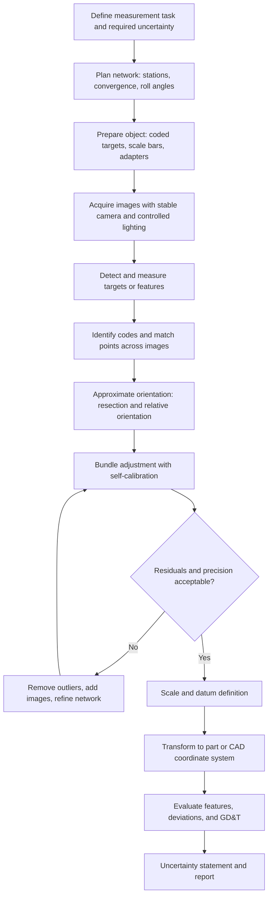

## Photogrammetry


Photogrammetry is the science and technology of obtaining reliable three-dimensional coordinates, dimensions, and shape information about objects from measurements made on photographic images. In precision metrology and quality control, photogrammetry provides noncontact, scalable, and traceable coordinate measurement over volumes ranging from a few millimeters (close-range and microphotogrammetry) to tens of meters (large-volume industrial metrology). It underpins applications such as aircraft and wind-turbine blade inspection, automotive body-in-white checks, antenna and reflector surface characterization, tooling and fixture verification, deformation and strain analysis, and reverse engineering.

### Fundamental Principle

Each camera exposure records a central projection of the scene. A 3D point $\mathbf{X}$, the camera projection center $\mathbf{C}$, and the corresponding image point $\mathbf{x}$ are collinear. When the same point is observed in two or more images taken from different positions, the corresponding rays intersect in space, and the point's coordinates are recovered by triangulation (forward intersection). The unknown camera positions and orientations are recovered by resection and bundle adjustment.

<svg xmlns="http://www.w3.org/2000/svg" viewBox="0 0 720 400" width="720" height="400" font-family="Arial, Helvetica, sans-serif" font-size="13">
<rect x="0" y="0" width="720" height="400" fill="#ffffff" stroke="#cccccc" />
<text x="360" y="26" text-anchor="middle" font-size="16" font-weight="bold">Multi-Ray Intersection Principle (svg_diagram)</text>

<circle cx="360" cy="320" r="7" fill="#d00" />
<text x="375" y="335">Object point X</text>

<polygon points="110,70 150,70 130,100" fill="#d6e4f4" stroke="#36a" />
<text x="130" y="58" text-anchor="middle">Camera 1 (C1)</text>
<line x1="130" y1="100" x2="360" y2="320" stroke="#36a" stroke-width="1.5" />
<line x1="105" y1="118" x2="155" y2="118" stroke="#585" stroke-width="2" />
<text x="70" y="122">image 1</text>
<circle cx="139" cy="118" r="3" fill="#36a" />

<polygon points="340,70 380,70 360,100" fill="#d6e4f4" stroke="#36a" />
<text x="360" y="58" text-anchor="middle">Camera 2 (C2)</text>
<line x1="360" y1="100" x2="360" y2="320" stroke="#36a" stroke-width="1.5" />
<line x1="335" y1="118" x2="385" y2="118" stroke="#585" stroke-width="2" />
<text x="392" y="122">image 2</text>
<circle cx="360" cy="118" r="3" fill="#36a" />

<polygon points="570,70 610,70 590,100" fill="#d6e4f4" stroke="#36a" />
<text x="590" y="58" text-anchor="middle">Camera 3 (C3)</text>
<line x1="590" y1="100" x2="360" y2="320" stroke="#36a" stroke-width="1.5" />
<line x1="565" y1="118" x2="615" y2="118" stroke="#585" stroke-width="2" />
<text x="620" y="122">image 3</text>
<circle cx="581" cy="118" r="3" fill="#36a" />

<line x1="130" y1="200" x2="590" y2="200" stroke="#999" stroke-dasharray="5,4" />
<text x="360" y="194" text-anchor="middle" fill="#666">Stations with known baselines after bundle adjustment</text>
</svg>

### Mathematical Foundations

#### Collinearity Equations

The central relationship of photogrammetry states that the object point, projection center, and image point lie on one line. For an image point $(x, y)$ measured relative to the principal point, with camera constant (principal distance) $c$:

$$x - x_0 = -c\,\frac{r_{11}(X - X_0) + r_{12}(Y - Y_0) + r_{13}(Z - Z_0)}{r_{31}(X - X_0) + r_{32}(Y - Y_0) + r_{33}(Z - Z_0)} + \Delta x$$


$$y - y_0 = -c\,\frac{r_{21}(X - X_0) + r_{22}(Y - Y_0) + r_{23}(Z - Z_0)}{r_{31}(X - X_0) + r_{32}(Y - Y_0) + r_{33}(Z - Z_0)} + \Delta y$$

where:

- $(X, Y, Z)$ are object-space coordinates of the point
- $(X_0, Y_0, Z_0)$ is the projection center in object space
- $r_{ij}$ are elements of the rotation matrix $\mathbf{R}$ (function of the angles $\omega, \varphi, \kappa$)
- $(x_0, y_0)$ is the principal point offset
- $\Delta x, \Delta y$ are corrections for lens distortion and other systematic effects

#### Pinhole Camera and Projection Matrix (Computer-Vision Form)

$$\lambda \begin{bmatrix} u \\ v \\ 1 \end{bmatrix} = \mathbf{K}\,[\mathbf{R} \mid \mathbf{t}] \begin{bmatrix} X \\ Y \\ Z \\ 1 \end{bmatrix}, \qquad \mathbf{K} = \begin{bmatrix} f_x & s & c_x \\ 0 & f_y & c_y \\ 0 & 0 & 1 \end{bmatrix}$$

Here $\mathbf{K}$ is the intrinsic matrix (focal lengths in pixels, skew $s$, principal point $(c_x, c_y)$), and $[\mathbf{R} \mid \mathbf{t}]$ holds the extrinsic parameters.

#### Lens Distortion Model

The widely used Brown model separates radial and decentering (tangential) components. With $\bar{x} = x - x_0$, $\bar{y} = y - y_0$, and $r^2 = \bar{x}^2 + \bar{y}^2$:

$$\Delta x_{rad} = \bar{x}\,(K_1 r^2 + K_2 r^4 + K_3 r^6)$$


$$\Delta x_{dec} = P_1 (r^2 + 2\bar{x}^2) + 2 P_2 \bar{x}\bar{y}$$


$$\Delta y_{dec} = P_2 (r^2 + 2\bar{y}^2) + 2 P_1 \bar{x}\bar{y}$$

with an analogous radial term for $y$. Additional affinity and shear terms $(B_1, B_2)$ are often included for sensor non-orthogonality.

#### Epipolar Geometry

For two views, corresponding image points $\mathbf{x}$ and $\mathbf{x}'$ satisfy:

$$\mathbf{x}'^{T}\,\mathbf{F}\,\mathbf{x} = 0$$

where $\mathbf{F}$ is the fundamental matrix. For calibrated cameras, the essential matrix $\mathbf{E} = \mathbf{K}'^{T}\mathbf{F}\mathbf{K}$ encodes the relative rotation and translation up to scale.

#### Bundle Adjustment

Bundle adjustment is a simultaneous nonlinear least-squares estimation of all object points, exterior orientations, and (optionally) interior orientation and distortion parameters by minimizing the reprojection error:

$$\min_{\mathbf{P}_j, \mathbf{X}_i, \mathbf{K}} \sum_{i}\sum_{j \in V(i)} \left\| \mathbf{x}_{ij} - \pi(\mathbf{K}, \mathbf{P}_j, \mathbf{X}_i) \right\|^2_{\Sigma_{ij}^{-1}}$$

where $V(i)$ is the set of images observing point $i$, $\pi$ is the projection function, and $\Sigma_{ij}$ is the observation covariance. The system is solved iteratively (Gauss-Newton or Levenberg-Marquardt), exploiting sparsity of the normal equations (Schur complement).

<svg xmlns="http://www.w3.org/2000/svg" viewBox="0 0 720 300" width="720" height="300" font-family="Arial, Helvetica, sans-serif" font-size="13">
<rect x="0" y="0" width="720" height="300" fill="#ffffff" stroke="#cccccc" />
<text x="360" y="26" text-anchor="middle" font-size="16" font-weight="bold">Bundle Adjustment Reprojection Residual (svg_diagram)</text>
<line x1="60" y1="230" x2="360" y2="230" stroke="#333" stroke-width="2" />
<text x="210" y="252" text-anchor="middle">Image plane</text>
<circle cx="230" cy="230" r="5" fill="#36a" />
<text x="230" y="270" text-anchor="middle" fill="#36a">Measured point x_ij</text>
<circle cx="270" cy="230" r="5" fill="#d00" />
<text x="290" y="215" fill="#d00">Predicted point π(X_i)</text>
<line x1="230" y1="230" x2="270" y2="230" stroke="#080" stroke-width="3" />
<text x="250" y="198" text-anchor="middle" fill="#080">residual</text>
<polygon points="450,60 490,60 470,90" fill="#d6e4f4" stroke="#36a" />
<text x="470" y="52" text-anchor="middle">Projection center C_j</text>
<line x1="470" y1="90" x2="270" y2="230" stroke="#d00" stroke-dasharray="5,4" />
<line x1="470" y1="90" x2="230" y2="230" stroke="#36a" stroke-dasharray="5,4" />
<circle cx="600" cy="230" r="6" fill="#d00" />
<text x="600" y="255" text-anchor="middle">Object point X_i</text>
<line x1="470" y1="90" x2="600" y2="230" stroke="#d00" stroke-dasharray="5,4" />
</svg>

### Camera Calibration and Orientation

#### Interior Orientation Parameters

- Principal distance $c$ (or focal lengths $f_x, f_y$)
- Principal point $(x_0, y_0)$
- Radial distortion coefficients $K_1, K_2, K_3$
- Decentering distortion coefficients $P_1, P_2$
- Affinity/shear coefficients $B_1, B_2$

#### Exterior Orientation Parameters

Six parameters per image: projection center $(X_0, Y_0, Z_0)$ and rotation angles $(\omega, \varphi, \kappa)$ or a quaternion.

#### Calibration Approaches

| Approach | Description | Typical Use |
| --- | --- | --- |
| Laboratory calibration | Camera imaged against a precise test field or goniometer | Reference-grade cameras |
| Test-field calibration | Convergent images of a coded-target field with known or free-network geometry | Most industrial systems |
| Self-calibration | Interior parameters estimated within the measurement bundle adjustment | Highest accuracy, project-specific |
| Stability calibration | Periodic verification of parameters using a stable reference field | Quality assurance |

A convergent camera network with roll angles of about 90 degrees about the optical axis at several stations is the standard recommendation, because it decorrelates the principal point and decentering parameters from the exterior orientation. [Inference] Exact station counts required for reliable self-calibration depend on lens, sensor, and target distribution.

### Network Design

The precision of photogrammetric coordinates depends strongly on the geometry of the camera network.

**Key Points**

- **Convergence angle:** Larger intersection angles (near 90 degrees) improve depth precision. Very small angles yield poor depth accuracy.
- **Number of rays per point:** More images per point raise redundancy and reliability.
- **Image scale:** Larger image scale (shorter standoff or longer focal length) improves precision.
- **Roll diversity:** Images rotated about the optical axis help decouple systematic parameters.
- **Target distribution:** Points should fill the image format, including corners, to constrain distortion.
- **Scale and datum:** At least one calibrated scale bar (preferably several, in different locations and orientations) fixes scale; a minimum-constraint or free-network datum avoids distorting the network.

A first-order estimate of the expected object-space precision, for a normal-case stereo configuration, is:

$$\sigma_{X} \approx \frac{Z}{c}\,\sigma_{x}, \qquad \sigma_{Z} \approx \frac{Z^{2}}{b\,c}\,\sigma_{x}$$

where $Z$ is the object distance, $c$ the principal distance, $b$ the baseline, and $\sigma_x$ the image measurement precision. For a multi-image convergent network, the following empirical relation is often used:

$$\sigma_{XYZ} = \frac{q\,S\,\sigma_{x}}{\sqrt{k}}$$

where $S$ is the image scale number ($S = Z/c$), $k$ is the average number of rays per point, and $q$ is a network design factor (typically between 0.4 and 1.2 for strong convergent networks; higher for weak geometry). [Inference] The value of $q$ is empirical and should be verified against the specific network.

**Example**

Estimate the object-space precision for a coded-target measurement of a large tool.

- Object distance $Z = 3000$ mm
- Principal distance $c = 24$ mm
- Image measurement precision $\sigma_x = 0.1$ pixel, with pixel pitch 5 $\mu$m, so $\sigma_x = 0.5\ \mu$m
- Average rays per point $k = 9$
- Design factor $q = 0.7$

Image scale number:

$$S = \frac{3000}{24} = 125$$

Object-space precision:

$$\sigma_{XYZ} = \frac{0.7 \times 125 \times 0.5\ \mu\text{m}}{\sqrt{9}} = \frac{43.75}{3}\ \mu\text{m} \approx 14.6\ \mu\text{m}$$

**Output**

- Expected point precision of roughly 15 $\mu$m over a 3 m standoff, or about 1 part in 200,000 relative to the object distance. Actual results depend on target quality, calibration stability, and environment.

### Targets and Image Measurement

#### Target Types

| Target Type | Description | Advantages | Limitations |
| --- | --- | --- | --- |
| Retro-reflective circular targets | Glass-bead or microprismatic film returning light toward the flash | High contrast, high-precision centroids | Require ring flash, specular sensitivity |
| Coded targets | Circular targets with a ring code that carries an ID | Automatic identification and orientation | Need sufficient size and clear view |
| Adhesive matte targets | Printed black and white dots | Low cost | Lower contrast |
| Projected dots or patterns | Laser or LED projected features | No contact with the object | Not fixed to the object surface, unsuitable as datum |
| Natural features | Surface texture, edges, corners | No preparation | Lower precision, requires texture |
| Adapters and probing targets | Targets mounted on pins, spheres, or probes | Measure hidden or offset points | Adapter offset must be calibrated |

#### Target Centering Algorithms

- **Weighted centroid (center of gravity):** Simple and fast; sensitive to thresholding.
- **Ellipse fitting:** Fits an ellipse to edge points; accounts for perspective foreshortening.
- **Least-squares template matching:** Correlates a synthetic target model with the image; sub-pixel precision typically 0.02 to 0.1 pixel under good conditions.

An important geometric effect is that the image of a circular target viewed off-axis is an ellipse, and its centroid is not the image of the target center. The eccentricity is small for small targets and moderate viewing angles, but it is corrected in high-accuracy work.

### Photogrammetric Systems

#### Single-Camera Offline (Multi-Image) Systems

A calibrated high-resolution camera is moved around the object, and images are processed offline after acquisition. It is suited to static objects, large parts, and high accuracy with coded targets.

#### Multi-Camera Online Systems

Two or more fixed cameras, synchronized and calibrated, deliver real-time 3D coordinates. Examples include tracking of probes, dynamic deformation, and robot guidance.

#### Structure from Motion and Multi-View Stereo (SfM/MVS)

SfM/MVS pipelines automatically detect features, match them across images, estimate camera poses, and produce dense point clouds without coded targets.

Typical pipeline:

1. Feature detection and description (SIFT, SURF, ORB, or learned detectors)
2. Feature matching and geometric verification (RANSAC on the fundamental or essential matrix)
3. Incremental or global sparse reconstruction
4. Bundle adjustment
5. Dense matching (MVS, semi-global matching)
6. Meshing and texturing

SfM/MVS is efficient for texture-rich scenes and reverse engineering, but without coded targets and calibrated scale bars, the absolute accuracy and traceability are usually lower than for classical target-based industrial photogrammetry. [Inference] Achievable accuracy depends heavily on texture, overlap, network geometry, and processing settings.

#### Close-Range vs. Aerial vs. Microphotogrammetry

| Category | Typical Volume | Typical Precision | Typical Use |
| --- | --- | --- | --- |
| Microphotogrammetry | mm to cm | sub-micrometer to micrometers | MEMS, microstructures |
| Close-range industrial | 0.1 m to 20 m | 5 to 100 $\mu$m | Tooling, aerospace, automotive |
| Architectural and heritage | 1 m to 100 m | mm to cm | Documentation |
| Aerial and UAV | 100 m to km | cm to dm | Mapping, volume surveying |

### Workflow



### Scale and Datum Definition

Photogrammetry from images alone determines shape only up to a similarity transformation. To obtain metric results:

- **Scale:** Use calibrated scale bars (for example, carbon-fiber bars with targets at certified separation), or known distances between control points. Multiple bars in different orientations reduce scale errors and reveal systematic issues.
- **Datum (free network):** A free-network adjustment with minimal constraints avoids introducing distortion from imperfect control points.
- **Transformation to a reference frame:** A 7-parameter (Helmert) similarity transformation maps the photogrammetric coordinates to CAD or a machine frame:

$$\mathbf{X}_{ref} = s\,\mathbf{R}\,\mathbf{X}_{photo} + \mathbf{t}$$

where $s$ is the scale factor, $\mathbf{R}$ the rotation, and $\mathbf{t}$ the translation. For metrology, a rigid-body (6-parameter, $s = 1$) transformation is used once scale has been established from scale bars.

### Quality Measures

#### Internal Precision Indicators

- **RMS of image residuals:** Root-mean-square of the reprojection error, typically reported in fractions of a pixel or micrometers on the sensor.
- **A posteriori standard deviation of unit weight** $\hat{\sigma}_0$:

$$\hat{\sigma}_0 = \sqrt{\frac{\mathbf{v}^T \mathbf{P}\,\mathbf{v}}{n - u}}$$

where $\mathbf{v}$ are residuals, $\mathbf{P}$ the weight matrix, $n$ the number of observations, and $u$ the number of unknowns. A value near 1 (when weights are set from a priori standard deviations) indicates consistency between stochastic and functional models.

- **Object point precision:** Standard deviations (or 3D error ellipsoids) from the covariance matrix of the adjustment.
- **Redundancy numbers and reliability:** Indicate how well gross errors can be detected.

#### External Accuracy Verification

Internal precision does not by itself guarantee accuracy. Verification should include:

- Comparison to calibrated reference artifacts (scale bars, ball bars, or a calibrated reference plate)
- Comparison to a higher-accuracy reference measurement (CMM or laser tracker)
- Checks of length measurement error using distances not used in the adjustment

**Output**

- Reported quantities generally include image residual RMS, unit-weight standard deviation, 3D point precision, scale-bar residuals, and comparison to check distances.

### Error Sources and Mitigation

| Error Source | Effect | Mitigation |
| --- | --- | --- |
| Lens distortion (uncorrected) | Systematic radial and tangential errors | Calibration, self-calibration |
| Camera instability | Drift of interior orientation, thermal effects | Warm-up, rigid mounting, frequent calibration checks |
| Poor network geometry | Weak depth precision, parameter correlation | Convergent images, roll diversity, more rays per point |
| Target quality | Poor centroids, biased points | High-contrast targets, adequate size in the image, clean surfaces |
| Target eccentricity | Ellipse-center bias | Small targets, ellipse-based correction |
| Illumination variation | Threshold and centroid errors | Ring flash with retroreflectors, controlled lighting |
| Scale errors | Global dimensional error | Multiple calibrated scale bars, temperature compensation |
| Object movement or deformation | Inconsistent geometry across images | Rigid fixturing, stable environment, simultaneous exposure |
| Refraction and atmospheric effects | Ray bending over long distances or temperature gradients | Environmental control, short standoff |
| Glass or reflective surfaces | Multipath, mirrored features | Matte targets, removable coating (where permitted) |
| Software and matching errors | False matches, outliers | Robust estimation (RANSAC), outlier detection, manual review |
| Thermal expansion of the object | Scale-related changes | Measure temperature, apply expansion correction, measure at reference temperature |

A simplified uncertainty combination for independent contributions is:

$$u_c = \sqrt{u_{img}^2 + u_{cal}^2 + u_{scale}^2 + u_{net}^2 + u_{env}^2 + u_{thermal}^2}$$

The values must be evaluated for the specific setup, ideally by repeated measurements and comparison with reference artifacts.

### Practical Example: Antenna Reflector Surface Measurement

**Example**

Measure the surface accuracy of a 2 m composite reflector using an offline multi-image system.

Setup:

- Approximately 400 retro-reflective targets bonded to the surface
- 30 coded targets distributed around the reflector and fixtures
- Two calibrated carbon-fiber scale bars, 1 m each, placed in different orientations
- Camera: 24 MP full-frame sensor, 28 mm fixed lens, ring flash
- Approximately 80 images from stations around the object, with roll angles 0 and 90 degrees

Procedure:

1. Place targets, scale bars, and coded targets; record ambient temperature.
2. Acquire convergent images ensuring each target is seen in at least 6 images.
3. Run automatic target detection and coded-target identification.
4. Compute approximate orientation and bundle adjustment with self-calibration.
5. Inspect residuals; remove outlier observations and re-run.
6. Scale using the bars; verify by comparing the bar length residuals.
7. Fit a best-fit paraboloid to the target coordinates and compute deviations (surface RMS).

Result reporting:

- Bundle adjustment RMS image residual, for example, 0.05 pixel
- Mean 3D point precision, for example, about 10 $\mu$m
- Scale-bar length deviations within the calibrated uncertainty of the bars
- Reflector surface RMS deviation from the best-fit paraboloid

**Output**

- A deviation map (per-target residual from the ideal surface), surface RMS in micrometers, and an uncertainty statement traceable to the scale bar calibration. Numerical values in this example are illustrative.

### Illustrative Code: Reprojection and Simple Bundle Adjustment Setup

The following Python sketch shows a projection function with Brown distortion and a residual function suitable for use with a nonlinear least-squares solver.

```python
import numpy as np
from scipy.optimize import least_squares
from scipy.spatial.transform import Rotation as Rot

def project(points, rvec, tvec, f, cx, cy, k1=0.0, k2=0.0, p1=0.0, p2=0.0):
    """Project Nx3 world points into pixel coordinates with Brown distortion."""
    R = Rot.from_rotvec(rvec).as_matrix()
    pc = points @ R.T + tvec                # world -> camera
    x = pc[:, 0] / pc[:, 2]
    y = pc[:, 1] / pc[:, 2]
    r2 = x**2 + y**2
    radial = 1 + k1 * r2 + k2 * r2**2
    xd = x * radial + 2 * p1 * x * y + p2 * (r2 + 2 * x**2)
    yd = y * radial + p1 * (r2 + 2 * y**2) + 2 * p2 * x * y
    return np.column_stack((f * xd + cx, f * yd + cy))

def residuals(params, n_cams, n_pts, cam_idx, pt_idx, obs, f, cx, cy):
    cams = params[:n_cams * 6].reshape(n_cams, 6)
    pts = params[n_cams * 6:].reshape(n_pts, 3)
    res = np.empty((len(obs), 2))
    for c in range(n_cams):
        m = cam_idx == c
        proj = project(pts[pt_idx[m]], cams[c, :3], cams[c, 3:], f, cx, cy)
        res[m] = proj - obs[m]
    return res.ravel()

# Synthetic demonstration
rng = np.random.default_rng(0)
n_pts, n_cams = 40, 5
f, cx, cy = 4800.0, 3000.0, 2000.0

pts_true = rng.uniform(-0.5, 0.5, (n_pts, 3)) + np.array([0, 0, 3.0])
angles = np.linspace(-0.3, 0.3, n_cams)
cams_true = np.zeros((n_cams, 6))
for i, a in enumerate(angles):
    cams_true[i, :3] = [0, a, 0]            # rotation vector (small yaw)
    cams_true[i, 3:] = [-a * 3.0, 0, 0]     # translation

cam_idx, pt_idx, obs = [], [], []
for c in range(n_cams):
    p = project(pts_true, cams_true[c, :3], cams_true[c, 3:], f, cx, cy)
    p += rng.normal(0, 0.1, p.shape)        # 0.1 px noise
    cam_idx += [c] * n_pts
    pt_idx += list(range(n_pts))
    obs.append(p)
cam_idx, pt_idx, obs = np.array(cam_idx), np.array(pt_idx), np.vstack(obs)

x0 = np.hstack([
    (cams_true + rng.normal(0, 0.01, cams_true.shape)).ravel(),
    (pts_true + rng.normal(0, 0.02, pts_true.shape)).ravel(),
])

sol = least_squares(
    residuals, x0, method="trf", loss="huber",
    args=(n_cams, n_pts, cam_idx, pt_idx, obs, f, cx, cy),
)

rms = np.sqrt(np.mean(sol.fun**2))
print(f"Reprojection RMS: {rms:.3f} px")
```

**Output**

The reprojection RMS is expected to be near the injected noise level (about 0.1 pixel), with the exact value varying with the random realization. This minimal example fixes the interior parameters and does not resolve the gauge (datum) freedom; production bundle adjustment adds datum constraints, sparse Jacobian handling, and self-calibration parameters.

### Standards and Guidelines

- **VDI/VDE 2634 Part 1**: Optical 3D measuring systems; imaging systems with point-by-point probing. Defines acceptance and reverification tests, including length measurement error and probing error using reference artifacts.
- **VDI/VDE 2634 Part 2 and Part 3**: Optical systems based on area scanning and multiple-view systems, respectively. [Inference] Exact scope and test definitions should be confirmed against the current edition.
- **ISO 10360 series**: CMM acceptance and verification; ISO 10360-8 addresses optical distance sensors on CMMs and is often used for comparison and reference.
- **ISO 17123 series**: Field procedures for testing geodetic and surveying instruments, relevant to some large-volume practices.
- **ISO/IEC 17025**: Requirements for competence of testing and calibration laboratories, relevant to traceable photogrammetric measurement services.
- **ISO/IEC Guide 98-3 (GUM)**: Guide to the expression of uncertainty in measurement, the framework for uncertainty budgets.
- **ASPRS, ISPRS guidelines**: Community references for mapping and photogrammetric accuracy reporting, primarily for aerial and terrestrial mapping.

### Advantages and Limitations

**Key Points**

Advantages:

- Scalable measurement volume from millimeters to tens of meters using the same principle
- Simultaneous measurement of hundreds to thousands of points in one session
- Noncontact and lightweight, suitable for large, fragile, hot, or hard-to-reach objects
- Portable equipment, minimal setup infrastructure
- Capture of the object state at the instant of exposure, allowing dynamic and multi-epoch measurement
- Permanent image record supporting later re-analysis and documentation
- Relative accuracy of about 1:100,000 or better achievable for well-designed target-based networks

Limitations:

- Requires visible, well-imaged targets or texture; featureless or highly reflective surfaces are difficult
- Target placement can be time-consuming and, for some parts, unacceptable (surface contamination or coating)
- Offline processing introduces latency, though automation shortens it
- Accuracy depends strongly on network design, calibration quality, and operator expertise
- Line of sight required from at least two, preferably many, stations
- Scale and traceability depend on calibrated reference artifacts
- Limited in dense surface capture on textureless surfaces unless combined with projected patterns or scanners

### Best Practices

1. Define the required measurement uncertainty first, then design the network, targets, and equipment to meet it with margin.
2. Use a rigid, stable camera and lens; lock focus and aperture, and avoid autofocus and image stabilization during the measurement.
3. Acquire convergent images with roll diversity and high redundancy; cover the full image format with targets.
4. Include multiple calibrated scale bars distributed across the volume in different orientations.
5. Control lighting and use retro-reflective targets with a ring flash for high-contrast centroids.
6. Allow thermal equilibrium of the camera before critical work, and record temperature for thermal corrections.
7. Inspect adjustment statistics: residuals, precision, and scale-bar deviations, and investigate anomalies before accepting results.
8. Validate the system periodically on a calibrated reference artifact, such as a ball-bar network or calibrated plate.
9. Keep raw images, processing settings, and software versions for reproducibility and audit.
10. Combine with other sensors (laser scanners, trackers, or CMMs) where photogrammetry alone cannot reach the required density or accuracy.

### Application Areas

- Aerospace: wing and fuselage assembly, jig and fixture verification, antenna and reflector surfaces
- Automotive: body-in-white and tooling checks, crash test deformation analysis
- Energy: wind-turbine blade shape, pressure vessel and pipe geometry, nuclear component measurement
- Shipbuilding and heavy engineering: hull and large weldment geometry
- Deformation and structural monitoring: bridges, dams, test rigs, and load tests
- Motion and vibration analysis with high-speed multi-camera systems
- Reverse engineering and heritage documentation
- Robot calibration and guidance
- Microphotogrammetry: MEMS and micro-component analysis with microscopy optics

### Conclusion

Photogrammetry derives 3D coordinates from image measurements by exploiting the collinearity of object point, projection center, and image point, with bundle adjustment coupling all observations into one statistically rigorous solution. Its metrological quality rests on four pillars: a well-calibrated and stable camera, a strong convergent network, high-quality targets or features measured with sub-pixel precision, and reliable scale and datum definition through calibrated artifacts. When these pillars are addressed and verified against reference standards, photogrammetry delivers traceable, high-accuracy coordinate data over a uniquely wide range of object sizes.

### Related Topics

- Camera calibration and self-calibration methods
- Coded target design and automatic recognition
- Structure from motion and multi-view stereo pipelines
- Bundle adjustment: sparse solvers and datum definition
- Laser trackers and large-volume metrology
- Structured light and fringe projection scanning
- Laser triangulation scanning
- Digital image correlation for deformation and strain measurement
- Measurement uncertainty evaluation per GUM for optical systems
- VDI/VDE 2634 acceptance testing procedures
- Point cloud registration and fusion of multi-sensor data
- High-speed photogrammetry for dynamic measurements