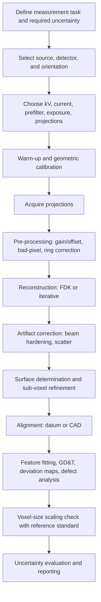

## Industrial Computed Tomography


Industrial computed tomography (CT) is a noncontact volumetric measurement technique that reconstructs the complete three-dimensional internal and external geometry of a workpiece from a set of X-ray projection images acquired at many angular positions. Unlike optical and tactile methods, which access only surfaces reachable by a probe or line of sight, CT captures internal features (undercuts, internal channels, cavities, porosity, assembled components) in a single scan. In precision metrology and quality control, CT serves two complementary roles: **dimensional metrology** (coordinate measurement of internal and external features, wall thickness, nominal-actual comparison) and **nondestructive testing** (porosity, cracks, inclusions, assembly verification). Because it produces a complete voxel dataset, one scan supports many downstream evaluations without re-measuring the part.

### Fundamental Principle

X-ray photons from a source pass through the object and are attenuated according to the material's density, atomic number, and path length. A detector records the transmitted intensity for each ray. Rotating the object (or the source-detector pair) through 360 degrees yields a set of 2D projections, from which a reconstruction algorithm computes the 3D distribution of the linear attenuation coefficient $\mu(x, y, z)$. Gray values in the reconstructed volume are proportional to $\mu$, and the boundary between material and air (or between materials) is located by surface determination.

#### Beer-Lambert Law

For a monochromatic beam traversing a homogeneous material of thickness $d$:

$$I = I_0 \, e^{-\mu d}$$

For a heterogeneous object, the measured line integral along a ray $L$ is:

$$p = -\ln\!\left(\frac{I}{I_0}\right) = \int_L \mu(s)\, ds$$

Each detector pixel yields one line integral per projection angle, and CT reconstruction inverts this set of line integrals. Real laboratory sources are polychromatic, so the simple exponential relation holds only approximately, which is the origin of beam hardening artifacts (discussed below).

#### Radon Transform and the Fourier Slice Theorem

The projection at angle $\theta$ is the Radon transform of the object function $f(x, y)$:

$$p(\theta, t) = \iint f(x, y)\, \delta(x\cos\theta + y\sin\theta - t)\, dx\, dy$$

The Fourier slice theorem states that the 1D Fourier transform of $p(\theta, t)$ with respect to $t$ equals a radial slice of the 2D Fourier transform of $f$ at angle $\theta$. This is the theoretical basis for filtered back-projection.

<svg xmlns="http://www.w3.org/2000/svg" viewBox="0 0 760 400" width="760" height="400" font-family="Arial, Helvetica, sans-serif" font-size="13">
<rect x="0" y="0" width="760" height="400" fill="#ffffff" stroke="#cccccc" />
<text x="380" y="26" text-anchor="middle" font-size="16" font-weight="bold">Cone-Beam CT Acquisition Geometry (svg_diagram)</text>

<circle cx="90" cy="210" r="14" fill="#f4d6d6" stroke="#a33" />
<text x="90" y="245" text-anchor="middle">X-ray source</text>
<text x="90" y="260" text-anchor="middle">(focal spot)</text>

<polygon points="90,210 620,80 620,340" fill="#fdf1d6" stroke="#c90" stroke-opacity="0.8" fill-opacity="0.6" />

<ellipse cx="320" cy="210" rx="34" ry="52" fill="#d6e4f4" stroke="#36a" />
<text x="320" y="214" text-anchor="middle">Object</text>
<line x1="320" y1="140" x2="320" y2="290" stroke="#333" stroke-dasharray="5,4" />
<text x="320" y="308" text-anchor="middle">Rotation axis</text>
<path d="M 290 160 A 34 12 0 0 1 350 160" fill="none" stroke="#080" stroke-width="2" />
<text x="365" y="152" fill="#080">360° rotation</text>

<rect x="620" y="80" width="18" height="260" fill="#dfe8d0" stroke="#585" />
<text x="630" y="366" text-anchor="middle">Flat-panel detector</text>

<line x1="90" y1="380" x2="320" y2="380" stroke="#333" />
<text x="205" y="376" text-anchor="middle">SOD</text>
<line x1="90" y1="392" x2="629" y2="392" stroke="#333" />
<text x="360" y="388" text-anchor="middle">SDD</text>
</svg>

### System Architecture

#### Main Components

| Component | Function | Metrological Relevance |
| --- | --- | --- |
| X-ray tube (or linear accelerator) | Generates polychromatic X-rays | Focal spot size and stability set sharpness and drift |
| Detector (flat-panel or line) | Records transmitted intensity | Pixel pitch, dynamic range, and noise limit resolution and contrast |
| Rotation stage | Rotates the object with high angular accuracy | Runout and wobble directly cause geometric artifacts |
| Manipulator axes | Position object to set magnification (SOD, SDD) | Axis accuracy affects voxel-size calibration |
| Shielding cabinet | Radiation protection | Thermal stability of the enclosure influences drift |
| Reconstruction workstation | Computes the volume (often GPU-accelerated) | Algorithm and filter choices affect the result |
| Analysis software | Surface determination, measurement, comparison | Determines the measurand |

#### Source Types

| Source | Typical Voltage | Typical Focal Spot | Typical Use |
| --- | --- | --- | --- |
| Microfocus tube | 20 to 225 kV | 1 to 50 $\mu$m | Small, low-density parts, high resolution |
| Nanofocus tube | up to about 180 kV | sub-micrometer to a few micrometers | Very small parts, highest resolution |
| Minifocus / standard tube | 225 to 450 kV | 0.4 to 1 mm | Medium to large, denser parts |
| Linear accelerator (LINAC) | MeV range | around 1 to 2 mm | Very dense or thick parts (castings, large assemblies) |
| Synchrotron | Tunable, near-monochromatic | Very small | Research, highest quality; not typical production |

#### Detector Types

- **Flat-panel (amorphous silicon or CMOS with scintillator):** Standard for cone-beam CT; 2D array captures full projections; typical formats from about 1000 by 1000 to 3000 by 3000 pixels or more.
- **Photon-counting detectors:** Count individual photons and optionally discriminate energy, reducing electronic noise and enabling spectral analysis. [Inference] Adoption in production metrology is growing but capability depends on the vendor and application.
- **Linear detector arrays:** Used in fan-beam systems with better scatter rejection but slower acquisition.

### Scan Geometry and Magnification

In cone-beam geometry, the geometric magnification is:

$$M = \frac{SDD}{SOD}$$

where SDD is the source-to-detector distance and SOD is the source-to-object (rotation axis) distance. The effective voxel size (with square pixels of pitch $p$) is:

$$v = \frac{p}{M} = \frac{p \cdot SOD}{SDD}$$

Bringing the object closer to the source raises magnification and reduces voxel size, but limits the maximum object diameter that stays fully within the field of view.

The condition that the object fits in the detector field of view is:

$$D_{obj} \lesssim \frac{W_{det}}{M}$$

where $W_{det}$ is the detector width.

#### Focal Spot Blur and Unsharpness

A finite focal spot of size $F$ causes geometric unsharpness (penumbra) at the detector:

$$U_g = F \left( M - 1 \right)$$

Referred back to object space, the blur is:

$$U_{obj} = \frac{U_g}{M} = F \, \frac{M - 1}{M}$$

At high magnification the blur approaches $F$, so achieving a voxel size much smaller than the focal spot size does not improve true resolution. A common design guideline is to match the focal spot size to the voxel size at the operating power. [Inference] The exact balance depends on the source, and the focal spot size grows with target power in many tubes.

**Example**

A microfocus system has a detector pixel pitch of 0.2 mm, SDD = 800 mm, SOD = 40 mm, and a focal spot of 8 $\mu$m at the chosen power.

Magnification:

$$M = \frac{800}{40} = 20$$

Voxel size:

$$v = \frac{0.2\ \text{mm}}{20} = 0.010\ \text{mm} = 10\ \mu\text{m}$$

Focal-spot blur in object space:

$$U_{obj} = 8\ \mu\text{m} \times \frac{20 - 1}{20} = 7.6\ \mu\text{m}$$

**Output**

- Voxel size: 10 $\mu$m
- Focal-spot blur in object space: about 7.6 $\mu$m, comparable to the voxel size, so the system is reasonably balanced. Reducing the voxel size further without reducing the spot size would add resolution in name only.

### Acquisition Parameters

| Parameter | Effect | Guidance |
| --- | --- | --- |
| Tube voltage (kV) | Penetration and contrast | Enough to reach adequate transmission through the longest path; too high reduces contrast |
| Tube current / power | Photon flux, focal spot size | Higher power increases flux but enlarges the focal spot |
| Prefilter (Cu, Al, Sn) | Removes low-energy photons, reduces beam hardening | Choose by material and thickness |
| Exposure time per projection | Signal-to-noise ratio | Longer exposure lowers noise, increases scan time and drift risk |
| Number of projections | Angular sampling | See sampling criterion below |
| Frame averaging | Noise reduction | Trade with total time |
| Detector binning | Noise vs. resolution | Binning increases signal per pixel and reduces resolution |
| Warm-up and stabilization | Focal spot and detector drift | Allow time to reach thermal equilibrium |

#### Angular Sampling Criterion

For a detector with $N$ pixels across the object's projected width, the approximate number of projections needed for a complete angular sampling over 360 degrees is:

$$N_{proj} \gtrsim \frac{\pi}{2} \, N$$

In practice, the number of projections is chosen from 1000 to 4000 or more as a compromise between quality and scan time. [Inference] Fewer projections can be acceptable for coarse inspection tasks, while dimensional metrology at high accuracy typically benefits from more.

#### Scan Trajectories

- **Circular (single-turn):** Simplest; theoretically incomplete for cone-beam (Tuy condition not satisfied away from the midplane), leading to cone-beam artifacts on tall objects.
- **Helical:** Improves completeness for tall objects at the cost of scan time.
- **Circle plus line, or multiple heights:** Additional orbit or vertical stitching for tall parts.
- **Laminography and limited-angle CT:** For flat, plate-like objects (PCBs, sheets) where full rotation is impractical.
- **Offset (half-beam) scans:** The detector is shifted laterally to extend the field of view for wide objects.

### Reconstruction

#### Filtered Back-Projection and FDK

Filtered back-projection (FBP) applies a ramp-type filter to each projection and then back-projects into the volume. For cone-beam geometry with circular trajectory, the Feldkamp-Davis-Kress (FDK) algorithm is the standard approximate method. In its parallel-beam form:

$$f(x, y) = \int_0^{\pi} \left( p(\theta, t) * h(t) \right)\Big|_{t = x\cos\theta + y\sin\theta} \, d\theta$$

where $h(t)$ is the ramp filter kernel. The choice of window (Ram-Lak, Shepp-Logan, Hann, Cosine) trades resolution against noise.

#### Iterative and Model-Based Methods

- **ART/SART/SIRT:** Algebraic methods solving $\mathbf{A}\mathbf{x} = \mathbf{p}$ iteratively.
- **Statistical iterative (MLEM, OSEM, MBIR):** Incorporate a noise model.
- **Regularized methods (for example, total-variation minimization):** Effective for sparse or limited-angle data.
- **Deep-learning-assisted reconstruction and denoising:** [Inference] Can reduce noise or scan time, but for metrology their effect on dimensional traceability must be validated for each use case.

The reconstruction problem can be written as:

$$\hat{\mathbf{x}} = \arg\min_{\mathbf{x}} \ \|\mathbf{A}\mathbf{x} - \mathbf{p}\|_2^2 + \lambda\, R(\mathbf{x})$$

where $\mathbf{A}$ is the system (projection) matrix, $\mathbf{p}$ the measured projections, $R$ a regularizer, and $\lambda$ the regularization weight.

### Image Artifacts

| Artifact | Cause | Appearance | Mitigation |
| --- | --- | --- | --- |
| Beam hardening (cupping, streaks) | Polychromatic spectrum; low-energy photons absorbed preferentially | Center of homogeneous object appears less dense; dark bands between dense features | Prefiltration, linearization, dual-energy, software correction |
| Scatter | X-rays deflected onto the detector | Reduced contrast, cupping | Collimation, anti-scatter grids, larger air gap, scatter correction |
| Metal artifacts | Photon starvation and beam hardening from dense parts | Bright and dark streaks radiating from dense regions | Higher energy, filtration, orientation change, metal artifact reduction |
| Ring artifacts | Faulty or miscalibrated detector pixels | Concentric rings | Detector gain/offset calibration, detector shift during scan, ring correction |
| Cone-beam artifacts | Incomplete sampling of circular trajectory | Blur and streaks far from midplane | Reduced cone angle, helical or multi-height scans |
| Motion and drift artifacts | Part movement, focal-spot drift, thermal expansion | Double edges, blur | Stable fixturing, warm-up, drift correction |
| Undersampling (aliasing) streaks | Too few projections | Fine streaks | Increase projection count |
| Noise | Photon statistics, electronics | Grainy volume, noisy surface | Longer exposure, averaging, higher flux, filtering |
| Partial volume effect | Voxel contains mixed materials | Blurred edges | Smaller voxel, sub-voxel surface determination |
| Geometry error artifacts | Misaligned rotation axis or detector | Blur, doubled features | Geometric calibration |

#### Beam Hardening Linearization (Polynomial)

A common correction maps the measured polychromatic projection value $p_{meas}$ to an equivalent monochromatic value $p_{mono}$ using a polynomial fitted from a calibration on a reference material:

$$p_{mono} = a_0 + a_1\, p_{meas} + a_2\, p_{meas}^2 + a_3\, p_{meas}^3$$

### Geometric Calibration

Accurate dimensional measurements require that the reconstruction geometry matches the real system. The key parameters are:

- Source position relative to the detector (SDD) and to the rotation axis (SOD)
- Detector tilt, skew, and offset (three rotations and two in-plane shifts)
- Rotation axis position and tilt relative to the detector
- Detector pixel pitch (which sets the scale)

Methods include:

- **Sphere-phantom calibration:** Scan of spheres (for example, ruby or ceramic) whose projections trace ellipses; fitting the trajectories gives the geometry parameters.
- **Reference-object scaling:** The voxel size is calibrated against a length standard (a calibrated ball bar or step gauge) measured in the same scan volume.
- **Self-calibration (auto-alignment) in reconstruction:** Iteratively optimizes the parameters to maximize image sharpness or consistency.

Because the voxel size directly scales all measurements, it is the single most important calibration parameter for dimensional CT, and it is typically verified with calibrated reference standards near the part's conditions.

### Surface Determination

Dimensional measurements require converting the gray-value volume into a surface. The measurand depends on this step.

#### Methods

| Method | Description | Remarks |
| --- | --- | --- |
| Global threshold (for example, ISO-50) | A single gray value, halfway between the material and background peaks in the histogram | Simple; sensitive to artifacts and material variation |
| Local (adaptive) threshold | Threshold determined near the edge from local material and background gray values | Handles cupping and gray-value variation; the standard approach for metrology |
| Gradient-based edge detection | Locates the maximum gradient magnitude | Robust to gray-level offsets |
| Sub-voxel refinement | Interpolates the surface position within voxels, often by fitting an edge profile | Enables uncertainty smaller than the voxel size, subject to noise and artifacts |
| Multi-material segmentation | Classifies different materials | Needed for assemblies with different densities |

#### Advanced Surface Determination

An initial global threshold produces a starting surface. Then, along the surface normal, a gray-value profile is sampled at each point, and the local edge position is set (for example, at the half-maximum between the local material and air gray values). Adopting the resulting points as the measured surface reduces artifact-induced bias.

The edge position for a locally determined threshold is:

$$g_{edge} = \frac{g_{mat} + g_{air}}{2}$$

where $g_{mat}$ and $g_{air}$ are the local mean gray values of material and background near the edge.

The surface is then usually represented as a triangulated mesh (STL) or a point cloud, exported to metrology software for evaluation.

### Dimensional Measurement and Evaluation

Once the surface is available, evaluation follows procedures common to coordinate metrology:

- **Feature fitting:** Least-squares or Chebyshev fits of planes, cylinders, spheres, cones, and freeform patches, including internal features.
- **Coordinate system alignment:** Datum-based alignment (per GD&T), best-fit alignment, or alignment to CAD.
- **Nominal-actual comparison:** Signed distance between the measured surface and the CAD model, displayed as a color deviation map.
- **Wall thickness analysis:** Local thickness computed from inscribed spheres or ray casting.
- **GD&T evaluation:** Form, orientation, location, and profile tolerances.
- **First-article inspection reports:** Balloon drawings with automatic feature measurement.
- **Assembly analysis:** Gaps, interferences, and internal positions in assembled products without disassembly.

### Nondestructive Testing Analyses

Besides dimensions, CT supports the following volumetric analyses:

- **Porosity and void analysis:** Detection, sizing, position, and statistics of voids. Typical methods are gray-value-based defect detection with thresholds, or comparison of the actual surface with a nominal or with the enclosing surface.
- **Inclusion and foreign-material detection:** Dense or light inclusions distinguished by gray-value deviation.
- **Crack and delamination detection:** Depends on crack opening relative to the voxel size; [Inference] cracks narrower than the voxel size may still be detectable through partial-volume contrast, but not resolvable dimensionally.
- **Fiber orientation analysis in composites:** Structure-tensor or fiber-tracking methods derive orientation and volume fraction.
- **Additive manufacturing:** Internal defects, lack of fusion, trapped powder, and lattice geometry conformance.

### Workflow



### Measurement Uncertainty

CT measurement uncertainty is strongly task-specific because the result depends on the part's material, geometry, orientation, and the entire processing chain. There is no single uncertainty for the machine as a whole. Influence factors fall into five groups.

| Group | Examples |
| --- | --- |
| Machine | Focal spot drift, rotation axis error, detector defects, geometry calibration, thermal stability |
| Workpiece | Material and density, size, surface roughness, geometry, and orientation (path lengths) |
| Acquisition and reconstruction | kV, filter, exposure, projections, voxel size, reconstruction algorithm and filter |
| Data processing | Surface determination method, fitting algorithm, alignment, filtering |
| Environment and operator | Temperature, vibration, operator choices |

A first-order combination of independent contributions is:

$$u_c = \sqrt{u_{scale}^2 + u_{geom}^2 + u_{surf}^2 + u_{noise}^2 + u_{drift}^2 + u_{proc}^2 + u_{temp}^2}$$

Approaches for evaluating the task-specific uncertainty include:

- **Substitution or comparison method (in the spirit of ISO 15530-3):** Measure a calibrated workpiece (or one calibrated by a higher-accuracy method such as a tactile CMM) with the same CT procedure, and use the deviations to determine systematic error and uncertainty. [Inference] Applicability to CT depends on how closely the calibrated part mimics the production part and on procedure stability.
- **Sensitivity analysis and Monte Carlo simulation:** Vary the influence factors within their ranges or use simulated CT (radiography simulation software) to propagate uncertainties.
- **Repeated measurements:** Several scans with re-mounting and processing to determine repeatability and reproducibility.
- **Error-limit specification testing per the applicable acceptance standard:** Verifies machine performance on artifacts, but does not replace a task-specific uncertainty.

**Key Points**

- The voxel size scale factor is a first-order systematic error source and must be calibrated with reference standards.
- Internal features and features with long X-ray path lengths typically have larger uncertainty.
- Material, orientation, and surface determination method can shift measured dimensions by amounts comparable to the voxel size. Consistent, documented parameters are essential.
- CT does not, in general, achieve the accuracy of a tactile CMM for simple external features, but it is uniquely capable for internal and hidden geometry. [Inference] The gap depends strongly on the part, the machine, and the procedure.

### Standards and Guidelines

- **ISO 10360-11**: Acceptance and reverification tests for CMMs using X-ray computed tomography (CT) systems. [Inference] Check the current edition for the exact specification parameters (for example, length measurement errors and probing errors).
- **VDI/VDE 2630 Part 1 series**: Computed tomography in dimensional measurement. Part 1.1 covers basics and definitions; Part 1.2 covers influencing factors on measurement results and recommendations for dimensional CT; Part 1.3 covers guideline for application of DIN EN ISO 10360 to CT; Part 1.4 covers measurement uncertainty determination. [Inference] Exact part titles and numbering should be confirmed in the current edition.
- **ISO 15530-3**: Technical specification on using calibrated workpieces or standards to determine uncertainty of CMM measurements.
- **ISO 15708 series (Parts 1 to 3)**: Radiation methods for computed tomography (principles, equipment, and operation), primarily nondestructive testing.
- **ASTM E1441 and ASTM E1570**: Guides for computed tomography imaging and examination.
- **ASTM E2737, E1695**: Practices related to digital detector array performance and CT system performance measurement. [Inference] Confirm exact scope in the current editions.
- **ISO 5817, ISO 10675 and related NDT standards**: Weld quality and radiographic acceptance; used when CT replaces radiography for weld inspection.
- **ISO/IEC 17025**: General requirements for testing and calibration laboratories.
- **ISO/IEC Guide 98-3 (GUM)**: Expression of uncertainty in measurement.

### Radiation Safety

Industrial CT systems are commonly built as fully shielded cabinets (self-shielded, licensed as cabinet X-ray systems in many jurisdictions), whereas large or high-energy systems are installed in shielded rooms with interlocks.

Key practices:

- Interlocked doors and emergency stop
- Dose rate at the cabinet surface below regulatory limits [Inference: the limit values vary by country and license category]
- Radiation warning indicators and controlled access
- Radiation protection officer and training as required by national regulation
- Periodic leakage surveys and dosimetry where required
- Reference frameworks include ICRP recommendations and national radiation protection laws

### Comparison with Other Measurement Methods

| Attribute | Industrial CT | Tactile CMM | Laser Scanning / Structured Light | Photogrammetry |
| --- | --- | --- | --- | --- |
| Internal features | Yes | Only with accessible probing | No | No |
| Data density | Full volume | Discrete points | Dense surface points | Sparse targets or dense with SfM |
| Speed per part (full geometry) | Minutes to hours | Minutes to hours (feature-dependent) | Seconds to minutes | Minutes to hours |
| Typical uncertainty (small parts) | Micrometers to tens of micrometers | Sub-micrometer to micrometers | Tens of micrometers | Tens of micrometers and up |
| Material limitation | Density and thickness (penetration) | Contact force on soft parts | Reflectivity, transparency | Target visibility and texture |
| Traceability | Requires reference standards and task-specific evaluation | Established | Requires evaluation | Requires scale bars and evaluation |
| Radiation | Yes | No | No | No |

### Practical Example: Injection-Molded Part with Internal Channel

**Example**

Inspect a polymer injection-molded manifold (approximate size 60 mm by 40 mm by 25 mm) with an internal 2 mm diameter cooling channel. The specification requires the channel diameter tolerance to be plus or minus 0.05 mm, and requires a porosity screen.

Setup:

- Microfocus source, 130 kV, prefilter 0.5 mm aluminum
- Flat-panel detector: 0.15 mm pixel pitch, 2000 by 2000 pixels
- SDD = 600 mm, SOD = 60 mm
- 1600 projections over 360 degrees, exposure 1 s each
- Reconstruction by FDK with beam-hardening correction

Voxel size:

$$M = \frac{600}{60} = 10, \qquad v = \frac{0.15}{10} = 0.015\ \text{mm} = 15\ \mu\text{m}$$

Fit-in-field check: the detector width is $2000 \times 0.15 = 300$ mm, so the maximum object width is about $300 / 10 = 30$ mm. The 60 mm diagonal exceeds that, so the part must be scanned with an offset detector, or at lower magnification.

Adjusted plan: reduce magnification to $M = 4$, using SOD = 150 mm, which gives $v = 0.15 / 4 = 0.0375$ mm (37.5 $\mu$m) and a field width of $300 / 4 = 75$ mm, which covers the part. The channel of 2 mm diameter then spans about 53 voxels, adequate for a sub-voxel diameter fit.

Processing:

1. Perform a geometric calibration and voxel-size check using a calibrated reference standard scanned under the same conditions.
2. Reconstruct and apply local-threshold surface determination.
3. Fit a cylinder to the internal channel; compute diameter, straightness, and position relative to the datum.
4. Run porosity analysis with a defect-detection algorithm and a minimum defect volume equivalent to several voxels.
5. Compare the part to CAD with a deviation map.

**Output**

- Channel diameter with an expanded uncertainty, and pass/fail against the plus or minus 0.05 mm tolerance
- Straightness and position of the channel
- Porosity report: number of voids, largest void volume and diameter, and location
- Deviation map versus CAD. Numerical values in this example are illustrative, and the achievable uncertainty must be established for the specific machine and procedure.

### Illustrative Code: Voxel Size, Field of View, and Local Threshold Edge Detection

The following Python code computes the scan geometry and demonstrates sub-voxel edge localization along a gray-value profile using a locally determined half-maximum threshold.

```python
import numpy as np

def scan_geometry(pixel_pitch_mm, sdd_mm, sod_mm, n_pix_u, focal_spot_um):
    """Return magnification, voxel size (mm), field width (mm), and blur (um)."""
    M = sdd_mm / sod_mm
    voxel_mm = pixel_pitch_mm / M
    fov_mm = n_pix_u * pixel_pitch_mm / M
    blur_um = focal_spot_um * (M - 1.0) / M
    return M, voxel_mm, fov_mm, blur_um

def subvoxel_edge(profile, voxel_mm, n_ref=8):
    """
    Locate the edge along a 1D gray-value profile going from air to material.
    Local threshold = mean of the air and material plateaus (half-maximum).
    Linear interpolation gives sub-voxel position (mm from profile start).
    """
    g_air = np.mean(profile[:n_ref])
    g_mat = np.mean(profile[-n_ref:])
    g_edge = 0.5 * (g_air + g_mat)

    idx = np.where(profile >= g_edge)[0]
    if len(idx) == 0 or idx[0] == 0:
        return np.nan
    i = idx[0]
    g0, g1 = profile[i - 1], profile[i]
    frac = (g_edge - g0) / (g1 - g0)
    return (i - 1 + frac) * voxel_mm

M, v, fov, blur = scan_geometry(0.15, 600.0, 150.0, 2000, 8.0)
print(f"Magnification: {M:.2f}")
print(f"Voxel size: {v * 1000:.1f} um")
print(f"Field width: {fov:.1f} mm")
print(f"Focal-spot blur (object space): {blur:.1f} um")

# Simulated blurred edge: air (100) to material (1000), true edge at 12.4 voxels
rng = np.random.default_rng(1)
x = np.arange(30, dtype=float)
true_edge = 12.4
sigma = 1.2                                   # blur in voxels
profile = 100 + 900 * 0.5 * (1 + np.tanh((x - true_edge) / sigma))
profile += rng.normal(0, 8, x.shape)

edge_mm = subvoxel_edge(profile, v)
print(f"Estimated edge: {edge_mm / v:.2f} voxels (true {true_edge}) ")
```

**Output**

For SDD = 600 mm, SOD = 150 mm, the code prints magnification 4.00, voxel size 37.5 $\mu$m, field width 75.0 mm, and blur of 6.0 $\mu$m. The estimated edge is close to the true value of 12.4 voxels, with a sub-voxel error that varies with the noise realization (the tanh edge profile is symmetric, so the half-maximum criterion is unbiased in this idealized example).

### Advantages and Limitations

**Key Points**

Advantages:

- Complete internal and external geometry in a single, nondestructive scan
- Access to hidden features, undercuts, and assemblies that cannot be probed
- One dataset supports dimensional evaluation, nominal-actual comparison, wall thickness, and defect analysis
- Suitable for freeform and complex parts, including additive-manufactured lattices
- Comparison with CAD across the whole part rather than at discrete points
- Automatable for inline or at-line inspection of series parts

Limitations:

- Penetration limits: highly dense or thick metallic parts require high energy and produce strong artifacts
- Artifacts (beam hardening, scatter, metal artifacts) can bias dimensions and depend on part geometry and orientation
- Voxel size limits detail: fine features and thin cracks may be unresolved
- Resolution and part size trade against each other (small voxel requires small field of view)
- Scan and reconstruction times can be long relative to optical methods
- Measurement uncertainty is task-specific and requires careful evaluation, and traceability must be established via reference standards
- Radiation shielding and regulatory compliance are required
- Equipment and operation cost are higher than for most other noncontact methods

### Best Practices

1. Define the measurement task (features, tolerances, required uncertainty) before selecting the scanner and parameters.
2. Orient the part to minimize the longest X-ray path lengths and avoid path lengths through dense features; avoid flat faces aligned parallel with the beam.
3. Choose the highest magnification that keeps the part in the field of view and remains consistent with the focal spot size at the chosen power.
4. Warm up the source and detector, and check drift with periodic reference projections or a drift-monitoring artifact.
5. Apply detector calibration (gain, offset, defective pixels) and check for ring artifacts before each session.
6. Use prefiltration and enough projections; validate with the artifact-free appearance of the reconstruction.
7. Calibrate voxel size with a length standard under the same scan settings, and repeat verification at defined intervals.
8. Use a consistent local-threshold surface determination, and document all software settings.
9. Fixture the part rigidly with low-density, low-attenuation materials (for example, foam or carbon fiber holders) placed outside critical regions.
10. Determine task-specific uncertainty using calibrated workpieces, repeated measurements, or simulation, and report it with the results.
11. Verify machine performance periodically against the acceptance standard using reference artifacts (for example, ball bars, step gauges, and sphere plates).
12. Follow radiation safety regulations, interlock checks, and personnel training requirements.

### Application Areas

- Additive manufacturing: internal defects, lattices, powder removal, and dimensional conformance
- Castings and forgings: porosity, shrinkage, wall thickness, and core position
- Injection-molded plastics: warpage, weld lines, internal channels, and inserts
- Electronics and semiconductors: solder joints, wire bonds, BGA voids, and package integrity
- Battery cells: electrode alignment, winding geometry, and internal defects
- Automotive: fuel injectors, sensors, and turbocharger components
- Aerospace: turbine blades (cooling channels), composites, and additive parts
- Medical devices: stents, implants, and micro-assemblies
- Composites: fiber orientation, voids, and delamination
- Reverse engineering and archiving of complex internal geometry
- Assembly verification without disassembly

### Conclusion

Industrial computed tomography converts a set of X-ray attenuation projections into a voxel model of a workpiece, from which internal and external geometry can be measured nondestructively. Its metrological value rests on a chain of well-controlled steps: stable source and detector, accurate geometric and voxel-size calibration, appropriate acquisition parameters and artifact correction, robust local surface determination, and evaluation against a documented uncertainty budget. Because the result depends on part material, geometry, and processing choices, task-specific uncertainty evaluation and periodic verification with reference standards are essential to make CT a traceable measurement method rather than only an imaging tool.

### Related Topics

- Cone-beam reconstruction algorithms and iterative methods
- Beam hardening, scatter, and metal artifact correction
- Geometric calibration of CT systems and voxel-size traceability
- Sub-voxel surface determination and edge detection
- CT acceptance testing per ISO 10360-11
- VDI/VDE 2630 series for dimensional CT
- Measurement uncertainty for CT using calibrated workpieces and simulation
- Dual-energy and spectral (photon-counting) CT
- CT simulation and digital twins for uncertainty estimation
- High-resolution nano-CT and micro-CT
- Porosity and defect analysis in additive manufacturing
- Inline and robot-integrated CT for production inspection
- Radiation safety and regulatory compliance for X-ray systems
- Laser triangulation scanning
- Photogrammetry