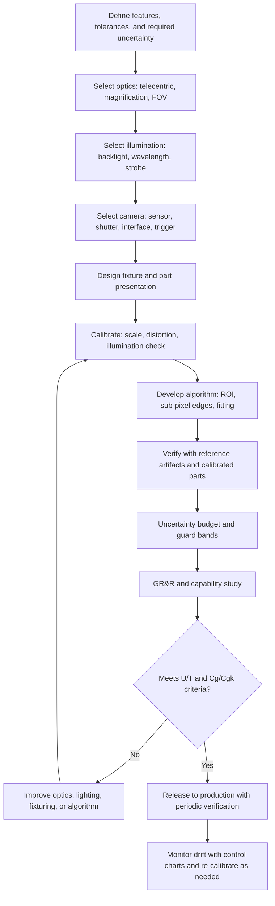

## Machine Vision for Dimensional Inspection


Machine vision for dimensional inspection uses digital cameras, controlled illumination, optics, and image-processing software to measure geometric features (lengths, diameters, angles, positions, gaps, and form deviations) of manufactured parts without physical contact. A vision system converts a scene into a pixel array, locates feature edges with sub-pixel precision, converts pixel coordinates into calibrated physical units, and compares the results against tolerances. In precision metrology and quality control, it is deployed both as high-throughput inline inspection (100 percent inspection of series parts at production speed) and as benchtop or video measuring systems (VMS) for first-article and laboratory measurement. The measurement quality depends on the entire imaging chain, not only the camera: illumination, optics, sensor, calibration, algorithms, mechanical stability, and environment each contribute to the uncertainty.

### Measurement Chain Overview

A dimensional vision measurement is a chain of transformations from a physical feature to a reported value. An error introduced at any stage propagates to the result.

<svg xmlns="http://www.w3.org/2000/svg" viewBox="0 0 780 260" width="780" height="260" font-family="Arial, Helvetica, sans-serif" font-size="12">
<rect x="0" y="0" width="780" height="260" fill="#ffffff" stroke="#cccccc" />
<text x="390" y="26" text-anchor="middle" font-size="16" font-weight="bold">Machine Vision Measurement Chain (svg_diagram)</text>
<rect x="15" y="80" width="100" height="60" fill="#f4d6d6" stroke="#a33" />
<text x="65" y="105" text-anchor="middle">Illumination</text>
<text x="65" y="122" text-anchor="middle">(backlight etc.)</text>
<rect x="135" y="80" width="100" height="60" fill="#fdf1d6" stroke="#c90" />
<text x="185" y="105" text-anchor="middle">Workpiece</text>
<text x="185" y="122" text-anchor="middle">and fixturing</text>
<rect x="255" y="80" width="100" height="60" fill="#d6e4f4" stroke="#36a" />
<text x="305" y="105" text-anchor="middle">Lens</text>
<text x="305" y="122" text-anchor="middle">(telecentric)</text>
<rect x="375" y="80" width="100" height="60" fill="#dfe8d0" stroke="#585" />
<text x="425" y="105" text-anchor="middle">Sensor</text>
<text x="425" y="122" text-anchor="middle">(CMOS/CCD)</text>
<rect x="495" y="80" width="100" height="60" fill="#e6d6f4" stroke="#639" />
<text x="545" y="105" text-anchor="middle">Image</text>
<text x="545" y="122" text-anchor="middle">processing</text>
<rect x="615" y="80" width="100" height="60" fill="#f4e6d6" stroke="#963" />
<text x="665" y="100" text-anchor="middle">Calibration</text>
<text x="665" y="114" text-anchor="middle">and results</text>
<text x="665" y="128" text-anchor="middle">(mm, tol.)</text>
<line x1="115" y1="110" x2="135" y2="110" stroke="#333" stroke-width="2" />
<line x1="235" y1="110" x2="255" y2="110" stroke="#333" stroke-width="2" />
<line x1="355" y1="110" x2="375" y2="110" stroke="#333" stroke-width="2" />
<line x1="475" y1="110" x2="495" y2="110" stroke="#333" stroke-width="2" />
<line x1="595" y1="110" x2="615" y2="110" stroke="#333" stroke-width="2" />
<text x="390" y="200" text-anchor="middle" fill="#555">Error sources: illumination stability, edge diffraction, lens distortion, sensor noise, thresholding, calibration scale, temperature</text>
</svg>

### Imaging Fundamentals

#### Resolution, Pixel Size, and Scale

The object-space pixel size (the physical length represented by one pixel) is:

$$p_{obj} = \frac{p_{sensor}}{m}$$

where $p_{sensor}$ is the sensor pixel pitch and $m$ is the optical magnification. The field of view (FOV) along one axis is:

$$FOV = N_{pix} \cdot p_{obj}$$

with $N_{pix}$ the number of pixels along that axis. The optical magnification for a thin-lens system with focal length $f$ and working distance $WD$ is approximately:

$$m \approx \frac{f}{WD - f}$$

**Example**

Select a camera for measuring a 40 mm long part to a resolution target of 5 $\mu$m per pixel or better.

- Required FOV: 40 mm plus 10 percent margin = 44 mm
- Pixels needed: $44\ \text{mm} / 0.005\ \text{mm} = 8800$ pixels

A single sensor of that size is impractical. Options are a line-scan camera, multiple cameras, or a relaxed pixel size combined with sub-pixel edge detection. With a 5120 by 5120 pixel sensor:

$$p_{obj} = \frac{44\ \text{mm}}{5120} = 8.6\ \mu\text{m/pixel}$$

With sub-pixel edge detection, edge localization of about 1/10 pixel gives a resolution of roughly 0.86 $\mu$m in the ideal case.

**Output**

- Object-space pixel size: about 8.6 $\mu$m per pixel
- Theoretical sub-pixel resolution: about 0.9 $\mu$m; realistic measurement uncertainty is larger because of lens distortion, edge diffraction, calibration, and thermal effects.

#### Rule of Thumb for Pixel Selection

Common practice states that the smallest feature (or the tolerance band) should span at least several pixels, and that the measurement resolution should be one tenth or better of the tolerance. [Inference] These rules of thumb are indicative; acceptable ratios depend on the process capability and the gauge repeatability and reproducibility (GR&R) requirement.

$$p_{obj} \lesssim \frac{T}{10 \cdot k_{sub}}$$

where $T$ is the tolerance band and $k_{sub}$ is the achievable sub-pixel factor (often between 2 and 10).

#### Depth of Field

Depth of field (DOF) sets how much part height variation stays acceptably sharp:

$$DOF \approx \frac{2\, N\, c\,(m + 1)}{m^{2}}$$

where $N$ is the lens f-number, $c$ is the acceptable circle of confusion (often taken as about one to two pixels), and $m$ is the magnification. Stopping down (higher $N$) increases DOF, but diffraction blur grows, and the Airy disk diameter is approximately:

$$d_{Airy} = 2.44\,\lambda\,N_{eff}, \qquad N_{eff} = N(1 + m)$$

The optimum aperture balances geometric blur and diffraction blur.

### Optics

#### Lens Types

| Lens Type | Property | Metrological Suitability |
| --- | --- | --- |
| Entocentric (standard) | Magnification changes with object distance; perspective error | Acceptable for planar parts at fixed distance, needs calibration |
| Telecentric (object-space) | Constant magnification within the working range; nearly orthographic view; low distortion | Preferred for dimensional measurement of 3D parts |
| Bi-telecentric | Telecentric on both object and image side; magnification insensitive to sensor position | Highest stability; used for high-accuracy systems |
| Hypercentric / pericentric | Views converge toward the object; sees the side walls of features | Inspection of bores and tube ends |
| Macro lens | Close-up imaging | Small parts; check distortion carefully |
| Zoom optics | Variable magnification | Flexible, needs magnification-specific calibration; lower repeatability |

For dimensional inspection, telecentric lenses are the standard because a change in the part's distance from the lens does not change the apparent size to first order. The residual error for a non-telecentric lens with a height variation $\Delta z$ at working distance $WD$ is a relative scale error of:

$$\frac{\Delta L}{L} \approx \frac{\Delta z}{WD}$$

[Inference] Real telecentric lenses have a small residual telecentricity error (a fraction of a degree), which limits scale insensitivity across the depth range and should be verified against the datasheet.

#### Distortion

Lens distortion moves image points from their ideal positions. The radial and tangential model (Brown-Conrady) is:

$$x_d = x\,(1 + k_1 r^2 + k_2 r^4 + k_3 r^6) + 2 p_1 x y + p_2 (r^2 + 2x^2)$$


$$y_d = y\,(1 + k_1 r^2 + k_2 r^4 + k_3 r^6) + p_1 (r^2 + 2y^2) + 2 p_2 x y$$

Telecentric lenses typically have low distortion (often below 0.1 percent for high-grade metrology lenses), but it must still be characterized and corrected for accurate work. [Inference] Specification values vary by manufacturer and model.

#### Optical Resolution Limit

The diffraction-limited resolution of the lens (Rayleigh criterion) in object space is approximately:

$$\delta_{obj} \approx \frac{0.61\,\lambda}{NA_{obj}}$$

The overall system resolution is limited by the lens modulation transfer function (MTF), the sensor sampling (Nyquist limit at 2 pixels per resolvable line pair), and defocus. The lens should be matched to the sensor: the lens must resolve at least the sensor's Nyquist frequency at the operating aperture.

### Illumination

Illumination is the most influential design decision, because it determines edge contrast, stability, and the position of the edge in the image.

| Technique | Setup | Best For | Cautions |
| --- | --- | --- | --- |
| Diffuse backlight | Light source behind the part, silhouette imaging | Outline dimensions, hole diameters, thin parts | Silhouette hides surface features; edge position depends on part edge geometry |
| Telecentric (collimated) backlight | Collimated light matched with a telecentric lens | Highest-accuracy silhouette measurement | Needs alignment; sensitive to refraction in transparent parts |
| Bright-field front (coaxial) light | Light along the optical axis, reflected by flat specular surfaces | Flat, polished surfaces | Highlights and hot spots on curved surfaces |
| Dark-field | Low-angle light; only scattered light returns | Edges, scratches, engraved marks | Low signal, not usually for dimensioning |
| Diffuse dome | Uniform hemispherical light | Curved, shiny surfaces | Lower edge contrast |
| Ring light | LEDs around the lens | General purpose | Uneven shading, reflections |
| Structured (line) light | Projected line for height | 3D profile | See laser triangulation |
| Polarized light | Cross-polarizers on light and camera | Suppress specular reflections | Reduces intensity |
| Strobed LED | Short pulses synchronized with the camera | Moving parts, freeze motion | Timing accuracy, thermal LED drift |
| Multi-angle programmable | Segments switched per image | Combines top, side, and coaxial views | Complexity |

Wavelength selection matters. Monochromatic (often blue) illumination reduces chromatic aberration and diffraction blur, since blur scales with wavelength. Narrow bandpass filters suppress ambient light.

**Key Points**

- Silhouette (backlit) measurement is the most repeatable method, because edge contrast is high and independent of surface finish.
- Front-lit measurements are affected by surface reflectivity, roughness, chamfers, and edge radii, which can shift the apparent edge position.
- LED intensity and color drift with temperature and age; use constant-current drivers, warm-up periods, and, for high accuracy, closed-loop intensity control.

### Sensors and Cameras

#### Area-Scan and Line-Scan

| Type | Description | Typical Use |
| --- | --- | --- |
| Area-scan | 2D pixel array captures a whole image at once | Discrete parts, stop-and-go or strobed inspection |
| Line-scan | 1D array builds an image as the part moves | Continuous web, long parts, high resolution at high speed |
| 3D / height cameras | Laser triangulation or stereo | Height, flatness, volume |

#### Sensor Characteristics Affecting Metrology

- **Global shutter** avoids skew distortion on moving objects; rolling shutter can distort fast-moving scenes.
- **Pixel pitch and fill factor:** Larger pixels collect more light (better signal-to-noise ratio), smaller pixels give finer sampling.
- **Bit depth:** 8 bits is common; 10 or 12 bits give better sub-pixel gradient estimation.
- **Noise sources:** Photon shot noise, read noise, dark current, and fixed-pattern noise. The signal-to-noise ratio for shot-noise-limited operation is:

$$SNR = \frac{S}{\sqrt{S + \sigma_{read}^2 + \sigma_{dark}^2}}$$

- **Interface and synchronization:** GigE Vision, USB3 Vision, CoaXPress, Camera Link; hardware triggering ensures consistent capture position and strobe timing.
- **Thermal effects:** Sensor and camera-body heating changes the sensor-to-lens distance and the dark signal, so warm-up and thermal stabilization improve repeatability.

### Image Processing for Measurement

#### Processing Pipeline

1. **Acquisition** with fixed exposure, gain, and gamma settings.
2. **Pre-processing:** Flat-field (shading) correction, dark-frame subtraction, defective-pixel correction, noise filtering (Gaussian or median), and optional distortion correction.
3. **Feature localization:** Find the region of interest (ROI) by pattern matching or fixtures.
4. **Edge detection:** Locate edge points with sub-pixel precision.
5. **Geometric fitting:** Fit lines, circles, ellipses, and curves to the edge points.
6. **Measurement computation:** Distances, diameters, angles, and positions.
7. **Conversion to physical units** using the calibration.
8. **Tolerance evaluation and reporting.**

#### Sub-Pixel Edge Detection

Sub-pixel methods estimate edge position to a fraction of a pixel. Common approaches:

- **Gradient maximum with interpolation:** Compute the intensity gradient along a search direction and refine the maximum position by fitting a parabola to three points:

$$\delta = \frac{g_{-1} - g_{+1}}{2\,(g_{-1} - 2 g_0 + g_{+1})}$$

where $g_0$ is the gradient at the peak pixel, and $g_{\pm 1}$ are the neighboring values; the edge position is $x_0 + \delta$.

- **Moment-based (centroid of gradient) methods.**
- **Edge-model fitting:** Fit an error-function (erf) or sigmoid model to the intensity profile across the edge:

$$I(x) = I_1 + \frac{I_2 - I_1}{2}\left[1 + \operatorname{erf}\!\left(\frac{x - x_e}{\sqrt{2}\,\sigma}\right)\right]$$

where $x_e$ is the edge position, $\sigma$ the edge blur width, and $I_1$, $I_2$ are the plateau intensities. This is typically the most accurate and lowest-bias method for well-imaged edges.

- **Zernike moments and other area-based methods.**
- **Half-maximum (50 percent) threshold crossing with linear interpolation.**

The theoretical edge-localization precision is inversely related to the signal-to-noise ratio and the edge sharpness. [Inference] Practical sub-pixel repeatability of 1/10 to 1/50 pixel is commonly reported under good conditions, but accuracy (as opposed to repeatability) is limited by systematic effects.

#### Geometric Fitting

For circle fitting, the algebraic (Kasa) least-squares solution minimizes:

$$\min_{a, b, R} \sum_i \left( \sqrt{(x_i - a)^2 + (y_i - b)^2} - R \right)^2$$

Geometric (orthogonal-distance) fitting is preferred for metrology because it minimizes the true distance to the model, while the algebraic fit is faster but can be biased for partial arcs. Robust fitting (RANSAC or M-estimators) suppresses outlier edge points from dust, burrs, or reflections.

The uncertainty of a fitted circle diameter from $n$ well-distributed edge points with independent random edge error $\sigma_e$ decreases approximately as:

$$\sigma_D \approx \frac{2\,\sigma_e}{\sqrt{n}}$$

for full circles with uniformly distributed points. [Inference] Correlated errors (distortion, illumination gradients) do not average out this way.

#### Edge Position Bias

The measured edge location generally does not coincide with the true geometric edge, and the offset depends on:

- Illumination type (backlight vs. front light)
- Threshold level chosen
- Edge geometry (sharp, chamfered, rounded)
- Diffraction and defocus, which blur and can shift edges asymmetrically
- Material transparency and edge translucency

This is why calibration and verification should use reference standards with the same edge type, material, and illumination as production parts. A systematic offset that is the same for an internal and an external feature changes the sign (internal features appear smaller and external features larger, or the reverse, depending on threshold), so diameters and gap widths are especially sensitive.

### Calibration

#### Scale (Pixel-to-Length) Calibration

Scale calibration relates pixel distances to physical lengths using a reference of known dimension: a calibrated stage micrometer, a chrome-on-glass grid, a step gauge, or a calibrated dot pattern. For a reference with two features at known distance $L_{ref}$ separated by $n_{pix}$ pixels:

$$s = \frac{L_{ref}}{n_{pix}}\ \ [\text{mm/pixel}]$$

Because the calibration reference has its own uncertainty and thermal expansion, both must enter the uncertainty budget.

#### Distortion and Perspective Calibration

A planar calibration target (for example, a grid or dot pattern) imaged at several positions supports estimation of camera intrinsics and distortion. For a plane at $Z = 0$ the mapping between target coordinates and image points is a homography:

$$\lambda \begin{bmatrix} u \\ v \\ 1 \end{bmatrix} = \mathbf{H} \begin{bmatrix} X \\ Y \\ 1 \end{bmatrix}$$

After distortion correction, $\mathbf{H}$ maps the image to a metric plane. For telecentric lenses the model reduces to a scaled orthographic (affine) projection, and the pinhole-based models must be replaced accordingly. [Inference] Some calibration toolkits offer a dedicated telecentric camera model; verify that the chosen model matches the lens type.

#### Verification and Periodic Checks

- Measure a calibrated reference artifact (such as a glass scale, ring gauge, or chrome-on-glass grid) at the start of each shift or lot.
- Track results on a control chart to detect drift.
- Recalibrate after lens changes, focus changes, or mechanical adjustments.
- Verify at multiple positions in the FOV, because distortion and telecentricity vary spatially.

**Example**

A telecentric system is calibrated with a chrome-on-glass grid (certified line spacing 1.000 mm, certificate uncertainty $U = 0.5\ \mu$m, $k = 2$). The image shows 10 grid intervals spanning 2048.6 pixels.

$$s = \frac{10.000\ \text{mm}}{2048.6\ \text{pixels}} = 4.8814\ \mu\text{m/pixel}$$

Standard uncertainty of the grid: $u_{grid} = 0.25\ \mu$m over one interval, so over ten intervals, if errors are treated as fully correlated, $u = 2.5\ \mu$m over 10 mm, a relative uncertainty of $2.5 \times 10^{-4}$. If the errors are independent, the combined uncertainty would be $0.25 \times \sqrt{10} \approx 0.79\ \mu$m. A conservative assumption (fully correlated) is usually adopted unless the certificate states otherwise.

**Output**

- Scale factor: 4.8814 $\mu$m per pixel
- Relative scale uncertainty from the reference: $2.5 \times 10^{-4}$ (conservative). For a 40 mm measurement, this contributes about 10 $\mu$m, which shows why a reference of comparable length to the measurand is preferable. Values are illustrative.

### Feature Measurements

| Feature | Typical Method | Notes |
| --- | --- | --- |
| Length, width | Edge-to-edge distance across a fitted line pair | Use fitted lines rather than single scan lines to average noise |
| Hole or shaft diameter | Circle fit to edge points | Backlight gives the best contrast for through-holes |
| Center distance | Distance between fitted circle centers | Less sensitive to edge bias than diameters (bias cancels for equal features) |
| Angle | Angle between fitted lines | Requires sufficiently long lines for angle resolution |
| Radius or corner | Arc fit | Limited by pixel sampling of small radii |
| Pitch, spacing | Multiple feature positions | Use pattern matching for feature location |
| Gap and flush | Edge fit plus 3D sensor for height | 2D vision alone cannot measure flush without height information |
| Straightness, roundness | Deviation of fitted points from the ideal geometry | Sensitive to noise and distortion |
| Thread profile | Silhouette profile with a shadowgraph approach | Pitch, flank angle, major and minor diameters |
| Coating or film thickness (cross-section) | Edge distance on a sectioned image | Requires calibrated microscope optics |

The angular resolution of a fitted line of length $L_{line}$ with edge localization precision $\sigma_e$ is approximately:

$$\sigma_\theta \approx \frac{\sigma_e \sqrt{12}}{L_{line}\sqrt{n}}$$

for $n$ evenly spaced points along the line. [Inference] This is a first-order estimate for independent random error only.

### System Types

| System Type | Description | Typical Uncertainty Class | Typical Use |
| --- | --- | --- | --- |
| Inline vision station | Fixed cameras and lighting at a production line with strobed capture | Tens of micrometers, depending on FOV | 100 percent inspection, sorting |
| Vision-guided robot cell | Cameras on or near a robot for location and inspection | Sub-millimeter to tens of micrometers | Assembly, gap and flush, pick-and-place |
| Video measuring machine (VMM/VMS) | Motorized XYZ stage, zoom or telecentric optics, optional touch probe | Micrometers | Small precision parts, PCBs, stampings |
| Optical comparator / shadowgraph (digital) | Silhouette projection with overlay comparison | Micrometers to tens of micrometers | Profile and thread inspection |
| Multi-sensor CMM | CMM with camera plus tactile and other sensors | Micrometers | Combined tactile and optical measurement |
| Line-scan web inspection | Continuous material with line-scan camera | Depends on line speed and resolution | Sheet, film, strip |
| Multi-camera array | Several cameras with stitching or view fusion | Tens of micrometers | Large parts, all-around checks |
| Microscope-based systems | High NA optics and sensor | Sub-micrometer to micrometers | Microstructures, MEMS |

For video measuring machines, the accuracy is often specified as a length measurement error with a form such as $E = \pm(A + L/B)\ \mu$m, where $L$ is the measured length in mm. [Inference] The coefficients depend on the model, and the current standard for acceptance testing should be consulted for the test procedure.

### Image Stitching and Large-Part Inspection

When the part exceeds the field of view, two strategies apply:

- **Stage-based stitching:** The XY stage moves the part, and the position of each image is taken from the stage encoders, giving measurement in machine coordinates. The measurement uncertainty then includes the stage positioning error and the coupling of stage error with camera calibration.
- **Feature-based stitching:** Overlap regions are registered by matching features. It is flexible but can accumulate drift and should not be the sole basis of a dimensional result.

For features that span several images, the preferred approach is to compute feature coordinates in the machine frame and evaluate the dimension from these coordinates instead of from stitched pixels.

### Automation, Motion, and Synchronization

For moving parts, the blur length is:

$$B = v \cdot t_{exp}$$

To keep blur below a fraction $\alpha$ of the object-space pixel size:

$$t_{exp} \leq \frac{\alpha\, p_{obj}}{v}$$

**Example**

A part travels on a conveyor at 300 mm/s. The object-space pixel size is 20 $\mu$m, and blur must not exceed 0.25 pixel.

$$t_{exp} \leq \frac{0.25 \times 0.020\ \text{mm}}{300\ \text{mm/s}} = 1.67 \times 10^{-5}\ \text{s} = 16.7\ \mu\text{s}$$

**Output**

- A strobe pulse of about 16 $\mu$s or shorter is required. A pulsed LED with a global-shutter camera and hardware trigger satisfies this. The trigger jitter $\Delta t$ also causes a position error $v\,\Delta t$, so 1 $\mu$s of jitter at 300 mm/s corresponds to 0.3 $\mu$m.

Encoder-triggered acquisition removes the dependence on conveyor speed variation. For line-scan cameras, the line trigger derived from the encoder must match the pixel size in the travel direction so that pixels are square:

$$\Delta y = p_{obj} \;\Rightarrow\; f_{line} = \frac{v}{p_{obj}}$$

### Measurement Uncertainty

A vision measurement should be reported with an uncertainty determined following the GUM. Major contributors:

| Contributor | Description | Mitigation |
| --- | --- | --- |
| Scale calibration | Reference standard uncertainty, calibration repeatability | Reference near the measurand length, multiple grid intervals |
| Lens distortion residual | Remaining error after correction | Telecentric optics, distortion mapping |
| Telecentricity error | Scale change with part height | Fixtures controlling height, telecentric lens with verified specification |
| Edge detection (repeatability) | Noise-driven sub-pixel scatter | Averaging, higher SNR, edge-model fitting |
| Edge detection (bias) | Threshold and illumination dependent offset | Calibrate on reference parts of the same type |
| Illumination stability | Intensity and spectrum drift | Constant-current drivers, warm-up, closed-loop control |
| Focus and defocus | Blur that shifts edge positions | Autofocus with fixed criteria, stable fixtures |
| Part positioning and orientation | Tilt and height error | Fixtures, tilt tolerance in the uncertainty budget |
| Thermal expansion | Part and reference temperature deviation from 20 degrees C | Temperature measurement and correction |
| Camera and mounting drift | Thermal or mechanical creep | Rigid, athermal mounts; warm-up |
| Fitting and algorithm | Model and sampling effects | Validated algorithm, sufficient edge points |
| Vibration | Motion blur, position jitter | Isolation, short exposure |

The combined standard uncertainty for independent contributions is:

$$u_c = \sqrt{\sum_i c_i^2\, u_i^2}$$

and the expanded uncertainty is $U = k\,u_c$, commonly with $k = 2$ (about 95 percent coverage for a normal distribution).

#### Relation to Tolerance

The measurement capability is often assessed with a ratio of uncertainty to tolerance:

$$\frac{U}{T} \leq \frac{1}{4} \ \text{ to } \ \frac{1}{10}$$

where different quality systems apply different limits. [Inference] The acceptable ratio is defined by the applicable procedure or customer requirement, and decision rules per ISO 14253-1 (guard bands) determine conformance.

The guarded acceptance limits with a guard band $g = U$ are:

$$USL_{acc} = USL - U, \qquad LSL_{acc} = LSL + U$$

### Measurement System Analysis

Gauge repeatability and reproducibility (GR&R) and capability studies confirm that the system is adequate for the process.

- **Type 1 study:** Repeated measurement of a single reference part to evaluate bias and repeatability. The capability index is:

$$C_g = \frac{0.2\,T}{6\,s_g}, \qquad C_{gk} = \frac{0.1\,T - |\bar{x}_g - x_{ref}|}{3\,s_g}$$

where $s_g$ is the standard deviation of the repeated measurements. Values of $C_g, C_{gk} \geq 1.33$ are widely used as acceptance thresholds. [Inference] Thresholds vary by organization and standard.

- **Crossed GR&R (Type 2/3):** Multiple parts, operators (or loading cycles for automated systems), and repeats to separate repeatability, reproducibility, and part variation. Common acceptance guidance treats %GRR below 10 percent as acceptable and above 30 percent as unacceptable, with the range between subject to application judgment.
- **Linearity and stability studies** over the measuring range and time.

### Practical Example: Inline Inspection of a Stamped Connector Terminal

**Example**

Inspect a stamped terminal with a critical slot width of 0.80 mm, tolerance plus or minus 0.03 mm ($T = 0.06$ mm), at 120 parts per minute.

Design decisions:

- Illumination: telecentric collimated backlight with 460 nm blue LEDs, strobed
- Lens: bi-telecentric, magnification 0.5 (field of view constrained to the terminal)
- Camera: 5 MP global-shutter monochrome sensor, pixel pitch 3.45 $\mu$m, hardware triggered

Object-space pixel size:

$$p_{obj} = \frac{3.45\ \mu\text{m}}{0.5} = 6.9\ \mu\text{m/pixel}$$

Required resolution: $T/10 = 6\ \mu$m; with sub-pixel factor 5, the effective resolution is $6.9/5 = 1.4\ \mu$m, comfortably better than the target.

Motion: the part moves at 150 mm/s at the vision station, so for blur of 0.2 pixel:

$$t_{exp} \leq \frac{0.2 \times 0.0069\ \text{mm}}{150\ \text{mm/s}} = 9.2\ \mu\text{s}$$

A 5 $\mu$s strobe pulse is selected.

Processing:

1. Trigger on the part sensor, with a fixed delay.
2. Locate the terminal by pattern matching to define the ROI.
3. Extract the two slot edges with erf-model sub-pixel fitting along 40 scan lines each.
4. Fit lines to each edge and compute the mean distance between them.
5. Apply the calibrated scale and the edge-bias correction determined from a reference part measured on a CMM or a certified reference.
6. Compare with the tolerance including guard bands.

Uncertainty estimate (illustrative):

| Contribution | Standard Uncertainty ($\mu$m) |
| --- | --- |
| Scale calibration | 1.0 |
| Edge repeatability (after line fit) | 0.6 |
| Edge bias correction | 1.5 |
| Distortion residual | 0.8 |
| Illumination and focus drift | 1.0 |
| Thermal | 0.5 |

$$u_c = \sqrt{1.0^2 + 0.6^2 + 1.5^2 + 0.8^2 + 1.0^2 + 0.5^2} \approx 2.4\ \mu\text{m}$$


$$U = 2 \times 2.4 = 4.8\ \mu\text{m}, \qquad \frac{U}{T} = \frac{4.8}{60} = 0.08$$

**Output**

- The ratio $U/T \approx 0.08$ (about 1:12) is acceptable for this application. Guarded acceptance limits are the tolerance limits tightened by 4.8 $\mu$m. All numerical values here are illustrative and must be established for the actual system.

### Workflow



### Illustrative Code: Sub-Pixel Edge Fit and Circle Fit

The following Python code simulates a backlit hole, extracts sub-pixel edge points along radial scan lines using an erf-model fit, fits a circle by orthogonal-distance least squares, and converts the diameter to millimeters.

```python
import numpy as np
from scipy.optimize import curve_fit, least_squares
from scipy.special import erf
from scipy.ndimage import map_coordinates

def make_hole_image(size=400, cx=200.3, cy=199.6, radius=80.45, sigma=1.4,
                    dark=200.0, bright=3000.0, noise=15.0, seed=0):
    """Backlit through-hole: bright inside the hole, dark outside; blurred edge."""
    rng = np.random.default_rng(seed)
    y, x = np.mgrid[0:size, 0:size].astype(float)
    r = np.hypot(x - cx, y - cy)
    img = dark + (bright - dark) * 0.5 * (1 + erf((radius - r) / (np.sqrt(2) * sigma)))
    return img + rng.normal(0, noise, img.shape)

def edge_model(t, i1, i2, te, s):
    """Intensity along a radial profile: bright (i2) inside, dark (i1) outside."""
    return i1 + (i2 - i1) * 0.5 * (1 + erf((te - t) / (np.sqrt(2) * s)))

def radial_edge_points(img, center, r_nom, n_rays=90, half_len=12, step=0.25):
    cx, cy = center
    t = np.arange(r_nom - half_len, r_nom + half_len, step)
    pts = []
    for ang in np.linspace(0, 2 * np.pi, n_rays, endpoint=False):
        xs = cx + t * np.cos(ang)
        ys = cy + t * np.sin(ang)
        prof = map_coordinates(img, [ys, xs], order=3)
        p0 = [prof.min(), prof.max(), r_nom, 1.5]
        try:
            popt, _ = curve_fit(edge_model, t, prof, p0=p0)
            te = popt[2]
            pts.append([cx + te * np.cos(ang), cy + te * np.sin(ang)])
        except RuntimeError:
            continue
    return np.array(pts)

def fit_circle(pts):
    """Orthogonal-distance circle fit initialized from the centroid."""
    def resid(p):
        return np.hypot(pts[:, 0] - p[0], pts[:, 1] - p[1]) - p[2]
    p0 = [pts[:, 0].mean(), pts[:, 1].mean(),
          np.mean(np.hypot(pts[:, 0] - pts[:, 0].mean(), pts[:, 1] - pts[:, 1].mean()))]
    sol = least_squares(resid, p0)
    return sol.x, resid(sol.x)

img = make_hole_image()
pts = radial_edge_points(img, center=(200, 200), r_nom=80)
(cx, cy, R), res = fit_circle(pts)

scale_um_per_px = 4.8814                     # from calibration
diameter_mm = 2 * R * scale_um_per_px / 1000.0
print(f"Fitted center (px): ({cx:.3f}, {cy:.3f})")
print(f"Fitted radius (px): {R:.3f}  (true 80.450)")
print(f"Diameter: {diameter_mm:.4f} mm")
print(f"Form residual RMS: {np.sqrt(np.mean(res**2)) * scale_um_per_px:.3f} um")
```

**Output**

The fitted radius is expected to agree with the true value of 80.45 pixels to within a small fraction of a pixel (the exact figure varies with the noise realization), and the diameter is about $2 \times 80.45 \times 4.8814 / 1000 \approx 0.7854$ mm. The residual RMS reflects noise-driven edge scatter and is typically a small fraction of a pixel in this idealized simulation. Real systems add distortion, illumination gradients, and edge bias not modeled here.

### Standards and Guidelines

- **VDI/VDE 2617 (series) and ISO 10360 (series)**: Acceptance and reverification of coordinate measuring systems; VDI/VDE 2617 covers optical and multi-sensor systems, and ISO 10360-7 covers CMMs equipped with imaging probing systems. [Inference] Confirm the current part numbers and editions for applicability to vision-only machines.
- **ISO 14253-1**: Decision rules for verifying conformity or nonconformity with specifications, including guard bands based on measurement uncertainty.
- **ISO/IEC Guide 98-3 (GUM)** and **JCGM 100**: Uncertainty evaluation framework.
- **ISO 22514 series and MSA reference manuals (AIAG)**: Capability and measurement system analysis; VDA Volume 5 defines the Cg/Cgk approach.
- **EMVA Standard 1288**: Characterization of image sensors and cameras (quantum efficiency, noise, dynamic range, linearity), useful for comparing cameras for metrology.
- **ISO 12233 and ISO 15529**: Resolution and MTF measurement of imaging systems (12233 for electronic still cameras; 15529 on sampling and MTF). [Inference] Check applicability to industrial lens/camera characterization.
- **GenICam, GigE Vision, USB3 Vision, CoaXPress, Camera Link (EMVA and AIA)**: Interface and control standards for industrial cameras.
- **ISO/IEC 17025**: Requirements for calibration and testing laboratories providing traceable results.
- **ISO 2768 and ISO 1101**: General tolerances and geometrical tolerancing that define what vision measurements must verify.
- **IEC 62471**: Photobiological safety of lamps and lamp systems, relevant for high-intensity LED illumination; **IEC 60825-1** for laser-based illumination.

### Comparison with Other Measurement Methods

| Attribute | Machine Vision (2D) | Tactile CMM | Laser Triangulation | Industrial CT |
| --- | --- | --- | --- | --- |
| Measurement type | 2D projected geometry | 3D point coordinates | 3D surface profile | Full 3D volume |
| Speed | Milliseconds to seconds | Seconds to minutes per feature set | Milliseconds per profile | Minutes to hours |
| Internal features | Only through visible openings, silhouettes | Accessible features only | No | Yes |
| Typical uncertainty | Micrometers to tens of micrometers | Sub-micrometer to micrometers | Micrometers to tens of micrometers | Micrometers to tens of micrometers |
| Contact | None | Yes | None | None |
| Height information | Limited without additional sensors | Yes | Yes | Yes |
| Best for | High-speed 2D features, thin and flat parts | Reference-grade 3D measurement | 3D profile, inline | Internal geometry |

### Advantages and Limitations

**Key Points**

Advantages:

- Noncontact, so no deformation of soft or delicate parts and no wear
- Very high throughput; capable of 100 percent inline inspection
- Many features measured in one image, with flexible reconfiguration by software
- Straightforward integration with automation, data logging, and SPC
- Micrometer-class resolution is achievable with telecentric optics and sub-pixel processing
- Simultaneous inspection of dimensions and surface or assembly defects

Limitations:

- Fundamentally 2D unless combined with height sensors, multi-view, or structured light
- Results depend heavily on illumination and edge appearance; edge position can be biased
- Perspective and distortion errors unless telecentric optics and calibration are used
- Field of view versus resolution trade-off; large parts need stitching or multiple cameras
- Sensitive to contamination, vibration, ambient light, and thermal drift
- Depth-of-field limits for parts with significant height variation
- Traceability requires reference artifacts, and edge-bias evaluation is application specific

### Best Practices

1. Start from the tolerance and the required uncertainty ratio, then derive the pixel size, field of view, and optics.
2. Use telecentric optics and telecentric backlighting for the highest-accuracy silhouette measurements.
3. Use monochromatic (preferably short-wavelength) illumination and lock camera settings (gain, gamma, exposure) to avoid changes in edge position.
4. Stabilize the system thermally: warm up lights and cameras, use athermal rigid mounts, and record temperature.
5. Calibrate scale with a certified reference close in size to the measurand, and check distortion and telecentricity across the field.
6. Calibrate or verify edge bias with reference parts of the same material, geometry, and finish as production parts.
7. Fit geometric elements to many edge points with robust, orthogonal-distance methods instead of single-line-scan measurements.
8. Fixture parts to control tilt, height, and rotation, and use hardware triggering and strobing for moving parts.
9. Characterize the whole system with an uncertainty budget, a Type 1 study, and a crossed GR&R before release.
10. Apply guard bands and decision rules for conformity assessment where uncertainty is significant relative to tolerance.
11. Monitor stability with periodic reference-artifact measurements and control charts, and define re-calibration triggers.
12. Keep software versions, parameters, and calibration data under configuration control.
13. Keep optics and windows clean; use covers, air knives, or enclosures in dirty environments.
14. Consider electromagnetic, photobiological, and machine safety requirements for lighting and moving elements.

### Application Areas

- Automotive: fastener and terminal dimensions, gasket and seal profiles, and gear and thread checks
- Electronics: PCB features, connector pin positions and coplanarity (with 3D), and component placement
- Medical devices: catheter tips, needles, syringes, and stent geometry
- Precision machining and turning: shaft diameters, thread profiles, and tool wear measurement
- Stamped and formed metal parts: hole positions, bend features, and edge profiles
- Plastics and packaging: cap dimensions, bottle finish, and label position
- Semiconductor and display: alignment, critical dimension checks (with microscope optics), and wafer edge inspection
- Watch and micro-mechanics: gear teeth, jewels, and small components
- Continuous products: wire, tube, and profile diameter and width using laser micrometers or line-scan
- Tool presetting and tool inspection in machining centers

### Conclusion

Machine vision for dimensional inspection converts images into calibrated dimensional results through a chain of carefully engineered elements: telecentric optics matched to the sensor, stable and appropriate illumination, sub-pixel edge detection, robust geometric fitting, and rigorous scale and distortion calibration. Its strength is speed, flexibility, and noncontact operation, while its principal metrological weaknesses are edge-position bias, 2D limitation, and sensitivity to illumination and thermal drift. Reliable use requires deriving the design from the tolerance, quantifying every contribution in an uncertainty budget, validating with reference artifacts and GR&R studies, applying decision rules that account for uncertainty, and monitoring stability over time.

### Related Topics

- Telecentric optics design and selection
- Illumination engineering: backlight, coaxial, dome, and structured light
- Sub-pixel edge detection and edge-model fitting
- Camera calibration models for telecentric and entocentric lenses
- Video measuring machines and multi-sensor CMMs
- Measurement system analysis: Type 1, GR&R, and VDA 5 Cg/Cgk
- Decision rules and guard banding per ISO 14253-1
- EMVA 1288 camera characterization
- Laser micrometers and shadow-based diameter measurement
- Deep-learning-assisted defect detection combined with dimensional measurement
- Vision-guided robotics and inline metrology integration
- Photogrammetry
- Laser triangulation scanning
- Industrial computed tomography