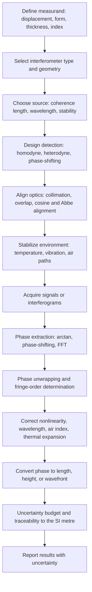

## Principles of Optical Interferometry


Optical interferometry is a family of measurement techniques in which two or more coherent light waves are superposed, and the resulting intensity pattern is used to determine quantities that modify the relative optical phase between the waves. Because the wavelength of visible and near-infrared light (roughly 0.3 to 1.5 $\mu$m) serves as the ruler, and because phase can be resolved to a small fraction of a fringe, interferometers reach displacement resolutions from nanometers down to picometers, and surface-form measurements at the sub-nanometer level. In precision metrology, interferometry provides the primary realization of length (through the definition of the metre via the speed of light and the second), and underpins laser displacement measurement, machine-tool and CMM calibration, optical surface testing, wavefront metrology, refractive-index and gauge-block measurement, and vibration analysis.

### Wave Description of Light

A monochromatic, linearly polarized plane wave propagating along $z$ has a scalar field described by:

$$E(z, t) = E_0 \cos(kz - \omega t + \phi_0)$$

or, in complex (phasor) notation,

$$\tilde{E}(z, t) = E_0\, e^{i(kz - \omega t + \phi_0)}$$

where:

- $E_0$ is the amplitude
- $k = 2\pi n / \lambda_0 = 2\pi/\lambda$ is the wavenumber in a medium of refractive index $n$
- $\omega = 2\pi \nu$ is the angular frequency
- $\phi_0$ is the initial phase
- $\lambda_0$ is the vacuum wavelength and $\lambda = \lambda_0 / n$ the wavelength in the medium

The detectable quantity is the intensity, the time average of the squared field:

$$I = \langle E^2 \rangle \propto \frac{1}{2} E_0^2$$

Optical detectors respond to intensity because optical frequencies (of order $10^{14}$ Hz) are far above the bandwidth of any electronic detector. Phase information therefore has to be converted to intensity, which is precisely what interference accomplishes.

#### Optical Path Length and Phase

The optical path length (OPL) along a ray is the geometric length weighted by the refractive index:

$$\text{OPL} = \int n(s)\, ds$$

The phase accumulated over this path is:

$$\phi = \frac{2\pi}{\lambda_0}\,\text{OPL}$$

The optical path difference (OPD) between the two arms determines the interference phase:

$$\Delta\phi = \frac{2\pi}{\lambda_0}\,\text{OPD}$$

### Superposition and the Interference Equation

Consider two waves of the same frequency and polarization with complex amplitudes $\tilde{E}_1$ and $\tilde{E}_2$. Superposition gives:

$$\tilde{E} = \tilde{E}_1 + \tilde{E}_2$$

and the intensity is:

$$I = I_1 + I_2 + 2\sqrt{I_1 I_2}\,\cos\Delta\phi$$

This is the **two-beam interference equation**. It is often written in terms of the mean intensity $I_0 = I_1 + I_2$ and the fringe visibility (contrast) $V$:

$$I(\Delta\phi) = I_0\left[1 + V \cos\Delta\phi\right]$$

with

$$V = \frac{I_{max} - I_{min}}{I_{max} + I_{min}} = \frac{2\sqrt{I_1 I_2}}{I_1 + I_2}$$

**Key Points**

- Maximum intensity (constructive interference) occurs when $\Delta\phi = 2\pi m$, that is, OPD $= m\lambda_0$, with integer order $m$.
- Minimum intensity (destructive interference) occurs when $\Delta\phi = (2m + 1)\pi$, that is, OPD $= (m + \tfrac{1}{2})\lambda_0$.
- Visibility is unity only for equal beam intensities ($I_1 = I_2$), full coherence, and identical polarization.
- One full intensity cycle (one fringe) corresponds to an OPD change of one wavelength.

<svg xmlns="http://www.w3.org/2000/svg" viewBox="0 0 760 360" width="760" height="360" font-family="Arial, Helvetica, sans-serif" font-size="13">
<rect x="0" y="0" width="760" height="360" fill="#ffffff" stroke="#cccccc" />
<text x="380" y="26" text-anchor="middle" font-size="16" font-weight="bold">Two-Beam Interference Intensity vs. Phase (svg_diagram)</text>

<line x1="70" y1="290" x2="710" y2="290" stroke="#333" stroke-width="2" />
<line x1="70" y1="60" x2="70" y2="290" stroke="#333" stroke-width="2" />
<text x="390" y="335" text-anchor="middle">Phase difference Δφ (OPD = Δφ · λ / 2π)</text>
<text x="30" y="175" text-anchor="middle" transform="rotate(-90 30 175)">Intensity I</text>

<path d="M 70 75 C 110 75, 130 175, 150 175 S 190 275, 230 275 S 270 175, 310 175 S 350 75, 390 75 S 430 175, 470 175 S 510 275, 550 275 S 590 175, 630 175 S 670 75, 710 75" fill="none" stroke="#36a" stroke-width="2.5" />

<line x1="70" y1="75" x2="710" y2="75" stroke="#d00" stroke-dasharray="6,4" />
<text x="716" y="79" fill="#d00" font-size="11">I_max</text>
<line x1="70" y1="275" x2="710" y2="275" stroke="#080" stroke-dasharray="6,4" />
<text x="716" y="279" fill="#080" font-size="11">I_min</text>
<line x1="70" y1="175" x2="710" y2="175" stroke="#999" stroke-dasharray="3,3" />
<text x="716" y="179" fill="#555" font-size="11">I_0</text>

<text x="70" y="308" text-anchor="middle">0</text>
<text x="230" y="308" text-anchor="middle">π</text>
<text x="390" y="308" text-anchor="middle">2π</text>
<text x="550" y="308" text-anchor="middle">3π</text>
<text x="710" y="308" text-anchor="middle">4π</text>

<line x1="70" y1="52" x2="390" y2="52" stroke="#333" />
<text x="230" y="46" text-anchor="middle">One fringe = λ of OPD</text>
</svg>

**Example**

Two beams have intensities $I_1 = 4$ (arbitrary units) and $I_2 = 1$. Find the fringe visibility and the maximum and minimum intensities.

$$V = \frac{2\sqrt{4 \times 1}}{4 + 1} = \frac{4}{5} = 0.80$$


$$I_{max} = I_1 + I_2 + 2\sqrt{I_1 I_2} = 5 + 4 = 9, \qquad I_{min} = 5 - 4 = 1$$

**Output**

- Visibility $V = 0.80$
- $I_{max} = 9$, $I_{min} = 1$; verification: $(9 - 1)/(9 + 1) = 0.80$

### Coherence

Interference requires that the two waves maintain a stable phase relationship over the measurement time and the path difference. Coherence is the measure of this correlation.

#### Temporal Coherence

Temporal coherence describes the correlation of the field with a delayed copy of itself. It is characterized by the **coherence time** $\tau_c$ and the **coherence length**:

$$L_c = c\,\tau_c \approx \frac{\lambda_0^2}{\Delta\lambda}$$

where $\Delta\lambda$ is the spectral bandwidth (the exact numerical factor depends on the spectral line shape and the definition adopted). Interference fringes with good visibility are observed only for $|\text{OPD}| \lesssim L_c$. The visibility as a function of OPD is the magnitude of the normalized degree of temporal coherence:

$$V(\text{OPD}) = |\gamma(\tau)|, \qquad \tau = \frac{\text{OPD}}{c}$$

By the Wiener-Khinchin theorem, $\gamma(\tau)$ is the Fourier transform of the normalized power spectrum of the source, which is the theoretical foundation of Fourier-transform spectroscopy and white-light interferometry.

| Source | Typical Bandwidth | Typical Coherence Length |
| --- | --- | --- |
| Stabilized He-Ne laser (single mode) | MHz range | Tens to hundreds of meters |
| Multimode He-Ne laser | About 1.5 GHz | Roughly 0.2 m (a few tens of cm) |
| Single-frequency diode laser (DFB or ECDL) | 100 kHz to a few MHz | Tens of meters to km |
| Multimode laser diode | Tens of GHz | Millimeters to centimeters |
| Superluminescent diode (SLD) | 10 to 50 nm | 10 to 50 $\mu$m |
| LED | 20 to 40 nm | About 10 $\mu$m |
| Halogen lamp (white light) | 300 nm or more | About 1 to 2 $\mu$m |
| Frequency comb (single tooth) | Very narrow (locked) | Very long |

[Inference] The figures in the table are order-of-magnitude values that vary with the specific device.

**Example**

Estimate the coherence length of a superluminescent diode centered at $\lambda_0 = 850$ nm with $\Delta\lambda = 30$ nm.

$$L_c \approx \frac{\lambda_0^2}{\Delta\lambda} = \frac{(850\ \text{nm})^2}{30\ \text{nm}} = \frac{722{,}500}{30}\ \text{nm} \approx 24\ \mu\text{m}$$

**Output**

- $L_c \approx 24\ \mu$m; interference is visible only when the two arm lengths match to within a few tens of micrometers, which is exactly the property exploited in low-coherence and white-light interferometry to localize a surface in depth.

#### Spatial Coherence

Spatial coherence describes the correlation of the field at two different points in the transverse plane. A finite source size limits the visibility of fringes in wavefront-division systems (for example, Young's double slit). The transverse coherence width at distance $R$ from an incoherent source of size $D_s$ is approximately:

$$\ell_c \approx \frac{\lambda R}{D_s}$$

In amplitude-division interferometers (Michelson, Mach-Zehnder, Fizeau), an extended source can be used if the interferometer is aligned so the two paths are nearly equal for all source points (as in a compensated Michelson with a wedge-free layout), but a finite source still reduces visibility if the beams are tilted or sheared. Laser sources are spatially coherent, which is why lasers dominate high-accuracy work.

### Polarization

Two beams interfere fully only if their polarization states have parallel components. For two linearly polarized beams with an angle $\alpha$ between their polarization directions, the interference term is reduced by $\cos\alpha$:

$$I = I_1 + I_2 + 2\sqrt{I_1 I_2}\,\cos\alpha\,\cos\Delta\phi$$

Orthogonally polarized beams ($\alpha = 90^\circ$) do not interfere in the intensity, which is exploited in heterodyne interferometers (using orthogonal linear polarizations with slightly different frequencies) and in polarization-based phase-shifting schemes, where a polarizer or a quarter-wave plate is used to recover the interference and to set the phase shift.

### Interference Geometries

#### Division of Wavefront

The wavefront is spatially divided into two parts that later recombine. The classic example is Young's double slit. For slit separation $d$ and screen distance $L \gg d$, the fringe spacing on the screen is:

$$\Delta x = \frac{\lambda L}{d}$$

Division of wavefront requires high spatial coherence and is uncommon in industrial metrology, except in some shearing and diffractive systems.

#### Division of Amplitude

A beamsplitter (partially reflecting surface or cube) divides the amplitude of the beam into two parts that travel separate paths and recombine. This is the basis of nearly all metrology interferometers: Michelson, Mach-Zehnder, Fizeau, Twyman-Green, and Sagnac. The Fabry-Perot etalon (multiple-beam division of amplitude) is a special case.

#### Thin-Film and Wedge Interference

For a film of thickness $t$ and refractive index $n_f$ illuminated at refraction angle $\theta_t$, the optical path difference between the two reflections is:

$$\text{OPD} = 2\,n_f\,t\,\cos\theta_t$$

with an additional phase shift of $\pi$ at the reflection from the interface with higher refractive index (the phase-change conditions determine whether the reflected intensity is maximal or minimal for a given thickness). This is the principle of Newton's rings (test-plate inspection of optical flats and spherical surfaces) and of thin-film thickness measurement.

For Newton's rings between a spherical surface of radius $R_s$ and a flat, the radius of the $m$-th dark ring (in reflection, with zero gap at the center) is:

$$r_m = \sqrt{m\,\lambda\,R_s}$$

### Fundamental Interferometer Types

<svg xmlns="http://www.w3.org/2000/svg" viewBox="0 0 760 420" width="760" height="420" font-family="Arial, Helvetica, sans-serif" font-size="13">
<rect x="0" y="0" width="760" height="420" fill="#ffffff" stroke="#cccccc" />
<text x="380" y="26" text-anchor="middle" font-size="16" font-weight="bold">Michelson Interferometer Layout (svg_diagram)</text>

<rect x="40" y="200" width="80" height="40" fill="#f4d6d6" stroke="#a33" />
<text x="80" y="225" text-anchor="middle">Laser</text>

<line x1="120" y1="220" x2="300" y2="220" stroke="#d00" stroke-width="2" />

<rect x="300" y="190" width="60" height="60" fill="#e8e8f8" stroke="#446" transform="rotate(0 330 220)" />
<line x1="300" y1="250" x2="360" y2="190" stroke="#446" stroke-width="2" />
<text x="330" y="272" text-anchor="middle">Beamsplitter</text>

<line x1="330" y1="190" x2="330" y2="90" stroke="#d00" stroke-width="2" />
<rect x="300" y="72" width="60" height="12" fill="#dfe8d0" stroke="#585" />
<text x="330" y="62" text-anchor="middle">Fixed mirror M1 (reference arm)</text>

<line x1="360" y1="220" x2="600" y2="220" stroke="#d00" stroke-width="2" />
<rect x="600" y="190" width="12" height="60" fill="#dfe8d0" stroke="#585" />
<text x="640" y="180" text-anchor="middle">Moving mirror M2</text>
<text x="640" y="196" text-anchor="middle">(measurement arm)</text>

<line x1="560" y1="290" x2="620" y2="290" stroke="#333" stroke-width="2" />
<polygon points="560,290 570,285 570,295" fill="#333" />
<polygon points="620,290 610,285 610,295" fill="#333" />
<text x="590" y="310" text-anchor="middle">displacement d</text>

<line x1="330" y1="250" x2="330" y2="350" stroke="#d00" stroke-width="2" />
<rect x="300" y="350" width="60" height="30" fill="#d6e4f4" stroke="#36a" />
<text x="330" y="370" text-anchor="middle">Detector</text>
<text x="330" y="398" text-anchor="middle">Interference output</text>
</svg>

#### Michelson Interferometer

A beamsplitter divides the input into a reference arm (fixed mirror) and a measurement arm (movable mirror). The beams return along their incoming paths, recombine at the beamsplitter, and go to the detector. When the movable mirror moves by $d$, the OPD changes by $2d$ (double pass), and the phase changes by:

$$\Delta\phi = \frac{4\pi\,n\,d}{\lambda_0}$$

so each fringe corresponds to a displacement of $\lambda_0/(2n)$. With $\lambda_0 = 632.8$ nm in air ($n \approx 1.00027$), one fringe is approximately 316.4 nm of mirror displacement.

The Michelson layout is the historic ancestor of most laser displacement interferometers, and of Fourier-transform infrared (FTIR) spectrometers and white-light scanning interferometers. The returning beam can re-enter the laser cavity (feedback), which is a disadvantage for some laser types and is usually mitigated with isolators or by using a lateral-offset retroreflector.

#### Twyman-Green Interferometer

A Michelson variant using collimated monochromatic light, designed for testing optical components. The test optic (or a mirror) is placed in one arm, and the resulting fringe pattern maps the wavefront deviation directly, with the fringe order corresponding to OPD in units of $\lambda$ (since the wavefront error is doubled on reflection double pass, each fringe represents $\lambda/2$ of surface height for a reflecting surface).

#### Mach-Zehnder Interferometer

Two beamsplitters separate and recombine the beams; each beam traverses its path once, so the OPD is single-pass. It is well suited to transmission measurements of refractive-index variations (flow visualization, plasma diagnostics, phase objects) and integrated optics and fiber sensors, and it avoids optical feedback into the source because there is no retro-return.

#### Fizeau Interferometer

The reference surface and test surface are close to one another (typically a reference flat or sphere placed in front of the test part), and light is reflected from both surfaces, forming a common-path interferometer largely insensitive to vibration and air turbulence in the cavity. It is the dominant instrument for testing optical flats, spheres, and precision surfaces. The fringes map the cavity gap: each fringe represents a surface height change of $\lambda/2$ for normal incidence.

#### Sagnac Interferometer

Two beams travel the same loop in opposite directions, forming a common-path interferometer with intrinsic stability. The phase difference is sensitive to rotation rate $\Omega$ (Sagnac effect):

$$\Delta\phi_S = \frac{8\pi A}{\lambda c}\,\Omega$$

where $A$ is the enclosed area. This is the basis of ring-laser and fiber-optic gyroscopes.

#### Fabry-Perot Interferometer

Two parallel partially reflective surfaces form a resonant cavity in which multiple reflections interfere. The transmitted intensity (Airy function) is:

$$T = \frac{1}{1 + F\,\sin^2(\delta/2)}, \qquad \delta = \frac{4\pi\,n\,\ell\,\cos\theta}{\lambda_0}, \qquad F = \frac{4R}{(1 - R)^2}$$

where $R$ is the mirror intensity reflectivity, $\ell$ the mirror spacing, and $n$ the refractive index of the gap. The free spectral range (in frequency) and finesse are:

$$\text{FSR} = \frac{c}{2\,n\,\ell}, \qquad \mathcal{F} = \frac{\text{FSR}}{\Delta\nu_{1/2}} = \frac{\pi\sqrt{R}}{1 - R}$$

Fabry-Perot cavities provide very sharp fringes (high finesse) that enhance sensitivity, and they are used for high-resolution spectroscopy, laser frequency stabilization (reference cavities), and fiber-optic sensors.

#### Comparison of Interferometer Types

| Type | Beam Path | Key Characteristic | Typical Metrology Use |
| --- | --- | --- | --- |
| Michelson | Double pass, separate arms | Displacement doubled; simple | Laser displacement, FTIR |
| Twyman-Green | Michelson with collimated input | Wavefront testing | Optical component testing |
| Mach-Zehnder | Single pass, separate arms | No feedback to source | Refractive index, phase objects |
| Fizeau | Common path | Vibration-tolerant, near-common path | Flats, spheres, surface form |
| Sagnac | Counter-propagating common path | Rotation sensitivity | Gyroscopes |
| Fabry-Perot | Multiple beam, resonant | High finesse | Spectroscopy, frequency reference |

### Displacement Measurement Principle

In a displacement-measuring interferometer, the measurement arm changes length by $d$ as a target (retroreflector or mirror) moves. The interference phase changes by:

$$\Delta\phi = \frac{2\pi}{\lambda_0}\,\text{OPD change} = \frac{2\pi\,N_p\,n\,d}{\lambda_0}$$

where $N_p$ is the number of passes (2 for a standard Michelson-type configuration with a retroreflector; 4 for double-pass arrangements with a plane-mirror interferometer). The displacement is:

$$d = \frac{\lambda_0}{N_p\,n}\left(m + \frac{\varphi}{2\pi}\right)$$

with integer fringe count $m$ and fractional phase $\varphi$ (0 to $2\pi$).

Counting fringes (incremental measurement) gives an increment of $\lambda_0/(2n)$ per fringe (for $N_p = 2$); interpolating the fractional fringe by phase measurement gives resolution far below that. With 12-bit phase interpolation in a homodyne system, the resolution is about $\lambda/(2 \times 4096)$, or roughly 0.08 nm for $\lambda = 632.8$ nm, subject to noise and nonlinearity.

**Key Points**

- Incremental interferometers lose the absolute reference if the beam is interrupted; the measurement starts from an arbitrary zero.
- The measurement depends directly on the vacuum wavelength and on the refractive index of air, so environmental compensation is required for high accuracy.
- Fringe direction sensing requires a second signal in quadrature (or heterodyne detection).

### Fringe Direction and Phase Detection

A single intensity signal $I \propto 1 + V\cos\Delta\phi$ cannot tell the direction of motion, since $\cos$ is even, and is ambiguous near the extrema where the slope vanishes. Solutions:

#### Quadrature Detection (Homodyne)

Two detector signals with a 90-degree phase offset are generated (using polarization optics, for example, a quarter-wave plate and polarizing beamsplitters):

$$I_1 = A + B\cos\Delta\phi, \qquad I_2 = A + B\sin\Delta\phi$$

After removing the offsets and normalizing the amplitudes, the phase is recovered with the four-quadrant arctangent:

$$\Delta\phi = \operatorname{atan2}(I_2 - A,\ I_1 - A)$$

The sign of rotation of the $(I_1, I_2)$ Lissajous point gives the direction of motion. Imperfections (offset errors, amplitude imbalance, and phase-quadrature error) turn the ideal circle into an ellipse and produce a periodic **nonlinearity** with a period of one fringe (and harmonics), typically of the order of nanometers, which is corrected by Heydemann-type ellipse fitting.

The Heydemann model is:

$$I_1 = a_1 + b_1\cos\Delta\phi, \qquad I_2 = a_2 + b_2\sin(\Delta\phi + \epsilon)$$

with offsets $a_{1,2}$, amplitudes $b_{1,2}$, and quadrature error $\epsilon$ estimated by least-squares fitting of the Lissajous ellipse.

#### Heterodyne Detection

Two frequencies $f_1$ and $f_2$ (split by a Zeeman-split laser or acousto-optic modulators) are used in the two arms. The detector output is an AC beat at $\Delta f = f_1 - f_2$, and the displacement is encoded in the phase of the beat relative to a reference beat. For a moving target with velocity $v$, the Doppler shift adds:

$$f_D = \frac{2\,n\,v}{\lambda_0}\ \ \ (\text{single-pass target arm, retroreflector})$$

Advantages: immunity to DC drift and intensity variations (because the information is in an AC phase), high signal-to-noise ratio, and inherent direction sensing. Limitations: a maximum measurable velocity set by the beat frequency ($v_{max} \approx \lambda_0\,\Delta f/2$ for $N_p = 2$), and periodic nonlinearity from frequency mixing (polarization leakage).

#### Phase-Shifting Techniques

For full-field measurements, several interferograms are recorded with known phase shifts between exposures, and the phase is calculated at each pixel. The **four-step** algorithm (shifts of $0, \pi/2, \pi, 3\pi/2$) gives:

$$\varphi(x, y) = \arctan\!\left(\frac{I_4 - I_2}{I_1 - I_3}\right)$$

and the general $N$-step least-squares formula with phase steps $\delta_k = 2\pi k / N$ is:

$$\varphi = \arctan\!\left(\frac{-\sum_k I_k \sin\delta_k}{\sum_k I_k \cos\delta_k}\right)$$

Phase shifts are typically introduced with a piezoelectric transducer (PZT) moving the reference mirror, or by wavelength tuning or polarization methods. Robust algorithms (five-step Hariharan, Carré, and windowed or 7-step and 13-step schemes) tolerate phase-shift calibration errors and vibration to different degrees.

#### Fringe Analysis by Fourier Transform and Phase Unwrapping

For a single interferogram with a spatial carrier (tilt fringes), the phase can be extracted using the Fourier-transform method (Takeda): isolate the carrier sideband in the Fourier domain, shift it to the origin, inverse transform, and take the argument. The result is wrapped to $(-\pi, \pi]$, and **phase unwrapping** restores a continuous phase map by adding multiples of $2\pi$ wherever adjacent-pixel differences exceed $\pi$. Unwrapping fails at discontinuities larger than half a wavelength (in surface-height terms, $\lambda/4$ for double pass) unless a multi-wavelength or low-coherence approach is used.

The surface height from the unwrapped phase in a reflection (double-pass) geometry is:

$$h(x, y) = \frac{\lambda_0}{4\pi}\,\varphi(x, y)$$

**Example**

A four-step phase-shifting measurement at $\lambda_0 = 632.8$ nm yields intensities at one pixel: $I_1 = 150$, $I_2 = 210$, $I_3 = 90$, $I_4 = 30$. Find the phase and surface height at that pixel (reflection geometry).

$$\varphi = \operatorname{atan2}(I_4 - I_2,\ I_1 - I_3) = \operatorname{atan2}(30 - 210,\ 150 - 90) = \operatorname{atan2}(-180,\ 60)$$


$$\varphi = -1.249\ \text{rad} \ (\approx -71.6^\circ)$$


$$h = \frac{\lambda_0}{4\pi}\,\varphi = \frac{632.8\ \text{nm}}{4\pi} \times (-1.249) \approx -62.9\ \text{nm}$$

**Output**

- Wrapped phase: $-1.249$ rad
- Surface height relative to the phase reference: about $-62.9$ nm (equivalent to $-0.199\,\lambda/2$ or about $-0.099\,\lambda$).

### Refractive Index of Air and Wavelength Compensation

Interferometric length measurements are made in units of the wavelength in air, $\lambda = \lambda_0/n_{air}$. Unless the measurement occurs in vacuum, a change in $n_{air}$ produces an apparent length change. The refractive index of air at 633 nm and standard conditions is approximately $n - 1 \approx 2.7 \times 10^{-4}$, and it varies with temperature, pressure, humidity, and $\text{CO}_2$ content. Approximate sensitivities near standard laboratory conditions:

| Parameter | Approximate Effect on $n$ |
| --- | --- |
| Temperature +1 K | About $-1 \times 10^{-6}$ |
| Pressure +1 hPa (1 mbar) | About $+2.7 \times 10^{-7}$ |
| Relative humidity +10 % (at 20 degrees C) | About $-1 \times 10^{-7}$ |
| CO$_2$ concentration +100 ppm | About $+1.5 \times 10^{-8}$ |

[Inference] These are commonly quoted first-order sensitivities; consult the Edlén or Ciddor equations for calculated values.

A change of $\Delta n = 10^{-6}$ (about 1 K temperature change) produces a length error of 1 $\mu$m over 1 m, or 1 ppm. The empirical models used to compute $n_{air}$ from measured environmental parameters include the **Edlén equation** (with updates by Birch and Downs) and the **Ciddor equation**, which is the more modern reference and covers a wider wavelength range. Alternatives are refractometers (fixed-length vacuum-cell interferometers that measure the index directly) and two-color interferometry, which exploits the dispersion of air to estimate the refractivity from the phase difference of two wavelengths.

**Example**

A 2 m displacement is measured with a HeNe interferometer using $\lambda_0 = 632.991$ nm (vacuum). The environmental sensor indicates a temperature 1.5 K higher than the value assumed in the wavelength compensation. Estimate the resulting error.

Using the sensitivity of about $-1 \times 10^{-6}$ per K:

$$\Delta n \approx -1.5 \times 10^{-6}$$


$$\Delta L \approx L \cdot |\Delta n| = 2\ \text{m} \times 1.5 \times 10^{-6} = 3.0\ \mu\text{m}$$

**Output**

- Length error of about 3 $\mu$m (1.5 ppm of the measured length). This demonstrates that uncorrected air-refractivity error dominates over the intrinsic laser wavelength accuracy (of order $10^{-8}$ relative for a stabilized HeNe) in laboratory air.

### Light Sources and Frequency Stability

| Source | Stability (relative) | Remarks |
| --- | --- | --- |
| Iodine-stabilized He-Ne (633 nm) | About $10^{-11}$ to $10^{-12}$ | Primary length standard practice (mise en pratique) |
| Frequency-stabilized HeNe (Zeeman or two-mode) | About $10^{-8}$ | Common in commercial laser interferometers |
| Diode laser (DFB, ECDL) with reference | $10^{-8}$ to $10^{-11}$ depending on locking | Compact; needs wavelength locking |
| Frequency comb referenced | Below $10^{-12}$ possible | Absolute distance, spectroscopy |
| Free-running diode or LED | Poor | For low-coherence systems |

The wavelength stability directly limits the length error for large OPD: $\Delta L / L = \Delta\lambda/\lambda$ (with the OPD proportional). For long-distance and unequal-arm interferometers, laser frequency noise is converted to phase noise proportional to the arm-length mismatch.

The metre is defined by fixing the numerical value of the speed of light in vacuum at exactly 299 792 458 m/s, with the second defined via the caesium hyperfine transition frequency. Practical realization uses recommended laser radiations (for example, the iodine-stabilized HeNe at 633 nm) with published frequencies and uncertainties, as recommended by the CIPM's mise en pratique.

### Resolution, Noise, and Error Sources

| Error Source | Mechanism | Mitigation |
| --- | --- | --- |
| Air refractive index variation | Temperature, pressure, humidity, composition changes | Environmental sensors with Edlén or Ciddor correction, refractometer, vacuum, or two-color compensation, shielding air paths |
| Laser wavelength (frequency) error | Instability and calibration | Stabilized laser, traceable calibration against reference |
| Thermal expansion of workpiece and mount | Length changes with temperature | Measure material temperature, correct to 20 degrees C reference |
| Dead-path error | Uncompensated air path between the reference position and the start of measurement | Minimize dead path, correct the environmental change over the dead path |
| Abbe error | Offset between measurement axis and measured feature combined with angular error | Align axes, follow the Abbe principle, measure angular errors |
| Cosine error | Misalignment of beam and motion axes | Careful alignment, cosine correction $L_{true} = L_{meas}/\cos\theta$ |
| Periodic nonlinearity | Polarization leakage, quadrature errors, ghost reflections | Optical design, signal correction algorithms |
| Mechanical drift and vibration | Thermal expansion of the optical mounts, ground vibration | Low-expansion mounts, common-path design, isolation |
| Optical component flatness and wavefront quality | Surface figure and beamsplitter errors | High-quality optics, wavefront-compensating design |
| Beam alignment and shear | Wavefront curvature and tilt | Alignment procedures, collimation |
| Detector noise and electronics | Shot noise, amplifier noise, digitization | Adequate optical power, low-noise electronics, averaging |
| Diffraction and Gouy phase | Beam divergence, wavefront curvature | Collimated, large beam, correction |
| Speckle | Rough surface scattering | Use retroreflectors or specular surfaces where possible; spatial averaging |
| Photon shot noise limit | Statistical fluctuations | Increase power, integration time |

The shot-noise-limited phase resolution for detected optical power $P$ over detection bandwidth $B$ is approximately:

$$\delta\phi \approx \frac{1}{V}\sqrt{\frac{2\,h\nu\,B}{\eta\,P}}$$

where $\eta$ is the detector quantum efficiency and $V$ the fringe visibility. [Inference] The exact coefficient depends on the detection scheme (for example, homodyne balanced detection); the expression is a leading-order estimate.

A total uncertainty statement for a displacement measurement combines independent contributions:

$$u_c(L) = \sqrt{\left(L\,u_\lambda\right)^2 + \left(L\,u_n\right)^2 + \left(L\,\alpha\,u_T\right)^2 + u_{dead}^2 + u_{Abbe}^2 + u_{cos}^2 + u_{nl}^2 + u_{noise}^2}$$

where $u_\lambda$ and $u_n$ are the relative standard uncertainties of the laser wavelength and air refractive index, $\alpha$ is the thermal expansion coefficient of the workpiece, and $u_T$ the temperature uncertainty of the workpiece. Values must be evaluated for the specific setup following the GUM.

### Wavefront and Surface Form Measurement

In full-field interferometry (Fizeau or Twyman-Green), the phase map $\varphi(x, y)$ is converted to surface deviation. The wavefront error is expressed as $W(x, y) = \varphi\lambda/(2\pi)$, and for reflection from a surface at normal incidence:

$$h(x, y) = \frac{W(x, y)}{2}$$

Zernike polynomials describe the aberration content of the wavefront over a circular aperture:

$$W(\rho, \theta) = \sum_{n,m} c_n^m\, Z_n^m(\rho, \theta)$$

Common parameters: peak-to-valley (PV) and root-mean-square (RMS) form error, power (curvature), astigmatism, coma, and spherical aberration. Typical outputs also include the Strehl ratio for image-quality prediction. The Maréchal approximation relates RMS wavefront error $\sigma_W$ (in waves) to the Strehl ratio:

$$S \approx \exp\!\left[-(2\pi\sigma_W)^2\right]$$

### Low-Coherence (White-Light) Interferometry

With a broadband source, fringes are visible only near zero OPD, within the coherence length. Scanning the reference (or the object) in depth, each pixel records an interferogram whose envelope peaks at the position where the OPD is zero, that is, at the surface height for that pixel. The intensity signal is modeled as:

$$I(z) = I_0\left[1 + V\,\gamma(z - z_0)\cos\!\left(\frac{4\pi}{\lambda_0}(z - z_0) + \phi_s\right)\right]$$

where $\gamma$ is the coherence envelope, $z_0$ the surface height at that pixel, and $\phi_s$ a surface-dependent phase offset. Envelope detection (peak of the envelope by Fourier or Hilbert-transform methods) identifies $z_0$ without $2\pi$ ambiguities, so step heights larger than $\lambda/4$ can be measured, and the phase of the fringes near the envelope peak can then be used to refine the height to sub-nanometer resolution. This is the basis of coherence scanning interferometry (CSI) for areal surface texture measurement (ISO 25178), and of optical coherence tomography (OCT) in biomedical imaging.

### Multi-Wavelength and Absolute Distance Interferometry

To resolve the fringe-order ambiguity of a single wavelength, the synthetic (equivalent) wavelength from two wavelengths $\lambda_1$ and $\lambda_2$ is used:

$$\Lambda = \frac{\lambda_1\,\lambda_2}{|\lambda_1 - \lambda_2|}$$

Measuring the phase difference gives a coarse measurement with unambiguous range $\Lambda/2$ (in double pass), and the single-wavelength phase refines it. Cascading multiple wavelengths (or using a tunable laser sweeping over a range) extends the range progressively. Frequency-modulated continuous-wave (FMCW) and swept-source methods, and frequency-comb-based methods, measure absolute distance over meters to kilometers.

**Example**

Two wavelengths $\lambda_1 = 632.8$ nm and $\lambda_2 = 633.3$ nm are used. Find the synthetic wavelength and unambiguous range in double-pass geometry.

$$\Lambda = \frac{632.8 \times 633.3}{0.5}\ \text{nm} = \frac{400{,}756.24}{0.5}\ \text{nm} \approx 801{,}512\ \text{nm} \approx 0.80\ \text{mm}$$


$$\text{Unambiguous range} = \frac{\Lambda}{2} \approx 0.40\ \text{mm}$$

**Output**

- Synthetic wavelength of about 0.80 mm and an unambiguous range of about 0.40 mm, a factor of roughly 1265 longer than a single-wavelength half-wavelength range (about 316 nm).

### Instrument Sensitivity to Environment: Common-Path Concept

Interferometers differ in their sensitivity to vibration and air turbulence. A **common-path** design (Fizeau, some Sagnac configurations, and shear interferometers) makes reference and test beams traverse nearly the same optical elements and air, so most disturbances cancel in the difference. Non-common-path designs (Michelson, Twyman-Green, Mach-Zehnder) offer flexibility (for example, a separate reference arm and independent adjustment) but require environmental control and isolation. Differential and plane-mirror interferometers reduce sensitivity to tilt and, by folding, measure the difference between two mirror positions relative to the same reference block, canceling common drift.

### Workflow



### Illustrative Code: Quadrature Signal Processing and Phase-Shifting Reconstruction

The following Python code demonstrates (1) recovering displacement from quadrature signals with a Heydemann-type correction and (2) reconstructing a surface with a four-step phase-shifting algorithm.

```python
import numpy as np

LAMBDA_NM = 632.991           # vacuum wavelength of the HeNe laser (nm)
N_AIR = 1.000268              # refractive index of air (from environment model)

# ---------------- Part 1: Quadrature displacement with ellipse correction ----------------
rng = np.random.default_rng(0)
true_disp_nm = np.linspace(0, 3000, 4000)                  # target motion (nm)
phi = 4 * np.pi * N_AIR * true_disp_nm / LAMBDA_NM         # double-pass phase

# Imperfect quadrature signals: offsets, unequal gains, quadrature error
a1, b1, a2, b2, eps = 0.10, 1.00, -0.05, 0.92, np.deg2rad(3.0)
I1 = a1 + b1 * np.cos(phi) + rng.normal(0, 0.002, phi.size)
I2 = a2 + b2 * np.sin(phi + eps) + rng.normal(0, 0.002, phi.size)

def displacement_raw(I1, I2):
    ph = np.unwrap(np.arctan2(I2, I1))
    return ph * LAMBDA_NM / (4 * np.pi * N_AIR)

def heydemann_fit(I1, I2):
    """
    Fit A*I1^2 + B*I2^2 + C*I1*I2 + D*I1 + E*I2 = 1 (general conic) and extract
    offsets, gains and quadrature error of the Lissajous ellipse.
    """
    M = np.column_stack([I1**2, I2**2, I1 * I2, I1, I2])
    A, B, C, D, E = np.linalg.lstsq(M, np.ones_like(I1), rcond=None)[0]

    # Ellipse centre = offsets
    den = C**2 - 4 * A * B
    x0 = (2 * B * D - C * E) / den
    y0 = (2 * A * E - C * D) / den

    # Axes-aligned equivalent via covariance of the centred data
    X, Y = I1 - x0, I2 - y0
    b1e = np.sqrt(2) * np.std(X)
    b2e = np.sqrt(2) * np.std(Y)
    sin_eps = np.mean(X * Y) * 2.0 / (b1e * b2e)           # <cos*sin(phi+eps)> = sin(eps)/2
    eps_e = np.arcsin(np.clip(sin_eps, -1, 1))
    return x0, y0, b1e, b2e, eps_e

x0, y0, b1e, b2e, eps_e = heydemann_fit(I1, I2)

# Correct: recover ideal cos and sin from the fitted parameters
c = (I1 - x0) / b1e                                        # cos(phi)
s_meas = (I2 - y0) / b2e                                   # sin(phi + eps)
s = (s_meas - c * np.sin(eps_e)) / np.cos(eps_e)           # sin(phi)

disp_raw = displacement_raw(I1, I2)
disp_cor = np.unwrap(np.arctan2(s, c)) * LAMBDA_NM / (4 * np.pi * N_AIR)

err_raw = disp_raw - true_disp_nm
err_cor = disp_cor - true_disp_nm
print(f"Nonlinearity, raw      : peak-to-peak {np.ptp(err_raw - err_raw.mean()):.2f} nm")
print(f"Nonlinearity, corrected: peak-to-peak {np.ptp(err_cor - err_cor.mean()):.2f} nm")

# ---------------- Part 2: Four-step phase-shifting surface reconstruction ----------------
ny, nx = 200, 200
y, x = np.mgrid[-1:1:1j * ny, -1:1:1j * nx]
rho2 = x**2 + y**2
mask = rho2 <= 1.0

surface_nm = 40 * (2 * rho2 - 1) + 15 * x * (3 * rho2 - 2) * 0  # power term
surface_nm = 40.0 * (2 * rho2 - 1) + 10.0 * x                    # power + tilt (nm)
phase_true = 4 * np.pi * surface_nm / LAMBDA_NM                  # double-pass

frames = []
for k in range(4):
    d = k * np.pi / 2
    Ik = 100 + 80 * np.cos(phase_true + d) + rng.normal(0, 1.0, phase_true.shape)
    frames.append(Ik)
I1s, I2s, I3s, I4s = frames

phase_wr = np.arctan2(I4s - I2s, I1s - I3s)                      # wrapped phase
# (No unwrapping needed here: |phase| stays below pi for this small surface amplitude)
h_nm = phase_wr * LAMBDA_NM / (4 * np.pi)

err = (h_nm - surface_nm)[mask]
err -= err.mean()                                                # remove piston
print(f"Four-step reconstruction RMS error: {np.std(err):.3f} nm")
```

**Output**

With the assumed 3-degree quadrature error, unequal gains, and offsets, the raw quadrature reconstruction shows a periodic nonlinearity with a peak-to-peak error of a few nanometers, whereas the ellipse-corrected reconstruction reduces it to a fraction of that (dominated by noise). The four-step reconstruction returns the surface with an RMS error of well below 1 nm in this noise-limited synthetic case. Exact printed values vary with the random noise realization, and real instruments add wavefront errors, environmental effects, and phase-shifter miscalibration that are not modeled here.

### Standards and Guidelines

- **SI definition of the metre and CIPM mise en pratique**: Defines practical realization by laser frequencies with recommended values and uncertainties. [Inference] Consult the current edition of the recommended radiations list for values.
- **ISO 230-2 and ISO 230-1**: Test code for machine tools; position accuracy and geometric accuracy, where laser interferometers are the standard measurement tool.
- **ISO 10360 series and VDI/VDE 2617**: Acceptance testing of coordinate measuring machines; interferometer-based calibrations of scales and axes support these.
- **ISO 10110 (series)**: Preparation of drawings for optical elements and systems; includes form tolerances specified in fringes.
- **ISO 14999 (series)**: Interferometric measurement of optical elements and optical systems (Parts 1 to 4), covering terms, calibration, evaluation, and interpretation of results. [Inference] Confirm the part titles in the current edition.
- **ISO 25178 (series)**: Areal surface texture; instruments including coherence scanning interferometry and phase-shifting interferometry are addressed in part 6 (classification) and part 600 series (metrological characteristics). [Inference] Verify the specific part numbers for CSI.
- **ISO 15530-3 and ISO 14253-1**: Uncertainty evaluation and conformity decision rules.
- **JCGM 100:2008 (GUM)**: Guide to the expression of uncertainty in measurement.
- **ISO/IEC 17025**: General requirements for calibration and testing laboratories.
- **IEC 60825-1**: Safety of laser products, relevant to interferometer sources.
- **ASTM F1811 and other ASTM guidance** on wavefront and flatness evaluation. [Inference] Verify applicability.

### Comparison with Other Length Measurement Principles

| Attribute | Laser Interferometry | Linear Encoders | Capacitive / Inductive Sensors | Laser Triangulation |
| --- | --- | --- | --- | --- |
| Traceability | Direct to SI via wavelength | Through calibration of the scale | Through calibration | Through calibration |
| Resolution | Sub-nm to pm | Nm to $\mu$m | Sub-nm to $\mu$m (short range) | $\mu$m |
| Range | Micrometers to tens of meters | Mm to meters | Micrometers to mm | Mm to hundreds of mm |
| Environmental sensitivity | High (air index, thermal) | Moderate (thermal) | High (fields, temperature) | Moderate |
| Contactless | Yes (with a retroreflector or mirror target) | No | Yes (short gap) | Yes |
| Cost and complexity | High | Low to moderate | Low to moderate | Low to moderate |

### Advantages and Limitations

**Key Points**

Advantages:

- Direct traceability to the definition of the metre through the laser wavelength
- Extremely high resolution and long range with a single instrument
- Noncontact measurement with no force on the target (with mirror or retroreflector targets)
- Full-field surface and wavefront metrology at sub-nanometer to nanometer level
- Applicability from micro-scale (MEMS, surface texture) to large-scale (machine tools, gravitational wave detectors)
- Established, well-documented uncertainty models and standards

Limitations:

- Sensitivity to environment: air refractive-index variation, temperature, vibration, and air turbulence
- Requires cooperative targets (mirrors or retroreflectors) for most displacement systems
- Incremental measurement loses the reference if the beam is interrupted
- Phase ambiguity and unwrapping problems for steep or discontinuous surfaces
- Optical alignment sensitivity (cosine, Abbe, beam shear)
- Rough or scattering surfaces produce speckle, which limits phase quality
- Periodic nonlinearity limits the accuracy of the interpolated fringe fraction
- Cost of stabilized lasers, optics, and environmental compensation for the highest accuracy

### Best Practices

1. Choose the interferometer type from the measurand: displacement (Michelson-type or plane mirror), form (Fizeau), thickness or index (Mach-Zehnder, low-coherence), or absolute distance (multi-wavelength, swept-source, comb).
2. Match the source coherence to the geometry: long coherence length for large OPD, short coherence for depth localization and suppression of parasitic fringes.
3. Minimize the dead path and keep the measurement axis collinear with the feature or motion axis to follow the Abbe principle.
4. Measure the environment (air temperature, pressure, humidity, and, for highest accuracy, CO$_2$) near the beam path, and apply Edlén or Ciddor compensation; shield the beam path or use a vacuum where feasible.
5. Allow warm-up of the laser and electronics, and use a wavelength-stabilized or frequency-locked source with a traceable calibration.
6. Use quadrature or heterodyne detection with signal correction (offset, gain, and phase-quadrature calibration) to suppress periodic nonlinearity.
7. Align carefully to reduce cosine error and beam shear; verify alignment by monitoring the signal strength across the full travel range.
8. Reduce vibration coupling using rigid, low-expansion mounts (for example, Invar, Zerodur, or granite), optical tables, and short, symmetric optical paths; consider common-path or differential layouts.
9. For surface testing, calibrate the reference surface (for example, by three-flat or random-ball tests) and separate the reference errors from the test part.
10. Take multiple measurements, average, and evaluate repeatability; document the uncertainty budget according to the GUM.
11. Verify the whole system periodically against a calibrated reference (a gauge block, calibrated step, or a second interferometer).
12. Observe laser safety regulations and provide appropriate beam enclosures and signage.

### Application Areas

- Machine-tool and CMM calibration: linear positioning, straightness, angular error (pitch, yaw, roll), squareness
- Nanopositioning and semiconductor lithography stages and wafer metrology
- Optical component testing: flats, spheres, aspheres (with null optics or computer-generated holograms), and wavefront metrology of telescope and lens systems
- Gauge block and end-standard calibration by interferometric comparison
- Surface texture and step-height measurement by phase-shifting and coherence scanning interferometry
- Thin-film and coating thickness by spectral reflectance or white-light interferometry
- Refractive index and dispersion of gases and solids, and flow visualization
- Vibration measurement and modal analysis by laser Doppler vibrometry
- Gravitational-wave detection and fundamental physics experiments
- Fiber-optic sensors: strain, temperature, and pressure using Fabry-Perot cavities and fiber Bragg grating interrogation
- Optical coherence tomography for medical imaging
- Frequency and length standards, and absolute distance metrology in large-scale structures

### Conclusion

Optical interferometry converts the phase relationship between coherent light beams into a measurable intensity pattern, using the wavelength of light as an intrinsic and traceable length scale. Its essential elements are the two-beam interference equation, the coherence properties of the source, the geometry that sets the optical path difference, and the phase-recovery method (fringe counting, quadrature, heterodyne, or phase-shifting) that turns intensity into phase and then into length, height, or wavefront. Achieving the theoretical resolution in practice depends on controlling the dominant error sources: air refractive index, laser wavelength stability, thermal drift, alignment, vibration, and periodic nonlinearity. When these are addressed and quantified in a GUM-compliant uncertainty budget, interferometry provides the most accurate and directly SI-traceable length measurement available in dimensional metrology.

### Related Topics

- Laser displacement interferometers (homodyne and heterodyne)
- Heterodyne detection and Zeeman-split lasers
- Phase-shifting algorithms and error-compensating schemes
- Fizeau interferometry for flatness and sphericity testing
- Refractive index of air: Edlén and Ciddor equations
- Coherence scanning and white-light interferometry
- Multi-wavelength and absolute distance interferometry
- Laser frequency stabilization and optical frequency combs
- Periodic nonlinearity and its compensation
- Wavefront analysis with Zernike polynomials
- Fabry-Perot cavities and fiber-optic interferometric sensors
- Uncertainty evaluation per the GUM for interferometric measurements
- Realization of the metre and traceability chains