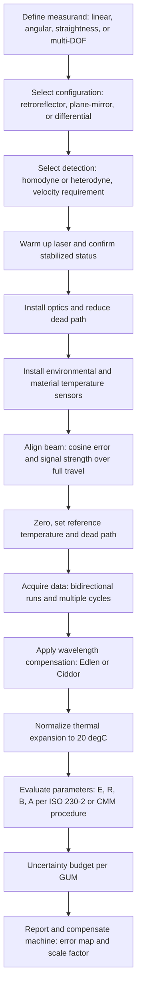

## Laser Interferometers for Length Measurement


A laser interferometer for length measurement is an instrument that determines the displacement or absolute position of a target by counting and interpolating interference fringes generated between a reference beam and a measurement beam, using the stabilized wavelength of a laser as the length scale. Because the wavelength is tied to an atomic or molecular reference (or a frequency-locked cavity) and hence to the SI definition of the metre, the laser interferometer is the principal instrument for realizing and disseminating length in industrial and calibration laboratories. It is the reference for calibrating machine tools, coordinate measuring machines (CMMs), linear encoders, positioning stages, gauge blocks, and step gauges, and it serves as the built-in metrology of semiconductor lithography scanners and nanopositioning systems. Typical commercial systems provide resolution from about 1 nm to below 0.1 nm, ranges from millimeters to 80 m or more, and accuracies of about 0.5 ppm (parts per million) or better under compensated conditions.

### Measurement Principle

The interferometer splits a laser beam into a reference path (fixed length) and a measurement path (terminated by a target that moves). When the two beams recombine, the intensity depends on the optical path difference (OPD). For a target displacement $d$ in a double-pass arrangement:

$$\Delta\phi = \frac{4\pi\,n\,d}{\lambda_0}$$

so that:

$$d = \frac{\lambda_0}{2\,n}\left(m + \frac{\varphi}{2\pi}\right) = \frac{\lambda}{2}\left(m + \frac{\varphi}{2\pi}\right)$$

where $\lambda_0$ is the vacuum wavelength, $n$ the refractive index of the medium, $\lambda = \lambda_0/n$ the wavelength in the medium, $m$ the integer fringe count, and $\varphi$ the fractional phase in $[0, 2\pi)$.

The measurement therefore consists of three steps: (1) count whole fringes with a direction-sensing counter, (2) interpolate the fractional fringe by phase measurement, and (3) convert the accumulated phase to length using the wavelength in the ambient medium, which requires knowledge of $n$.

<svg xmlns="http://www.w3.org/2000/svg" viewBox="0 0 780 420" width="780" height="420" font-family="Arial, Helvetica, sans-serif" font-size="13">
<rect x="0" y="0" width="780" height="420" fill="#ffffff" stroke="#cccccc" />
<text x="390" y="26" text-anchor="middle" font-size="16" font-weight="bold">Linear Displacement Interferometer with Retroreflector (svg_diagram)</text>

<rect x="30" y="170" width="90" height="46" fill="#f4d6d6" stroke="#a33" />
<text x="75" y="198" text-anchor="middle">Laser head</text>
<line x1="120" y1="193" x2="250" y2="193" stroke="#d00" stroke-width="2" />

<rect x="250" y="158" width="70" height="70" fill="#e8e8f8" stroke="#446" />
<line x1="250" y1="228" x2="320" y2="158" stroke="#446" stroke-width="2" />
<text x="285" y="250" text-anchor="middle">PBS / interferometer optic</text>

<line x1="285" y1="158" x2="285" y2="90" stroke="#36a" stroke-width="2" />
<polygon points="265,90 305,90 285,66" fill="#d6e4f4" stroke="#36a" />
<text x="285" y="56" text-anchor="middle">Fixed reference retroreflector</text>

<line x1="320" y1="193" x2="600" y2="193" stroke="#d00" stroke-width="2" />
<line x1="320" y1="205" x2="600" y2="205" stroke="#c60" stroke-width="2" stroke-dasharray="5,3" />
<polygon points="600,175 600,225 650,200" fill="#d6e4f4" stroke="#36a" />
<text x="640" y="170" text-anchor="middle">Moving retroreflector</text>
<text x="640" y="186" text-anchor="middle">(target on the stage)</text>

<line x1="480" y1="270" x2="560" y2="270" stroke="#333" stroke-width="2" />
<polygon points="480,270 490,265 490,275" fill="#333" />
<polygon points="560,270 550,265 550,275" fill="#333" />
<text x="520" y="290" text-anchor="middle">displacement d</text>

<line x1="285" y1="228" x2="285" y2="320" stroke="#d00" stroke-width="2" />
<rect x="240" y="320" width="90" height="46" fill="#dfe8d0" stroke="#585" />
<text x="285" y="348" text-anchor="middle">Receiver / detector</text>
<text x="285" y="392" text-anchor="middle">Phase counting and interpolation</text>

<rect x="440" y="320" width="200" height="46" fill="#fdf1d6" stroke="#c90" />
<text x="540" y="340" text-anchor="middle">Environmental compensation unit</text>
<text x="540" y="356" text-anchor="middle">(T, p, RH, material T)</text>
</svg>

### Fringe Resolution and Displacement Constants

The displacement per fringe depends on the number of times the measurement beam passes over the moving target, $N_p$:

$$\Delta d_{fringe} = \frac{\lambda}{N_p}$$

Hence, for the classic **single-pass retroreflector layout** with the beam going out and returning ($N_p = 2$ optical passes over the displacement), one fringe corresponds to $\lambda/2$; for a **plane-mirror (double-pass) layout**, the beam traverses the moving mirror twice ($N_p = 4$), so one fringe corresponds to $\lambda/4$.

| Configuration | Passes over displacement $N_p$ | Displacement per fringe ($\lambda = 632.8$ nm) |
| --- | --- | --- |
| Linear interferometer with retroreflector | 2 | 316.4 nm |
| Plane-mirror interferometer | 4 | 158.2 nm |
| High-resolution multi-pass optics (for example, 8 passes) | 8 | 79.1 nm |

Adding electronic interpolation by a factor $I_f$ (for example, 256, 1024 or 4096) gives the system resolution:

$$\delta d = \frac{\lambda}{N_p\,I_f}$$

**Example**

A plane-mirror interferometer uses a He-Ne laser ($\lambda_0 = 632.991$ nm) in air with $n = 1.00027$ and a phase interpolator of 4096 counts per fringe. Find the displacement per fringe and the digital resolution.

$$\lambda = \frac{632.991}{1.00027} = 632.820\ \text{nm}$$


$$\Delta d_{fringe} = \frac{632.820}{4} = 158.205\ \text{nm}$$


$$\delta d = \frac{158.205}{4096} = 0.0386\ \text{nm} \approx 39\ \text{pm}$$

**Output**

- Displacement per fringe: 158.2 nm
- Digital resolution: about 0.039 nm (39 pm); the practical resolution is limited by noise, nonlinearity, and air turbulence to a larger value.

### Optical Configurations

#### Linear (Retroreflector) Interferometer

A polarizing beamsplitter (PBS) and a pair of retroreflectors (one fixed, one on the target) form the interferometer. The retroreflector returns the beam parallel to the incoming beam regardless of small tilt, which makes the measurement tolerant to angular motion of the target. This is the workhorse for long-travel machine-tool calibration.

#### Plane-Mirror Interferometer

The measurement beam is reflected from a flat mirror attached to the stage and passes over the mirror twice (through a quarter-wave plate and a retroreflector in the interferometer optic), doubling the sensitivity and, because a plane mirror returns the beam correctly for tilt when a compensating retroreflector is used, keeping the beam overlap in the presence of angular motion. It is the standard in lithography stages and nano-positioning where high resolution and fold-back geometry are needed. It requires a high-flatness mirror because the mirror surface form directly appears in the measured position.

#### Differential Interferometer

The reference beam reflects from a second mirror (for example, a fixed reference mirror on the tool or on the same metrology frame) instead of the interferometer body. The measured quantity is then the relative distance between two mirrors, rejecting common-mode drift of the base and the air path. It is used for measurements between a tool and a workpiece and for stage-relative measurements.

#### Angular Interferometer

Two parallel beams with a fixed lateral separation $s$ are directed to two retroreflectors on the target. The differential path change provides the angle:

$$\theta \approx \frac{\Delta L_1 - \Delta L_2}{s}$$

It measures pitch and yaw of machine axes. For example, a 1 nm differential path change over a 50 mm beam separation corresponds to $2 \times 10^{-8}$ rad.

#### Straightness Interferometer

A Wollaston prism splits the beam into two diverging beams, and a two-mirror reflector on the target returns them. Lateral displacement of the reflector changes the path difference between the two beams, giving the straightness deviation of a stage with resolution of a small fraction of a micrometer.

#### Flatness and Squareness

Combining straightness data with an optical square or a reference flat provides flatness and squareness measurement of axes.

#### Fiber-Coupled and Remote Heads

Fiber-delivered heads separate the heat-generating laser and electronics from the measurement point and give compact optics for tight installations. The fiber must maintain polarization (polarization-maintaining fiber) in heterodyne systems, and the fiber path should be outside the measurement path or common to both beams.

#### Interferometer Configuration Comparison

| Configuration | Sensitivity | Tilt Tolerance | Typical Use |
| --- | --- | --- | --- |
| Linear with retroreflectors | $\lambda/2$ per fringe | High (retroreflector) | Machine-tool and CMM axis calibration |
| Plane-mirror | $\lambda/4$ per fringe | Moderate (mirror flatness and tilt limit) | Lithography and nano-stages |
| Differential | Same as linear, common-mode rejection | Depends on layout | Tool-to-workpiece and relative measurements |
| Angular | Small angles by differential path | High | Pitch and yaw calibration |
| Straightness | Lateral deviation | Sensitive to beam pointing | Straightness of guideways |
| Multi-axis (3 or more DOF) | Six degrees of freedom by multiple beams | Design specific | Stage and robot metrology |

### Laser Sources and Detection Schemes

Two broad classes of detection determine the electronics and the error characteristics: homodyne and heterodyne.

#### Homodyne (DC) Interferometer

A single-frequency laser illuminates both arms. The interference signals are detected in quadrature (two or more signals with a 90-degree phase offset), and the phase is computed as:

$$\Delta\phi = \operatorname{atan2}(I_{sin},\, I_{cos})$$

Advantages: simple optics, high slew rate (the maximum target velocity is set by electronic bandwidth), possibility of very low noise. Disadvantages: sensitivity to intensity drift and offset errors (because information is in the DC amplitude), which produce periodic nonlinearity, and a requirement for a dedicated quadrature optical scheme.

#### Heterodyne (AC) Interferometer

Two orthogonally polarized beams of slightly different optical frequencies $f_1$ and $f_2$ (from a Zeeman-split He-Ne laser with frequency difference of about 2 to 4 MHz, or from acousto-optic modulators with tens of MHz) enter the reference and measurement arms. A detector on the interferometer output sees a beat at $\Delta f = f_1 - f_2$. When the target moves at velocity $v$, the measurement beam undergoes a Doppler shift:

$$f_D = \frac{N_p\,n\,v}{\lambda_0}\ \ \ (\text{for } N_p \text{ optical passes})$$

and the measurement signal frequency is $\Delta f \pm f_D$, whereas the reference signal (from a reference detector at the laser head) stays at $\Delta f$. The phase difference between the two AC signals is proportional to displacement:

$$\Delta\phi = \frac{2\pi\,N_p\,n\,d}{\lambda_0}$$

The maximum measurable velocity is limited because the Doppler shift must not exceed the beat frequency (otherwise the signal frequency reaches zero and direction sensing fails):

$$v_{max} = \frac{\lambda_0\,\Delta f}{N_p\,n}$$

For a Zeeman-split laser with $\Delta f = 4$ MHz and $N_p = 2$, $v_{max} \approx 632.8\ \text{nm} \times 4\times10^6 / 2 \approx 1.27$ m/s (near 1 m/s is commonly quoted), whereas systems with acousto-optic beat frequencies of about 20 MHz allow velocities of several meters per second.

Advantages: intrinsic direction sensing, immunity to DC intensity variations, and good signal-to-noise ratio via AC detection. Disadvantages: velocity limit set by the beat frequency, and a specific periodic nonlinearity due to frequency mixing (polarization leakage between the two frequency components).

| Attribute | Homodyne | Heterodyne |
| --- | --- | --- |
| Laser | Single frequency | Two orthogonal frequencies (Zeeman or acousto-optic) |
| Signal | DC intensity, quadrature | AC beat, phase measurement |
| Direction sensing | Requires quadrature optics | Inherent |
| Maximum velocity | Set by electronics bandwidth (high) | Limited by beat frequency |
| Sensitivity to intensity drift | Higher | Lower |
| Periodic nonlinearity source | Offset, gain, and quadrature errors | Polarization mixing and frequency leakage |
| Typical use | High-resolution stage metrology, compact heads | Calibration systems, long-range measurement |

#### Laser Sources

| Laser | Wavelength | Frequency Stability | Notes |
| --- | --- | --- | --- |
| Frequency-stabilized He-Ne (Zeeman) | 632.99 nm | About $10^{-8}$ (about 0.01 ppm) | The standard in commercial calibration interferometers |
| Two-mode intensity-stabilized He-Ne | 632.8 nm | About $10^{-7}$ to $10^{-8}$ | Lower cost, stable after warm-up |
| Iodine-stabilized He-Ne | 633 nm | About $10^{-11}$ to $10^{-12}$ | Primary laboratory standard |
| Single-frequency diode laser, wavelength-locked | 780 to 1550 nm | $10^{-8}$ to $10^{-11}$ | Compact heads, fiber delivery |
| Frequency-comb-referenced laser | Various | Below $10^{-12}$ possible | Absolute distance and highest accuracy |

The vacuum wavelength of a stabilized He-Ne laser is calibrated periodically against a reference (for example, an iodine-stabilized laser or a comb) and given on the calibration certificate. The warm-up time (typically 5 to 20 minutes, depending on the model) must be respected before critical measurements, because the wavelength and frequency difference drift during warm-up. Commercial systems display a status indicator when the laser is stabilized.

### Refractive Index of Air and Environmental Compensation

The wavelength in air differs from the vacuum wavelength by the factor $n_{air} \approx 1.00027$, so the uncompensated length error would be about 270 ppm. Variations of $n_{air}$ with environmental conditions create errors on the order of 1 ppm per K of temperature, 0.27 ppm per hPa of pressure, and 0.1 ppm per 10 % relative humidity (approximate first-order sensitivities near standard laboratory conditions).

The measured length is corrected with a wavelength compensation factor:

$$L_{corrected} = L_{raw}\,\frac{n_{ref}}{n_{actual}}$$

where $n_{ref}$ is the index assumed by the counter (typically that at standard conditions, or the value set in the instrument) and $n_{actual}$ is the index computed from the measured environment.

#### Edlén and Ciddor Equations

- The **Edlén equation** (with Birch and Downs, and Bönsch and Potulski updates) gives $n_{air}$ as a function of wavelength, temperature, pressure, humidity, and $\text{CO}_2$ content, and is widely implemented in commercial compensators.
- The **Ciddor equation** covers a wider wavelength range and is regarded as the modern standard reference for the refractive index of air.

For an air refractive index computed with an Edlén-type formula, the estimated standard uncertainty of the equation itself is of the order of $10^{-8}$ (about 0.01 ppm) for careful measurements, whereas the practical uncertainty is dominated by sensor accuracy and by the difference between the sensor-measured air and the air actually in the beam path. [Inference] Exact equation uncertainties vary with the version, the wavelength, and the humidity range.

#### Sensor Requirements

To reach a 0.5 ppm compensation uncertainty, typical sensor standard uncertainties are approximately:

| Parameter | Approx. Sensitivity | Sensor Uncertainty Needed for about 0.1 ppm |
| --- | --- | --- |
| Air temperature | 0.93 ppm per K | About 0.1 K |
| Air pressure | 0.27 ppm per hPa | About 0.4 hPa |
| Relative humidity | 0.01 ppm per % | About 10 % |
| CO$_2$ | Very small; approximately 0.014 ppm per 100 ppm change | Usually not measured (use a standard value) |

[Inference] Sensitivities are approximate and depend on operating conditions and the specific equation used.

#### Compensation Alternatives

- **Vacuum path:** Eliminates the air index (used in lithography and metrology frames with vacuum enclosures).
- **Refractometer:** A fixed-length cell (evacuated or open) measures the index change directly by interferometry in the same environment.
- **Two-color (dispersion) interferometry:** Measures at two wavelengths and uses air dispersion to infer the index along the actual path, which corrects for path-integrated turbulence.
- **Shielding and controlled airflow:** Tubes, laminar-flow enclosures, and air conditioning reduce local gradients.

#### Material Temperature Compensation (Thermal Expansion)

The measured length of a workpiece or a machine scale is also affected by thermal expansion. A length $L_T$ measured at temperature $T$ is normalized to the reference temperature of 20 degrees C:

$$L_{20} = \frac{L_T}{1 + \alpha\,(T - 20\,^\circ\text{C})}$$

where $\alpha$ is the coefficient of linear thermal expansion. For steel with $\alpha \approx 11.5 \times 10^{-6}\ \text{K}^{-1}$, a 1 K deviation causes 11.5 ppm error, which is much larger than the air-index effect; therefore, material temperature sensors and appropriate temperature waiting periods are essential.

**Example**

A 1000 mm steel axis is measured with an interferometer. The system's environmental compensation assumes standard conditions, but the actual conditions are $T_{air} = 22.0\ ^\circ$C, $p = 1005$ hPa, RH = 40 %. The counter reads 999.9500 mm before compensation using the reference condition of $n = 1.000271$ ($20\ ^\circ$C, 1013.25 hPa, 50 % RH). Estimate the corrected length and the material-normalized length. The steel temperature is 22.0 degrees C, $\alpha = 11.5\times10^{-6}\ \text{K}^{-1}$.

First-order refractive index estimation:

$$n_{actual} - 1 \approx 2.71\times10^{-4} + (-0.93\times10^{-6})(22 - 20) + 0.27\times10^{-6}\,(1005 - 1013.25) + (0.01\times10^{-6})(40 - 50)\cdot(-1)$$

Evaluating the terms: temperature $-1.86\times10^{-6}$; pressure $-2.23\times10^{-6}$; humidity effect about $+0.10\times10^{-6}$ (lower humidity slightly increases the index).

$$n_{actual} - 1 \approx 2.71\times10^{-4} - 1.86\times10^{-6} - 2.23\times10^{-6} + 0.10\times10^{-6} \approx 2.667\times10^{-4}$$

Compensation factor:

$$\frac{n_{ref}}{n_{actual}} = \frac{1.000271}{1.0002667} \approx 1.0000043$$


$$L_{corr} = 999.9500\ \text{mm} \times 1.0000043 = 999.9543\ \text{mm}$$

Material normalization to 20 degrees C:

$$L_{20} = \frac{999.9543}{1 + 11.5\times10^{-6}\times 2} = \frac{999.9543}{1.000023} = 999.9313\ \text{mm}$$

**Output**

- Wavelength-compensated length: 999.9543 mm (compensation of about +4.3 ppm, or about $+4.3\ \mu$m)
- Length normalized to 20 degrees C: 999.9313 mm (material compensation about $-23\ \mu$m). The example illustrates that thermal expansion of the workpiece typically dominates over the air-index compensation for a steel part 2 K away from the reference temperature. Values are illustrative and use first-order coefficients.

### Error Sources and Uncertainty

| Error Source | Mechanism | Typical Magnitude | Mitigation |
| --- | --- | --- | --- |
| Laser vacuum wavelength | Frequency drift, calibration | 0.02 ppm or better for stabilized He-Ne | Certified, periodic calibration, warm-up |
| Air refractive index | Uncompensated or inaccurately measured environment | 0.1 to several ppm | Environmental sensors, refractometer, shielding, vacuum |
| Air turbulence | Local index fluctuations in the beam path | Sub-nm to tens of nm over short times | Averaging, tubes, reduced airflow, two-color methods |
| Thermal expansion of workpiece and scale | Temperature deviation, sensor placement | 11.5 ppm/K for steel | Multiple material sensors, thermal soak, 20 degrees C correction |
| Cosine error | Angle $\theta$ between beam and axis of motion | $L(1/\cos\theta - 1) \approx L\theta^2/2$ | Alignment using the return-signal strength, target and iris alignment |
| Abbe error | Offset $h$ between measurement line and functional line, with angular error $\epsilon$ | $h\cdot\epsilon$ | Colinearity, measure the angles, minimize offsets |
| Dead-path error | Environmental change over the initial unmeasured path | $D\,(\Delta n)$ | Minimize dead path, apply dead-path correction |
| Periodic nonlinearity | Polarization mixing, quadrature imperfections | 0.1 to a few nm | Optical design, signal correction, calibration |
| Electronic (interpolation) error | Phase meter accuracy and timing | Sub-nm | Calibrated electronics |
| Retroreflector and optics thermal drift | Optic mounts, thermal expansion of glass | nm per K | Symmetric layout, warm-up, low-expansion mounts |
| Mirror flatness (plane-mirror systems) | Mirror form and roughness, not moving in a perfect line | nm to tens of nm | Calibrated mirror, mapping, reduced range |
| Beam pointing and shear | Angular misalignment, target tilt beyond acceptance | Signal loss, errors | Retroreflector use, alignment checks |
| Vibration | Relative movement of optics | nm to $\mu$m | Rigid mounts, isolation, averaging |
| Data timing and synchronization | Trigger latency between the interferometer and other sensors | Velocity times latency | Hardware synchronization, timestamp calibration |

#### Cosine Error Detail

If the laser beam makes an angle $\theta$ with the axis of motion, the measured travel is $L_m = L\cos\theta$ and the error is:

$$\Delta L = L\,(1 - \cos\theta) \approx \frac{L\,\theta^2}{2}$$

For $L = 1$ m and $\theta = 100\ \mu$rad (a lateral shift of 0.1 mm over 1 m), $\Delta L \approx 1\text{ m} \times (10^{-4})^2 / 2 = 5\times10^{-9}\ \text{m} = 5$ nm, so the cosine error is small for careful alignment (second-order dependence). For $\theta = 1$ mrad, $\Delta L = 0.5\ \mu$m over 1 m.

#### Abbe Error Detail

If the interferometer measures along a line offset by $h$ from the line of the functional point, and the carriage has a pitch or yaw error $\epsilon$ (in radians), the Abbe error is approximately:

$$\Delta L_{Abbe} = h\,\tan\epsilon \approx h\,\epsilon$$

For $h = 100$ mm and $\epsilon = 5\ \mu$rad (about 1 arcsecond), $\Delta L \approx 0.5\ \mu$m. This error is often larger than the errors of the interferometer itself and is one of the main reasons that measurements on real machines must consider the geometry of the measurement line relative to the tool or probe.

#### Dead-Path Error

The dead path is the length of air path between the interferometer optics and the reference point at which the measurement begins (the target's zero position). Changes in air refractive index over the dead path $D_{path}$ during the measurement produce an uncompensated error of approximately:

$$\Delta L_{dead} \approx D_{path}\,\frac{\Delta n}{n}\cdot\ldots \approx D_{path}\,\Delta n$$

(the exact expression depends on the compensator's convention). Dead-path correction is commonly applied by the instrument software when the dead path length is entered, and the effect is minimized by placing the interferometer close to the zero position of the axis.

#### Uncertainty Budget

The combined standard uncertainty for a compensated linear displacement measurement is:

$$u_c(L) = \sqrt{(L\,u_\lambda)^2 + (L\,u_{n})^2 + (L\,\alpha\,u_T)^2 + u_{cos}^2 + u_{Abbe}^2 + u_{dead}^2 + u_{nl}^2 + u_{res}^2 + u_{rep}^2}$$

and the expanded uncertainty is $U = k\,u_c$ (typically $k = 2$). A typical commercial system specification (for example, "0.5 ppm accuracy") applies to the interferometer and its environmental compensation under defined conditions, and does not include the machine-related terms (Abbe, thermal expansion of the object, and installation).

**Example**

Estimate the expanded uncertainty for calibrating a 2 m axis of a machine tool with a compensated laser interferometer.

Assumed standard uncertainties (illustrative):

| Contribution | Relative or absolute standard uncertainty | Value for $L = 2$ m |
| --- | --- | --- |
| Laser wavelength | $0.02$ ppm | $0.04\ \mu$m |
| Air index (sensors and equation) | $0.2$ ppm | $0.40\ \mu$m |
| Material temperature ($\alpha = 11.5$ ppm/K, $u_T = 0.1$ K) | $1.15$ ppm | $2.30\ \mu$m |
| Cosine error (alignment) | (residual, $\theta \le 50\ \mu$rad) | $0.0025\ \mu$m (negligible) |
| Abbe (measured, residual) |  | $0.20\ \mu$m |
| Dead path |  | $0.10\ \mu$m |
| Nonlinearity and resolution |  | $0.005\ \mu$m |
| Repeatability (type A) |  | $0.30\ \mu$m |

$$u_c = \sqrt{0.04^2 + 0.40^2 + 2.30^2 + 0.0025^2 + 0.20^2 + 0.10^2 + 0.005^2 + 0.30^2}\ \mu\text{m}$$


$$u_c = \sqrt{0.0016 + 0.16 + 5.29 + \approx 0 + 0.04 + 0.01 + \approx 0 + 0.09}\ \mu\text{m} = \sqrt{5.5916}\ \mu\text{m} \approx 2.36\ \mu\text{m}$$


$$U = 2 \times 2.36 \approx 4.7\ \mu\text{m}\ \ (k = 2)$$

**Output**

- Expanded uncertainty of about $4.7\ \mu$m for 2 m, or 2.4 ppm. The dominant contributor is the material temperature (2.30 $\mu$m), which shows that the temperature measurement of the axis and the thermal state of the machine dominate over the interferometer's intrinsic uncertainty. Values are illustrative.

### Alignment Procedure

Correct alignment reduces cosine error and preserves the signal strength across the whole travel. A typical procedure:

1. Mount the laser on a stable tripod or fixture with the beam approximately parallel to the axis under test; allow warm-up until the laser indicates a stabilized state.
2. Install the interferometer optic close to the laser (or fixed to a structure) and the retroreflector on the moving carriage; keep the dead path short.
3. Position the target at the near end of travel; adjust the laser so that the returning beam overlaps the outgoing beam (by observing the alignment target or the signal strength bar).
4. Move the target to the far end of travel; adjust the laser pitch and yaw to restore the signal, and repeat, alternating between ends until the signal strength is adequate over the full range (iterative reduction of the beam-to-axis angle).
5. Confirm that signal strength stays above the manufacturer's minimum along the entire travel.
6. Enter the material temperature sensors and the environmental sensors and start the compensation.
7. Take a zero-reference measurement, run a few forward and reverse cycles, and check for consistency before the calibration run.

### Machine-Tool and CMM Calibration with Laser Interferometry

The standard use case of the laser interferometer is the linear positioning calibration of a machine axis by comparing the nominal position commanded by the machine control with the position measured by the interferometer at a series of target positions.

#### Test Procedure (ISO 230-2 Style)

- Select target positions over the stroke (for example, at least five positions per meter and a total of at least five, with irregular spacing to reveal periodic errors).
- Approach each position from both directions in several cycles (unidirectional and bidirectional test runs, typically five cycles).
- Record the deviation of each achieved position from the nominal position.
- Compute the systematic error (mean deviation), the repeatability, the reversal error (backlash), and the position uncertainty and accuracy parameters.

Standard parameters (in the ISO 230-2 style) include:

| Parameter | Symbol | Description |
| --- | --- | --- |
| Bidirectional systematic positioning deviation | $E$ | Range of mean deviations over all positions and both approach directions |
| Bidirectional positioning repeatability | $R$ | Maximum of the repeatability over the target positions |
| Reversal value | $B$ | Largest of the reversal values over the target positions |
| Mean bidirectional positional deviation range | $M$ | Range of the mean bidirectional deviations |
| Bidirectional accuracy of positioning | $A$ | Combined range of the deviation including repeatability |

The bidirectional accuracy is computed with:

$$A = \max\!\left(\bar{x}_i\uparrow + 2 s_i\uparrow,\ \bar{x}_i\downarrow + 2 s_i\downarrow\right) - \min\!\left(\bar{x}_i\uparrow - 2 s_i\uparrow,\ \bar{x}_i\downarrow - 2 s_i\downarrow\right)$$

where $\bar{x}_i\uparrow, \bar{x}_i\downarrow$ are the mean deviations at position $i$ for approaches in the positive and negative directions, and $s_i$ are the corresponding standard deviations. [Inference] Confirm the exact formulations against the current edition of ISO 230-2.

The results are used for **error mapping and compensation**: a lookup table of deviation versus position is stored in the controller (leadscrew error compensation, or volumetric compensation with all geometric errors of the axes), reducing the systematic positioning error.

#### Measuring Other Geometric Errors

| Error Component | Interferometer Configuration |
| --- | --- |
| Linear positioning | Linear (retroreflector) |
| Pitch and yaw | Angular optics |
| Straightness (horizontal and vertical) | Straightness optics with a Wollaston prism and reflector |
| Squareness between axes | Straightness measurement with optical square |
| Flatness of a plane | Angular or straightness measurements in a grid |
| Rotary axis | Angular interferometer with a rotary axis kit |
| Volumetric errors | Multi-lateration laser tracker or multi-axis interferometer methods |

### Six-Degree-of-Freedom and Multi-Axis Systems

For stage metrology, several interferometers are combined to measure translation and rotation of a stage in up to six degrees of freedom. Common layouts use a set of parallel beams on a common mirror block: the average of two or more beams gives translation, and the differences divided by the beam separation give the rotations. Requirements: careful flatness and orthogonality of mirrors, calibrated geometry, and an integrated environmental compensation that treats all beams consistently. Lithography scanners use plane-mirror heterodyne interferometers with sub-nanometer resolution and update rates in the range of MHz, with the beams typically shielded in a temperature-controlled enclosure or measured in a purged gas. Encoder-based systems have progressively replaced some interferometric applications because the encoder's short, protected optical path is less sensitive to air, but interferometers remain the reference for the highest accuracy over long travel.

### Absolute Distance and Long-Range Measurement

Incremental interferometers lose the reference if the beam is interrupted. Techniques for absolute measurement:

| Method | Principle | Range / Notes |
| --- | --- | --- |
| Multi-wavelength (synthetic wavelength) | Phase at two or more wavelengths yields a long synthetic wavelength $\Lambda = \lambda_1\lambda_2/ | \lambda_1 - \lambda_2 |
| Frequency-swept (FMCW) interferometry | Tunable laser sweep; beat frequency proportional to distance | Meters to tens of meters, sub-micrometer resolution possible with linearization |
| Frequency-comb-based methods | Pulse timing and spectral interferometry with combs | Meters to kilometers, with high accuracy |
| Laser tracker (absolute distance meter plus interferometer) | Interferometer for incremental displacement, ADM for absolute reference | Tens of meters in large-scale metrology |
| Time-of-flight | Modulated light | Long distance; lower precision |

For a swept-source method with tuning range $\Delta\nu$, the distance resolution is approximately:

$$\delta L \approx \frac{c}{2\,n\,\Delta\nu}$$

(so a sweep of 1 THz gives about 150 $\mu$m coarse resolution, refined by phase evaluation). [Inference] The achieved uncertainty depends on the laser tuning linearity and the reference used to linearize the sweep.

### Signal Processing and Electronics

- **Fringe counter:** An up/down counter driven by the direction-sensing logic accumulates whole fringes.
- **Phase interpolator:** In homodyne systems, an analog-to-digital converter samples the quadrature signals and computes the phase digitally, and in heterodyne systems, a phase-locked loop or digital phase detector measures the phase between the measurement and reference beats.
- **Data-age and latency:** The time between the optical event and the data output must be known when synchronizing with a machine controller. Hardware trigger and a defined latency allow position-triggered sampling.
- **Sampling rate and bandwidth:** Determine the maximum velocity and the noise; the slew rate is often specified as the maximum speed at which counting continues without a fringe loss.
- **Signal strength monitoring:** Automatically warns when the return beam power drops below a threshold because of misalignment, contamination, or interruption; measurements taken when the signal is below threshold must be discarded.
- **Nonlinearity correction:** Off-line or real-time compensation of offset, gain, and quadrature phase errors using ellipse fitting.

**Key Points**

- The instrument's specified velocity limit must exceed the maximum target velocity, otherwise fringes are lost silently or flagged as errors, depending on the design.
- Post-processing should reject data during signal interruption and flag the segment boundaries.
- Thermal stabilization of electronics (warm-up) reduces drift in phase-measurement electronics.

### Practical Example: Calibrating a CMM Axis

**Example**

Calibrate the X axis (1.2 m stroke) of a bridge CMM using a heterodyne laser interferometer.

Setup and procedure:

1. Mount the retroreflector on the CMM's probe head (or ram) close to the probing point to minimize the Abbe offset; mount the interferometer optic on the stationary table.
2. Place material temperature sensors on the CMM scale (or the granite and the axis), plus air temperature, pressure, and humidity sensors near the beam path.
3. Warm up the laser for the recommended time; warm up the CMM by running the axis for 30 minutes to reach thermal equilibrium.
4. Align the beam so the signal strength is adequate at both ends of the travel.
5. Define 13 target positions from 0 to 1200 mm at irregular intervals (approximately 100 mm steps plus an offset to avoid coincidence with scale periods).
6. Program the CMM to move to each position, dwell 3 s, and record the interferometer reading and the CMM scale reading; run in both directions for five cycles.
7. Evaluate the deviations (CMM position minus interferometer position after compensation), compute repeatability, reversal value, and the systematic error.

Illustrative evaluated results:

| Parameter | Value |
| --- | --- |
| Bidirectional systematic positioning deviation $E$ | $3.1\ \mu$m |
| Bidirectional repeatability $R$ | $0.8\ \mu$m |
| Reversal value $B$ | $0.6\ \mu$m |
| Linear scale error (fitted slope) | $1.8$ ppm |
| Expanded uncertainty of calibration ($k = 2$) | $0.9\ \mu$m + $1.5\,L$ ppm (with $L$ in meters, illustrative) |

The fitted slope suggests a scale factor error of 1.8 ppm, which can be corrected in the machine software (scale compensation), and the residual periodic errors can be included in a lookup table.

**Output**

- Calibration certificate values for the axis: systematic error, repeatability, reversal, and the compensation table, with uncertainty and the environmental conditions. The results are traceable to the SI metre via the calibrated laser wavelength, and are valid at the reference temperature (20 degrees C) after material temperature compensation.

### Illustrative Code: Counting, Compensation, and Uncertainty

The following Python code (1) reconstructs displacement from a heterodyne phase record with fringe unwrapping, (2) applies a modified Edlén-style first-order compensation and thermal normalization, and (3) computes a combined uncertainty using the GUM root-sum-of-squares approach.

```python
import numpy as np

# ------------------------- Constants -------------------------
LAMBDA0_NM = 632.991          # laser vacuum wavelength (nm), from calibration certificate
N_PASSES = 2                  # optical passes over the displacement (retroreflector layout)
N_REF = 1.000271              # refractive index assumed at the counter (reference conditions)

# ------------------------- 1. Displacement from phase -------------------------
def displacement_from_phase(phase_rad, n_actual, lambda0_nm=LAMBDA0_NM, n_passes=N_PASSES):
    """
    phase_rad: unwrapped interferometer phase (rad), 2*pi per fringe.
    Returns displacement in mm.
    """
    d_nm = phase_rad * lambda0_nm / (2 * np.pi * n_passes * n_actual)
    return d_nm * 1e-6

# ------------------------- 2. Compensation (first-order, illustrative) -------------------------
def air_index_first_order(T_c, p_hpa, rh_pct):
    """
    First-order approximation about 20 degC, 1013.25 hPa, 50 % RH at ~633 nm.
    For traceable work, use the full Edlen or Ciddor equations instead.
    """
    n_minus_1 = (2.71e-4
                 + (-0.93e-6) * (T_c - 20.0)
                 + (0.27e-6) * (p_hpa - 1013.25)
                 + (-0.01e-6) * (rh_pct - 50.0))
    return 1.0 + n_minus_1

def to_20C(length_mm, T_material_c, alpha_per_k):
    return length_mm / (1.0 + alpha_per_k * (T_material_c - 20.0))

# Simulated motion: 0 to 500 mm stage travel
rng = np.random.default_rng(3)
true_mm = np.linspace(0.0, 500.0, 2001)

T_air, p, rh = 21.6, 1004.0, 42.0
n_actual = air_index_first_order(T_air, p, rh)

# Phase the interferometer would accumulate (with tiny electronic noise ~ 1 pm)
phase = 2 * np.pi * N_PASSES * n_actual * (true_mm * 1e6) / LAMBDA0_NM
phase += rng.normal(0, 2 * np.pi * N_PASSES * 1.0e-3 / LAMBDA0_NM, phase.size)  # 1 pm noise

# Counter that assumed N_REF (no compensation)
raw_mm = displacement_from_phase(phase, N_REF)
# Compensated with the measured environment
comp_mm = displacement_from_phase(phase, n_actual)
# Thermal normalization for a steel scale at 21.6 degC
norm_mm = to_20C(comp_mm, T_material_c=21.6, alpha_per_k=11.5e-6)

print(f"n_actual                 : {n_actual:.7f}")
print(f"End reading raw          : {raw_mm[-1]:.6f} mm")
print(f"End reading compensated  : {comp_mm[-1]:.6f} mm   (true {true_mm[-1]:.6f})")
print(f"End reading at 20 degC   : {norm_mm[-1]:.6f} mm")
print(f"Compensation effect      : {(comp_mm[-1] - raw_mm[-1]) * 1e3:.3f} um")

# ------------------------- 3. Uncertainty budget (GUM RSS) -------------------------
def combined_uncertainty(L_m, u_lambda_rel=2e-8, u_n_rel=2e-7,
                         alpha=11.5e-6, u_T_k=0.1,
                         u_abbe_um=0.2, u_dead_um=0.1, u_cos_um=0.003,
                         u_nl_um=0.005, u_rep_um=0.3):
    L_um = L_m * 1e6
    contrib_um = {
        "wavelength": L_um * u_lambda_rel,
        "air index" : L_um * u_n_rel,
        "material T": L_um * alpha * u_T_k,
        "Abbe"      : u_abbe_um,
        "dead path" : u_dead_um,
        "cosine"    : u_cos_um,
        "nonlinear" : u_nl_um,
        "repeat"    : u_rep_um,
    }
    u_c = np.sqrt(sum(v**2 for v in contrib_um.values()))
    return u_c, contrib_um

u_c, parts = combined_uncertainty(L_m=0.5)
for k, v in parts.items():
    print(f"  u({k:<10s}) = {v:6.3f} um")
print(f"Combined standard uncertainty u_c = {u_c:.3f} um;  U(k=2) = {2 * u_c:.3f} um")
```

**Output**

The compensated end reading is close to the true 500 mm within the simulated 1 pm noise, whereas the uncompensated reading (using the reference index of 1.000271) differs by an amount proportional to $\Delta n \times L$ (about 1.6 ppm here, or roughly $0.8\ \mu$m over 500 mm, given the assumed environment). The thermal normalization changes the value by about $-9\ \mu$m for the 1.6 K temperature offset of the steel scale. The uncertainty budget for 0.5 m is dominated by the repeatability, material-temperature, and Abbe terms, with printed values on the order of a few tenths of a micrometer for $u_c$. Exact numeric outputs depend on the coefficients and the random noise realization, and the first-order index model is illustrative; use the full Edlén or Ciddor equation for traceable work.

### Workflow



### Standards and Guidelines

- **SI definition of the metre and CIPM mise en pratique**: Recommended radiations and their frequencies for practical realization of the metre; underpins the traceability of the laser wavelength. [Inference] Check the current list for the exact values and uncertainties.
- **ISO 230-1**: Test code for machine tools; geometric accuracy of machines operating under no-load or quasi-static conditions.
- **ISO 230-2**: Determination of accuracy and repeatability of positioning of numerically controlled axes; the main standard for laser interferometer calibration of machine axes.
- **ISO 230-3**: Determination of thermal effects. [Inference] Consult when the thermal behavior of the machine is part of the assessment.
- **ISO 230-4, ISO 230-7, ISO 230-9**: Circular tests, geometric accuracy of axes of rotation, and estimation of measurement uncertainty; the latter supports the uncertainty evaluation of machine-tool tests.
- **ISO 10360 series and VDI/VDE 2617**: CMM acceptance and verification tests. ISO 10360-2 uses length standards whose calibration may be based on laser interferometry.
- **ISO 3650**: Gauge blocks; interferometric calibration of gauge blocks is the primary route for their traceability.
- **ISO 14253-1** and **JCGM 100 (GUM)**: Decision rules and uncertainty evaluation.
- **ISO/IEC 17025**: Requirements for calibration laboratories, relevant to accredited interferometer calibration services.
- **VDI/VDE/DGQ 2617 and VDI/DGQ 3441**: German guidelines on accuracy of machine tools and positioning. [Inference] Confirm the current numbering and scope.
- **ASME B5.54, ASME B89.4.19**: Performance evaluation of machining centers and laser tracker systems (B89.4.19 for laser-based spherical coordinate measuring systems). [Inference] Confirm the current editions and applicability.
- **IEC 60825-1**: Safety of laser products (most calibration interferometers are Class 2 or Class 3R, depending on the source and power; verify for the specific product).

### Comparison with Other Length Measurement Methods

| Attribute | Laser Interferometer | Linear Encoder | Laser Tracker | Capacitive/Inductive Probe |
| --- | --- | --- | --- | --- |
| Traceability | Direct via laser wavelength | Via calibration of the scale | Via interferometer or ADM | Via calibration |
| Range | Up to 80 m or more (with compensation) | Millimeters to several meters | Tens of meters | Sub-millimeter |
| Resolution | 0.1 to 1 nm (sub-nm for stage systems) | 1 nm to 1 $\mu$m | About 0.1 $\mu$m to 1 $\mu$m | Sub-nm to nm |
| Typical accuracy | 0.5 ppm with compensation | 1 to 5 $\mu$m/m and better on the best scales | About 15 $\mu$m + 6 $\mu$m/m for many models | Depends on calibration |
| Environmental sensitivity | High for air, moderate for structure | Low to moderate (short path) | Moderate | High (fields, temperature) |
| Contact required | No (cooperative target) | No (reading head close to scale) | No (cooperative target) | Short gap |
| Setup effort | High (alignment, sensors) | Built in | Moderate | Built in |

### Advantages and Limitations

**Key Points**

Advantages:

- Direct traceability to the SI metre through a calibrated laser wavelength
- Resolution down to sub-nanometer and accuracy at or below 1 ppm with environmental compensation
- Long measuring range (tens of meters) without loss of resolution
- Noncontact measurement of moving axes and dynamic measurements (velocity, vibration, and stage motion)
- Multiple configurations (linear, angular, straightness, squareness, and multi-DOF) with a common laser
- Established standards, procedures, and uncertainty models for machine-tool and CMM calibration
- Basis for error mapping and compensation, improving machine accuracy at low cost after calibration

Limitations:

- Sensitivity to air refractive index; sensors and thermal steady-state are required for the best accuracy
- Incremental measurement (relative displacement); interruption of the beam requires a reset
- Requires alignment effort and stable mounting; cosine and Abbe errors depend on setup
- Cooperative targets (retroreflectors or mirrors) needed, and limited angular tolerance
- Measurement is single-axis or few-axis; full volumetric characterization needs multiple setups or tracker-based methods
- Thermal expansion of the object under test often dominates the uncertainty
- Cost and expertise for a calibration-grade system are higher than for scale-based devices
- Periodic nonlinearity limits the accuracy at the nanometer level in high-precision stage applications unless corrected

### Best Practices

1. Let the laser warm up until its stabilized status is indicated, and check the calibration certificate for the wavelength and its uncertainty; recalibrate on the recommended schedule.
2. Place the interferometer and the target so that the dead path is minimal and the measurement axis is collinear with the axis or feature under test, following the Abbe principle.
3. Align by maximizing and equalizing signal strength at both ends of travel; repeat alignment after any adjustment.
4. Use calibrated air temperature, pressure, and humidity sensors placed near the beam path and away from heat sources, and apply the Edlén or Ciddor compensation continuously during the measurement.
5. Measure and enter the temperature of the workpiece or scale at several points, and let the machine and the environment stabilize thermally before data acquisition.
6. Shield the beam path against air currents (laminar flow, tubes, or barriers), and switch off nearby fans or heat sources during critical measurements.
7. Select a detection scheme and a laser whose maximum velocity and bandwidth are compatible with the motion profile.
8. Use robust mounts (rigid, low thermal expansion) and isolate the optics from vibration; avoid cables tugging on the optical heads.
9. Include repeatability runs in both directions and multiple cycles; use irregular position spacing to reveal periodic errors.
10. Evaluate the measurement uncertainty according to the GUM, include the temperature of the artifact, the geometry (Abbe and cosine), and the instrument specification, and state the reference temperature.
11. Correct or evaluate the periodic nonlinearity in high-resolution applications (nanometer stage metrology).
12. Cross-check the interferometer periodically against a known reference (calibrated step gauge, gauge block, or a second interferometer) to detect faults.
13. Maintain laser safety controls: appropriate beam enclosures, warning signs, and training in accordance with IEC 60825-1 and local regulations.
14. Document the configuration (optics, laser serial, calibration date, environmental sensor calibration, software version, and compensation model) for reproducibility.

### Application Areas

- Calibration of linear positioning accuracy, straightness, angularity, and squareness of CNC machine tools
- Calibration and error mapping of CMMs, including volumetric methods
- Calibration of linear encoders, glass scales, and step gauges
- Interferometric comparison and calibration of gauge blocks and end standards
- Semiconductor lithography and wafer-stage metrology (sub-nm plane-mirror heterodyne systems)
- Nano-positioning systems, piezo stage calibration, and scanning probe microscope metrology
- Dynamic measurements: stage settling, velocity, and acceleration; laser vibrometry
- Large-scale metrology in aerospace, shipbuilding, and accelerators (with trackers and absolute distance meters)
- Calibration of length measuring devices such as micrometers, dial gauges, and indicators (through comparison in a calibration lab)
- Robot and gantry positioning calibration
- Primary length metrology at national metrology institutes

### Conclusion

Laser interferometers for length measurement determine displacement by counting and interpolating interference fringes with the laser wavelength as the length scale, combining direct SI traceability with resolution at the nanometer level and range over tens of meters. The measured length depends on the vacuum wavelength, the refractive index of the medium, the optical configuration (passes over the displacement), and the alignment geometry, so a complete measurement system includes a frequency-stabilized laser, homodyne or heterodyne phase detection, environmental and material-temperature compensation, and an evaluation of cosine, Abbe, dead-path, and nonlinearity errors. In practice, the interferometer's intrinsic uncertainty is often smaller than the contributions from the thermal state of the object and the geometry of the setup, so disciplined alignment, temperature measurement, and a GUM-based uncertainty budget are what convert an accurate instrument into a traceable calibration result.

### Related Topics

- Principles of optical interferometry
- Heterodyne and homodyne detection and periodic nonlinearity correction
- Zeeman-split and iodine-stabilized He-Ne lasers
- Refractive index of air: Edlén and Ciddor equations and refractometers
- Machine-tool accuracy testing per ISO 230-2
- CMM error mapping and volumetric compensation
- Laser trackers and absolute distance meters
- Straightness, angular, and squareness measurement with laser interferometers
- Plane-mirror interferometers and multi-axis stage metrology
- Absolute distance interferometry: multi-wavelength, FMCW, and frequency comb
- Gauge block interferometry
- Measurement uncertainty evaluation per the GUM for displacement measurements
- Laser safety classification and compliance