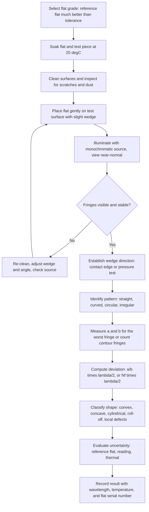

## Optical Flats and Fringe Interpretation


An optical flat is a precisely polished, extremely flat disc of glass or fused quartz used as a reference surface for testing the flatness of other surfaces by interferometry. When an optical flat is placed on (or very near) a test surface and illuminated with monochromatic light, the thin wedge-shaped air gap between the two surfaces produces a pattern of bright and dark interference fringes. Each fringe is a contour line of constant air-gap thickness, so the pattern is a direct topographic map of the test surface relative to the reference. Because one fringe corresponds to a gap change of half a wavelength (about 0.3 $\mu$m for common sources), optical flats resolve surface deviations of a fraction of a fringe, in the range of tens of nanometers, without electronics or moving parts. In precision metrology and quality control, optical flats are used to verify the flatness of gauge blocks, micrometer anvils, surface plates, seal faces, lapped and ground components, and to check the parallelism of gauge-block wringing faces and the flatness of other optical flats.

### Physical Basis

#### Air-Wedge Interference

When an optical flat rests on a test surface, the two surfaces are not perfectly parallel or in perfect contact. A thin air wedge of thickness $t(x, y)$ exists between them. Light incident on the wedge is partly reflected from the lower surface of the flat (reference) and partly reflected from the upper surface of the test piece. These two reflected beams interfere. For near-normal incidence, the optical path difference (OPD) is twice the gap thickness (the beam passes the gap twice):

$$\text{OPD} = 2\,n_{air}\,t\,\cos\theta \approx 2\,t \qquad (n_{air} \approx 1,\ \theta \approx 0)$$

Reflection at the glass-to-air boundary (reference surface, from within the glass, external to the gap) is an internal reflection with no phase change, while reflection at the air-to-test-surface boundary (for a reflective solid such as steel or glass) is an external reflection that introduces a phase shift of $\pi$. The net additional phase shift is $\pi$, so the intensity condition becomes:

$$2\,t = m\,\lambda \quad \Rightarrow \quad \text{dark fringe (destructive interference)}$$


$$2\,t = \left(m + \tfrac{1}{2}\right)\lambda \quad \Rightarrow \quad \text{bright fringe (constructive interference)}$$

with integer order $m = 0, 1, 2, \ldots$. The zero-order dark fringe corresponds to zero gap (contact). [Inference] For metallic test surfaces, the reflection phase shift differs from exactly $\pi$ and depends on the material's complex refractive index, which changes the apparent fringe position by a small fraction of a fringe; this matters when mixing metal and glass surfaces in a comparison or in gauge-block wringing measurements.

#### Height per Fringe

Adjacent dark fringes differ in gap thickness by:

$$\Delta t = \frac{\lambda}{2}$$

so each fringe is a contour of height interval $\lambda/2$.

| Light Source | Wavelength $\lambda$ | Height per Fringe ($\lambda/2$) |
| --- | --- | --- |
| Helium lamp | 587.6 nm | 0.294 $\mu$m (11.6 $\mu$in) |
| Sodium lamp (D-lines mean) | 589.3 nm | 0.295 $\mu$m |
| Mercury green (Hg 546.1 nm) | 546.1 nm | 0.273 $\mu$m |
| He-Ne laser | 632.8 nm | 0.316 $\mu$m |
| Green LED (about 525 nm) | 525 nm | 0.263 $\mu$m |
| White light (mean about 550 nm) | About 550 nm | About 0.275 $\mu$m (colored fringes, few visible) |

The commonly quoted working figure for a helium or sodium source is about 0.3 $\mu$m (11.6 microinches) per fringe.

<svg xmlns="http://www.w3.org/2000/svg" viewBox="0 0 780 420" width="780" height="420" font-family="Arial, Helvetica, sans-serif" font-size="13">
<rect x="0" y="0" width="780" height="420" fill="#ffffff" stroke="#cccccc" />
<text x="390" y="26" text-anchor="middle" font-size="16" font-weight="bold">Optical Flat on a Test Surface: Air-Wedge Formation (svg_diagram)</text>

<text x="130" y="60" text-anchor="middle">Monochromatic light (near normal incidence)</text>
<line x1="200" y1="70" x2="200" y2="140" stroke="#d90" stroke-width="2" />
<polygon points="200,140 195,128 205,128" fill="#d90" />
<line x1="320" y1="70" x2="320" y2="150" stroke="#d90" stroke-width="2" />
<polygon points="320,150 315,138 325,138" fill="#d90" />
<line x1="440" y1="70" x2="440" y2="160" stroke="#d90" stroke-width="2" />
<polygon points="440,160 435,148 445,148" fill="#d90" />

<polygon points="90,110 640,150 640,200 90,160" fill="#dbe9f6" stroke="#36a" stroke-width="2" />
<text x="365" y="152" text-anchor="middle" fill="#245">Optical flat (reference)</text>

<rect x="90" y="260" width="550" height="46" fill="#dddddd" stroke="#555" stroke-width="2" />
<text x="365" y="288" text-anchor="middle">Test surface</text>

<polygon points="90,160 640,200 640,260 90,260" fill="#fff8e0" stroke="#c90" stroke-dasharray="5,3" />
<text x="410" y="238" text-anchor="middle" fill="#a60">Air wedge, gap t(x)</text>

<circle cx="90" cy="260" r="4" fill="#d00" />
<text x="90" y="330" text-anchor="middle" fill="#d00">Contact edge (t = 0)</text>

<line x1="600" y1="203" x2="600" y2="260" stroke="#333" stroke-width="2" />
<polygon points="600,203 595,213 605,213" fill="#333" />
<polygon points="600,260 595,250 605,250" fill="#333" />
<text x="640" y="238" fill="#333">t</text>

<g stroke="#000" stroke-width="3">
<line x1="170" y1="312" x2="170" y2="352" />
<line x1="250" y1="312" x2="250" y2="352" />
<line x1="330" y1="312" x2="330" y2="352" />
<line x1="410" y1="312" x2="410" y2="352" />
<line x1="490" y1="312" x2="490" y2="352" />
<line x1="570" y1="312" x2="570" y2="352" />
</g>
<text x="365" y="378" text-anchor="middle">Dark fringes: equally spaced contours, spacing D, each step = λ/2 in gap</text>
<text x="365" y="400" text-anchor="middle" fill="#555">Straight, parallel, equally spaced fringes indicate a flat surface</text>
</svg>

### Optical Flat Construction and Grades

#### Materials

| Material | Thermal Expansion Coefficient | Remarks |
| --- | --- | --- |
| Borosilicate glass (for example, BK7, Pyrex-type) | About $3.3$ to $7 \times 10^{-6}\ \text{K}^{-1}$ | Common, economical, widely used for shop-floor flats |
| Fused quartz (fused silica) | About $0.5 \times 10^{-6}\ \text{K}^{-1}$ | Low thermal sensitivity, excellent stability; preferred for high grades |
| Zero-expansion glass-ceramic (for example, Zerodur-type) | About $\pm 0.05 \times 10^{-6}\ \text{K}^{-1}$ | Highest thermal stability; reference and laboratory flats |

Low expansion reduces distortion from handling and from temperature gradients (a warm hand on the flat bends it), which can produce fringes of the order of a fringe or more.

#### Flatness Grades

Flatness specifications are given as the maximum deviation over the working surface, usually in fractions of a wavelength (the reference wavelength is commonly 546 nm or 633 nm, depending on the standard), or in microinches or micrometers.

| Grade (typical designation) | Typical Flatness | Application |
| --- | --- | --- |
| Reference / laboratory grade | $\lambda/20$ to $\lambda/10$ | Calibration laboratories; checking working flats |
| Working / inspection grade | $\lambda/10$ to $\lambda/4$ | Shop and inspection use |
| Toolroom grade | $\lambda/4$ to $\lambda/2$ | General checking of surfaces |

The standard in the United States has been **ASTM/Federal specification-based grades** (for example, Federal Specification GGG-O-...?), and in metrology, the classification of gauge-block interferometry follows ISO 3650. [Inference] Grade designations, exact numeric flatness limits, and reference wavelengths differ between manufacturers and standards; consult the current specification and the certificate of the individual flat.

For a $\lambda/20$ flat measured at 633 nm:

$$\frac{633\ \text{nm}}{20} \approx 32\ \text{nm} \ (\text{peak-to-valley})$$

so the flat itself may deviate by 32 nm over its aperture, which sets a floor on the measurement uncertainty when using the flat as a reference.

#### Two Forms

- **One-side flat (single-surface):** One surface is polished to the stated flatness; the other is ground. Used when the test surface is against the working face only.
- **Two-side (parallel) flat:** Both faces are flat, and the faces are parallel to within a stated tolerance. Used for gauge-block parallelism tests and for tests in which the flat is inserted between surfaces, or where either face may be used. A parallel flat with a coating on one face is often reserved for the working side.

Sizes commonly range from 45 mm to 300 mm diameter and thickness in the range 12 mm to 50 mm or more. The thickness-to-diameter ratio is chosen to limit self-weight sag and mounting distortion.

Certain optical flats have reflective coatings (partially reflective, e.g., for multiple-beam Fizeau fringes), and specialized flats include a hard-anodized or chromium coating for wear.

### Light Sources and Fringe Visibility

Because the coherence length of the source determines whether fringes form across the air gap, the source matters.

| Source | Coherence Length (approx.) | Practical Comment |
| --- | --- | --- |
| Helium discharge lamp (587.6 nm) | Millimeters (order 0.1 to 0.5 mm, given lamp and line width) | Common in shops; bright yellow, easily viewed |
| Sodium vapor lamp (589 nm) | Fraction of a millimeter to a few mm | Older shop standard; two closely spaced D lines cause the fringe visibility to vary with gap |
| Mercury vapor with green filter (546.1 nm) | Sub-millimeter | Used in laboratories; needs a filter |
| Low-pressure or cadmium spectral lamps | mm range | Laboratory reference |
| He-Ne laser (632.8 nm) | Tens of centimeters or more | Very long coherence, but speckle and parasitic fringes from dust and back reflections |
| Narrowband LED | Tens of micrometers | Adequate for thin gaps near contact |
| White light | About 1 to 2 $\mu$m | Only a few colored fringes near contact, useful to identify the zero-order fringe |

Fringes are visible only if the air-gap OPD is within the coherence length of the source. For small wedge angles and gap up to a few micrometers (tens of fringes), all listed sources except white light suffice. A lamp is typically placed about 20 to 30 cm from the flat and viewed from directly above (near-normal). [Inference] A diffusing screen or a filter is often used to get uniform illumination; the viewing angle should be kept small because obliquity changes the path difference.

**Key Points**

- Use a monochromatic source so fringes are sharp and their spacing corresponds to $\lambda/2$ per fringe.
- Use a dark background and view near-normal to avoid parallax and obliquity errors.
- White light shows colored fringes and helps locate the zero-order (contact) fringe, which is black, whereas higher orders progressively lose saturation.
- Laser illumination increases the risk of spurious interference patterns (from the back surface of the flat, if it is not wedged or coated, and from dust), so it is used only with proper care.

### Fringe Formation and the Equations of Interpretation

#### Wedge Geometry

If the flat rests on the test surface with a contact edge on one side and is supported at an opposite edge by a small gap (for example, a dust particle or a shim), the gap increases linearly, with wedge angle $\alpha$:

$$t(x) = x\,\tan\alpha \approx \alpha\,x$$

The dark fringes occur at $t = m\lambda/2$, so the fringe spacing $D$ (distance between adjacent fringes) is:

$$D = \frac{\lambda}{2\alpha}$$

which gives the wedge angle from the measured fringe spacing:

$$\alpha = \frac{\lambda}{2D}$$

Fringes for a flat, wedge-shaped gap are straight, parallel, equally spaced, and perpendicular to the wedge direction. Their orientation is parallel to the line of contact (the apex of the wedge).

**Example**

A He lamp ($\lambda = 587.6$ nm) illuminates an optical flat resting on a gauge block. The fringes are straight and parallel with a spacing of $D = 4.0$ mm across the block face. Find the wedge angle and the total gap increase across a 35 mm block face.

$$\alpha = \frac{\lambda}{2D} = \frac{587.6\times10^{-9}\ \text{m}}{2 \times 4.0\times10^{-3}\ \text{m}} = 7.35\times10^{-5}\ \text{rad} \approx 15.2\ \text{arcsec}$$

Number of fringes across 35 mm: $35/4.0 = 8.75$ fringes.

Gap increase across the face:

$$\Delta t = \alpha \times 35\ \text{mm} = 7.35\times10^{-5} \times 35\times10^{-3}\ \text{m} = 2.57\ \mu\text{m}$$

check: $8.75 \times \lambda/2 = 8.75 \times 0.2938\ \mu\text{m} = 2.57\ \mu\text{m}$.

**Output**

- Wedge angle: about $7.4\times10^{-5}$ rad (about 15 arcseconds)
- Gap difference across the face: about 2.57 $\mu$m, equivalent to 8.75 fringes. This is the expected result for a wrung-free (resting) flat and does not by itself indicate a form error; it tells the tilt, not the shape.

#### Deviation from Flatness by Fringe Curvature

For a surface that is not flat, the fringes are curved. The amount of curvature of a fringe, measured relative to the fringe spacing, gives the departure from flatness in fractions of a fringe (each fringe is $\lambda/2$).

Consider one dark fringe, which should be a straight line if the surface were flat. Let $a$ be the maximum deviation (sagitta) of the fringe from a straight line drawn between its ends, and let $b$ be the distance between adjacent fringes (fringe spacing), measured perpendicular to the fringe. The local surface deviation from flatness is:

$$\delta = \frac{a}{b}\cdot\frac{\lambda}{2}$$

The ratio $a/b$ is the deviation expressed in fringes, so for $a/b = 0.25$ the surface departs by a quarter of a fringe, equal to $\lambda/8$.

**Example**

A He-lamp test of a lapped steel face shows fringes that bow, with the fringe deviating $a = 1.2$ mm from the straight line joining its ends, while the fringe spacing is $b = 4.8$ mm.

$$\frac{a}{b} = \frac{1.2}{4.8} = 0.25\ \text{fringe}$$


$$\delta = 0.25 \times \frac{587.6\ \text{nm}}{2} = 0.25 \times 293.8\ \text{nm} = 73.5\ \text{nm}$$

**Output**

- Departure from flatness: 0.25 fringe, about 73 nm (about 2.9 microinches). The result describes the local deviation along that fringe; the total form deviation is evaluated over all fringes (see below).

<svg xmlns="http://www.w3.org/2000/svg" viewBox="0 0 780 460" width="780" height="460" font-family="Arial, Helvetica, sans-serif" font-size="13">
<rect x="0" y="0" width="780" height="460" fill="#ffffff" stroke="#cccccc" />
<text x="390" y="26" text-anchor="middle" font-size="16" font-weight="bold">Measuring Fringe Curvature: a and b (svg_diagram)</text>

<rect x="120" y="60" width="520" height="300" fill="#f7f7f7" stroke="#888" />

<path d="M 120 110 Q 380 60 640 110" fill="none" stroke="#000" stroke-width="4" />
<path d="M 120 190 Q 380 138 640 190" fill="none" stroke="#000" stroke-width="4" />
<path d="M 120 270 Q 380 218 640 270" fill="none" stroke="#000" stroke-width="4" />
<path d="M 120 350 Q 380 298 640 350" fill="none" stroke="#000" stroke-width="4" />

<line x1="120" y1="190" x2="640" y2="190" stroke="#d00" stroke-dasharray="6,4" stroke-width="2" />

<line x1="380" y1="164" x2="380" y2="190" stroke="#080" stroke-width="3" />
<polygon points="380,164 375,174 385,174" fill="#080" />
<polygon points="380,190 375,180 385,180" fill="#080" />
<text x="392" y="182" fill="#080" font-weight="bold">a</text>

<line x1="200" y1="190" x2="200" y2="270" stroke="#36a" stroke-width="3" />
<polygon points="200,190 195,200 205,200" fill="#36a" />
<polygon points="200,270 195,260 205,260" fill="#36a" />
<text x="212" y="234" fill="#36a" font-weight="bold">b</text>
<text x="380" y="395" text-anchor="middle">Deviation from flatness = (a / b) × (λ / 2)</text>
<text x="380" y="418" text-anchor="middle" fill="#555">a = sagitta of one fringe from its chord; b = fringe spacing</text>
<text x="380" y="440" text-anchor="middle" fill="#555">Fringes bowed the same way over the whole aperture indicate a convex or concave surface (see the direction rule)</text>
</svg>

### Interpreting Fringe Patterns

Every fringe is a contour of constant gap. To interpret shape, first establish where the gap is smaller and where it is larger (the wedge direction), then compare the fringe shape against that reference.

#### Establishing the Wedge Direction (Direction of Increasing Gap)

Three practical methods:

1. **Pressure test (finger press):** Apply gentle pressure near the edge of the flat. Fringes move toward the point of contact when the gap reduces (the contact/thin-gap region), and away from the point where the gap is opened. If the fringes move toward the pressing point, the gap there is larger than the gap in the direction from which they come [Inference: the exact behavior depends on where the contact is relative to the pressing point; apply the rule "fringes move toward the thicker gap, or the wedge-opening side, when the wedge thickness is reduced near the wedge apex" with care]. A safer statement: pressing at the wedge-open (thick) end reduces the gap there, so the fringes migrate toward the thick end (away from the apex), and the number of fringes decreases; pressing at the apex end moves the fringes toward the apex.
2. **White-light zero-order identification:** In white light, the zero-order fringe (contact) is dark; colored fringes follow with a defined color sequence. The dark fringe is at the thin end.
3. **Known-contact reference:** If the contact point is visible (the flat touches at one edge or corner), the thin-gap side is that edge, and the gap increases away from it.

#### Fringe Shape Rule for Convex and Concave Surfaces

Given a straight-fringe wedge in which the gap increases from left (thin) to right (thick):

- If a fringe bows **toward the thin side (toward the contact edge)**, the gap at the fringe's center is smaller than expected for a straight fringe, which is the same gap as an adjacent point of the fringe on the thick-side-of-center; equivalently, the test surface is **higher (raised) at that point** relative to a flat: a **convex (crowned)** surface.
- If a fringe bows **away from the contact edge (toward the thick side)**, the surface is **lower at that point**: a **concave (hollow)** surface.

Reasoning: Along one fringe, the gap is constant. Where the fringe bulges toward the thin side, it reaches a place where the wedge would make the gap smaller, yet the fringe indicates the same gap as the ends. Hence the test surface must be lower there to keep that gap equal to $m\lambda/2$... this pattern requires care, so the next section provides an unambiguous, worked rule using the tilt reference and fringe count.

**Unambiguous rule:** Choose the fringe that passes through a specific point of the surface. Compare the position of the fringe at the point of interest with the position of the straight-line extension of the same fringe drawn from its ends:

- A fringe displaced **toward the wedge apex (thin side)** at the point of interest means the surface at that point is **lower than the chord level relative to the flat**, so the gap for that fringe order is reached at a smaller wedge thickness; the test surface is displaced **away from the flat**, so the surface is **concave (depression)**...

To avoid inconsistency, the recommended method is the unambiguous physical rule below.

**Physical rule based on the wedge:** The gap at any point is $t = t_{wedge}(x) + z_{flat}(x,y) - z_{test}(x,y)$, where $z$ measures the surface height toward the flat. A fringe of fixed order has fixed $t$. At a point where the test surface is raised toward the flat ($z_{test}$ larger), the gap is reduced, so to maintain the same fringe order the wedge component must be larger; this means the fringe of that order is found at a position with **larger wedge thickness, i.e., displaced toward the thick side (away from the apex)**. Therefore:

- Fringe bows **away from the contact edge (toward the thick side)** at some region: the test surface is **raised (high spot / convex)** there.
- Fringe bows **toward the contact edge (toward the thin side)**: the test surface is **lowered (low spot / concave)** there.

This is the standard rule used in practice: **fringes bend away from the line of contact over a high spot and toward the line of contact over a low spot** (the fringe "points" toward the thick side over a raised region because the gap has been reduced there). [Inference] The mapping between direction of bow and the surface type depends only on the assumption that the wedge thickens away from the contact edge; the pressure test or the contact-edge identification should always be performed first.

<svg xmlns="http://www.w3.org/2000/svg" viewBox="0 0 780 500" width="780" height="500" font-family="Arial, Helvetica, sans-serif" font-size="13">
<rect x="0" y="0" width="780" height="500" fill="#ffffff" stroke="#cccccc" />
<text x="390" y="26" text-anchor="middle" font-size="16" font-weight="bold">Fringe Patterns and Surface Types (svg_diagram)</text>

<text x="140" y="56" text-anchor="middle" font-weight="bold">Flat (tilted)</text>
<rect x="30" y="66" width="220" height="150" fill="#f7f7f7" stroke="#888" />
<g stroke="#000" stroke-width="3"><line x1="80" y1="66" x2="80" y2="216" /><line x1="130" y1="66" x2="130" y2="216" /><line x1="180" y1="66" x2="180" y2="216" /><line x1="230" y1="66" x2="230" y2="216" /></g>
<text x="140" y="238" text-anchor="middle" fill="#555">Straight, parallel, equal spacing</text>
<text x="34" y="234" fill="#d00" font-size="11">contact</text>

<text x="390" y="56" text-anchor="middle" font-weight="bold">Convex (high center)</text>
<rect x="280" y="66" width="220" height="150" fill="#f7f7f7" stroke="#888" />
<g fill="none" stroke="#000" stroke-width="3"><path d="M 330 66 Q 350 141 330 216" /><path d="M 380 66 Q 405 141 380 216" /><path d="M 430 66 Q 455 141 430 216" /><path d="M 480 66 Q 505 141 480 216" /></g>
<text x="390" y="238" text-anchor="middle" fill="#555">Fringes bow away from contact edge</text>
<text x="284" y="234" fill="#d00" font-size="11">contact</text>

<text x="640" y="56" text-anchor="middle" font-weight="bold">Concave (low center)</text>
<rect x="530" y="66" width="220" height="150" fill="#f7f7f7" stroke="#888" />
<g fill="none" stroke="#000" stroke-width="3"><path d="M 580 66 Q 560 141 580 216" /><path d="M 630 66 Q 610 141 630 216" /><path d="M 680 66 Q 660 141 680 216" /><path d="M 730 66 Q 710 141 730 216" /></g>
<text x="640" y="238" text-anchor="middle" fill="#555">Fringes bow toward contact edge</text>
<text x="534" y="234" fill="#d00" font-size="11">contact</text>

<text x="140" y="286" text-anchor="middle" font-weight="bold">Spherical (no tilt)</text>
<rect x="30" y="296" width="220" height="150" fill="#f7f7f7" stroke="#888" />
<g fill="none" stroke="#000" stroke-width="3"><circle cx="140" cy="371" r="20" /><circle cx="140" cy="371" r="42" /><circle cx="140" cy="371" r="62" /></g>
<text x="140" y="466" text-anchor="middle" fill="#555">Concentric circular fringes</text>

<text x="390" y="286" text-anchor="middle" font-weight="bold">Cylindrical (ridge or trough)</text>
<rect x="280" y="296" width="220" height="150" fill="#f7f7f7" stroke="#888" />
<g fill="none" stroke="#000" stroke-width="3"><path d="M 280 336 Q 390 306 500 336" /><path d="M 280 371 Q 390 341 500 371" /><path d="M 280 406 Q 390 376 500 406" /></g>
<text x="390" y="466" text-anchor="middle" fill="#555">Uniformly curved parallel fringes</text>

<text x="640" y="286" text-anchor="middle" font-weight="bold">Turned edge (roll-off)</text>
<rect x="530" y="296" width="220" height="150" fill="#f7f7f7" stroke="#888" />
<g fill="none" stroke="#000" stroke-width="3"><path d="M 580 296 L 580 396 Q 583 420 600 446" /><path d="M 640 296 L 640 396 Q 643 420 660 446" /><path d="M 700 296 L 700 396 Q 703 420 720 446" /></g>
<text x="640" y="466" text-anchor="middle" fill="#555">Fringes bend sharply near one edge</text>
</svg>

The "bow toward or away from the contact edge" rule is consistent when the wedge thickens away from the contact edge. If the flat is tilted in the opposite sense, the sense of bowing reverses for the same surface.

#### Catalog of Common Patterns

| Fringe Pattern | Interpretation | Notes |
| --- | --- | --- |
| Straight, parallel, equally spaced | Flat surface, tilt only | Spacing gives tilt angle: $\alpha = \lambda/(2D)$ |
| Straight, parallel, unequally spaced | Uniform variation of slope, i.e., a smooth curvature in one direction | Spacing changes with position, meaning the surface is cylindrical (one-dimensional curvature) |
| Uniformly curved, parallel (arcs) | Cylindrical, ridge or trough; or spherical with tilt | Determine by direction and by pressure test |
| Concentric circles or ellipses | Spherical (or slightly astigmatic) with the wedge nearly zero | Number of rings is the sag in fringes |
| Elliptical rings | Sphere with astigmatism or different curvatures in perpendicular directions | Toroidal surface |
| Saddle-shaped, hyperbolic fringes | Saddle (anticlastic), opposite curvatures in two directions | Typical of poorly lapped or distorted surfaces |
| Fringes bending sharply at one edge | Turned-down (or turned-up) edge, roll-off | Common on lapped edges |
| Fringes bending at a corner only | Corner deformation | Local, may be due to lapping |
| Irregular, wavy, closed contours | Local hills and depressions, high-spot or low-spot area | Closed contours identify local extrema |
| Fringes that are not continuous or jump | Scratches, pits, dirt, or step | A step of $k$ fringes has fringes displaced by $k$ spacings across the step |
| Parallel fringes with a single closed loop | A local bump or a dip | Loop direction gives high or low (use the pressure test) |

#### Determining High vs. Low Spots Using Pressure

Gentle finger pressure on the flat's edge (with a clean cloth or a wooden or plastic tool) reduces the gap locally:

- If pressing on the flat near a closed-contour region changes the fringe count and the fringes shrink toward the point, the region is a high spot (protruding toward the flat) [Inference: the behavior depends on where the contact occurs; the rule "fringes move toward the thicker gap region when the gap is reduced near the thin-gap region" is only valid when the reference wedge is clearly identified].
- A closed-loop fringe that shrinks and disappears under pressure indicates a hill (the flat pressed down onto the peak), whereas a loop that expands indicates a depression.

An unambiguous practical approach: create a known wedge by lightly lifting one edge of the flat with a thin shim; the thin side is the side nearest the contact. Then apply the "bow away from contact over a high spot" rule and confirm by observing how the fringe pattern changes with the applied pressure.

### Quantitative Evaluation of Flatness

#### Single-Fringe Method (Wedge with Parallel Fringes)

1. Adjust the flat so 3 to 6 straight fringes cross the surface (a small tilt improves reading accuracy).
2. Measure the fringe spacing $b$ and the maximum bow $a$ for the worst fringe, perpendicular to the wedge.
3. Compute $\delta = (a/b)\cdot\lambda/2$.
4. State the direction (convex or concave) via the contact-edge rule.

For rectangular gauge-block faces and small parts, this is sufficient, and the flatness is stated as the maximum bow in fringes or in nanometers.

#### Multi-Fringe (Contour) Method

When the pattern is a set of closed contours with no tilt, each fringe is one contour of $\lambda/2$ height. The total form deviation is the number of contour intervals from the lowest to the highest region times $\lambda/2$:

$$PV = N_f\,\frac{\lambda}{2}$$

where $N_f$ is the number of fringes (contour intervals, including fractions) between the highest and lowest points, corrected for the wedge (tilt) component removed by best-fit or by choosing null tilt.

**Example**

A He-lamp ($\lambda = 587.6$ nm) test on a lapped surface, adjusted to null tilt, displays concentric rings; 3.5 fringes are counted from the center to the edge. Estimate the peak-to-valley deviation and classify the shape.

$$PV = 3.5 \times \frac{587.6\ \text{nm}}{2} = 3.5 \times 293.8\ \text{nm} = 1028\ \text{nm} \approx 1.03\ \mu\text{m}$$

Concentric circular fringes indicate a spherical form (crowned or hollowed), which the pressure test or the tilt-shift direction distinguishes.

**Output**

- Peak-to-valley flatness deviation of about 1.03 $\mu$m (about 40 microinches), a spherical shape (crowned or hollowed).

#### Radius of Curvature from Circular Fringes

For a spherical surface tested against a flat, the fringe count $N_f$ across a diameter of radius $r$ relates the sagitta $s = N_f\lambda/2$ to the radius of curvature $R$:

$$s \approx \frac{r^2}{2R} \quad \Rightarrow \quad R \approx \frac{r^2}{2s} = \frac{r^2}{N_f\lambda}$$

**Example**

A convex lapped surface of 25 mm diameter ($r = 12.5$ mm) shows 3.5 rings at 587.6 nm.

$$s = 3.5 \times 293.8\ \text{nm} = 1.028\ \mu\text{m}$$


$$R \approx \frac{(12.5\ \text{mm})^2}{2 \times 1.028\times10^{-3}\ \text{mm}} = \frac{156.25}{2.056\times10^{-3}}\ \text{mm} \approx 7.6\times10^{4}\ \text{mm} = 76\ \text{m}$$

**Output**

- Radius of curvature of about 76 m (nearly flat), consistent with 3.5 fringes over the 25 mm face.

#### Newton's Rings for Test-Plate Comparison

When a nominally spherical surface of radius $R_s$ is placed against a flat, the radius of the $m$-th dark ring in reflection (with a contact point at the center) is:

$$r_m = \sqrt{m\,\lambda\,R_s}$$

This relation is the basis of test-plate checking of spherical surfaces with reference plates (test glasses) and is the same physical principle as the optical-flat test.

#### Parallelism of Two Faces (Gauge Blocks and Parallel Flats)

For a parallel-sided object (a gauge block or an optical parallel), place the flat on each face (or, for a two-sided part, on the top face with the bottom resting on a reference flat) and count the fringes across a defined length $\ell$. The wedge angle between the faces is:

$$\alpha = \frac{N_f\,\lambda/2}{\ell}$$

where $N_f$ is the number of fringes across the length $\ell$ on the test surface, when the reference flat is wrung on the other face, or measured on each face with a separate reference. The parallelism (thickness variation across the face) is:

$$\Delta t = N_f\,\frac{\lambda}{2}$$

Gauge-block tolerances (in ISO 3650) specify the permitted variation in length across the block, and the interferometric method is used to check them.

### Gauge Block Interferometry with Wrung Platen

In interferometric calibration of gauge blocks, the block is wrung to a flat platen (an optical flat or a precisely flat surface of similar material). The top face is viewed with a second optical flat or a reference that produces fringes between the block face and the reference flat, and the platen provides a reference plane. The fringe displacement across the boundary between the block face and the platen gives the block's length as a fractional fringe:

$$L = \left(m + f\right)\frac{\lambda}{2}$$

with $m$ the integer order (determined from a known nominal length or from multiple wavelengths using the method of exact fractions) and $f$ the measured fractional fringe displacement between the block face and the platen: $f = a/b$ (ratio of the fringe offset to the fringe spacing). The **method of exact fractions** uses two or more wavelengths (for example, red, green, and blue lines of cadmium or a modern laser set) to determine the integer $m$ uniquely from the fractional parts, typically starting from a length known to within a few tenths of a micrometer or better. The phase change on reflection (block versus platen) and the wringing-film thickness must be accounted for, which requires the platen to be of the same material and surface finish as the block for the highest accuracy. Modern calibration laboratories use laser interferometric comparators or dedicated gauge block interferometers, which apply the same principle with phase-shifting analysis.

### Effects on Accuracy and Error Sources

| Error Source | Effect | Mitigation |
| --- | --- | --- |
| Flatness of the reference flat | Adds to or subtracts from the apparent test-surface deviation | Use a reference flat much better than the required accuracy; calibrate the reference (three-flat method) |
| Thermal gradients (hand warmth, handling) | Bending of the flat, changing fringes by fractions of a fringe | Allow thermal equalization, use tweezers or a cloth, hold at edges only, use low-expansion material |
| Temperature difference between flat and test piece | Changing dimension, moving fringes | Soak both pieces in the same environment (typically 20 degrees C) |
| Dust, dirt, or residue | False fringes, a wedge, air gap larger than expected, scratches | Clean with lint-free wipes and solvent; blow off with clean air; inspect before contact |
| Viewing obliquity | Changes OPD by $\cos\theta$, shifting fringe spacing by a factor of $1/\cos\theta$ | View near-normal; use a collimated arrangement for high accuracy |
| Non-monochromatic source | Reduced fringe contrast; wrong spacing | Use a filtered narrow-band source or a lamp with a known wavelength |
| Wavelength error | Scale error of height per fringe | Use nominal wavelengths from the source specification |
| Fringe-reading error | Estimation error in $a$ and $b$ | Use a magnifier and reticle, or photograph and measure digitally |
| Gap refractive index (air) | Scale factor from air index, small at the nominal condition | Negligible for thin gaps; account for it in high-accuracy work |
| Reflective phase change | Fringe shift for metals versus glass | Apply a correction or use comparison with a similar material |
| Flat sag under its own weight and mounting | Distorted reference | Use proper support points (Airy or Bessel points), adequate thickness |
| Surface-quality defects (pits, scratches) | Local fringe disruptions | Inspect and discard damaged flats |
| Dust wedge and contact pressure | Elastic deflection and wear | Keep contact pressure low; use a defined gap rather than heavy contact |

#### Support Points for Minimum Sag

An optical flat supported on a horizontal plane deflects under its weight. The support points minimizing the deflection of a uniformly loaded disc of length $L$ (for a beam or a rectangular plate) are the **Airy points**, at $0.2113\,L$ from each end (giving equal end and center slopes for a beam), and the **Bessel points**, at $0.2203\,L$ from each end (for minimum length change). For a circular flat, a three-point support at a radius of about 0.68 of the flat radius reduces the deflection. [Inference] The optimum radius depends on the assumed model and the thickness of the plate; follow the manufacturer's recommendation, and record the support method with the calibration.

### Measurement Uncertainty

The uncertainty of a flatness measurement by optical flat has components from the reference flat, the fringe reading, and the setup:

$$u_c = \sqrt{u_{ref}^2 + u_{read}^2 + u_{\lambda}^2 + u_{T}^2 + u_{obl}^2 + u_{dust}^2 + u_{rep}^2}$$

where the terms correspond to the reference flat's calibrated flatness, the reading of fringe position (typically 0.05 to 0.1 of a fringe for careful visual observation, corresponding to about 15 to 30 nm), the wavelength (negligible), temperature, obliquity, contamination, and repeatability. For a visual test, a practical resolution is about 1/10 fringe (about 30 nm), and the typical uncertainty is of the order of $\lambda/10$ to $\lambda/20$ for good work. [Inference] Photographic and camera-based fringe analysis can reduce the reading error; phase-shifting interferometers (such as Fizeau instruments) outperform the visual test by an order of magnitude or more.

**Example**

Combine standard uncertainties for a visual flatness check at 587.6 nm.

| Contribution | Standard uncertainty (nm) |
| --- | --- |
| Reference flat ($\lambda/20$ rectangular distribution, half-width $\lambda/40 = 14.7$ nm, divided by $\sqrt{3}$) | 8.5 |
| Fringe reading (0.05 fringe of 293.8 nm) | 14.7 |
| Temperature and handling | 8.0 |
| Obliquity (viewing within 5 degrees; $1 - \cos 5^\circ = 3.8\times10^{-3}$ times 293.8 nm, per fringe, at 3 fringes) | 3.3 |
| Contamination (dust) | 5.0 |
| Repeatability (type A) | 7.0 |

$$u_c = \sqrt{8.5^2 + 14.7^2 + 8.0^2 + 3.3^2 + 5.0^2 + 7.0^2}\ \text{nm} = \sqrt{72.25 + 216.09 + 64 + 10.89 + 25 + 49}\ \text{nm}$$


$$u_c = \sqrt{437.2}\ \text{nm} \approx 20.9\ \text{nm}, \qquad U = 2\,u_c \approx 42\ \text{nm}\ \ (k = 2)$$

**Output**

- Expanded uncertainty of about 42 nm (about $\lambda/14$, or about 1.7 microinches), which is consistent with the general capability of a careful visual test with a $\lambda/20$ reference. Values are illustrative and depend on the setup.

### Cleaning, Handling, and Care

Optical flats are fragile and their accuracy depends on the condition of the surface.

1. Handle by the edges with clean, lint-free gloves or with tissue; avoid skin contact with the working face and avoid thermal transfer.
2. Clean before use with a lint-free tissue and a suitable solvent (for example, reagent-grade isopropyl alcohol or acetone, following the manufacturer's advice); use a fresh tissue surface for each wipe and wipe from the center outward.
3. Blow off particulates with clean, dry air before contact; never slide the flat across the test surface with grit present.
4. Place the flat down gently and slowly, letting it settle, and avoid sliding except for a light adjustment to remove trapped air (the film thickness reduction is visible as fringe changes).
5. Do not wring the flat onto steel surfaces. Wringing can cause both to stick and can scratch. Optical flats are used with a thin air gap, not wrung, except when using a wrung gauge-block platen technique with approved flats.
6. Store in a protective case, with the working face protected by a soft tissue or foam, in a stable-temperature environment, and keep the flat away from vibration, moisture, and dust.
7. Avoid temperature shocks (warm water, direct sunlight), which cause thermal distortion or cracking.
8. Check periodically for scratches, chips, and edge damage, and have the flat recalibrated at intervals (commonly 1 to 3 years, depending on use and quality-system requirements).
9. Never use optical flats with hard abrasive workpieces without protection; use a lapped reference flat or a working-grade flat in such cases.

### Calibration of an Optical Flat (Three-Flat Test)

The absolute flatness of a reference flat can be determined without a perfect reference by the **three-flat test**: three flats A, B, and C are compared pairwise (A against B, B against C, and C against A, sometimes with rotation), and the surface-error profiles are solved from the set of pairwise difference maps. Denoting the surface height profiles $h_A$, $h_B$, $h_C$ and the measured pairwise differences (with the sign convention determined by the way the surfaces face each other):

$$m_{AB} = h_A + h_B,\quad m_{BC} = h_B + h_C,\quad m_{CA} = h_C + h_A$$

(for two flats facing each other, the fringe pattern reveals the sum of their surface errors, expressed in the coordinate system of the setup, with one flat mirrored). The individual profiles along a line, for example, are obtained from:

$$h_A = \frac{m_{AB} + m_{CA} - m_{BC}}{2},\quad h_B = \frac{m_{AB} + m_{BC} - m_{CA}}{2},\quad h_C = \frac{m_{BC} + m_{CA} - m_{AB}}{2}$$

This simplified form determines the profiles along a line but does not separate antisymmetric components fully in a two-dimensional map; complete 2D reconstruction (Schulz-Schwider or Zernike-based methods) requires additional rotations of one of the flats by different angles. [Inference] The exact treatment of the reflection geometry and the rotational symmetry components varies with the method, and the fully 2D result depends on the rotation strategy. Modern calibration laboratories perform this test with phase-shifting Fizeau interferometers.

### Workflow



### Illustrative Code: Fringe Simulation and Flatness Extraction

The following Python code simulates the interference pattern of a slightly crowned, tilted surface under a wavelength-specified source and then reconstructs the height map by Fourier-transform fringe analysis (spatial carrier method), reporting peak-to-valley flatness in fringes and nanometers.

```python
import numpy as np

LAMBDA_NM = 587.6                 # helium lamp
HALF_LAMBDA_NM = LAMBDA_NM / 2.0  # height per fringe

# ---------------- 1. Simulate a test surface and its fringe pattern ----------------
n = 512
x = np.linspace(-12.5, 12.5, n)          # mm, 25 mm aperture
X, Y = np.meshgrid(x, x)
R2 = X**2 + Y**2
mask = R2 <= 12.5**2

# Surface height toward the flat (nm): crowned (spherical) form of ~1.0 um sag
sag_nm = 1030.0 * (1.0 - R2 / 12.5**2)
# Air-wedge (tilt) added by the way the flat rests: ~8 fringes across the aperture
tilt_fringes_across = 8.0
wedge_nm = tilt_fringes_across * HALF_LAMBDA_NM * (X + 12.5) / 25.0

# Gap thickness (nm): wedge minus surface height (surface bulges toward the flat)
gap_nm = wedge_nm - sag_nm + 3000.0      # constant offset keeps the gap positive

# Two-beam interference; the extra pi shift makes t = 0 a dark fringe
phase = 4 * np.pi * gap_nm / LAMBDA_NM
I0, V = 1.0, 0.85
rng = np.random.default_rng(2)
I = I0 * (1 + V * np.cos(phase + np.pi)) + rng.normal(0, 0.02, phase.shape)
I[~mask] = 0.0

# ---------------- 2. Fourier-transform fringe analysis (Takeda) ----------------
F = np.fft.fftshift(np.fft.fft2(I - I[mask].mean()))
cx = n // 2
# locate the carrier peak (tilt carrier lies along the x direction)
mag = np.abs(F)
mag[cx - 6:cx + 7, cx - 6:cx + 7] = 0          # suppress the DC neighbourhood
py, px = np.unravel_index(np.argmax(mag), mag.shape)

# filter a window around the carrier, shift it to the origin, inverse transform
win = 30
G = np.zeros_like(F)
G[py - win:py + win, px - win:px + win] = F[py - win:py + win, px - win:px + win]
G = np.roll(G, shift=(cx - py, cx - px), axis=(0, 1))
z = np.fft.ifft2(np.fft.ifftshift(G))
wrapped = np.angle(z)

# ---------------- 3. Unwrap (simple row-then-column unwrapping) ----------------
u = np.unwrap(wrapped, axis=1)
u = np.unwrap(u, axis=0)

# remove piston and residual tilt by least-squares plane fit over the aperture
A = np.column_stack([X[mask], Y[mask], np.ones(mask.sum())])
coef, *_ = np.linalg.lstsq(A, u[mask], rcond=None)
plane = coef[0] * X + coef[1] * Y + coef[2]
u_flat = u - plane

# convert phase to surface height: 4*pi per fringe pair -> lambda/2 per 2*pi
height_nm = u_flat * LAMBDA_NM / (4 * np.pi)
h = height_nm[mask]
h -= h.mean()
pv_nm = h.max() - h.min()

print(f"Measured peak-to-valley form error: {pv_nm:.0f} nm ({pv_nm / HALF_LAMBDA_NM:.2f} fringes)")
print(f"RMS form error                     : {h.std():.0f} nm")
print(f"Input crown (design)               : 1030 nm (3.51 fringes)")

# ---------------- 4. Radius of curvature from the sag ----------------
r_mm = 12.5
s_mm = pv_nm * 1e-6
R_m = (r_mm**2) / (2 * s_mm) / 1000.0
print(f"Estimated radius of curvature      : {R_m:.1f} m")
```

**Output**

The reconstruction should return a peak-to-valley form error close to the input crown of 1030 nm (about 3.5 fringes), with an RMS error of a few hundred nanometers, and an estimated radius of curvature near 76 m, within the noise and unwrapping quality of the synthetic data. The recovered sign of the height depends on the convention chosen for the wedge and the surface direction, and the exact numbers vary with the noise realization and the carrier filter. In practice, the sign (convex versus concave) must be established physically using the contact edge or pressure test, because intensity alone does not carry the sign of the phase.

### Standards and Guidelines

- **ISO 3650**: Geometrical product specifications (GPS), length standards, gauge blocks. Specifies tolerances and calibration methods, including interferometric methods and grades (K, 0, 1, 2).
- **ISO 10110 (series)**: Optics and photonics, preparation of drawings for optical elements and systems; notation of surface form tolerances in fringes (for example, the surface-form indication of power and irregularity in fringes at 546 nm).
- **ISO 14999 (series)**: Interferometric measurement of optical elements and optical systems.
- **ISO 1101 and ISO 12781**: Geometrical tolerancing and flatness specification; ISO 12781-1 and -2 define flatness terms and specification operators.
- **ASME B89.1.9**: Gage blocks (United States), including calibration by interferometry. [Inference] Verify the current edition and applicability.
- **JIS B 7430, DIN 58 (series), and older standards**: National standards for optical flats and parallels in some regions. [Inference] Standards for optical flat grades vary by region and edition; use the applicable current standard and the manufacturer's certificate.
- **ISO/IEC 17025**: Requirements for calibration laboratories; recommended for accredited flat and gauge-block calibrations.
- **JCGM 100 (GUM)**: Guide to the expression of uncertainty in measurement.

### Comparison with Other Flatness Measurement Methods

| Attribute | Optical Flat and Fringes | Phase-Shifting Fizeau Interferometer | Autocollimator / Levels | CMM Tactile Scan | Surface Plate with Indicator |
| --- | --- | --- | --- | --- | --- |
| Measurement type | Whole-surface contour by eye | Whole-surface, quantitative map | Line profile from slope | Point or line scan | Point or line comparison |
| Typical uncertainty | About $\lambda/10$ to $\lambda/20$ (30 to 15 nm) | Below $\lambda/100$ (about 5 nm and better) | About 1 $\mu$m/m and up | Micrometers | Micrometers |
| Aperture / size | Up to about 300 mm | Up to 300 mm and larger | Any length | Machine dependent | Any size |
| Speed | Seconds | Seconds to minutes | Minutes | Minutes | Minutes |
| Equipment cost | Low | High | Moderate | High | Low |
| Best for | Lapped and polished small surfaces | Precision optics and flats | Long straight edges and tables | Machined parts | Shop-floor checks |
| Data output | Visual estimate | Digital, statistical | Digital | Digital | Visual/readout |

### Advantages and Limitations

**Key Points**

Advantages:

- Very high sensitivity (a fraction of $\lambda/2$, tens of nanometers) at low cost
- Direct visualization of the entire surface topography in a single view
- No electronics, no moving parts, and no contact force beyond the flat's own weight
- Portable and quick; suited to inspection of lapped, ground, and polished parts
- Direct traceability to the wavelength of the illuminating source
- Ideal for gauge blocks, seal faces, anvils, and reference parts

Limitations:

- Applicable only to highly polished, reflective, and nearly flat surfaces (a few micrometers of departure at most, or the fringes become too dense)
- Qualitative-to-semiquantitative; the reading depends on operator judgment unless digital analysis is used
- Sensitive to temperature, handling, dust, and viewing angle
- Establishing the sign (high or low) requires additional steps (contact-edge or pressure test)
- The reference flat's own error limits the achievable accuracy, and calibrated flats require periodic recertification
- Risk of scratching either surface if dirt is trapped or the flat is slid
- Not suitable for rough surfaces, curved parts (beyond a small sag), or large aspect ratios

### Best Practices

1. Choose a reference flat at least 3 to 5 times better than the required tolerance (for example, $\lambda/20$ to test to $\lambda/4$).
2. Soak the flat and workpiece at the same temperature (ideally 20 degrees C) and avoid warmth from hands and lighting.
3. Clean both surfaces immediately before the test, and check for dust with a magnifier; use lint-free materials and appropriate solvents.
4. Place the flat with care, allow settling, and introduce a slight wedge that gives 3 to 6 straight fringes for easy interpretation.
5. Use a monochromatic source of known wavelength and view near-normal against a dark background; use a hood or viewing box to reduce stray light.
6. Establish the wedge direction (contact edge or gentle pressure test) before interpreting convex or concave.
7. Measure $a$ and $b$ using a reticle or a magnified image; use fractions of a fringe consistently, and record the worst fringe.
8. For quantitative work, photograph the fringes and analyze digitally (fringe centering or Fourier-transform analysis) to reduce reading error.
9. Record the wavelength, temperature, flat serial number and calibration date, orientation of the pattern, and the fringe deviation in fractions of a fringe and in nanometers.
10. Support the flat at appropriate support points when testing large surfaces, and use thick enough flats to limit the sag.
11. Store flats in protective cases, and recalibrate on a regular schedule, using the three-flat test or a Fizeau interferometer.
12. Use a phase-shifting Fizeau interferometer instead of visual interpretation when the required uncertainty is better than about $\lambda/20$.

### Application Areas

- Verification of flatness of gauge blocks, gauge-block platens, and the wringing quality of gauge blocks
- Flatness checks of micrometer anvils and spindles, caliper jaws, and measuring faces
- Seal faces, valve seats, and mechanical face seals (helium leak-tightness relates to flatness at the micrometer and sub-micrometer level)
- Lapped and ground precision parts, such as hydraulic spool components, bearing races, and spacer rings
- Parallelism checking of optical parallels, windows, and plates
- Checking of surface plates and straightedges (with larger flats or by using working flats and comparison methods)
- Optical component fabrication: polishing control of flat mirrors and prisms
- Calibration laboratories: evaluation of reference flats, and gauge-block interferometric measurement
- Semiconductor wafer and substrate flatness (with interferometric instruments derived from the same principle)
- Educational demonstration of interference, Newton's rings, and wedge fringes

### Conclusion

Optical flats convert the small air gap between a reference surface and a test surface into a fringe pattern in which each fringe is a contour of $\lambda/2$ height, so surface topography can be read directly as a map. Interpreting the pattern requires three steps: identify the wedge direction, classify the fringe shape (straight, curved, circular, or irregular), and quantify the deviation as $(a/b)\cdot\lambda/2$ for a bowed fringe or as the number of contour fringes times $\lambda/2$ for closed contours. Accuracy is governed by the calibrated flatness of the reference, thermal equilibrium, cleanliness, monochromatic illumination, and near-normal viewing. Used carefully, the optical flat gives a fast, low-cost, and traceable check of flatness to about one-tenth of a fringe (roughly 30 nm), while calibration-grade and higher-accuracy work moves to phase-shifting Fizeau interferometry, which applies the same optics with digital phase analysis.

### Related Topics

- Fizeau interferometers and phase-shifting flatness testing
- Three-flat test and absolute flatness calibration
- Gauge block interferometry and the method of exact fractions
- Wringing of gauge blocks and wringing-film thickness
- Newton's rings and test-plate (test-glass) inspection of spherical surfaces
- Multiple-beam interferometry and Fabry-Perot flats
- Flatness tolerancing per ISO 1101 and ISO 12781
- Airy and Bessel support points for flats and straightedges
- Digital fringe analysis: Fourier-transform and phase-unwrapping methods
- Surface texture measurement by coherence scanning interferometry
- Principles of optical interferometry
- Laser interferometers for length measurement