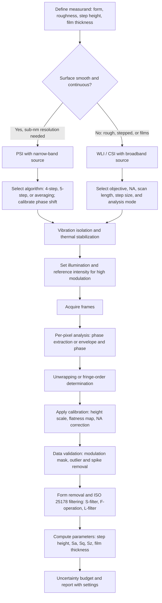

## White Light and Phase Shifting Interferometry


White light interferometry (WLI, also called coherence scanning interferometry, CSI, or vertical scanning interferometry, VSI) and phase shifting interferometry (PSI) are the two principal full-field, areal interferometric methods for measuring surface topography at the nanometer and sub-nanometer level. Both use a two-beam interferometer (commonly a Michelson, Mirau, or Linnik objective, or a Fizeau cavity) and a camera, and both recover surface height at every pixel from the interference signal. They are complementary: PSI uses a narrow-band source and extracts phase from a few frames with known phase shifts, giving sub-nanometer vertical resolution on smooth, continuous surfaces but with an unambiguous range of only $\lambda/4$ between adjacent pixels. WLI uses a broadband source and scans the optical path, locating the position of maximum fringe contrast (the coherence envelope peak) at each pixel, giving an unambiguous height over a range of tens to hundreds of micrometers on rough, stepped, and discontinuous surfaces, and can be combined with phase evaluation for nanometer resolution. In precision metrology and quality control, they underpin areal surface texture measurement per ISO 25178, step-height and film-thickness measurement, MEMS and semiconductor inspection, optical component form testing, and the calibration of roughness and step standards.

### Two-Beam Interference Fundamentals

For two beams of intensity $I_1$ and $I_2$ with optical path difference (OPD) $\Delta$ and phase difference $\phi = 2\pi\Delta/\lambda$, the intensity is:

$$I = I_1 + I_2 + 2\sqrt{I_1 I_2}\,\cos\phi = I_0\left[1 + V\cos\phi\right]$$

with visibility $V = 2\sqrt{I_1 I_2}/(I_1 + I_2)$. In a reflection geometry (Michelson, Mirau, Fizeau), a surface height $h$ changes the OPD by $2h$ (double pass), so:

$$\phi = \frac{4\pi}{\lambda}\,h \quad\Rightarrow\quad h = \frac{\lambda}{4\pi}\,\phi$$

One $2\pi$ of phase corresponds to a height change of $\lambda/2$ (a fringe). For $\lambda = 632.8$ nm, one fringe is 316.4 nm.

#### Broadband Sources and the Coherence Envelope

For a source with a spectral distribution $S(k)$ over wavenumber $k = 2\pi/\lambda$, the intensity as a function of OPD $\Delta = 2(z - z_0)$ (with $z$ the scan position and $z_0$ the surface height at that pixel) is the superposition of monochromatic fringe patterns:

$$I(z) = I_0\left[1 + V\,\gamma\!\left(2(z - z_0)\right)\cos\!\left(2k_0 (z - z_0) + \phi_s\right)\right]$$

where:

- $k_0$ is the mean (effective) wavenumber of the source
- $\gamma(\Delta)$ is the normalized coherence envelope, the Fourier transform of the normalized power spectrum (Wiener-Khinchin theorem)
- $\phi_s$ is a surface-dependent phase offset (from reflection phase changes and dispersion)

The envelope peaks where the OPD is zero, that is, where the scan position equals the surface height $z_0$. For a Gaussian spectrum of mean wavelength $\lambda_0$ and full width at half maximum $\Delta\lambda$, the coherence length is approximately:

$$L_c \approx \frac{2\ln 2}{\pi}\,\frac{\lambda_0^2}{\Delta\lambda} \approx 0.44\,\frac{\lambda_0^2}{\Delta\lambda}$$

(the numerical factor depends on the definition; $\lambda_0^2/\Delta\lambda$ is often quoted as an order-of-magnitude estimate). The width of the envelope in the scan coordinate is about half the coherence length in OPD, because the OPD changes by twice the scan step.

| Source | Central Wavelength | Bandwidth $\Delta\lambda$ | Coherence Length (OPD) | Typical Use |
| --- | --- | --- | --- | --- |
| Halogen lamp with filter (white) | About 570 nm | 200 to 300 nm | About 1 to 2 $\mu$m | Standard WLI/CSI |
| White LED (phosphor) | About 550 nm | About 100 to 200 nm | About 2 to 3 $\mu$m | CSI, compact instruments |
| Green or blue LED (narrow) | 460 to 530 nm | 20 to 40 nm | About 6 to 12 $\mu$m | Extended-envelope CSI, PSI with LED |
| Superluminescent diode (SLD) | 800 to 850 nm | 20 to 50 nm | 15 to 35 $\mu$m | Low-coherence sensors, OCT |
| Multimode laser diode | About 650 nm | 1 to 3 nm | 0.15 to 0.4 mm | Extended-range PSI variants |
| He-Ne laser | 632.8 nm | Below $10^{-5}$ nm | Tens of cm or more | PSI, Fizeau interferometers |
| Frequency-swept or comb sources | Various | Tunable | Very long (synthetic) | Wavelength-scanning interferometry |

[Inference] Figures in the table are order-of-magnitude values; actual values depend on the specific source, filter, and spectral shape.

<svg xmlns="http://www.w3.org/2000/svg" viewBox="0 0 800 380" width="800" height="380" font-family="Arial, Helvetica, sans-serif" font-size="13">
<rect x="0" y="0" width="800" height="380" fill="#ffffff" stroke="#cccccc" />
<text x="400" y="26" text-anchor="middle" font-size="16" font-weight="bold">White-Light Correlogram: Fringes Under a Coherence Envelope (svg_diagram)</text>
<line x1="60" y1="300" x2="760" y2="300" stroke="#333" stroke-width="2" />
<line x1="60" y1="60" x2="60" y2="300" stroke="#333" stroke-width="2" />
<text x="410" y="345" text-anchor="middle">Scan position z (surface at z0)</text>
<text x="26" y="180" text-anchor="middle" transform="rotate(-90 26 180)">Intensity I(z)</text>

<path d="M 60 180 C 200 178, 280 175, 330 150 S 390 82, 410 78 S 470 150, 490 165 S 640 180, 760 180" fill="none" stroke="#d00" stroke-width="2" stroke-dasharray="6,4" />
<path d="M 60 180 C 200 182, 280 185, 330 210 S 390 278, 410 282 S 470 210, 490 195 S 640 180, 760 180" fill="none" stroke="#d00" stroke-width="2" stroke-dasharray="6,4" />

<polyline fill="none" stroke="#36a" stroke-width="2" points="60,180 100,180 140,181 180,179 220,182 250,177 275,186 295,172 315,192 335,158 350,205 365,140 378,224 390,112 402,250 410,84 418,254 430,116 442,224 455,144 468,200 482,166 496,190 512,174 528,186 545,177 570,183 600,179 640,181 700,180 760,180" />

<line x1="410" y1="60" x2="410" y2="300" stroke="#080" stroke-dasharray="3,3" />
<text x="418" y="72" fill="#080">z0: envelope peak (surface height)</text>

<text x="600" y="150" fill="#d00">Coherence envelope γ</text>
<text x="130" y="228" fill="#36a">Fringes (period λ/2 in z)</text>
<line x1="330" y1="316" x2="490" y2="316" stroke="#333" />
<text x="410" y="332" text-anchor="middle">Envelope width ~ L_c / 2</text>
</svg>

### Interferometer Objectives and Optical Configurations

| Configuration | Description | Typical Magnification and Use |
| --- | --- | --- |
| Michelson objective | Beamsplitter cube between objective and sample; a separate reference mirror | Low magnification ($1\times$ to $5\times$); long working distance |
| Mirau objective | Reference mirror and beamsplitter plate integrated on the optical axis between the objective and sample | $10\times$ to $50\times$; the most common CSI/PSI microscope objective |
| Linnik objective | Two matched microscope objectives, one for the reference arm and one for the sample arm | High magnification ($50\times$ to $100\times$), high NA; needs matched arms |
| Fizeau interferometer | Reference flat or sphere close to the test surface; common path | Large-aperture form testing; PSI with laser |
| Twyman-Green | Michelson variant with collimated light | Optical component testing |
| Wavelength-scanning (Fizeau/Michelson) | Tunable laser; the optical path is fixed | Vibration-tolerant areal measurements |
| Polarization (Nomarski or shearing) | Differential interference between shifted wavefronts | Slope and step detection, phase-contrast imaging |

The numerical aperture (NA) governs lateral resolution and the maximum measurable slope, but it also affects the fringe period, because for an objective of high NA the effective fringe spacing along the scan axis is increased (the **numerical-aperture effect** or obliquity factor). For a uniformly filled aperture, the effective wavelength along $z$ is approximately:

$$\lambda_{eff} \approx \frac{\lambda}{\,1 - \tfrac{1}{4}\sin^2\theta_{max}\,}\quad(\text{approximate for small to moderate NA})$$

so that the height scale must be calibrated for high-NA objectives (see Calibration). [Inference] The exact form of the obliquity factor depends on the aperture apodization and illumination filling; instrument manufacturers determine the factor by calibration on step standards.

### Phase Shifting Interferometry

#### Principle

PSI records a set of interferograms while the phase difference between the beams is changed by known increments $\delta_k$. At each pixel $(x, y)$, the intensity in frame $k$ is:

$$I_k = A + B\cos\!\left(\phi(x, y) + \delta_k\right) = A + B\cos\phi\cos\delta_k - B\sin\phi\sin\delta_k$$

with background $A(x, y)$, modulation $B(x, y)$, and unknown phase $\phi(x, y)$. Rewriting as a linear model in the unknowns $A$, $a = B\cos\phi$, and $b = -B\sin\phi$ gives a least-squares solution for $N \geq 3$ frames. For equally spaced shifts $\delta_k = 2\pi k/N$:

$$\phi = \arctan\!\left(\frac{-\sum_{k} I_k \sin\delta_k}{\sum_{k} I_k \cos\delta_k}\right)$$

The height is obtained from the unwrapped phase:

$$h(x, y) = \frac{\lambda}{4\pi}\,\phi(x, y)$$

Phase shifts are generated by:

- A piezoelectric transducer (PZT) translating the reference mirror or the objective (most common)
- Wavelength tuning of a laser diode (in unequal-path interferometers)
- Polarization optics (a rotating polarizer or a quarter-wave plate), and pixelated polarization cameras for simultaneous (instantaneous) phase shifting
- Tilted plate or liquid-crystal retarders

#### Common Phase-Shifting Algorithms

| Algorithm | Frames | Phase Steps | Formula for $\phi$ | Remarks |
| --- | --- | --- | --- | --- |
| Three-step | 3 | $0, \pi/2, \pi$ | $\arctan\!\dfrac{I_1 - 2I_2 + I_3}{I_1 - I_3}$ | Minimum frames; sensitive to shift error and intensity nonlinearity |
| Three-step (alternate) | 3 | $-\pi/2, 0, +\pi/2$ | $\arctan\!\dfrac{I_1 - I_3}{2I_2 - I_1 - I_3}$ | Equivalent under relabeling |
| Four-step (Bruning) | 4 | $0, \pi/2, \pi, 3\pi/2$ | $\arctan\!\dfrac{I_4 - I_2}{I_1 - I_3}$ | Simple, widely used |
| Carré | 4 | Equal but unknown step $2\alpha$ | $\arctan\!\dfrac{\sqrt{[3(I_2 - I_3) - (I_1 - I_4)][(I_2 - I_3) + (I_1 - I_4)]}}{(I_2 + I_3) - (I_1 + I_4)}$ | Tolerates an unknown, constant step |
| Five-step (Schwider-Hariharan) | 5 | $0, \pi/2, \pi, 3\pi/2, 2\pi$ | $\arctan\!\dfrac{2(I_2 - I_4)}{2I_3 - I_1 - I_5}$ | Reduced sensitivity to linear miscalibration of the shift |
| Averaging (for example, 7-step, 13-step) | 7 or more | $\pi/2$ increments with weights | Weighted sums | Suppress harmonics and shift errors, vibration tolerance |
| Least-squares $N$-step | $N$ | $2\pi k/N$ | General formula above | Noise averaging; rejects harmonics up to $N-2$ |
| Advanced iterative (AIA, PCA) | 5 or more | Unknown, arbitrary | Iterative fit of shifts and phase | Handles arbitrary or nonuniform shifts |

**Example**

A four-step measurement at $\lambda = 632.8$ nm gives, at one pixel, $I_1 = 180$, $I_2 = 130$, $I_3 = 60$, $I_4 = 110$ (phase steps $0, \pi/2, \pi, 3\pi/2$). Find the phase and height.

$$\phi = \operatorname{atan2}(I_4 - I_2,\ I_1 - I_3) = \operatorname{atan2}(110 - 130,\ 180 - 60) = \operatorname{atan2}(-20,\ 120)$$


$$\phi = -0.165\ \text{rad}$$


$$h = \frac{632.8\ \text{nm}}{4\pi}\times(-0.165) = -8.3\ \text{nm}$$

Modulation and background at that pixel:

$$B = \tfrac{1}{2}\sqrt{(I_4 - I_2)^2 + (I_1 - I_3)^2} = \tfrac{1}{2}\sqrt{400 + 14400} = 60.8, \qquad A = \tfrac{1}{4}\sum I_k = 120$$

**Output**

- Wrapped phase $-0.165$ rad; surface height $-8.3$ nm relative to the phase reference
- Modulation $B = 60.8$, background $A = 120$, so visibility $V = B/A = 0.51$, which is adequate for a reliable phase estimate.

#### Sensitivity to Errors: Phase-Shift Calibration and Nonlinearity

If the actual phase step is $(1 + \epsilon)\,\pi/2$ instead of $\pi/2$ (linear miscalibration), the four-step algorithm produces a phase error that oscillates at twice the fringe frequency (a ripple with period $\lambda/4$ in height):

$$\Delta\phi \approx \frac{\epsilon}{2}\,\sin(2\phi)\ \ \ (\text{to first order, for the four-step algorithm})$$

The five-step Schwider-Hariharan algorithm and the averaging algorithms cancel the first-order term. Detector nonlinearity (second harmonic in the intensity) produces errors at $2\phi$ and $3\phi$ for simple algorithms. Vibration produces ripple at twice the fringe frequency as well. [Inference] The exact error expressions depend on the algorithm; the four-step formula shown is the standard first-order result for a fixed linear shift error.

#### Phase Unwrapping

The arctangent yields a phase wrapped to $(-\pi, \pi]$. Unwrapping adds integer multiples of $2\pi$ to obtain a continuous phase. The method relies on the assumption that the true phase difference between adjacent pixels has magnitude less than $\pi$ (the Itoh condition), which corresponds to a height difference below $\lambda/4$ between adjacent pixels. Steps and steep slopes violate this condition:

$$|\Delta h_{pixel}| < \frac{\lambda}{4} \quad\Rightarrow\quad \text{slope}_{max} < \frac{\lambda}{4\,\Delta x_{pixel}}$$

For $\lambda = 632.8$ nm and a pixel size in object space of $\Delta x = 1\ \mu$m, the maximum unambiguous slope is about $0.158$ (about 9 degrees).

Unwrapping algorithms include path-following (branch-cut, quality-guided), least-squares (FFT- or DCT-based), and minimum-norm methods, with quality maps based on the modulation $B$ to avoid unreliable pixels. Noise, shadowing, and discontinuities create phase residues (inconsistent loops) that must be handled by the algorithm.

#### Extending the Range of PSI: Multiple-Wavelength Methods

To overcome the $\lambda/4$ limit, two or more wavelengths $\lambda_1$ and $\lambda_2$ are used to form a synthetic (equivalent) wavelength:

$$\Lambda = \frac{\lambda_1\,\lambda_2}{|\lambda_1 - \lambda_2|}$$

The phase difference $\phi_1 - \phi_2$ behaves like the phase at wavelength $\Lambda$, giving an unambiguous height range of $\Lambda/2$ (per double pass) at the cost of amplified noise by the factor $\Lambda/\lambda$. The coarse height obtained from $\Lambda$ selects the correct fringe order in the fine single-wavelength phase, restoring the nanometer resolution over a larger range (the temporal and hierarchical phase-unwrapping approach).

**Example**

Two-wavelength PSI uses $\lambda_1 = 632.8$ nm (He-Ne) and $\lambda_2 = 543.5$ nm (green He-Ne). Find $\Lambda$, the unambiguous range, and the noise amplification for a single-wavelength phase noise of 0.02 rad.

$$\Lambda = \frac{632.8 \times 543.5}{632.8 - 543.5}\ \text{nm} = \frac{343{,}907}{89.3}\ \text{nm} \approx 3851\ \text{nm} = 3.85\ \mu\text{m}$$

Unambiguous height range: $\Lambda/2 = 1.93\ \mu$m.

Phase noise of the difference phase (independent noise on each phase): $\sqrt{2}\times 0.02 = 0.0283$ rad, so the height noise from the synthetic wavelength is:

$$\sigma_h = \frac{\Lambda}{4\pi}\times 0.0283 = \frac{3851}{12.566}\times 0.0283\ \text{nm} \approx 8.7\ \text{nm}$$

**Output**

- Synthetic wavelength: 3.85 $\mu$m, unambiguous range 1.93 $\mu$m (six times the single-wavelength range of 0.316 $\mu$m)
- The coarse height noise (about 8.7 nm) must be below about $\lambda_1/4 = 158$ nm so that the fringe order is selected without error; the single-wavelength phase then restores the resolution of about 1 nm. Values are illustrative.

### White Light (Coherence Scanning) Interferometry

#### Principle of Operation

The objective or sample is scanned along $z$ in steps $\Delta z$ (typically 50 to 150 nm for white light, so that there are 3 to 4 frames per fringe), and a frame is captured at each position. At each pixel, the intensity as a function of scan position is the **correlogram** (interferogram) described above. The surface height at that pixel is found from the position of the envelope maximum (coherence peak), or from the fringe phase near the peak (or a combination). Because the envelope is localized to a few micrometers, the height at each pixel is determined independently of neighboring pixels, so the method handles steps, grooves, and rough surfaces without phase-unwrapping ambiguity.

#### Signal Analysis Methods

| Method | Description | Accuracy and Remarks |
| --- | --- | --- |
| Envelope (coherence peak) detection by centroid | Find the centroid of the intensity variation (after high-pass filtering) | Fast, robust; resolution of order 10 to 50 nm (roughness dependent) |
| Envelope by Hilbert transform | Analytic signal magnitude gives the envelope; peak by interpolation | Improved resolution; moderate cost |
| Envelope by demodulation (five-step or three-step sampling algorithms) | Nonlinear formula from a sliding window of frames; for example, Larkin's five-sample formula | Efficient; used in real-time instruments |
| Fourier-domain analysis (frequency-domain analysis, FDA) | Fourier transform of the correlogram; height from the slope of the phase versus wavenumber | Handles dispersion; provides spectral information and thin-film analysis |
| Phase (fringe) analysis at the envelope peak | Use PSI-type phase evaluation on the fringes near the peak to refine the height | Sub-nm resolution for smooth surfaces; called the "phase" or "PSI mode" of CSI |
| Wavelet or Wigner-distribution methods | Time-frequency analysis of the correlogram | Robust for noisy or discontinuous signals |
| Model-based fitting | Fit the full theoretical signal with dispersion or film parameters | Slow, most versatile; for thin films and specific materials |

#### Larkin's Five-Sample Envelope Estimator

For samples of the correlogram taken at a step of about $\lambda_0/8$ in $z$ (phase step of $\pi/2$ in the double-pass fringe), the squared envelope estimate from five consecutive samples $I_{-2}, \dots, I_{+2}$ is:

$$M^2 \propto 4\,(I_{-1} - I_{+1})^2 - (I_{-2} - I_0)(I_0 - I_{+2})$$

The position of the maximum of $M$ over the scan gives the coherence peak. [Inference] The formula is the standard form of the five-sample envelope detector derived by Larkin; coefficients and sampling step follow from the derivation and should be checked for the specific implementation.

#### Sampling and Scan Considerations

The Nyquist criterion for the fringe signal requires at least two samples per fringe period (period $\lambda_0/2$ in $z$), so the step is at most $\lambda_0/4$. Practical steps are $\lambda_0/8$ to $\lambda_0/4$ (about 70 to 140 nm for green light). The scan speed and the camera frame rate set the acquisition time:

$$v_{scan} = \Delta z\cdot f_{frame}, \qquad T_{scan} = \frac{L_{scan}}{v_{scan}}$$

**Example**

Choose the scan parameters for a 100 $\mu$m deep MEMS structure using a white-light source (mean wavelength 570 nm) and a camera at 60 frames per second.

Step size for four samples per fringe: $\Delta z = \lambda_0/8 = 71$ nm.

Scan speed: $v = 71\times10^{-9}\ \text{m}\times 60\ \text{s}^{-1} = 4.3\ \mu\text{m/s}$.

Scan time for 100 $\mu$m plus a margin of 10 $\mu$m: $T = 110/4.3 = 25.8$ s.

If the step is doubled to $\lambda_0/4 = 142$ nm (two samples per fringe, at the Nyquist limit and less noise-robust), the time halves to about 13 s, and vertical scanning across the coherence envelope keeps about 20 samples inside the envelope (envelope width about 1.5 $\mu$m).

**Output**

- Step 71 nm, speed 4.3 $\mu$m/s, scan time about 26 s for the 110 $\mu$m range. The trade-off between speed and signal quality is typical; extended scans are often limited by vibration and thermal drift.

#### Fringe Order and the Two Modes

- **Envelope (VSI/CSI coherence) mode:** Uses only the envelope peak; unambiguous over the full scan range; typical vertical resolution of about 1 to 3 nm on smooth surfaces after averaging, and larger noise on rough surfaces; insensitive to steps.
- **Phase (PSI-like) mode within CSI:** Uses the fringe phase at the envelope peak for 0.1 nm-class resolution on smooth, continuous regions; ambiguities remain at steps larger than $\lambda/4$ unless the envelope determines the fringe order.
- **Combined mode:** Envelope determines the fringe order, and phase refines the position. Pixel-wise processing avoids unwrapping.

#### Batwing and Edge Effects at Steps

Near sharp step edges the measured height shows overshoots ("batwings", "ringing") of tens of nanometers, caused by diffraction and by the finite coherence and lateral resolution of the objective. The effect appears when the step height is comparable to the coherence length and the lateral feature is near the optical resolution limit. [Inference] Batwings are a known artifact of CSI on steps and narrow features; their magnitude depends on the objective NA, the source, the step height, and the analysis algorithm (phase-based methods are more affected).

### Comparison of PSI and WLI

| Attribute | Phase Shifting Interferometry (PSI) | White Light / Coherence Scanning Interferometry (WLI/CSI) |
| --- | --- | --- |
| Source | Narrow band (laser, LED) | Broadband (white LED, halogen) |
| Coherence length | Long (fringes visible over large OPD) | Short (fringes only near zero OPD) |
| Height range (single-shot unambiguous) | $\lambda/4$ between adjacent pixels (about 158 nm) | Full scan range (tens to hundreds of $\mu$m, up to mm with piezo or stage) |
| Vertical resolution | Sub-nm (0.1 nm class) | About 0.1 nm (phase mode) to 1 to 3 nm (envelope mode) |
| Rough and stepped surfaces | Difficult (unwrapping fails) | Well handled |
| Acquisition time | Short (few frames, milliseconds to seconds) | Longer (scan of hundreds to thousands of frames) |
| Vibration sensitivity | High (frames must be simultaneous to a fraction of a fringe); vibration-immune variants exist | High as well (scan-based); mitigated by short scans and isolation |
| Thin films | Not directly | Yes (transparent film thickness by spectral or model analysis) |
| Parasitic reflections | Sensitive (coherent artifacts from any surface) | Largely suppressed by the short coherence length |
| Speckle | Present on rough surfaces (laser) | Reduced (broadband, spatially incoherent illumination) |
| Typical instruments | Fizeau flat and sphere testers, PSI microscopes | Optical profilers (CSI microscopes), semiconductor metrology |
| Applications | Smooth optics, super-polished surfaces, flatness | Surface texture, MEMS, step heights, films, machined parts |

### Instrument Design Elements

<svg xmlns="http://www.w3.org/2000/svg" viewBox="0 0 800 460" width="800" height="460" font-family="Arial, Helvetica, sans-serif" font-size="13">
<rect x="0" y="0" width="800" height="460" fill="#ffffff" stroke="#cccccc" />
<text x="400" y="26" text-anchor="middle" font-size="16" font-weight="bold">Mirau Interferometric Microscope for CSI and PSI (svg_diagram)</text>

<rect x="60" y="70" width="110" height="46" fill="#fdf1d6" stroke="#c90" />
<text x="115" y="90" text-anchor="middle">White LED /</text>
<text x="115" y="106" text-anchor="middle">filtered lamp</text>
<line x1="170" y1="93" x2="330" y2="93" stroke="#d90" stroke-width="2" />

<rect x="330" y="68" width="50" height="50" fill="#e8e8f8" stroke="#446" />
<line x1="330" y1="118" x2="380" y2="68" stroke="#446" stroke-width="2" />
<text x="355" y="60" text-anchor="middle">BS</text>

<line x1="355" y1="68" x2="355" y2="40" stroke="#36a" stroke-width="2" />
<rect x="320" y="14" width="70" height="26" fill="#dfe8d0" stroke="#585" />
<text x="355" y="32" text-anchor="middle" font-size="12">Camera</text>

<line x1="355" y1="118" x2="355" y2="200" stroke="#d90" stroke-width="2" />

<rect x="325" y="200" width="60" height="60" fill="#d6e4f4" stroke="#36a" />
<text x="355" y="236" text-anchor="middle">Objective</text>

<rect x="330" y="275" width="50" height="8" fill="#ddd" stroke="#444" />
<text x="440" y="281" fill="#333">Reference mirror + beamsplitter plate (Mirau)</text>
<line x1="355" y1="260" x2="355" y2="275" stroke="#d90" stroke-width="2" />

<rect x="270" y="335" width="170" height="26" fill="#dddddd" stroke="#555" />
<text x="355" y="352" text-anchor="middle">Sample surface</text>
<line x1="355" y1="283" x2="355" y2="335" stroke="#d90" stroke-width="2" />

<rect x="470" y="205" width="120" height="50" fill="#f4d6d6" stroke="#a33" />
<text x="530" y="226" text-anchor="middle">PZT / stage</text>
<text x="530" y="242" text-anchor="middle">z-scan or phase shift</text>
<line x1="470" y1="230" x2="385" y2="230" stroke="#a33" stroke-dasharray="4,3" />

<line x1="620" y1="200" x2="620" y2="270" stroke="#333" stroke-width="2" />
<polygon points="620,200 615,212 625,212" fill="#333" />
<polygon points="620,270 615,258 625,258" fill="#333" />
<text x="632" y="240" fill="#333">scan z</text>

<rect x="610" y="70" width="140" height="46" fill="#e6d6f4" stroke="#639" />
<text x="680" y="90" text-anchor="middle">Computer: frame grab,</text>
<text x="680" y="106" text-anchor="middle">peak / phase analysis</text>
<line x1="390" y1="27" x2="680" y2="27" stroke="#639" />
<line x1="680" y1="27" x2="680" y2="70" stroke="#639" />
<text x="400" y="410" text-anchor="middle" fill="#555">Reference and sample arms have matched path length; the scan moves the objective (or sample) through the coherence envelope</text>
</svg>

Key design elements:

- **Illumination:** Kohler illumination with an adjustable aperture stop (controls NA of illumination and fringe contrast) and a field stop. Spectral filtering and LED stability affect the calibration of the height scale (the mean wavelength).
- **Objective:** The choice of magnification and NA sets field of view, lateral resolution, and slope capability. For a nominal diffraction-limited lateral resolution:

$$\delta_{lat} \approx \frac{0.61\,\lambda}{NA}$$

and a maximum measurable slope (limited by light collection) of about the acceptance half-angle of the objective (for $NA = 0.55$, about 33 degrees for smooth specular surfaces, and less for rough ones).

- **Reference arm:** A reference mirror matched to the sample reflectivity keeps the modulation high. Neutral-density adjustment of the reference reflectivity maximizes the visibility (best when $I_1 \approx I_2$).
- **Scanner:** Closed-loop piezoelectric stage with a capacitive or strain-gauge sensor (range 100 to 500 $\mu$m for typical scanners) and its calibration; larger ranges use a stepper or a translation stage (with piezo for fine motion). Scanner nonlinearity, hysteresis, and cross-talk directly affect height accuracy.
- **Camera:** Global-shutter CMOS or CCD, typically 1 to 5 megapixels, with 8 to 12 bits, running at 30 to 500 frames per second. Pixel size in object space is $p_{obj} = p_{sensor}/M$, and the field of view is $N_{pix}\,p_{obj}$.
- **Stitching:** Multiple fields of view can be stitched to cover large areas using accurate stage positioning and overlap registration.
- **Vibration isolation:** Active or passive isolation and short acquisition times, or vibration-insensitive variants (dynamic PSI, pixelated-mask polarization cameras, and spatial carrier techniques).

### Calibration and Traceability

| Calibration Item | Method | Standard or Artifact |
| --- | --- | --- |
| Vertical (z) scale, amplification coefficient | Measure a certified step height and compare | Step-height standards (for example, 10 nm to 100 $\mu$m), ISO 5436-1 type A |
| Vertical linearity | Multiple steps of different heights, or a flat with tilted positioning | Step heights, calibrated tilt of an optical flat |
| Flatness deviation (reference and optical) | Measure a flat reference and subtract a stored reference | Optical flat, three-flat calibration |
| Lateral (x, y) scale, amplification coefficient | Measure a grating or lattice with known pitch | Grating standards (for example, 2D grids), ISO 5436-1 type C |
| Lateral resolution and MTF | Measure edge, star, or spatial-frequency artifacts | Resolution targets, ISO 25178-600 metrological characteristics |
| Squareness of x, y, z axes | Measure calibrated artifacts | Sphere or grid, cross-gratings |
| Noise and repeatability | Repeated measurement of a smooth flat | Optical flat, static noise (difference of two measurements) |
| Topographic spatial resolution | Measure a known spatial wavelength | Sinusoidal or chirped gratings |
| Scanner nonlinearity | Compare with a reference interferometer or capacitive sensor | Laser interferometer, capacitance gauge |

The measurement noise is evaluated by subtracting two successive measurements of the same flat (removing the flat's shape) and computing the RMS of the difference divided by $\sqrt{2}$. The **height scale** (amplification coefficient $\alpha_z$) is the ratio of the certified step height to the measured step height, applied as a correction to all heights. For high-NA objectives, the NA effect changes the effective wavelength, which the step calibration captures automatically as long as the calibration is performed for the same objective, illumination aperture, and source.

### Areal Surface Texture Measurement per ISO 25178

CSI and PSI are classified as areal topography-measuring instruments (ISO 25178-6), and their metrological characteristics are defined in ISO 25178-600 (amplification coefficient, linearity, flatness deviation, measurement noise, topography fidelity, and lateral resolution). Surface texture parameters (for example, $S_a$, $S_q$, $S_z$, $S_{sk}$, $S_{ku}$) are computed from the measured height map after filtering with S-filters and L-filters to select the scale-limited surface.

$$S_a = \frac{1}{A}\iint_A |z(x, y)|\,dx\,dy, \qquad S_q = \sqrt{\frac{1}{A}\iint_A z^2(x, y)\,dx\,dy}$$

where $z(x, y)$ is the height after form removal and filtering, and $A$ is the evaluation area. The S-filter (short wavelength limit) removes measurement noise and small-scale features below the nesting index, and the L-filter (long wavelength limit) removes waviness. Measurement noise contributes a bias to $S_q$ that adds in quadrature:

$$S_{q,meas} \approx \sqrt{S_{q,true}^2 + \sigma_{noise}^2}$$

so noise must be estimated and, where relevant, kept far below the surface roughness under test.

### Thin-Film Measurement

For transparent films (oxide layers, photoresists, polymer coatings) with thickness between roughly 0.1 and 100 $\mu$m, two reflections (top surface and film-substrate interface) produce two coherence peaks separated in scan position by the optical thickness $n_g\,t$ for group refractive index $n_g$ (film thicker than the coherence length), or a modified single peak with distorted phase (thin films below the coherence length). Approaches:

- **Two-peak separation (thick films):** Film thickness $t = \Delta z_{peaks}/n_g$, with $n_g$ the group index of the film at the source's central wavelength.
- **Spectral analysis (Fourier-domain):** Extract the spectral reflectance from the correlogram and fit a thin-film model with thickness and index as parameters, like spectroscopic reflectometry but with spatial resolution.
- **Model-based fitting of the full correlogram:** Handles thin films below the coherence length with multiple reflections and dispersion.

The film thickness map is obtained pixel by pixel, and the top-surface and buried-interface topography are separated.

**Example**

A silicon dioxide film ($n_g \approx 1.48$ at 570 nm) is measured with CSI. The two coherence peaks are separated by 2.96 $\mu$m in scan position (the scan position difference in air equivalent). Find the film thickness.

Because the scan measures optical thickness in air-equivalent path (with the round trip through the film changing the path by $2 n_g t$, whereas the scan of the objective changes it by $2\,\Delta z$), the relation is:

$$\Delta z_{peaks} = n_g\,t \quad\Rightarrow\quad t = \frac{2.96\ \mu\text{m}}{1.48} = 2.00\ \mu\text{m}$$

**Output**

- Film thickness of 2.00 $\mu$m. In practice, the correction factor for high-NA objectives and the difference between phase index and group index must be included. [Inference] For high-accuracy work, the group index at the effective wavelength, the objective NA effect, and the film dispersion must be calibrated or modeled.

### Sources of Error and Mitigation

| Error Source | Applies To | Effect | Mitigation |
| --- | --- | --- | --- |
| Vibration | PSI, CSI | Ripple at twice the fringe frequency; noise | Isolation, short acquisition, robust algorithms (averaging), instantaneous phase-shifting cameras |
| Phase-shift miscalibration | PSI | Ripple at $2\phi$ | Calibrate PZT, use error-compensating algorithms (five-step, averaging), iterative algorithms |
| Detector nonlinearity | PSI, CSI | Harmonic distortion of fringes | Operate in the linear range, calibrate response, harmonic-rejecting algorithms |
| Scanner nonlinearity and hysteresis | CSI, PSI | Height-scale error, periodic errors | Closed-loop capacitive sensing, calibration with a reference interferometer |
| Source instability (intensity drift and wavelength drift) | PSI, CSI | Phase and scale errors | Stabilized sources, monitoring the mean wavelength |
| Air turbulence and thermal drift | PSI, CSI | Low-frequency height error | Enclosure, warm-up, thermally stable design |
| Reference mirror flatness and objective aberrations | PSI, CSI | Systematic form error | Measure and subtract a reference (flat) map, use a calibrated flat |
| Numerical-aperture (obliquity) effect | CSI, PSI | Height-scale error with NA | Step-height calibration for each objective and setting |
| Dispersion and phase change on reflection (materials) | CSI | Offset between envelope and phase; material-dependent height offset for metals versus dielectrics | Material-specific calibration, correct with known optical constants |
| Batwings and edge diffraction | CSI | Overshoot at steps, ringing | Envelope-only analysis at edges, algorithm choice, smaller NA where possible |
| Steep slopes and low reflectivity | PSI, CSI | Missing data, noise | Higher NA, brighter source, scaling exposure, stitching from multiple tilts |
| Rough surface (speckle in PSI) | PSI | Random phase noise, phase singularities | Use CSI or spatially incoherent light |
| Multiple reflections and transparent layers | CSI, PSI | Spurious peaks, apparent height errors | Model-based analysis, scanning with recognition of double peaks, polarization |
| Unwrapping failure | PSI | $2\pi$ height jumps | Quality-guided unwrapping, multiwavelength methods, use CSI envelope |
| Sampling and step error | CSI | Envelope peak bias | Correct step, avoid under-sampling; use analysis algorithms robust to step errors |
| Pixel saturation or low modulation | PSI, CSI | Invalid pixels | Adjust exposure and reference intensity; use modulation thresholds |

#### Vibration Model

Small vibrations of the OPD, with amplitude $a_v$ (in height) at a frequency comparable to the frame rate, cause a phase error of up to $4\pi a_v/\lambda$, and for the four-step algorithm the resulting error in reconstructed height is of the order of $a_v$ (the algorithm samples the fringe at four instants over which the OPD wanders). For example, with $\lambda = 632.8$ nm, a vibration amplitude of 10 nm gives a phase error of about 0.2 rad, and a height error of about 10 nm. This illustrates why standard PSI requires stable environments (or an instantaneous phase-shifting design) to reach sub-nanometer accuracy.

### Uncertainty Evaluation

An uncertainty budget for a topography measurement by CSI/PSI following the GUM includes:

$$u_c(h) = \sqrt{u_{cal}^2 + u_{noise}^2 + u_{lin}^2 + u_{flat}^2 + u_{NA}^2 + u_{mat}^2 + u_{vib}^2 + u_{env}^2 + u_{alg}^2}$$

where the terms represent calibration of the height scale (step standard uncertainty and repeatability), measurement noise, scanner or phase-shifter nonlinearity, residual flatness of the reference and optics, NA-related scale error, material-dependent phase-change effects, vibration, environment (temperature drift), and algorithm bias. The uncertainty for a height difference (step height) is dominated by the calibration standard, the linearity, and the noise, and is typically a few nanometers for CSI on smooth steps with careful calibration. [Inference] Specific values depend on the instrument, objective, and surface; each laboratory should determine them through measurements on calibrated artifacts and repeatability studies.

**Example**

Estimate the standard uncertainty of a 1.000 $\mu$m step-height measurement by CSI.

| Contribution | Standard uncertainty (nm) |
| --- | --- |
| Calibration of the step standard (certificate, $U = 6$ nm at $k = 2$) | 3.0 |
| Amplification coefficient calibration (repeatability of calibration) | 1.5 |
| Linearity (scanner) | 2.0 |
| Measurement noise (averaged over the ROI) | 0.6 |
| Reference flatness and form | 0.5 |
| Material and NA effect residual | 2.0 |
| Environment (drift, vibration) | 1.0 |
| Algorithm and edge (batwing residual) | 1.5 |

$$u_c = \sqrt{3.0^2 + 1.5^2 + 2.0^2 + 0.6^2 + 0.5^2 + 2.0^2 + 1.0^2 + 1.5^2}\ \text{nm} = \sqrt{9 + 2.25 + 4 + 0.36 + 0.25 + 4 + 1 + 2.25}\ \text{nm} = \sqrt{23.11}\ \text{nm}$$


$$u_c \approx 4.8\ \text{nm}, \qquad U = 2\,u_c \approx 9.6\ \text{nm}\ \ (k = 2)$$

**Output**

- Expanded uncertainty of about 9.6 nm for a 1.000 $\mu$m step (about 1 %), with the step-standard calibration and the linearity as the leading contributors. Values are illustrative.

### Vibration-Tolerant and Single-Shot Techniques

| Technique | Principle | Remarks |
| --- | --- | --- |
| Pixelated phase-mask (polarization) camera | A micro-polarizer array on the sensor provides four phase-shifted images simultaneously (spatial phase shifting); orthogonal polarizations in reference and test | Single-shot; lower lateral resolution (one phase per $2\times2$ block); insensitive to vibration |
| Spatial carrier (tilt fringes) with Fourier analysis | Single interferogram with carrier fringes; phase from the Fourier method (Takeda) | Single-shot; limited to smooth surfaces and requires carrier fringe sampling |
| Spatial phase shifting | Adjacent pixels provide phase-shifted samples | Reduced resolution; sensitive to local gradients |
| Dynamic (multi-camera) interferometry | Multiple cameras with polarization-based phase offsets capture simultaneous frames | High cost, high performance |
| Wavelength-scanning interferometry | Tunable laser with fixed optical path; phase change with wavenumber $k$ produces a temporal signal | No mechanical scan; suits large objects and rough surfaces; height from the frequency of the signal |
| Vibration-compensating algorithms | Estimate actual phase steps and correct (iterative or 2-frame methods) | Post-processing to reduce ripple |
| Common-path designs | Fizeau or shearing: reduced sensitivity | Fizeau flats commonly used in optics shops |

#### Wavelength Scanning Interferometry Relationship

When the laser wavenumber is scanned linearly with time, $k(t) = k_0 + \beta t$, the interference intensity at a pixel with OPD $\Delta$ oscillates as $\cos(\Delta\,k(t))$ with a temporal frequency $f = \beta\Delta/2\pi$, so the absolute OPD (surface height, in the absence of fringe-order ambiguity) is determined by the frequency of the signal, and the resolution of the height is inversely proportional to the tuning range:

$$\delta z \approx \frac{\pi}{\Delta k_{total}} = \frac{\lambda_0^2}{4\,\Delta\lambda_{tuning}}$$

(for double pass, order of magnitude; for example, a tuning range of 10 nm at 800 nm gives about 16 $\mu$m coarse resolution, refined by phase evaluation). [Inference] The precise relation depends on the windowing and the estimator, and the tuning linearity is a critical error source.

### Workflow



### Illustrative Code: PSI Reconstruction and CSI Envelope Peak Detection

The following Python code (1) simulates a smooth surface with a step and reconstructs it by four-step and five-step PSI with unwrapping, (2) simulates a white-light correlogram for a stepped surface and finds the height by envelope detection and phase refinement, and (3) reports errors.

```python
import numpy as np
from scipy.signal import hilbert

# ============================ PSI: four-step and five-step ============================
LAMBDA = 632.8                                   # nm
rng = np.random.default_rng(4)

n = 256
x = np.linspace(-1, 1, n)
X, Y = np.meshgrid(x, x)
R2 = X**2 + Y**2
mask = R2 <= 1.0

# Smooth surface with 60 nm peak-to-valley (bowl) plus small ripple, heights in nm
h_true = 30.0 * (2 * R2 - 1) + 3.0 * np.sin(2 * np.pi * 6 * X)
phi_true = 4 * np.pi * h_true / LAMBDA

def frames(phi, deltas, A=120.0, B=80.0, noise=1.0, step_err=0.0):
    out = []
    for d in deltas:
        d_actual = d * (1.0 + step_err)          # linear phase-shifter miscalibration
        out.append(A + B * np.cos(phi + d_actual) + rng.normal(0, noise, phi.shape))
    return out

# Four-step (0, pi/2, pi, 3pi/2)
eps = 0.03                                       # 3 % phase-shift miscalibration
d4 = [0, np.pi / 2, np.pi, 3 * np.pi / 2]
I1, I2, I3, I4 = frames(phi_true, d4, step_err=eps)
phi4 = np.arctan2(I4 - I2, I1 - I3)

# Five-step Schwider-Hariharan (0, pi/2, pi, 3pi/2, 2pi)
d5 = [0, np.pi / 2, np.pi, 3 * np.pi / 2, 2 * np.pi]
J1, J2, J3, J4, J5 = frames(phi_true, d5, step_err=eps)
phi5 = np.arctan2(2 * (J2 - J4), 2 * J3 - J1 - J5)

def height_from_phase(phi_wrapped):
    u = np.unwrap(np.unwrap(phi_wrapped, axis=1), axis=0)
    h = u * LAMBDA / (4 * np.pi)
    # remove piston/tilt (plane fit)
    A_mat = np.column_stack([X[mask], Y[mask], np.ones(mask.sum())])
    c, *_ = np.linalg.lstsq(A_mat, h[mask], rcond=None)
    return h - (c[0] * X + c[1] * Y + c[2])

def rms_error(h_est):
    hr = h_true - h_true[mask].mean()
    e = (h_est - hr)[mask]
    e -= e.mean()
    return e.std()

# Reference: true height with plane removed for fair comparison
print("PSI results with 3 % phase-shift miscalibration")
print(f"  Four-step  RMS height error: {rms_error(height_from_phase(phi4)):.3f} nm")
print(f"  Five-step  RMS height error: {rms_error(height_from_phase(phi5)):.3f} nm")

# ============================ CSI: envelope + phase for a step ============================
LAMBDA0 = 570.0                                  # nm, mean wavelength
BW = 200.0                                       # nm, source bandwidth (FWHM)
Lc = 0.44 * LAMBDA0**2 / BW                      # OPD coherence length (nm), approx.
dz = LAMBDA0 / 8.0                               # scan step (nm)
z = np.arange(-2000, 2000 + dz, dz)              # scan axis (nm)

def correlogram(z, z0, A=1.0, V=0.8, noise=0.01):
    # Gaussian envelope in scan coordinate: OPD = 2*(z - z0)
    sigma_opd = Lc / (2 * np.sqrt(2 * np.log(2)))
    env = np.exp(-((2 * (z - z0)) ** 2) / (2 * sigma_opd**2))
    fringe = np.cos(4 * np.pi * (z - z0) / LAMBDA0)
    return A * (1 + V * env * fringe) + rng.normal(0, noise, z.size)

def csi_height(signal, z):
    s = signal - signal.mean()
    env = np.abs(hilbert(s))                     # envelope by analytic signal
    # sub-sample envelope peak by parabolic interpolation
    i = np.argmax(env)
    y0, y1, y2 = env[i - 1], env[i], env[i + 1]
    delta = 0.5 * (y0 - y2) / (y0 - 2 * y1 + y2)
    z_env = z[i] + delta * (z[1] - z[0])
    # phase refinement: phase of analytic signal at the peak, referenced to a bright fringe
    ph = np.angle(hilbert(s))
    ph_peak = np.interp(z_env, z, np.unwrap(ph))
    # nearest fringe maximum; each 2*pi of phase = lambda0/2 of z
    z_ph = z_env - (ph_peak / (2 * np.pi)) * (LAMBDA0 / 2.0)
    fringe_order = np.round((z_ph - z_env) / (LAMBDA0 / 2.0))
    z_ph -= fringe_order * (LAMBDA0 / 2.0)
    return z_env, z_ph

# Two pixels on either side of a 1000 nm step
z0_low, z0_high = 300.0, 1300.0
low_env, low_ph = csi_height(correlogram(z, z0_low), z)
high_env, high_ph = csi_height(correlogram(z, z0_high), z)

step_env = high_env - low_env
step_ph = high_ph - low_ph
print("\nCSI step-height measurement (true step = 1000.0 nm)")
print(f"  Envelope-only step : {step_env:8.1f} nm")
print(f"  Envelope + phase   : {step_ph:8.1f} nm")
print(f"  OPD coherence length used: {Lc / 1000:.2f} um")
```

**Output**

With a 3 percent linear phase-shift error, the four-step reconstruction shows a residual RMS height error of a few tenths of a nanometer (the characteristic ripple at twice the fringe frequency), whereas the five-step Schwider-Hariharan algorithm suppresses the first-order error and gives a smaller residual dominated by noise. In the CSI simulation, envelope-only detection reproduces the 1000 nm step to within a few nanometers, and the envelope-plus-phase result improves the agreement to about one nanometer or better; the phase estimate depends on the phase-offset handling, which in real instruments must be calibrated for material and dispersion effects. Exact numbers vary with the random noise realization.

### Standards and Guidelines

- **ISO 25178-2**: Areal surface texture, terms, definitions, and surface texture parameters.
- **ISO 25178-3**: Specification operators (filters, form removal, and nesting indices).
- **ISO 25178-6**: Classification of methods for measuring surface texture; includes coherence scanning interferometry and phase-shifting interferometry.
- **ISO 25178-600**: Metrological characteristics for areal topography measuring methods (amplification coefficient, linearity, flatness deviation, noise, topography fidelity, and resolution). [Inference] Confirm the edition and any related parts for the specific method.
- **ISO 25178-604 and ISO 25178-605**: Nominal characteristics of coherence scanning interferometry and of point autofocus probe instruments, respectively (in the ISO 25178-60x series). [Inference] Verify the current part numbers and titles.
- **ISO 25178-70 (series)**: Material measures for calibration, and **ISO 25178-700**: Calibration, adjustment, and verification of areal topography measuring instruments. [Inference] Check the status and numbering.
- **ISO 5436-1 and ISO 5436-2**: Measurement standards (type A to type F material measures) for profile instruments, widely used for step-height calibration.
- **ISO 4287 and ISO 21920 (series)**: Profile roughness parameters and specification (for profile methods evaluated on extracted profiles).
- **ISO 10110 (series)**: Optics drawings and surface-form tolerances (fringes).
- **ISO 14999 (series)**: Interferometric measurement of optical elements and systems.
- **ISO 14253-1 and JCGM 100 (GUM)**: Decision rules and uncertainty evaluation.
- **ISO/IEC 17025**: Requirements for calibration laboratories.
- **VDI/VDE 2655 (series)**: Optical measurement and microtopography; calibration of interference microscopes and depth-measuring standards. [Inference] Verify the current parts and applicability.
- **ASTM E2530 and related SEMI standards**: Step-height and thin-film measurement practices in semiconductor metrology. [Inference] Verify applicability and edition.

### Advantages and Limitations

**Key Points**

Advantages of PSI:

- Vertical resolution below 0.1 nm on smooth surfaces, and high repeatability
- Fast acquisition with a few frames; well suited to large apertures (Fizeau instruments up to several hundred mm)
- Mature algorithms, standards, and calibration procedures for optics testing
- Insensitive to the exact absolute reflectivity (uses relative modulation)

Limitations of PSI:

- Limited to smooth, continuous surfaces because of the $\lambda/4$ pixel-to-pixel unwrapping limit
- Coherent artifacts (parasitic fringes, speckle, and dust diffraction rings) with laser sources
- Vibration and air turbulence sensitivity
- Cannot measure steps larger than $\lambda/4$ in a single wavelength (multiwavelength extension needed)

Advantages of WLI/CSI:

- Unambiguous heights over a scan range of up to hundreds of micrometers or more
- Handles rough, stepped, and discontinuous surfaces; areal measurement with lateral resolution near the optical limit
- Suppresses parasitic reflections and speckle because of the low coherence
- Enables thin-film and layered-structure measurement
- Versatile for surface texture per ISO 25178 and for MEMS and semiconductor metrology

Limitations of WLI/CSI:

- Longer acquisition and higher data volume because of the scan
- Batwing artifacts at edges and errors on steep slopes; sensitivity to material-dependent phase changes
- Height scale dependent on NA, mean wavelength, and scanner calibration
- Fewer measurable points on very steep, dark, or highly scattering surfaces; limited slope capability by the NA
- Transparent and layered samples require model-based analysis

### Best Practices

1. Choose PSI for super-smooth optical surfaces and sub-nanometer form and roughness, and CSI for rough surfaces, steps, films, and larger depth range.
2. Match the objective to the task: lateral resolution and slope capability (NA) versus field of view and working distance; use the highest NA that still gives sufficient modulation.
3. Calibrate the height scale for each objective and illumination setting on a step-height standard close to the measurand height, and verify linearity across the range.
4. Balance the reference and sample intensities to maximize the fringe modulation, and avoid saturation while using the full dynamic range of the camera.
5. Select the phase-shifting algorithm to suit the error sources (five-step or averaging for shift error and harmonic rejection), and calibrate or estimate the actual phase steps.
6. Choose the CSI step size at or below $\lambda_0/4$ (typically $\lambda_0/8$), and the scan length to include the full sample height plus margin.
7. Mitigate vibration using isolation tables, short acquisitions, enclosures, and vibration-tolerant methods where available.
8. Subtract a stored reference (flatness) map measured on a high-quality flat where the required accuracy demands it, and record the calibration date.
9. Apply modulation thresholds and spike filters, and document the treatment of invalid points.
10. Perform form removal, S-filtering, and L-filtering according to ISO 25178-3, and state the nesting indices in the report.
11. Evaluate measurement noise and repeatability on a flat under the actual conditions, and include them in the uncertainty budget.
12. Be aware of material-dependent effects (metals versus dielectrics) and of batwings; verify results on artifacts of similar material and geometry.
13. Warm up the light source and scanner, and control the temperature to reduce drift.
14. Document the objective, NA, source, scan parameters, algorithm, filters, calibration, and software version for reproducibility.

### Application Areas

- Areal surface texture (roughness and waviness) of machined, ground, polished, and additive-manufactured surfaces
- Step-height, trench-depth, and critical-dimension checks in semiconductors and MEMS
- Optical component form: flats, spheres, and aspheres (with null optics), and super-polished surfaces
- Thin-film thickness (oxides, photoresists, polymers, and multilayer coatings)
- Wear, corrosion, and tribology studies (volume loss, scar depth, and track profiles)
- Medical devices and implants: surface finish, coatings, and micro-features
- Print and display industry: pixel structures, printed electronics, and ink layers
- Fuel injector nozzles, sealing surfaces, and precision mechanical parts
- Data storage and hard-disk sliders (flying height and flatness)
- Calibration of step-height and roughness standards
- Biological and material samples with low reflectivity (with appropriate modes)

### Conclusion

White light interferometry and phase shifting interferometry both derive surface height from the phase of two-beam interference, but they exploit different aspects of the interference signal. PSI extracts the phase from a few frames with known shifts and reaches sub-nanometer resolution on smooth, continuous surfaces, at the cost of a $\lambda/4$ pixel-to-pixel ambiguity limit and sensitivity to coherent artifacts. WLI, or coherence scanning interferometry, uses the localized coherence envelope of a broadband source to find the surface at each pixel independently, so it measures rough and stepped surfaces over a range of tens to hundreds of micrometers, while the fringe phase within the envelope can restore nanometer-scale resolution. Reliable results depend on a calibrated height scale (including the numerical-aperture effect), a well-controlled environment, appropriate algorithms and sampling, and awareness of artifacts such as batwings and material-dependent phase offsets. Combined with ISO 25178 filtering and a GUM-based uncertainty budget, these techniques provide traceable areal topography for surface texture, step-height, film-thickness, and optical form metrology.

### Related Topics

- Coherence scanning interferometry algorithms: Hilbert, Larkin, and Fourier-domain analysis
- Phase-shifting algorithm design and error compensation
- Phase unwrapping algorithms and multiwavelength unwrapping
- Vibration-insensitive and single-shot interferometry (pixelated polarization cameras)
- Wavelength-scanning and frequency-swept interferometry
- Fizeau interferometers for optical form testing
- Areal surface texture parameters and filtering per ISO 25178
- Calibration of optical profilers with step-height and grating standards
- Thin-film thickness measurement by white-light interferometry and spectral reflectometry
- Optical coherence tomography
- Principles of optical interferometry
- Optical flats and fringe interpretation
- Laser interferometers for length measurement