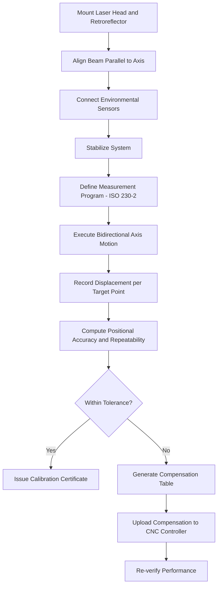

## Laser Calibration of Machine Tool Axes

### Overview

Laser calibration of machine tool axes is a metrology process that uses laser interferometry (and related optical techniques) to measure and correct positional accuracy, geometric errors, and volumetric performance of CNC machine tools, CMMs, and other motion-controlled equipment. It provides traceable, high-precision measurement of linear displacement, angular errors, straightness, squareness, and other geometric deviations far exceeding the resolution achievable with mechanical methods, forming the basis for machine acceptance testing, periodic verification, and error compensation.

### Underlying Principle: Laser Interferometry

Laser calibration systems most commonly use a helium-neon (HeNe) laser interferometer based on the Michelson interferometer principle. A laser beam is split into a reference beam and a measurement beam; the measurement beam reflects off a retroreflector mounted on the machine's moving axis. As the retroreflector moves, the optical path length changes, producing interference fringes that are counted to determine displacement with extremely high resolution.

Displacement is derived from the relationship:

$$D = \frac{N \lambda}{2}$$

where $D$ is the linear displacement, $N$ is the number of interference fringe cycles counted, and $\lambda$ is the laser wavelength. Because $\lambda$ for a stabilized HeNe laser is known to a very high degree of precision (typically referenced to iodine-stabilized or frequency-stabilized standards), this provides a directly traceable length measurement, often to sub-micrometer resolution over travel ranges of many meters.

Modern systems commonly achieve linear accuracy in the range of ±0.5 to ±1 ppm (parts per million) of measured length, though actual performance depends on environmental compensation and specific instrument specification. [Inference: exact accuracy figures vary by manufacturer and model]

### Environmental Compensation

Since the wavelength of light in air is affected by air's refractive index, which varies with temperature, pressure, and humidity, accurate laser calibration requires real-time environmental compensation:

$$\lambda_{air} = \frac{\lambda_{vacuum}}{n}$$

where $n$ is the refractive index of air, calculated using standard formulas (e.g., the Edlén equation) from measured air temperature, barometric pressure, and relative humidity. Most commercial systems include environmental sensor units that automatically feed this data into the compensation calculation in real time during measurement.

Material temperature compensation is also applied for the machine structure and scale, since thermal expansion of the machine itself affects true positional accuracy independent of the optical measurement.

**Key Points**

- Air temperature, pressure, and humidity must be actively monitored and compensated during measurement, not just recorded once at the start
- Material temperature sensors on the workpiece/machine structure allow compensation to a reference temperature (commonly 20°C)
- Vibration, air turbulence, and drafts across the beam path can introduce measurement noise; controlled environmental conditions improve repeatability

### Measured Error Types

#### Linear Positioning Errors

- Deviation between commanded and actual axis position at each measured point along travel
- Measured directly via linear interferometer optics along the axis of motion
- Used to generate positional accuracy and repeatability values per ISO 230-2 or similar standards, and to build compensation tables loaded into the machine controller

#### Straightness Errors

- Deviation of an axis's actual path from a true straight line, in both horizontal and vertical planes
- Measured using straightness interferometer optics (typically a Wollaston prism-based straightness kit) with a reflector traveling along the axis
- Reported as deviation over the travel length, often in µm

#### Angular Errors (Pitch, Yaw, Roll)

- Measured using an angular interferometer optics kit
- **Pitch**: rotation about the axis perpendicular to travel and horizontal
- **Yaw**: rotation about the vertical axis
- **Roll**: rotation about the axis of travel itself
- Small angular errors accumulate into significant positional errors over the length of the machine structure (Abbe error effect)

#### Squareness Errors

- Deviation from 90° between two linear axes
- Measured using an optical square accessory combined with straightness measurement, comparing the actual angle between two axes to true perpendicularity

#### Volumetric/Positional Error Mapping

- Combines linear, straightness, angular, and squareness data across all axes to characterize the full 3D error field of the machine's working volume
- Often synthesized into a volumetric error compensation model loaded into the CNC controller

### Standard Reference Frameworks

- **ISO 230-2**: Determination of accuracy and repeatability of positioning of numerically controlled axes
- **ISO 230-1**: Geometric accuracy of machines operating under no-load or quasi-static conditions
- **ASME B5.54 / B5.57**: methods for performance evaluation of machining centers and CNC machine tools (commonly referenced in North America)
- **VDI/VDE 2617**: guidelines applicable to CMM and machine tool accuracy verification

### Calibration Procedure (General Workflow)

1. Mount the laser head on a stable tripod or fixture aligned with the axis under test; mount the retroreflector on the machine spindle or table
2. Align the laser beam parallel to the axis of travel to minimize cosine error (angular misalignment between beam and travel direction)
3. Connect environmental sensors (air temperature, pressure, humidity, material temperature) and allow the system to stabilize
4. Define the measurement program: target positions, travel range, number of measurement runs (bidirectional, per ISO 230-2 typically requiring multiple approaches from both directions)
5. Execute the machine motion sequence while the laser system records displacement at each commanded target position
6. Repeat for each axis and each error type (linear, straightness, angular, squareness) as required by the calibration scope
7. Analyze results: compute positional accuracy, repeatability, systematic error, and reversal error per applicable standard
8. Generate and, where applicable, upload an error compensation table to the machine controller
9. Issue a calibration certificate referencing traceable standards and measurement uncertainty

### Error Compensation

Once systematic positioning errors are characterized, many CNC controllers support loading a compensation table that adjusts commanded positions to counteract known errors at each point along the axis. This is typically implemented as:

- **Linear (pitch) error compensation**: point-by-point correction values along each axis
- **Backlash compensation**: correction for reversal error when changing direction
- **Volumetric compensation**: advanced multi-axis correction accounting for interactions between axes (available on higher-end controllers)

**Key Points**

- Compensation corrects for *systematic*, repeatable errors — it cannot correct random errors or non-repeatable machine behavior
- Compensation tables should be re-verified periodically, as mechanical wear, thermal drift, and component replacement can shift the error characteristics over time
- Over-reliance on compensation without addressing root mechanical causes (worn ballscrews, loose bearings) can mask developing mechanical problems

### Applications

- New machine tool acceptance testing against manufacturer specifications
- Periodic (preventive maintenance) recalibration per quality system requirements (ISO 9001, IATF 16949, AS9100)
- Diagnosing machine degradation (worn ballscrews, guideway wear, thermal growth issues)
- CMM calibration and verification
- Post-crash or post-repair verification after machine collision or major maintenance
- Research and development of error compensation algorithms for high-precision machining

### Advantages

- Extremely high resolution and long-range traceable accuracy in a single measurement system
- Direct traceability to fundamental physical constants (wavelength of light) via national/international standards
- Capable of measuring multiple error types (linear, angular, straightness, squareness) with one core instrument and interchangeable optics
- Non-contact measurement, avoiding mechanical loading effects
- Data directly usable for generating machine controller compensation tables

### Limitations

- Highly sensitive to environmental conditions (temperature gradients, air currents, vibration); requires careful setup and, ideally, environmental control
- Alignment (minimizing cosine error and beam misalignment) requires skill and careful setup time
- Optical path must remain unobstructed and thermally stable throughout the measurement, which can be challenging on large machines or in production environments
- Equipment cost and required operator expertise are significant compared to simpler gauge-based checks
- Measures machine performance at the time of test; does not account for load-dependent or dynamic (in-process cutting force) effects unless combined with dynamic measurement techniques

### Example

A vertical machining center's X-axis (1000 mm travel) is calibrated per ISO 230-2:

1. The laser head is set up and aligned parallel to the X-axis travel; cosine error is minimized to below a specified threshold
2. Environmental compensation sensors are connected and allowed to stabilize for 15–20 minutes
3. The machine is commanded to move to 20 target positions along the axis, in both forward and reverse directions, with 5 repetitions per position
4. The laser system records actual displacement at each target and computes bidirectional positional accuracy and repeatability
5. Results show a maximum positional deviation of 8 µm and a repeatability of 2 µm, both within the machine's specified tolerance
6. A pitch error compensation table is generated and uploaded to the controller, reducing systematic error to within 3 µm across the travel

### Illustration: Laser Interferometer Setup for Axis Calibration (svg_diagram)

<svg xmlns="http://www.w3.org/2000/svg" viewBox="0 0 720 320" font-family="Arial, sans-serif">
<text x="360" y="24" font-size="16" text-anchor="middle" font-weight="bold">Laser Interferometer Setup for Axis Calibration (svg_diagram)</text>

<rect x="40" y="140" width="90" height="50" fill="#f2d9a8" stroke="#333" />
<text x="85" y="130" font-size="11" text-anchor="middle">Laser Head</text>

<rect x="200" y="150" width="30" height="30" fill="#dcdcdc" stroke="#333" transform="rotate(45 215 165)" />
<text x="215" y="135" font-size="10" text-anchor="middle">Interferometer</text>
<text x="215" y="210" font-size="10" text-anchor="middle">Optic</text>

<line x1="130" y1="165" x2="200" y2="165" stroke="#c0392b" stroke-width="2" />

<line x1="215" y1="150" x2="215" y2="100" stroke="#c0392b" stroke-width="1.5" stroke-dasharray="4,2" />
<text x="215" y="90" font-size="9" text-anchor="middle">Reference path</text>

<line x1="230" y1="165" x2="560" y2="165" stroke="#c0392b" stroke-width="2" />

<rect x="560" y="145" width="40" height="40" fill="#a8c9f2" stroke="#333" />
<text x="580" y="135" font-size="10" text-anchor="middle">Retroreflector</text>

<rect x="500" y="190" width="160" height="20" fill="#cccccc" stroke="#333" />
<text x="580" y="225" font-size="10" text-anchor="middle">Machine Table (X-axis travel)</text>

<line x1="520" y1="240" x2="640" y2="240" stroke="#333" stroke-width="1.5" />
<polygon points="640,240 630,235 630,245" fill="#333" />
<text x="580" y="255" font-size="9" text-anchor="middle">Travel direction</text>

<rect x="300" y="60" width="70" height="30" fill="#e6f0da" stroke="#333" />
<text x="335" y="80" font-size="9" text-anchor="middle">Env. Sensor</text>
<text x="335" y="105" font-size="8" text-anchor="middle" fill="#555">(T, P, RH)</text>

<rect x="40" y="230" width="90" height="45" fill="#dbe9f7" stroke="#333" />
<text x="85" y="255" font-size="10" text-anchor="middle">Analysis PC</text>
</svg>

### Illustration: Laser Calibration and Compensation Workflow

### Best Practices

- Allow adequate thermal stabilization of both the machine and the laser system before beginning measurements (often 30+ minutes depending on environment)
- Minimize cosine error through careful mechanical alignment of the laser beam parallel to the axis of travel
- Perform measurements in as stable an environment as practically achievable — avoid direct sunlight, drafts from HVAC vents, and foot traffic near the beam path during measurement
- Follow bidirectional measurement protocols per ISO 230-2 to properly capture reversal (backlash-related) error
- Maintain traceable calibration of the laser system itself against national metrology standards
- Document all environmental conditions and compensation parameters in the calibration record for full traceability

**Related Topics**

- ISO 230 series standards for machine tool testing
- Ballbar (telescoping magnetic ballbar) testing for circular interpolation accuracy
- Volumetric error mapping and compensation algorithms
- Abbe error and its effect on measurement accuracy
- CMM calibration using laser interferometry
- Thermal error compensation in precision machine tools
- Renishaw XL-80 / XM-60 and API laser system architectures
- Uncertainty budgeting in dimensional metrology (GUM methodology)