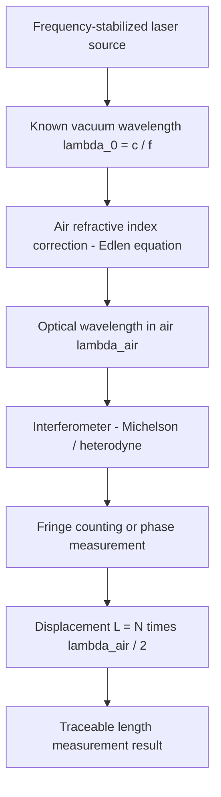

## Frequency Stabilized Lasers as Length References

### Fundamental Principle

The meter is realized in practice through the wavelength of light, since 1983 defined via a fixed value of the speed of light, $c = 299\,792\,458\ \text{m/s}$. A length measurement by interferometry ultimately counts fringes of a laser wavelength, so the accuracy of any interferometric length measurement is bounded by how well the laser's frequency (and hence vacuum wavelength $\lambda_0 = c/f$) is known and controlled. An unstabilized laser diode or HeNe tube drifts in frequency due to thermal expansion of the cavity, mechanical vibration, and gain-medium fluctuations, making it unsuitable as a metrological reference without active stabilization.

The wavelength used in air must further be corrected for the refractive index of air, $n$, via the Edlén equation, since interferometers measure optical path length $L_{opt} = nL$, not geometric length $L$ directly.

### Why Stabilization Is Required

**Key Points**

- A free-running HeNe laser (632.8 nm) has multiple longitudinal cavity modes; without stabilization, mode hopping causes frequency jumps of several hundred MHz to GHz as the cavity thermally expands.
- Relative frequency stability of an unstabilized laser is typically only $10^{-6}$ to $10^{-7}$, corresponding to a length uncertainty of ~1 µm per meter — inadequate for precision dimensional metrology.
- Frequency-stabilized lasers achieve stabilities of $10^{-9}$ to $10^{-11}$ or better, reducing length uncertainty to nanometer levels over meter-scale distances.

### Stabilization Techniques

#### Iodine-Stabilized HeNe Laser (633 nm)

The internationally recommended and most widely deployed length-reference laser. A HeNe laser cavity contains an internal iodine (${}^{127}I_2$) absorption cell. The laser frequency is locked to a hyperfine component of the iodine molecular absorption spectrum near 633 nm.

**Key Points**

- Operating principle: the laser frequency is dithered and locked to the center of a saturated-absorption dip (a Lamb-dip-like feature) in the iodine spectrum using third-harmonic detection.
- CIPM (International Committee for Weights and Measures) has recommended specific hyperfine components (e.g., component "f" or "i") as mise en pratique realizations of the meter.
- Typical reproducibility: relative uncertainty on the order of $2.1 \times 10^{-11}$ (per CIPM 2017 recommended values) [Unverified — exact recommended uncertainty depends on the specific CIPM list revision in force].
- Commercial iodine-stabilized HeNe systems (e.g., from manufacturers historically including Melles Griot, SIOS, and various national metrology institute designs) are the workhorse standard in national metrology institutes (NMIs) and in calibrating interferometers used for gauge block interferometry and machine tool calibration.

#### Frequency-Stabilized Diode Lasers

**Key Points**

- Diode lasers can be locked to atomic/molecular transitions (e.g., rubidium, acetylene, or cesium-related references) using techniques such as saturated absorption spectroscopy or Pound-Drever-Hall (PDH) locking to a high-finesse reference cavity.
- Distributed feedback (DFB) or external-cavity diode lasers (ECDL) offer tunability and compact packaging, useful in fiber-based interferometric systems.
- Locking to a reference cavity alone provides excellent short-term stability but is subject to long-term drift unless the cavity itself is referenced to an atomic transition or a frequency comb.

#### Frequency Comb Referencing

For the highest-accuracy applications, a femtosecond optical frequency comb links the laser frequency directly to a cesium primary frequency standard (or a GPS-disciplined reference), providing absolute frequency traceability with fractional uncertainties approaching $10^{-13}$–$10^{-15}$.

**Key Points**

- A frequency comb consists of a mode-locked laser producing evenly spaced spectral lines (comb teeth) described by $f_n = f_{ceo} + n f_{rep}$, where $f_{ceo}$ is the carrier-envelope offset frequency and $f_{rep}$ is the pulse repetition rate.
- Both $f_{ceo}$ and $f_{rep}$ can be locked to a primary standard, making the comb a "ruler" for optical frequencies.
- Used primarily in NMIs and advanced research labs rather than shop-floor metrology, due to cost and complexity.

### Locking Techniques — Detail

#### Saturated Absorption Spectroscopy

Eliminates Doppler broadening by using counter-propagating pump and probe beams through the absorbing gas cell, isolating a narrow Lamb dip at the exact atomic/molecular transition frequency, independent of the atoms' velocity distribution.

$$\Delta f_{Doppler} \gg \Delta f_{natural}$$

The saturated absorption signal isolates the sub-Doppler natural linewidth, enabling lock points with much higher discrimination than direct absorption.

#### Third-Harmonic Locking (Iodine-Stabilized HeNe)

The laser cavity length (and hence frequency) is dithered sinusoidally at a modulation frequency $f_m$. The resulting fluorescence or transmission signal from the iodine cell is demodulated at $3f_m$ to generate an error signal with a steep, dispersive zero-crossing exactly at the hyperfine component center — this is fed back to a piezoelectric transducer (PZT) controlling cavity length.

#### Pound-Drever-Hall (PDH) Locking

Used for locking to high-finesse reference cavities: the laser is phase-modulated, reflected off the cavity, and the reflected signal is demodulated to generate an error signal proportional to the frequency detuning from cavity resonance, enabling sub-Hz-level stabilization of the laser to the cavity mode.

### System Architecture (svg_diagram)

<svg xmlns="http://www.w3.org/2000/svg" viewBox="0 0 900 460" font-family="Arial, sans-serif">
<text x="450" y="28" font-size="18" font-weight="bold" text-anchor="middle">Iodine-Stabilized HeNe Length Reference (svg_diagram)</text>
<rect x="40" y="70" width="160" height="60" fill="#dbeafe" stroke="#1e3a8a" stroke-width="2" rx="6" />
<text x="120" y="95" font-size="13" text-anchor="middle">HeNe Gain Tube</text>
<text x="120" y="112" font-size="13" text-anchor="middle">(632.8 nm cavity)</text>
<rect x="250" y="70" width="160" height="60" fill="#dcfce7" stroke="#065f46" stroke-width="2" rx="6" />
<text x="330" y="95" font-size="13" text-anchor="middle">Internal Iodine</text>
<text x="330" y="112" font-size="13" text-anchor="middle">Absorption Cell</text>
<rect x="460" y="70" width="160" height="60" fill="#fef3c7" stroke="#92400e" stroke-width="2" rx="6" />
<text x="540" y="95" font-size="13" text-anchor="middle">Output Coupler /</text>
<text x="540" y="112" font-size="13" text-anchor="middle">Beam Splitter</text>
<rect x="670" y="70" width="180" height="60" fill="#ede9fe" stroke="#5b21b6" stroke-width="2" rx="6" />
<text x="760" y="95" font-size="13" text-anchor="middle">Stabilized Output</text>
<text x="760" y="112" font-size="13" text-anchor="middle">Beam (to interferometer)</text>
<line x1="200" y1="100" x2="250" y2="100" stroke="black" stroke-width="2" marker-end="url(#arrow)" />
<line x1="410" y1="100" x2="460" y2="100" stroke="black" stroke-width="2" marker-end="url(#arrow)" />
<line x1="620" y1="100" x2="670" y2="100" stroke="black" stroke-width="2" marker-end="url(#arrow)" />
<rect x="250" y="220" width="160" height="60" fill="#fee2e2" stroke="#991b1b" stroke-width="2" rx="6" />
<text x="330" y="245" font-size="13" text-anchor="middle">Photodetector</text>
<text x="330" y="262" font-size="13" text-anchor="middle">(fluorescence/abs.)</text>
<rect x="250" y="320" width="160" height="60" fill="#e0e7ff" stroke="#3730a3" stroke-width="2" rx="6" />
<text x="330" y="345" font-size="13" text-anchor="middle">3f Lock-in</text>
<text x="330" y="362" font-size="13" text-anchor="middle">Demodulator</text>
<rect x="60" y="320" width="160" height="60" fill="#fce7f3" stroke="#9d174d" stroke-width="2" rx="6" />
<text x="140" y="345" font-size="13" text-anchor="middle">PZT Driver /</text>
<text x="140" y="362" font-size="13" text-anchor="middle">Servo Controller</text>
<line x1="330" y1="130" x2="330" y2="220" stroke="black" stroke-width="2" marker-end="url(#arrow)" />
<line x1="330" y1="280" x2="330" y2="320" stroke="black" stroke-width="2" marker-end="url(#arrow)" />
<line x1="250" y1="350" x2="220" y2="350" stroke="black" stroke-width="2" marker-end="url(#arrow)" />
<line x1="100" y1="320" x2="100" y2="130" stroke="black" stroke-width="2" stroke-dasharray="5,4" marker-end="url(#arrow)" />
<text x="105" y="220" font-size="11" fill="#555">feedback to cavity length</text>

<text x="330" y="410" font-size="12" text-anchor="middle" fill="#333">Dither modulation applied to PZT at f_m; error signal demodulated at 3f_m</text>

</svg>

### Interferometric Length Measurement Chain

### Practical Applications in Precision Metrology

- **Gauge block interferometry**: NMI-grade gauge block calibration uses iodine-stabilized HeNe lasers as the wavelength reference in Kösters-type or Fizeau interferometers to realize sub-10 nm uncertainty length standards.
- **Laser interferometer displacement measurement**: Heterodyne interferometers (e.g., HP/Agilent/Keysight 5528/5529 series, Renishaw XL-80) used for machine tool calibration, coordinate measuring machine (CMM) verification, and semiconductor stage metrology rely on stabilized HeNe or stabilized diode laser sources to maintain sub-ppm axis accuracy over multi-meter travel ranges.
- **Wavelength transfer standards**: Iodine-stabilized lasers serve as transfer standards disseminated from NMIs to accredited calibration laboratories, maintaining an unbroken metrological traceability chain to the SI meter.

### Environmental and Practical Considerations

**Key Points**

- Warm-up time: iodine-stabilized HeNe lasers typically require 20–60 minutes of thermal settling before the lock achieves rated stability, since the iodine cell temperature and cavity length must equilibrate. [Behavior may vary by specific instrument model and ambient conditions.]
- Vibration isolation is required since mechanical disturbance of the cavity or iodine cell perturbs the lock point.
- Air turbulence and refractive index fluctuations along the measurement beam path (not the reference laser itself) are frequently the dominant source of residual uncertainty in shop-floor interferometry, motivating environmental compensation (temperature, pressure, humidity, $CO_2$ sensors feeding an Edlén-equation correction).
- Aging effects: the iodine cell's absorption line intensity and depth can change slowly over years, requiring periodic recalibration against a primary or secondary NMI reference. [Inference based on general behavior of gas absorption cells; exact aging rate is instrument- and cell-specific.]

### Comparative Summary

| Reference Type | Typical Relative Stability | Primary Use Case |
| --- | --- | --- |
| Unstabilized HeNe | $10^{-6}$–$10^{-7}$ | Alignment only, not metrology |
| Iodine-stabilized HeNe (633 nm) | $\sim10^{-11}$–$10^{-12}$ | NMI length standards, gauge block interferometry |
| Cavity-locked diode laser | $10^{-13}$ (short-term), drifts long-term | High-resolution displacement sensing |
| Frequency-comb-referenced laser | $10^{-13}$–$10^{-15}$ | Primary standards, absolute frequency metrology |

**Related Topics**

- Heterodyne vs. homodyne interferometer architectures
- Edlén equation and refractive index compensation for air
- Gauge block interferometry (Kösters and Fizeau configurations)
- Optical frequency comb metrology
- Saturated absorption spectroscopy fundamentals
- Traceability chains from primary frequency standards to dimensional metrology
- Heterodyne displacement interferometers in machine tool calibration