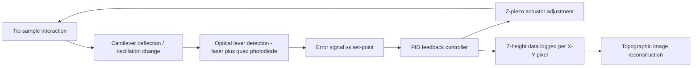

## Scanning Probe Microscopy

### Fundamental Principle

Scanning probe microscopy (SPM) encompasses a family of techniques that image and measure surfaces at nanometer to sub-angstrom resolution by raster-scanning a physical probe (tip) across a sample and recording a tip-sample interaction as a function of lateral position. Unlike optical or electron microscopy, SPM does not rely on wave diffraction limits; resolution is instead determined by tip sharpness, the interaction range of the physical mechanism used, and the precision of the scanning and feedback mechanisms. This makes SPM the primary tool for dimensional nanometrology, including semiconductor critical dimension (CD) measurement, surface roughness characterization, and step-height/line-edge metrology at the nanoscale.

The core SPM architecture consists of: a sharp probe, a scanning mechanism (typically piezoelectric actuators), a feedback loop that maintains a set-point interaction level, and a detection system that converts probe response into an image or dataset.

### Core SPM Techniques

#### Scanning Tunneling Microscopy (STM)

The original SPM technique, developed by Binnig and Rohrer (1981, Nobel Prize 1986). A sharp conducting tip is brought within ~1 nm of a conductive or semiconductive sample; a bias voltage induces a quantum mechanical tunneling current across the vacuum gap.

**Key Points**

- Tunneling current $I$ depends exponentially on tip-sample separation $d$:

$$I \propto V \exp(-2\kappa d)$$

where $\kappa = \sqrt{2m\phi}/\hbar$ and $\phi$ is the effective work function/barrier height.

- This exponential sensitivity gives STM sub-angstrom vertical resolution and atomic lateral resolution on conductive surfaces.
- Requires electrically conductive or semiconductive samples; insulating samples cannot be imaged directly with STM.
- Two primary operating modes: **constant-current mode** (feedback adjusts z-height to hold current constant, producing a topographic map) and **constant-height mode** (tip height fixed, current variation recorded — faster but risks tip crash on rough samples).

#### Atomic Force Microscopy (AFM)

The most widely deployed SPM technique in metrology, capable of imaging conductive and non-conductive samples alike. A cantilever with a sharp tip (radius typically 2–20 nm) interacts with the sample via van der Waals, electrostatic, capillary, and short-range chemical forces. Cantilever deflection is typically measured via a laser beam reflected onto a segmented photodiode (optical lever method).

**Key Points**

- **Contact mode**: tip remains in continuous mechanical contact with the surface; feedback maintains constant cantilever deflection (constant force). Simple and fast but risks tip and sample damage from lateral (shear) forces, especially on soft samples.
- **Tapping mode (intermittent contact / AC mode)**: cantilever is oscillated near its resonance frequency (typically tens to hundreds of kHz); the tip lightly taps the surface once per cycle. Feedback maintains constant oscillation amplitude. Reduces lateral drag forces, making it the standard mode for most dimensional metrology and soft/biological samples.
- **Non-contact mode**: cantilever oscillates above the surface without touching it, sensing long-range attractive forces (van der Waals) via frequency or amplitude shift. Offers minimal sample disturbance but is more sensitive to environmental noise and typically requires ultra-high vacuum (UHV) for atomic resolution.
- Cantilever spring constant $k$ and resonance frequency $f_0$ are selected according to application: soft cantilevers ($k \sim 0.01$–$1$ N/m) for contact mode on delicate samples; stiff cantilevers ($k \sim 20$–$80$ N/m) for tapping mode.

#### Other SPM Variants Relevant to Metrology

- **Lateral Force Microscopy (LFM)**: measures cantilever torsion from friction forces, useful for material contrast mapping.
- **Magnetic Force Microscopy (MFM)**: uses a magnetized tip to map magnetic domain structures via long-range magnetic force gradients, typically in a two-pass "lift mode" (first pass records topography, second pass at constant height above the surface records magnetic interaction).
- **Kelvin Probe Force Microscopy (KPFM)**: maps surface potential/work function by nulling electrostatic force via an applied DC bias.
- **Conductive AFM (C-AFM)**: measures local current through a conductive tip in contact with the sample, used for electrical characterization of semiconductor devices.
- **Critical Dimension AFM (CD-AFM)**: specialized flared/boot-shaped tips capable of imaging reentrant sidewall profiles, essential for semiconductor line-width and sidewall-angle metrology where conventional tips cannot access undercut geometries.

### System Architecture (svg_diagram)

<svg xmlns="http://www.w3.org/2000/svg" viewBox="0 0 900 480" font-family="Arial, sans-serif">
<text x="450" y="28" font-size="18" font-weight="bold" text-anchor="middle">AFM System Architecture (svg_diagram)</text>
<circle cx="200" cy="130" r="6" fill="#111" />
<line x1="200" y1="130" x2="120" y2="200" stroke="#111" stroke-width="3" />
<rect x="90" y="200" width="220" height="14" fill="#93c5fd" stroke="#1e3a8a" stroke-width="1.5" />
<text x="200" y="195" font-size="12" text-anchor="middle">Cantilever</text>
<text x="120" y="225" font-size="12">Tip</text>
<rect x="60" y="330" width="360" height="30" fill="#d1fae5" stroke="#065f46" stroke-width="2" />
<text x="240" y="350" font-size="13" text-anchor="middle">Sample on Piezo Scanner (X-Y-Z)</text>
<line x1="200" y1="130" x2="330" y2="90" stroke="#dc2626" stroke-width="2" marker-end="url(#arrow2)" />
<text x="270" y="80" font-size="12" fill="#dc2626">Laser</text>
<line x1="380" y1="90" x2="500" y2="130" stroke="#dc2626" stroke-width="2" />
<rect x="500" y="110" width="60" height="60" fill="#fef3c7" stroke="#92400e" stroke-width="2" />
<text x="530" y="145" font-size="11" text-anchor="middle">Quad</text>
<text x="530" y="158" font-size="11" text-anchor="middle">Photodiode</text>
<line x1="380" y1="70" x2="330" y2="90" stroke="none" />
<rect x="330" y="60" width="60" height="30" fill="#fecaca" stroke="#991b1b" stroke-width="1.5" transform="rotate(20 360 75)" />
<rect x="620" y="110" width="200" height="60" fill="#ede9fe" stroke="#5b21b6" stroke-width="2" rx="6" />
<text x="720" y="135" font-size="12" text-anchor="middle">Feedback Controller</text>
<text x="720" y="152" font-size="12" text-anchor="middle">(PID loop, set-point)</text>
<line x1="560" y1="140" x2="620" y2="140" stroke="black" stroke-width="2" marker-end="url(#arrow2)" />
<line x1="720" y1="170" x2="720" y2="345" stroke="black" stroke-width="2" />
<line x1="720" y1="345" x2="420" y2="345" stroke="black" stroke-width="2" marker-end="url(#arrow2)" />
<text x="750" y="260" font-size="11" text-anchor="middle" transform="rotate(90 750 260)">Z-piezo drive</text>
<rect x="620" y="380" width="200" height="60" fill="#dbeafe" stroke="#1e3a8a" stroke-width="2" rx="6" />
<text x="720" y="405" font-size="12" text-anchor="middle">Image Reconstruction</text>
<text x="720" y="422" font-size="12" text-anchor="middle">(topography map)</text>
<line x1="720" y1="170" x2="720" y2="380" stroke="black" stroke-width="1.5" stroke-dasharray="4,3" />
</svg>

### Feedback Loop Signal Flow

### Resolution and Metrology Considerations

**Key Points**

- Lateral resolution is limited primarily by **tip radius of curvature** and **tip-sample convolution effects** — the recorded image is a convolution of the true surface topography and the tip geometry, causing feature broadening and inability to resolve steep or reentrant sidewalls with standard conical/pyramidal tips.
- Vertical (Z-axis) resolution can reach sub-angstrom levels, limited mainly by mechanical/thermal noise, piezo creep, and detector noise floor rather than a diffraction-type limit.
- **Piezo scanner nonlinearity, hysteresis, and creep** are major sources of lateral and vertical measurement error; metrology-grade AFMs use closed-loop capacitive or optical position sensors on the scanner stage to linearize and correct piezo response in real time.
- **Tip wear and tip shape characterization** are critical for quantitative metrology; tip-width artifacts are commonly characterized and deconvolved using calibrated tip-characterizer samples (e.g., sharp-edge or spike gratings) combined with blind tip-estimation algorithms.
- Traceability: metrology AFMs are calibrated against certified pitch/step-height standards traceable to the SI meter (often via laser interferometric displacement sensors integrated into the scan stage), enabling their use as reference instruments for semiconductor CD-SEM cross-calibration.

### Applications in Semiconductor and Nanometrology

- **Critical dimension (CD) metrology**: CD-AFM measures line width, sidewall angle, and line-edge roughness (LER) of lithographically patterned features on wafers, complementing CD-SEM with true 3D profile data.
- **Surface roughness characterization** ($R_a$, $R_q$, power spectral density) for polished optics, hard disk media, and MEMS surfaces.
- **Step-height and film-thickness verification** for thin-film deposition process control.
- **Overlay and pattern-defect metrology** in advanced semiconductor nodes, where SEM-based methods face resolution or charging limitations.
- **Reference metrology / instrument cross-calibration**: SPM serves as a ground-truth reference for calibrating faster inline metrology tools (scatterometry, CD-SEM) due to its direct, traceable topographic measurement.

### Comparative Summary

| Technique | Sample Requirement | Typical Lateral Resolution | Typical Application |
| --- | --- | --- | --- |
| STM | Conductive/semiconductive | Atomic (~0.1 nm) | Surface science, atomic-scale defect imaging |
| AFM (tapping mode) | Any (conductive or insulating) | 1–10 nm (tip-limited) | General dimensional/roughness metrology |
| CD-AFM | Any, patterned structures | Sidewall/undercut capable | Semiconductor line-width & sidewall metrology |
| MFM | Magnetic samples | 20–50 nm | Magnetic domain/data storage media imaging |
| KPFM | Conductive/semiconductive | 10–50 nm | Work function / surface potential mapping |

### Environmental and Practical Considerations

**Key Points**

- Vibration isolation (active or passive) is essential, since mechanical noise at the nanometer scale directly corrupts topographic data; metrology-grade systems are typically installed on isolated foundations or active vibration-cancellation platforms.
- Acoustic and thermal drift management: thermal expansion of the cantilever holder, scanner, and sample stage can produce drift on the order of nm/min, requiring thermal equilibration and, in high-precision systems, closed-loop drift correction.
- Tip contamination and wear necessitate periodic tip replacement/characterization; tip life varies with scan mode, sample hardness, and scan parameters. [Behavior may vary significantly by tip material, coating, and application.]
- Scan speed vs. resolution trade-off: higher scan speeds reduce throughput time but increase tracking error in the feedback loop, particularly over steep topographic features.

**Related Topics**

- Piezoelectric actuator calibration and closed-loop metrology scanners
- CD-SEM vs. CD-AFM cross-correlation methods
- Tip characterization and blind tip reconstruction algorithms
- Surface roughness parameters ($R_a$, $R_q$, $R_z$) and power spectral density analysis
- Traceable displacement metrology using laser interferometric scan stages
- Line-edge roughness (LER) and line-width roughness (LWR) measurement in lithography