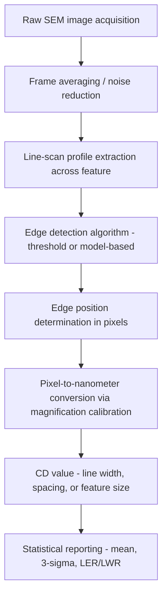

## Scanning Electron Microscopy for Dimensional Metrology

### Fundamental Principle

Scanning electron microscopy (SEM) forms images by rastering a focused electron beam across a sample surface and detecting signals generated by electron-sample interactions — primarily secondary electrons (SE) and backscattered electrons (BSE). Because electron wavelengths at typical accelerating voltages (1–30 kV) are orders of magnitude smaller than visible light wavelengths, SEM achieves lateral resolution down to ~1 nm, far surpassing optical microscopy's diffraction limit. In dimensional metrology, SEM is adapted into **CD-SEM (Critical Dimension SEM)**, a specialized instrument class optimized for accurate, repeatable, low-damage measurement of nanoscale feature dimensions rather than general-purpose imaging.

### Electron-Sample Interaction and Signal Generation

**Key Points**

- The primary electron beam penetrates the sample and generates an interaction volume shaped like a teardrop or hemisphere, with size dependent on beam energy, sample atomic number, and density.
- **Secondary electrons (SE)**: low-energy electrons (<50 eV) ejected from near-surface atoms; escape depth is only a few nanometers, making SE the primary signal for high-resolution topographic/edge imaging used in CD measurement.
- **Backscattered electrons (BSE)**: high-energy electrons elastically scattered back from deeper in the interaction volume; signal intensity depends strongly on atomic number ($Z$-contrast), useful for material/compositional contrast but with lower spatial resolution than SE for edge detection.
- Edge brightening effect: at sidewalls and edges, increased SE escape probability produces characteristic bright edge signals in the SE image, which CD-SEM algorithms exploit to precisely locate feature boundaries.

### CD-SEM System Architecture

#### Electron Optics Column

- **Electron source**: thermal field emission (TFE) or cold field emission (CFE) guns are standard in CD-SEM due to their small virtual source size and high brightness, enabling sub-nanometer probe diameters at low landing energies.
- **Condenser and objective lenses**: electromagnetic lenses demagnify and focus the beam to a fine probe spot on the sample; beam current and spot size are traded off against each other and against noise/throughput requirements.
- **Low-voltage operation**: CD-SEM typically operates at low landing energies (300 eV – 1 kV) to minimize beam penetration depth and reduce charging and sample damage on sensitive photoresist and low-$k$ dielectric materials — a key distinction from general-purpose SEM, which often runs at higher voltages (5–30 kV) for better SE yield and depth of field.

#### Detection and Signal Processing

- In-lens or through-the-lens (TTL) detectors improve SE collection efficiency at low voltage, where conventional Everhart-Thornley detectors (positioned off-axis) become less effective.
- Multiple detector configurations (upper/lower, or multi-segment) can be combined to enhance edge contrast and reduce measurement noise.

### CD Measurement Algorithm Pipeline

**Key Points**

- **Threshold-based edge detection**: locates the edge at a fixed percentage (e.g., 50%) of the peak-to-baseline signal intensity in the line-scan profile — simple but sensitive to noise and profile shape assumptions.
- **Model-based library (MBL) methods**: fit the measured SE signal profile to a physics-based model of electron scattering from an assumed sidewall geometry, improving accuracy for non-ideal (sloped, rounded) sidewall profiles compared to simple threshold methods.
- Multiple line scans are typically averaged across a feature (or across repeated measurements) to reduce the impact of line-edge roughness (LER) and random noise on the reported CD value.

### Magnification Calibration and Traceability

**Key Points**

- CD-SEM magnification/pixel size must be calibrated against certified reference materials — pitch standards or linewidth standards traceable to the SI meter, often themselves calibrated using SPM (AFM) or optical/X-ray interferometric methods.
- Magnification calibration drift (from electron optics instability, stage inaccuracy, or lens hysteresis) is a dominant source of systematic CD measurement error and requires periodic recalibration against reference standards.
- Because CD-SEM measures a 2D projected top-down image, it inherently reports an apparent line width that can differ from the true cross-sectional width, particularly for sloped or reentrant sidewalls — a key limitation addressed by cross-referencing with CD-AFM or destructive cross-section TEM measurements.

### Sources of Measurement Uncertainty

**Key Points**

- **Charging effects**: insulating or poorly grounded samples (e.g., photoresist on some substrates) accumulate charge under the electron beam, distorting the image and shifting apparent edge positions; mitigated by low landing voltage, charge-neutralization techniques, or conductive coatings (though coatings add thickness that itself introduces measurement bias).
- **Electron beam-induced sample damage/shrinkage**: photoresist features can shrink measurably under repeated electron beam exposure during measurement, requiring dose-controlled imaging protocols and minimizing frame averaging where shrinkage sensitivity is high. [Behavior may vary by resist chemistry and beam dose; exact shrinkage rates are process-dependent.]
- **Edge model bias**: threshold-based algorithms can introduce systematic bias depending on true sidewall angle and roughness, since the assumed edge model may not match actual profile shape.
- **Pattern placement/stage accuracy**: for overlay and placement metrology, stage positioning repeatability contributes directly to measurement uncertainty independent of the imaging resolution itself.
- **Vibration and electromagnetic interference**: as with all high-resolution electron-optical instruments, external vibration and stray EM fields perturb beam position and blur the image at the nanometer scale.

### Comparison with Other Dimensional Metrology Techniques

| Technique | Measurement Type | Typical Resolution | Key Limitation |
| --- | --- | --- | --- |
| CD-SEM | 2D top-down projected width | ~1 nm repeatability | Cannot directly resolve sidewall angle/undercut |
| CD-AFM | True 3D profile (with flared tips) | Sub-nm vertical, tip-limited lateral | Slower throughput than CD-SEM |
| Optical scatterometry (OCD) | Model-fit to diffraction signature | Model-dependent, indirect | Requires accurate optical/geometric model |
| Cross-section TEM | Direct cross-sectional profile | Sub-nm | Destructive, low throughput |

### Applications in Semiconductor Metrology

- **Inline process control**: CD-SEM is the workhorse inline metrology tool in semiconductor fabs for monitoring lithography and etch process critical dimensions across production wafers at high throughput.
- **Overlay metrology**: measuring misregistration between successive lithographic layers.
- **Defect review**: high-resolution imaging of defects identified by inspection tools, often combined with energy-dispersive X-ray spectroscopy (EDS) for compositional analysis.
- **Process window characterization**: statistical CD data across wafer maps and lots feeds into process capability (Cpk) analysis and lithography/etch process tuning.

### Practical Considerations

**Key Points**

- Throughput vs. accuracy trade-off: higher frame averaging and multiple line-scan measurements improve precision but reduce wafer throughput, a critical factor in high-volume manufacturing metrology.
- Sample preparation: minimal for CD-SEM compared to TEM (no cross-sectioning required for standard top-down CD measurement), which is a major advantage for non-destructive inline use.
- Environmental requirements: vacuum chamber operation, vibration isolation, and magnetic field shielding are standard requirements for maintaining sub-nanometer beam stability.

**Next Steps**

- Model-based library (MBL) fitting techniques for sidewall profile reconstruction
- Optical critical dimension (OCD) scatterometry and its complementary role to CD-SEM
- Cross-section TEM sample preparation via focused ion beam (FIB) milling
- Statistical process control (SPC) methods for semiconductor CD data (Cpk, 3-sigma control limits)
- Overlay metrology techniques and registration error budgets
- Electron beam-induced contamination and shrinkage mitigation strategies