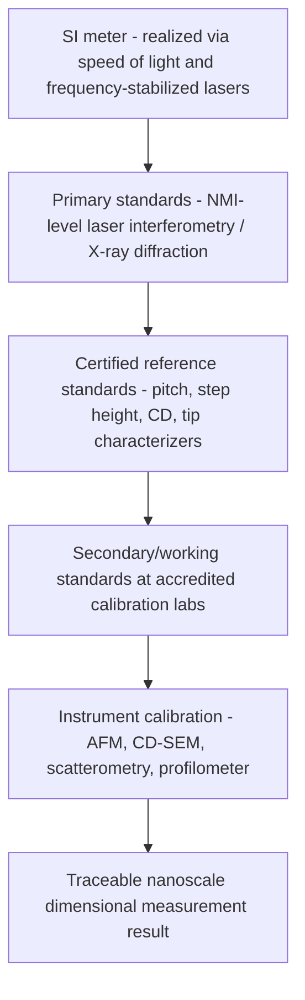

## Nanoscale Calibration Standards

### Fundamental Principle

Nanoscale calibration standards are physical artifacts with precisely known, certified dimensional or structural properties, used to establish measurement traceability for instruments operating at the nanometer scale — including SPM (AFM/STM), CD-SEM, optical scatterometry, and X-ray-based techniques. Because nanoscale instruments cannot rely on the direct fringe-counting traceability of macroscopic laser interferometry alone (tip convolution, electron beam interaction volume, and diffraction effects all introduce instrument-specific systematic errors), calibration standards serve as the critical link connecting a given measurement to the SI meter through an unbroken, documented chain of comparisons, each with a stated uncertainty.

### Categories of Nanoscale Standards

#### Pitch (Grating) Standards

Periodic line/space gratings with a certified, highly uniform pitch (period), used primarily to calibrate the lateral magnification and linearity of SEM, AFM, and optical instruments.

**Key Points**

- Fabricated typically via electron-beam lithography on silicon, providing high pattern fidelity and long-term dimensional stability.
- Certified pitch values are traceable via calibration against a primary standard, ultimately linked to laser interferometry or X-ray diffraction methods.
- Because pitch is a *periodic* quantity averaged over many repeat features, pitch standards achieve very low relative uncertainty (often sub-nm on multi-micrometer pitches) since random errors average out over many periods.
- Used to correct magnification calibration and linearity/distortion errors across the field of view of SEM and AFM scanners.

#### Step Height Standards

Certified vertical step features (typically ranging from sub-nanometer to several micrometers), used to calibrate the Z-axis (vertical) response of AFM, stylus profilometers, and white-light interferometers.

**Key Points**

- Common substrates include silicon with certified oxide or metal step features, or bonded/etched silicon step artifacts.
- Step height standards address Z-axis nonlinearity and piezo scanner calibration in AFM, which is often the dominant source of vertical measurement error if uncorrected.
- Typical certified uncertainties for high-quality step standards can reach the sub-nanometer level for steps in the 10–100 nm range. [Unverified — exact uncertainty depends on specific certificate and calibration laboratory.]

#### Linewidth / Critical Dimension (CD) Standards

Certified reference features with known line width, used specifically to calibrate CD-SEM and CD-AFM measurement accuracy (as distinct from pitch, which calibrates spacing periodicity rather than absolute width).

**Key Points**

- CD reference values are often established via a combination of cross-sectional TEM measurement (destructive, ground-truth) and CD-AFM, since CD-SEM itself cannot serve as its own primary reference due to edge-model-dependent bias.
- Sidewall angle and edge roughness of the reference feature must also be characterized, since these affect how different instruments interpret "linewidth" differently (top-width vs. bottom-width vs. mid-height width).

#### Tip Characterizers

Specialized structures — often sharp spikes, ridges, or trenches with well-known, extremely small radius of curvature or steep/reentrant geometry — used not to calibrate the sample stage, but to characterize the **probe tip itself** in AFM.

**Key Points**

- Used in blind tip reconstruction algorithms, where scanning a tip characterizer with known geometry allows mathematical deconvolution of the tip shape from subsequent measurements on unknown samples.
- Critical for CD-AFM, where flared/boot-shaped tips used to image reentrant sidewalls must have their exact geometry known and periodically re-verified as they wear.

#### Reference Materials for Force and Property Calibration

Beyond pure dimensional standards, certain nanoscale reference materials support calibration of AFM cantilever spring constant, force sensitivity, and other non-topographic quantities (e.g., calibrated reference cantilevers, elastic modulus reference samples), which matter for quantitative nanomechanical AFM modes.

### Traceability Chain

### Fabrication Methods for Standards

**Key Points**

- **Electron-beam lithography (EBL)**: direct-write patterning offering high resolution and flexibility for custom pitch/linewidth designs; widely used for research-grade and NMI reference standards.
- **X-ray lithography and interferometric lithography**: used for extremely high-uniformity periodic gratings where pattern fidelity over large areas is paramount.
- **Crystal lattice-based standards**: highly oriented pyrolytic graphite (HOPG) and cleaved crystal surfaces provide atomically defined periodicities usable as ultra-fine lateral calibration references at the sub-nanometer scale, since the crystal lattice constant is a fixed physical constant.
- **Self-assembled or epitaxial structures**: in some cases, naturally forming periodic structures (e.g., certain epitaxial superlattices) provide well-defined periodicities for specialized calibration needs. [Inference — less commonly used for mainstream commercial calibration compared to lithographically fabricated standards.]

### Uncertainty Budget Considerations

**Key Points**

- Total measurement uncertainty when using a nanoscale standard combines: (1) the certified uncertainty of the standard itself, (2) instrument repeatability/reproducibility, (3) environmental contributions (thermal drift, vibration), and (4) algorithm-dependent bias (e.g., edge detection threshold choice).
- Standards degrade over time due to contamination, oxidation, mechanical wear (especially tip characterizers), or handling damage — necessitating recertification intervals defined by the issuing calibration laboratory or NMI.
- Cross-validation between independent techniques (e.g., verifying a CD standard via both CD-AFM and cross-sectional TEM) strengthens confidence in the assigned reference value and helps identify technique-specific systematic biases.

### Reference Standard Providers

**Key Points**

- National Metrology Institutes (NMIs) — such as NIST (USA), PTB (Germany), NPL (UK), and NMIJ (Japan) — develop and certify primary-level nanoscale standards and disseminate them through calibration services.
- Standard Reference Materials (SRMs), such as those issued by NIST, provide commercially available certified nanoscale pitch and step-height artifacts for industrial and research calibration use.
- Accredited secondary calibration laboratories provide working-level standards calibrated against NMI primary references, extending traceability access to production and R&D facilities at lower cost and turnaround time than direct NMI calibration.

### Applications Summary

| Standard Type | Calibrates | Typical Instrument |
| --- | --- | --- |
| Pitch (grating) standard | Lateral magnification, distortion | SEM, AFM, optical scatterometry |
| Step height standard | Z-axis (vertical) scale | AFM, profilometer, interferometric microscope |
| CD/linewidth standard | Absolute width measurement accuracy | CD-SEM, CD-AFM |
| Tip characterizer | Probe tip geometry | AFM (especially CD-AFM) |
| Crystal lattice reference | Sub-nm lateral scale, atomic resolution verification | STM, high-resolution AFM |

### Practical Considerations

**Key Points**

- Handling protocols (cleanroom storage, controlled environment, contamination avoidance) are essential to preserving the certified state of nanoscale standards between uses.
- Selection of an appropriate standard must match the feature scale, geometry, and material relevant to the actual measurement task — using a standard with mismatched pitch or aspect ratio relative to production features can leave calibration gaps uncorrected.
- Recalibration intervals should be established based on usage frequency, handling risk, and the criticality of the measurements relying on the standard.

**Related Topics**

- Blind tip reconstruction and tip deconvolution algorithms
- NIST Standard Reference Materials (SRM) program for nanometrology
- Uncertainty budget construction (GUM methodology) for nanoscale measurements
- Cross-sectional TEM as a ground-truth reference technique
- Electron-beam lithography for reference artifact fabrication
- Atomic lattice constants as intrinsic calibration references in STM