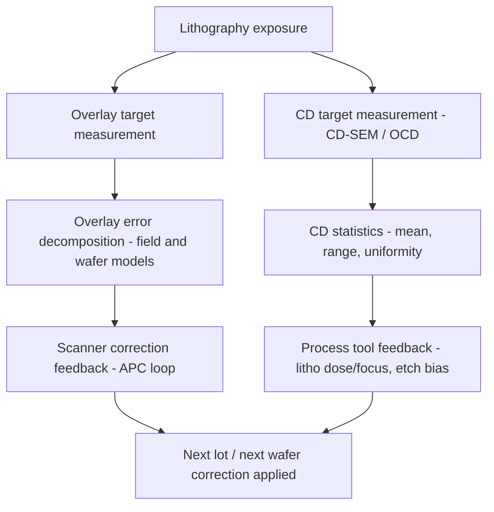

## Semiconductor Overlay and Critical Dimension Metrology

### Fundamental Principle

Overlay and critical dimension (CD) metrology together form the core dimensional control discipline of semiconductor manufacturing. **Overlay metrology** quantifies the placement error (misregistration) between successive patterned layers on a wafer, ensuring that features from different lithography steps align within the tolerance required for device function (e.g., a contact via must land correctly within an underlying metal line). **CD metrology** quantifies the size of individual patterned features — line width, spacing, hole diameter — to ensure they meet the target dimension within process specification. Both are essential feedback mechanisms in the lithography-etch process loop and are measured at high volume throughout wafer fabrication to maintain yield.

As device nodes have shrunk into the single-digit-nanometer regime, tolerance budgets for both overlay and CD have shrunk correspondingly, driving continuous evolution of measurement techniques, targets, and algorithms.

### Overlay Metrology

#### Target-Based (Imaging) Overlay

**Key Points**

- Uses dedicated overlay targets — typically nested box-in-box, frame-in-frame, or advanced imaging metrology (AIM) target designs — printed alongside device features in each lithography layer.
- An optical microscope images the target, and image-processing algorithms locate the centroid of features from each layer; overlay error is the vector displacement between centroids.
- Target design must balance printability (must resolve reliably at each layer's process window) against measurement precision; asymmetric target degradation (e.g., from etch or CMP processes) can bias the measured overlay value away from the true device-level misregistration — a phenomenon termed **target-device offset**.

#### Diffraction-Based Overlay (DBO) / Scatterometry Overlay

**Key Points**

- Uses periodic grating targets on two (or more) layers; a broadband or spectroscopic light source illuminates the target, and the diffraction spectrum (intensity vs. wavelength, and/or vs. angle) is analyzed.
- Overlay-induced asymmetry in the diffracted spectrum between +1 and −1 diffraction orders is directly related to the overlay offset, providing a signal less susceptible to certain optical aberration effects than image-based methods.
- Generally offers better precision and is less sensitive to some process-induced target asymmetries compared to imaging overlay, though it requires careful target design and modeling to avoid its own asymmetry-related biases.

#### Overlay Error Decomposition

Overlay error across a wafer is typically decomposed into a polynomial model of systematic field-level and wafer-level components (translation, rotation, magnification, and higher-order terms), enabling scanner correction algorithms to compensate for systematic contributions while leaving random/residual error as the limiting factor.

$$\Delta x, \Delta y = f(x, y; \text{translation, rotation, scaling, higher-order terms})$$

### Critical Dimension (CD) Metrology

#### CD-SEM

The primary high-throughput inline CD measurement technique; covered in detail separately (see related chapter item). Measures line width via top-down secondary-electron imaging and edge-detection algorithms.

#### Optical Critical Dimension (OCD) Scatterometry

**Key Points**

- A model-based technique: broadband or spectroscopic ellipsometric/reflectometric light is directed at a periodic test structure, and the resulting diffraction/reflection signature is fit against a library or regression model of candidate profile shapes (width, height, sidewall angle, sometimes multiple layers) using rigorous coupled-wave analysis (RCWA) or similar electromagnetic simulation.
- Non-destructive, fast, and capable of extracting full 3D profile information (not just top-down width) in a single measurement — a key advantage over CD-SEM for complex 3D structures (e.g., FinFET fins, gate stacks).
- Accuracy is fundamentally model-dependent: an incorrect or oversimplified geometric/optical model can produce confident but inaccurate results, requiring careful model validation against reference techniques (CD-AFM, cross-sectional TEM).

#### CD-AFM

Provides true 3D sidewall profile measurement using specialized flared tips; serves as a key reference/calibration technique for validating OCD models and CD-SEM measurements (see related chapter item for full detail).

### Metrology Data Flow in Process Control

### Advanced Process Control (APC) Integration

**Key Points**

- Overlay and CD measurements feed real-time or lot-to-lot **Advanced Process Control (APC)** systems that automatically adjust scanner exposure corrections (dose, focus, alignment models) and etch/deposition process parameters to compensate for observed drift.
- **Run-to-run control** algorithms use measured overlay/CD data from completed wafers/lots to predict and pre-compensate settings for subsequent wafers, reducing systematic error propagation.
- Sampling strategy (how many dies/fields per wafer, and how many wafers per lot are measured) is a critical trade-off between measurement throughput cost and process control granularity.

### Sources of Measurement Uncertainty

**Key Points**

- **Target-device offset** in overlay: metrology targets may not perfectly represent the actual device pattern's printing/etch behavior, introducing systematic bias between measured and true device-level overlay.
- **Tool-induced shift (TIS)**: asymmetries in the metrology tool's own optical path can introduce apparent overlay error independent of the actual wafer; commonly characterized and corrected via 0°/180° wafer rotation measurements that average out tool-symmetric bias.
- **Model bias in OCD**: incorrect profile or material optical constant assumptions bias extracted CD/profile values; mitigated through machine-learning-assisted or hybrid metrology approaches that combine OCD with reference CD-SEM/AFM data.
- **Pattern-dependent effects**: CD and overlay can vary systematically with local pattern density and proximity effects from lithography and etch loading, requiring dense on-product sampling rather than reliance on scribe-line targets alone in advanced nodes.

### Hybrid and Machine-Learning-Enhanced Metrology

**Key Points**

- **Hybrid metrology** combines data from multiple techniques (e.g., OCD + CD-SEM, or OCD + X-ray) to improve overall measurement accuracy beyond what any single technique achieves alone, by using one technique to constrain or validate the model of another.
- Machine learning / regression-based OCD analysis has increasingly supplemented or replaced traditional library-based fitting, enabling faster and more robust profile extraction, particularly for complex 3D device structures. [Inference — specific ML architectures and deployment details are vendor- and fab-specific and evolve rapidly; general trend is well documented industry-wide.]

### Comparative Summary

| Technique | Measures | Throughput | Key Strength | Key Limitation |
| --- | --- | --- | --- | --- |
| Imaging overlay | Layer-to-layer placement | High | Direct, intuitive target imaging | Sensitive to target asymmetry |
| Diffraction-based overlay (DBO) | Layer-to-layer placement | High | Better precision, less optical-aberration sensitivity | Requires careful target/model design |
| CD-SEM | Top-down line width | High | Fast, widely deployed, direct image | 2D projection only, no sidewall detail |
| OCD scatterometry | Full 3D profile (model-based) | High | Non-destructive 3D info, fast | Accuracy depends on model validity |
| CD-AFM | True 3D profile | Low-moderate | Ground-truth sidewall/undercut capability | Slower, tip wear sensitivity |

### Practical Considerations

**Key Points**

- Target/structure design (overlay marks, OCD gratings) must be co-optimized with device design rules and process integration teams to ensure representativeness without excessive area overhead.
- Metrology tool matching (chamber-to-chamber, fab-to-fab) is essential in high-volume manufacturing, since systematic offsets between nominally identical tools can otherwise appear as false process drift.
- Total measurement uncertainty (per international metrology guidelines) must be budgeted against the shrinking process tolerance windows at advanced nodes, often requiring measurement uncertainty to be a small fraction (e.g., ~10%) of the total process tolerance.

**Next Steps**

- Diffraction-based overlay (DBO) target design and asymmetry correction
- Rigorous coupled-wave analysis (RCWA) fundamentals for OCD modeling
- Advanced process control (APC) run-to-run correction algorithms
- Hybrid metrology data fusion techniques
- Tool-induced shift (TIS) characterization and correction methods
- FinFET and gate-all-around (GAA) 3D structure metrology challenges