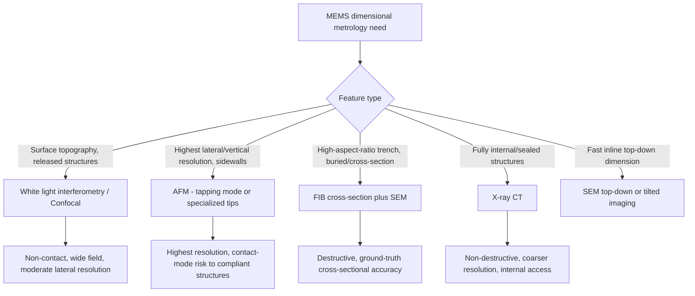

## Dimensional Metrology of Microelectromechanical Systems

### Fundamental Principle

Microelectromechanical systems (MEMS) combine mechanical structures — cantilevers, membranes, gears, resonators, comb-drive actuators — with electronic circuitry at the micro- and nanoscale. Unlike planar semiconductor logic devices, MEMS structures are frequently three-dimensional, released (freestanding/suspended), and mechanically functional, meaning their dimensional metrology must characterize not only lateral and vertical feature dimensions but also out-of-plane geometry, surface topography, sidewall profile, and in some cases dynamic mechanical response. This combination of requirements makes MEMS dimensional metrology a distinct discipline that draws on techniques from both semiconductor CD metrology and macroscale precision engineering, adapted for high-aspect-ratio, released, and often fragile structures.

### Key Measurement Challenges Specific to MEMS

**Key Points**

- **High aspect ratio structures**: many MEMS features (deep trenches, comb fingers, through-silicon vias) have depth-to-width ratios far exceeding typical planar semiconductor features, challenging optical and electron-beam techniques that rely on line-of-sight access to the feature bottom.
- **Released/suspended structures**: freestanding membranes, cantilevers, and bridges can deflect under probe contact force (in stylus or AFM contact-mode measurement), under electron beam charging, or under their own residual stress, complicating measurement without disturbing the structure being measured.
- **Sidewall angle and etch profile**: MEMS fabrication (notably deep reactive ion etching, DRIE) produces sidewall profiles (including characteristic scalloping from the Bosch process) that must be characterized as part of dimensional qualification, not merely top-down width.
- **Stress-induced deformation**: residual stress from thin-film deposition can cause out-of-plane bowing or curling of released structures, meaning the "as-designed" flat geometry may differ substantially from the "as-fabricated, as-released" geometry — a metrology target in itself for MEMS reliability.
- **Surface roughness at sidewalls and floors**: DRIE and other etch processes produce roughness that affects both mechanical (stiction, friction) and optical (if applicable) MEMS performance, requiring dedicated roughness characterization beyond simple dimensional measurement.

### Primary Measurement Techniques

#### White Light Interferometry (WLI) / Coherence Scanning Interferometry (CSI)

**Key Points**

- Non-contact optical technique using a broadband light source and a reference mirror in a Michelson- or Mirau-type interferometer objective; vertical scanning produces an interferogram whose peak coherence position at each pixel yields surface height.
- Widely used for MEMS surface topography, step height, and roughness measurement due to its non-contact nature (avoiding damage to fragile released structures) and relatively fast, wide-field acquisition compared to point-by-point techniques.
- Vertical resolution can reach sub-nanometer levels; lateral resolution is diffraction-limited (typically several hundred nanometers), making WLI complementary to rather than a replacement for SPM on the finest lateral features.
- Struggles with steep sidewalls (beyond the objective's numerical-aperture-limited detectable slope angle) and with transparent or highly reflective/specular thin films that produce interference artifacts.

#### Confocal Microscopy

- Point-scanning optical technique using a pinhole to reject out-of-focus light, providing optical sectioning capability; used for 3D surface profiling of MEMS structures with moderate aspect ratios, offering good performance on steeper slopes than conventional WLI in some configurations.

#### Atomic Force Microscopy (AFM)

- Provides the highest-resolution topographic and sidewall data for MEMS, particularly with specialized high-aspect-ratio or flared tips analogous to CD-AFM in semiconductor metrology (see related chapter item), though contact-mode measurement risks deflecting compliant released structures — tapping or non-contact modes are generally preferred for delicate MEMS elements.

#### Scanning Electron Microscopy (SEM) / Focused Ion Beam (FIB) Cross-Sectioning

**Key Points**

- SEM provides high-resolution top-down and tilted-view imaging of MEMS structures, useful for qualitative inspection and semi-quantitative dimensional estimation, particularly for high-aspect-ratio trench and sidewall profile assessment via tilted or cross-sectional imaging.
- FIB cross-sectioning enables direct, destructive cross-sectional dimensional measurement of buried or high-aspect-ratio features (trench depth, sidewall angle, undercut) with SEM-level resolution, serving as a ground-truth reference technique analogous to its role in semiconductor CD metrology.
- Charging effects are a particular concern for released, electrically floating MEMS structures under electron beam imaging, often requiring conductive coating or careful voltage/current control.

#### X-ray Computed Tomography (X-ray CT / Micro-CT)

**Key Points**

- Non-destructive 3D imaging technique using X-ray attenuation contrast reconstructed via computed tomography algorithms (typically filtered back-projection or iterative reconstruction) from projections acquired at many rotation angles.
- Uniquely capable of imaging fully internal/buried MEMS structures (e.g., sealed cavities, wafer-bonded devices) without destructive cross-sectioning, a significant advantage for packaged or hermetically sealed MEMS.
- Resolution (typically hundreds of nanometers to a few micrometers for lab-based systems, better for synchrotron sources) is generally coarser than SEM or AFM, positioning X-ray CT as complementary for internal/buried features rather than a replacement for surface-sensitive high-resolution techniques.

#### Stylus Profilometry

- Contact technique using a fine diamond stylus dragged across the surface under controlled force; provides accurate step-height and surface profile data but the contact force and stylus tip radius limit applicability on fragile or high-aspect-ratio released MEMS structures.

### Measurement Technique Selection Framework

### Dynamic and Functional Metrology Considerations

**Key Points**

- Beyond static dimensional measurement, many MEMS require characterization of dynamic behavior — resonant frequency, quality factor, deflection under applied voltage/pressure — measured via techniques such as laser Doppler vibrometry (LDV), which uses the Doppler shift of light reflected from a vibrating surface to measure velocity/displacement with sub-nanometer sensitivity at MHz-range bandwidths.
- Stroboscopic interferometry combines white-light interferometry with synchronized strobed illumination to capture out-of-plane displacement of MEMS structures at specific phases of their operational cycle, enabling 3D dynamic deformation mapping.
- These functional/dynamic measurements complement static dimensional metrology by verifying that the as-fabricated geometry produces the intended mechanical/electromechanical performance.

### Traceability and Standards Considerations

**Key Points**

- MEMS-specific calibration standards are less standardized industry-wide compared to semiconductor CD/pitch standards, and many MEMS metrology labs rely on adapting semiconductor nanoscale standards (pitch, step height — see related chapter item) or developing custom reference artifacts matched to specific process geometries.
- Traceability for high-aspect-ratio and 3D measurements often requires cross-validation between techniques (e.g., X-ray CT results verified against destructive FIB cross-section on a sacrificial sample) due to the lack of a single universally applicable primary reference method for complex 3D MEMS geometries.
- ASTM and SEMI standards exist for select MEMS test methods (e.g., resonant frequency measurement, residual stress test structures), providing partial standardization of measurement procedures even where a fully traceable dimensional reference chain is less mature than in planar semiconductor metrology. [Unverified — specific standard numbers and scope should be confirmed against current ASTM/SEMI publications for the exact MEMS application in question.]

### Comparative Summary

| Technique | Contact/Non-contact | Best For | Key Limitation |
| --- | --- | --- | --- |
| White light interferometry | Non-contact | Surface topography, step height, roughness | Diffraction-limited lateral res.; steep slope limits |
| AFM | Contact/tapping (non-contact optional) | Highest-resolution topography, sidewalls | Slow; contact risk on compliant structures |
| SEM / FIB cross-section | Non-contact imaging / destructive sectioning | High-aspect-ratio, buried feature ground truth | Destructive (FIB); charging on floating structures |
| X-ray CT | Non-contact | Internal/sealed structures, full 3D | Coarser resolution than SEM/AFM |
| Laser Doppler vibrometry | Non-contact | Dynamic/resonant behavior | Not a static dimensional technique |

### Practical Considerations

**Key Points**

- Handling and mounting of MEMS samples for metrology must avoid mechanical shock or electrostatic discharge that could damage released, compliant structures.
- Measurement technique selection typically requires combining multiple complementary methods (e.g., WLI for wafer-scale topography survey plus AFM for critical sidewall detail plus periodic FIB cross-section verification) rather than relying on a single universal technique, given the geometric diversity of MEMS designs.
- Environmental control (vibration isolation, thermal stability) remains essential across all high-resolution techniques applied to MEMS, consistent with general nanometrology practice.

**Related Topics**

- Deep reactive ion etching (DRIE) and Bosch process sidewall scalloping characterization
- Laser Doppler vibrometry for MEMS resonator characterization
- Residual stress measurement in thin-film MEMS structures
- X-ray computed tomography reconstruction algorithms
- FIB cross-sectioning sample preparation techniques
- Stiction and surface roughness effects on MEMS reliability