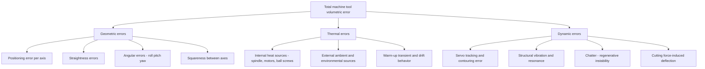

## Geometric, Thermal, and Dynamic Error Sources

### Fundamental Principle

Machine tool accuracy is governed by the combined effect of multiple, physically distinct error mechanisms that together determine the deviation between a machine's commanded position and its true achieved position at the tool point. These errors are conventionally grouped into three broad categories — **geometric**, **thermal**, and **dynamic** — each arising from different physical root causes, evolving on different timescales, and requiring different measurement and compensation strategies. Understanding and budgeting these error sources is foundational to volumetric error modeling, machine tool calibration, and the specification of achievable dimensional accuracy in manufactured parts.

### Geometric Errors

Geometric errors are time-invariant (or slowly varying) deviations arising from imperfections in the machine's mechanical structure, guideways, and assembly — present even under ideal, stable thermal and dynamic conditions.

#### Error Components per Axis

**Key Points**

- For each linear axis, six degrees of freedom (DOF) of error exist: one **positioning (linear displacement) error** along the axis of travel, two **straightness errors** (in the two directions perpendicular to travel), and three **angular errors** — **roll, pitch, and yaw**.
- A three-axis machine tool therefore has $3 \times 6 = 18$ individual axis error components, plus **squareness errors** between each pair of axes (3 squareness terms for X-Y, Y-Z, X-Z), totaling 21 independent geometric error parameters — the well-established basis of rigid-body volumetric error modeling.

$$E_{total} = 21 \text{ geometric error components (rigid-body model)}$$

#### Positioning (Linear Displacement) Error

Deviation between commanded and actual axis position along the direction of travel, typically caused by lead screw pitch error, ball screw manufacturing tolerance, encoder scale inaccuracy, or backlash.

#### Straightness Errors

Deviation of the axis's actual path from a true straight line in the two directions transverse to travel, arising from guideway imperfections, bearing preload variation, or structural sag along the travel length.

#### Angular Errors (Roll, Pitch, Yaw)

**Key Points**

- **Roll**: rotation about the axis of travel itself.
- **Pitch**: rotation about the axis transverse to travel in the vertical plane.
- **Yaw**: rotation about the axis transverse to travel in the horizontal plane.
- Angular errors are particularly significant because their effect on tool-point position is amplified by the **Abbe offset** — the distance between the measurement/reference line and the point of interest — meaning even small angular errors can produce substantial positional error at the tool tip for machines with long structural offsets (Abbe error, per the Abbe principle).

$$\delta_{Abbe} = L \cdot \theta$$

where $L$ is the offset distance and $\theta$ is the angular error (small-angle approximation).

#### Squareness Errors

Deviation from perfect 90° orientation between nominally orthogonal axes, causing systematic skew across the machine's working volume that compounds with distance from the origin.

### Thermal Errors

Thermal errors arise from non-uniform and time-varying temperature distributions within the machine structure, causing differential thermal expansion/contraction that distorts the machine geometry away from its calibrated (typically 20°C reference) state.

#### Heat Sources

**Key Points**

- **Internal sources**: spindle bearing friction, servo motor losses, ball screw nut friction, hydraulic system heat, and cutting process heat (for machining operations) are primary internal contributors.
- **External sources**: ambient temperature fluctuation, solar/radiative heat gain, proximity to other heat-generating equipment, and airflow/HVAC patterns in the shop floor environment.
- **Internal gradient effects**: even under stable ambient conditions, internal heat sources create non-uniform temperature gradients across the machine structure (e.g., spindle housing warmer than distant structural members), producing complex, non-rigid-body thermal distortion that is harder to model than simple uniform thermal expansion.

#### Thermal Error Characteristics

**Key Points**

- Thermal errors typically dominate total machine tool error budget in many industrial settings — commonly cited as responsible for a substantial fraction (often quoted as up to 40–70% depending on machine type and environment) of total volumetric error in uncompensated machines. [Unverified — exact proportion varies significantly by machine design, environment, and operating cycle; figures widely cited in machine tool literature but not a fixed universal constant.]
- Time-dependent behavior: thermal errors evolve over warm-up transients (minutes to hours after startup) and can continue drifting through a full production shift, distinguishing them fundamentally from the largely static nature of geometric errors.
- Spindle thermal growth (axial and radial displacement of the spindle nose due to bearing heating) is a particularly significant and well-studied thermal error mode in machining centers.

#### Thermal Error Mitigation

- **Thermal symmetric design**: structural designs that promote symmetric, predictable thermal expansion rather than asymmetric distortion.
- **Temperature-controlled environments**: maintaining stable ambient shop temperature (often specified near the international reference temperature of 20°C for dimensional metrology) reduces external thermal variation.
- **Real-time thermal compensation**: temperature sensors embedded at key structural locations feed compensation models (often empirically derived or machine-learning-based) that adjust axis commands in real time to counteract predicted thermal distortion.
- **Forced cooling**: chilled coolant circulation through spindle housings, ball screws, and structural members to actively stabilize temperature.

### Dynamic Errors

Dynamic errors arise from the machine's response to time-varying forces during motion and cutting — including servo control dynamics, structural vibration, and cutting-force-induced deflection — distinct from both static geometric error and slowly evolving thermal error.

#### Sources of Dynamic Error

**Key Points**

- **Servo tracking error**: finite bandwidth and gain of axis position control loops cause a lag between commanded and actual position during acceleration/deceleration and contouring motion, particularly pronounced at direction reversals (quadrant glitches from friction/backlash nonlinearity).
- **Structural vibration**: machine structure, spindle, and tooling have finite stiffness and mass, giving rise to natural resonant modes; excitation near these frequencies (from imbalance, cutting force variation, or external sources) produces vibration that directly degrades surface finish and dimensional accuracy.
- **Chatter**: a self-excited regenerative vibration phenomenon arising from the interaction between the cutting process and structural dynamics, capable of producing large-amplitude, unstable vibration that severely degrades both dimensional accuracy and surface finish, and can damage tooling.
- **Cutting force-induced deflection**: static and dynamic deflection of the tool, spindle, and workpiece under cutting loads, dependent on material removal rate, tool geometry, and process parameters.

#### Stability and Dynamic Characterization

**Key Points**

- Stability lobe diagrams (derived from the machine-tool-workpiece structural dynamics via frequency response function measurement, typically through impact/modal testing) predict combinations of spindle speed and depth of cut that avoid chatter instability.
- Modal analysis (impact hammer testing with accelerometers, or laser Doppler vibrometry) characterizes the machine's natural frequencies, mode shapes, and damping ratios, informing both structural design improvements and process parameter selection.

### Error Source Interaction and Classification

### Comparative Time-Scale and Modeling Characteristics

| Error Category | Time Scale | Modeling Approach | Typical Compensation Strategy |
| --- | --- | --- | --- |
| Geometric | Static / very slow (wear over months-years) | Rigid-body kinematic model (21-term) | Software error mapping and compensation tables |
| Thermal | Minutes to hours (warm-up, shift-length drift) | Empirical or physics-based thermal models | Real-time sensor-based compensation, thermal design |
| Dynamic | Milliseconds to seconds (motion, vibration) | Frequency response function / modal models, servo control theory | Controller tuning, stability lobe-guided process parameters, structural damping |

### Measurement Techniques for Error Characterization

**Key Points**

- **Laser interferometry** (see related interferometry chapter content): primary technique for measuring linear positioning error, straightness, and angular errors along individual axes.
- **Ballbar testing** (telescoping magnetic ballbar): rapid circular interpolation test capturing combined effects of several geometric and servo-dynamic errors (backlash, squareness, servo mismatch) in a single diagnostic measurement.
- **Capacitive/inductive displacement probes and thermocouples**: used for direct thermal growth measurement at key structural locations during thermal characterization testing.
- **Accelerometers and laser Doppler vibrometry**: used for dynamic/modal characterization and chatter diagnosis.

### Practical Considerations

**Key Points**

- A comprehensive machine tool error budget must account for all three categories jointly, since they interact — for example, thermal expansion can alter effective squareness, and dynamic vibration amplitude can be influenced by thermally-induced bearing preload changes.
- Volumetric error compensation systems in modern CNC controllers increasingly combine static geometric compensation maps with real-time thermal compensation models, while dynamic errors are addressed separately through servo tuning and process parameter selection rather than direct position compensation.
- Environmental control of the shop floor (temperature stability, vibration isolation from adjacent equipment) remains a foundational, non-software mitigation strategy applicable across all three error categories.

**Next Steps**

- Rigid-body volumetric error modeling and homogeneous transformation matrices
- Laser interferometer-based axis calibration procedures (linear, angular, straightness)
- Ballbar diagnostic testing and circular interpolation error analysis
- Stability lobe diagram construction from modal testing data
- Thermal error compensation model development (empirical vs. physics-based)
- Abbe principle and its implications for machine and instrument design