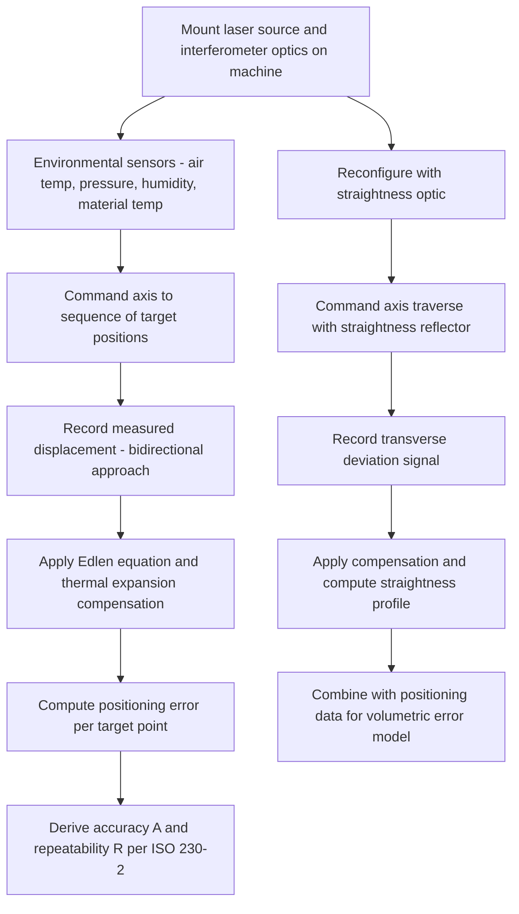

## Positional and Straightness Error Measurement

### Fundamental Principle

Positional and straightness error measurement quantifies two of the fundamental geometric error components of a linear machine axis: **positioning error** (the deviation between commanded and actual displacement along the axis of travel) and **straightness error** (the deviation of the actual travel path from a true straight line in the directions transverse to travel). These measurements form the empirical foundation of machine tool geometric calibration, feeding directly into volumetric error compensation models and machine acceptance testing per international standards such as ISO 230 and ASME B5.54.

### Positioning Error Measurement

#### Laser Interferometry (Linear Displacement)

**Key Points**

- The dominant industry method: a stabilized laser source (typically frequency-stabilized HeNe, see related interferometry chapter content) with a linear interferometer optic and retroreflector mounted on the machine axis measures displacement via fringe counting/phase interpolation as the axis traverses its travel range.
- The machine is commanded to a series of target positions; at each position, the laser system records the actual displacement, and positioning error is computed as the difference between commanded and measured position.
- Measurements are typically performed bidirectionally (approaching each target position from both positive and negative travel directions) to capture **backlash** and **hysteresis** effects distinct from unidirectional systematic error.
- Environmental compensation (air temperature, pressure, humidity, and material temperature) is applied via the Edlén equation and material thermal expansion coefficients to correct the measured optical path length to true mechanical displacement — critical because uncompensated air refractive index variation can introduce errors comparable to or larger than the machine error being measured.

#### Positioning Error Metrics (per ISO 230-2)

**Key Points**

- **Unidirectional positioning error**: deviation from target position when approaching from one direction only.
- **Bidirectional positioning error**: the total range of position values obtained by approaching a given target from both directions, capturing reversal/backlash effects.
- **Mean bidirectional positioning error** and **systematic positional deviation** curves are derived from repeated bidirectional runs (typically 5 repetitions per ISO 230-2 recommendations) and used to compute machine accuracy ($A$) and repeatability ($R$) parameters that characterize overall axis performance.

$$A = \max(\bar{x}_i + 2s_i) - \min(\bar{x}_i - 2s_i)$$

where $\bar{x}_i$ is the mean position error and $s_i$ is the standard deviation at target position $i$, across bidirectional approaches.

#### Alternative/Complementary Techniques

- **Glass/tape linear scales**: high-precision encoder scales can be used as a secondary reference or as the machine's native feedback device; comparison against an independent laser reference validates scale accuracy.
- **Step gauges and gauge block trains**: contact-based mechanical comparison method, historically significant and still used for lower-cost or field verification, though generally superseded by laser interferometry for primary calibration due to higher achievable accuracy and faster measurement of many target points.

### Straightness Error Measurement

#### Straightness Interferometry (Laser-Based)

**Key Points**

- Uses a specialized straightness interferometer optic — typically a Wollaston prism-based configuration that splits the laser beam into two parallel paths reflected off a precision straightness reflector (often a right-angle or Wollaston-type optic).
- As the target moves along the axis, any transverse (perpendicular) motion produces a differential path length change between the two beam paths, which the interferometer detects as straightness deviation independent of the axis's along-travel displacement.
- Two orthogonal straightness measurements (horizontal and vertical planes) are required to fully characterize the two transverse straightness components of a single axis, typically performed as separate setups with the optics rotated 90°.
- Straightness interferometry accuracy over longer travel ranges can be affected by beam divergence and air turbulence; shorter-range, higher-precision straightness measurements sometimes favor autocollimator-based or other complementary methods.

#### Autocollimator-Based Straightness (via Angular Integration)

**Key Points**

- An autocollimator measures the angular deviation (pitch or yaw) of a moving reflector as the axis translates; straightness is then derived by mathematically integrating the angular error data over the travel distance.
- This indirect method requires careful handling of integration constants and is more sensitive to accumulated error over long travel distances compared to direct straightness interferometry, but offers high angular sensitivity useful for combined straightness/angular error characterization in a single setup.

#### Reference Straightedge and Electronic Level Methods

- Mechanical or optical comparison against a calibrated straightedge, using a dial indicator or electronic probe to record deviation along the travel — a lower-cost, lower-accuracy alternative to laser-based methods, still used for coarse verification or where laser equipment is unavailable.

### Measurement Setup and Data Flow

### Standards Framework

**Key Points**

- **ISO 230 series** (particularly ISO 230-1 for geometric accuracy testing and ISO 230-2 for positioning accuracy of numerically controlled axes) provides the internationally recognized test methods, terminology, and statistical treatment for positioning and straightness error measurement of machine tools.
- **ASME B5.54** provides an analogous standard widely used in North America for machining center performance evaluation, including positioning and straightness testing methodology.
- Adherence to standardized test procedures (number of target points, repetitions, environmental reporting requirements) ensures measurement results are comparable across different machines, laboratories, and time periods — essential for machine acceptance testing and warranty/contractual accuracy verification.

### Sources of Measurement Uncertainty

**Key Points**

- **Cosine error**: misalignment between the laser beam axis and the true axis of machine travel introduces a systematic undermeasurement of displacement proportional to $(1 - \cos\theta)$ for a small misalignment angle $\theta$; careful optical alignment procedures minimize this effect.
- **Abbe offset error**: if the laser measurement line is not coincident with the functional line of the axis being characterized (e.g., the tool point), angular errors of the axis introduce additional apparent positioning error not present in the true tool-point motion — a key reason combined positioning/angular/straightness characterization is necessary for a full volumetric model.
- **Air turbulence and refractive index gradients** along the beam path, particularly over long travel ranges, introduce measurement noise and potential systematic bias if not adequately compensated or averaged.
- **Thermal drift of the machine structure itself** during the measurement sequence can conflate true thermal error with the geometric error being characterized; best practice includes allowing adequate machine warm-up and monitoring structural temperature during testing.
- **Mounting and setup repeatability**: interferometer optic and retroreflector mounting fixtures must be sufficiently rigid and repeatable to avoid introducing setup-induced error into the measurement.

### Comparative Summary

| Method | Measures | Typical Accuracy | Key Advantage | Key Limitation |
| --- | --- | --- | --- | --- |
| Laser interferometry (linear) | Positioning error | Sub-micrometer over meters | High accuracy, long range, standard method | Requires environmental compensation |
| Laser straightness interferometry | Transverse straightness | Sub-micrometer | Direct, decoupled from positioning measurement | Beam divergence over long range |
| Autocollimator + integration | Straightness (via angle) | High angular sensitivity | Combines with angular error measurement | Integration error accumulation |
| Step gauge / gauge block train | Positioning error | Lower than laser, but traceable | Simple, robust, low equipment cost | Slower, fewer points, lower accuracy |

### Practical Considerations

**Key Points**

- Full geometric characterization of a single linear axis (per the 21-term rigid-body model discussed in the related error-source chapter content) requires combining positioning, two-axis straightness, and angular (roll/pitch/yaw) measurements — no single instrument setup captures all components simultaneously with standard laser interferometer systems.
- Measurement sequence planning should account for total test duration versus thermal drift risk, since lengthy multi-axis, multi-component calibration sequences increase exposure to thermal variation that can contaminate results if not properly monitored and compensated.
- Data from positioning and straightness measurements feeds directly into software-based volumetric error compensation tables in modern CNC controllers, making measurement accuracy and repeatability directly consequential for the achievable compensated accuracy of the machine.

**Related Topics**

- ISO 230-2 statistical treatment of positioning accuracy and repeatability
- Angular error measurement via laser interferometer angular optics and autocollimators
- Volumetric error compensation and 21-term rigid-body modeling
- Ballbar testing as a rapid multi-error diagnostic method
- Abbe principle and its application to axis measurement line placement
- Cosine error correction in laser alignment procedures