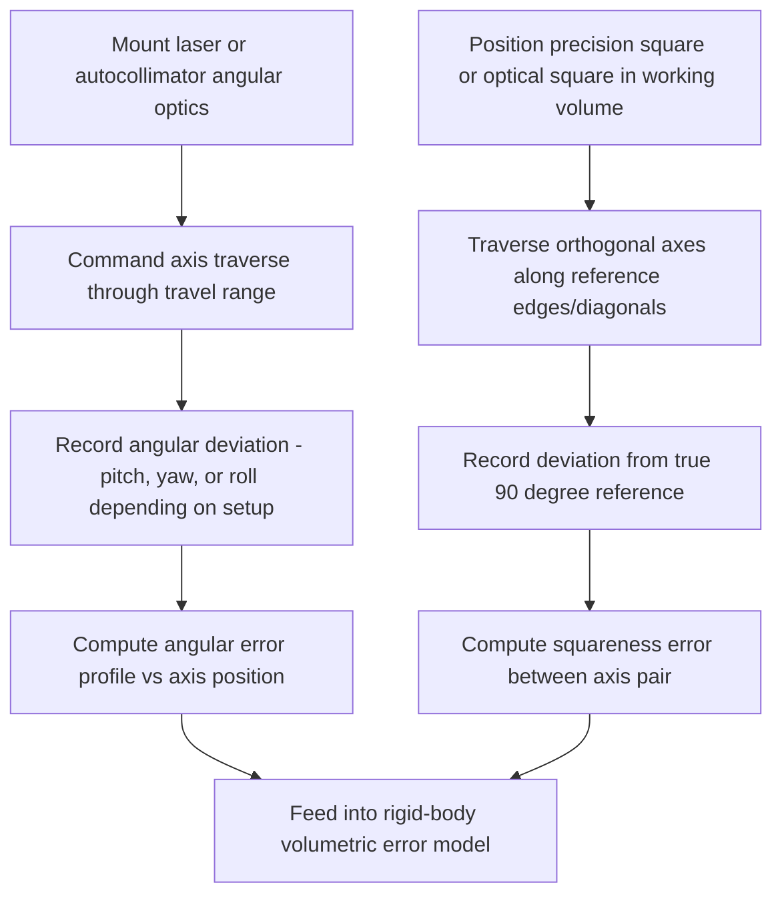

## Squareness and Angular Error Measurement

### Fundamental Principle

Squareness and angular error measurement characterizes two closely related but distinct classes of geometric error in a machine tool: **angular errors** (roll, pitch, and yaw) of an individual linear axis as it travels, and **squareness errors** between pairs of nominally orthogonal axes. Together with positioning and straightness error (see related chapter item), these complete the rigid-body geometric error model of a machine's kinematic structure. Angular errors are of particular metrological significance because, via the Abbe principle, even small angular deviations produce amplified positional error at points offset from the measurement line — making angular characterization essential wherever tooling, workpiece, or measurement probes are mounted away from an axis's direct line of travel.

### Angular Error Components

**Key Points**

- **Roll**: rotation of the carriage/slide about the axis of travel itself (the "long" axis direction).
- **Pitch**: rotation about the horizontal axis transverse to travel.
- **Yaw**: rotation about the vertical axis transverse to travel.
- Each linear axis has all three angular error components as a function of position along its travel, contributing 3 of the 6 error components per axis in the standard rigid-body model (alongside 1 positioning and 2 straightness components).

### Angular Error Measurement Techniques

#### Laser Interferometer Angular Optics

**Key Points**

- A specialized angular measurement optic (typically incorporating two parallel beam paths reflected from a precision angular reflector, often built from a pair of retroreflectors on a rigid bar) is used with the same laser source as linear/straightness measurement.
- As the target undergoes angular rotation, a differential optical path length develops between the two parallel beams; the interferometer converts this path difference into an angular measurement, typically resolvable to sub-arcsecond levels over practical baseline lengths.
- Pitch and yaw are measured with the angular optic oriented in the appropriate plane (vertical for pitch, horizontal for yaw); roll requires a distinct measurement approach since it cannot be captured by the standard two-beam angular optic used for pitch/yaw.

#### Electronic Autocollimator

**Key Points**

- Projects a collimated light beam onto a small mirror mounted on the moving axis; angular tilt of the mirror displaces the reflected beam's focal spot position on an internal detector (typically a position-sensitive detector or CCD/CMOS array), which is converted to angular deviation.
- Achieves very high angular resolution (sub-arcsecond to sub-0.1 arcsecond in high-end instruments) and is widely used for both pitch/yaw measurement and, via appropriate fixturing, roll measurement and squareness verification.
- Unlike laser interferometer angular optics, autocollimators measure angle directly without requiring integration, making them well suited to standalone angular characterization tasks, though typically over shorter effective ranges than laser interferometer systems.

#### Precision Level (Electronic/Spirit Level)

- Gravity-referenced instrument used to measure small angular deviations relative to true horizontal; useful for certain roll and pitch measurements, particularly in large machine tool bed leveling and coarse angular verification, though generally lower resolution than laser or autocollimator methods and sensitive to vibration.

#### Roll Measurement Methods

**Key Points**

- Roll is the most difficult angular error component to measure directly because it represents rotation about the direction of travel itself, offering no natural lever arm for simple optical angular detection along that axis.
- Common approaches include: precision electronic levels mounted transverse to the travel direction (sensitive to gravity-referenced tilt about the travel axis), or specialized roll-sensing autocollimator/optic configurations using a precision square or transverse-mounted reflector.
- Roll error is often the least characterized of the three angular components in routine machine calibration due to this measurement difficulty, though its contribution to Abbe error can still be significant for machines with substantial transverse offsets.

### Squareness Error Measurement

Squareness quantifies the deviation from exact 90° orientation between two nominally orthogonal machine axes, a critical contributor to volumetric error that grows with distance from the origin/reference point in the machine's working volume.

#### Precision Square and Dial Indicator Method

- A calibrated precision square (or granite square) is positioned in the machine's working volume; a dial indicator or electronic probe mounted on the machine spindle/carriage is traversed along each reference edge, and deviation from the square's reference surfaces is recorded to compute the included angle error between the two axes.

#### Laser Interferometer Squareness Optic

**Key Points**

- Uses a specialized optical square (a precision right-angle prism assembly) combined with the laser interferometer system to measure squareness without requiring a large mechanical reference square, by comparing straightness or angular measurements along two orthogonal directions referenced through the optical square.
- This method offers higher accuracy and repeatability than mechanical square methods, particularly for larger machines where a sufficiently large, accurately calibrated mechanical square would be impractical or prohibitively expensive.

#### Diagonal Displacement / Step Diagonal Method

**Key Points**

- Per ISO 230-1 and related standards, squareness can be derived from linear displacement measurements taken along the diagonals of a rectangular or square test plane within the machine's working volume, using the geometric relationship between diagonal length differences and the included angle error.
- This method leverages standard linear laser interferometer measurements (rather than a dedicated angular/squareness optic) and is well suited to integration within broader positioning accuracy test sequences.

### Angular and Squareness Measurement Data Flow

### Abbe Error Amplification from Angular Error

**Key Points**

- Angular error at any point along an axis's travel produces an additional positional offset at any point displaced from the measurement/reference line by a distance $L$, following the small-angle relationship:

$$\delta_{Abbe} = L \cdot \theta$$

- For example, a modest angular error of $\theta = 5$ arcseconds ($\approx 2.4 \times 10^{-5}$ rad) acting over an offset of $L = 500$ mm produces an Abbe error contribution of approximately 12 µm — illustrating why angular error characterization is essential even when linear positioning error alone appears small, particularly for machines or instruments with large structural offsets between the measurement scale and the functional point (tool tip, probe tip).

### Standards Framework

**Key Points**

- **ISO 230-1** defines geometric accuracy test methods for machine tools operating under no-load or quasi-static conditions, including angular and squareness error test procedures.
- **ISO 230-2** addresses positioning accuracy determination, which is measured alongside and combined with angular/squareness data for full volumetric characterization.
- **ASME B5.54** provides analogous North American standard test methodology, including squareness and angular error test procedures for machining centers.

### Sources of Measurement Uncertainty

**Key Points**

- Setup alignment error between the angular measurement optic/autocollimator and the true axis of travel introduces systematic bias if not carefully aligned.
- Thermal drift during extended angular measurement sequences can introduce apparent angular error unrelated to the true geometric characteristic being measured, particularly relevant given the often slower measurement speed of angular/squareness testing compared to simple linear positioning tests.
- Mechanical square accuracy and calibration traceability directly limit the achievable squareness measurement accuracy when using contact-based precision square methods; optical square and diagonal displacement methods reduce dependency on large mechanical reference artifacts.
- Vibration sensitivity varies by technique: autocollimators and precision levels can be more susceptible to floor-transmitted vibration than laser interferometer-based angular measurement in some configurations. [Behavior may vary by specific instrument design and installation environment.]

### Comparative Summary

| Method | Measures | Typical Resolution | Key Advantage | Key Limitation |
| --- | --- | --- | --- | --- |
| Laser interferometer angular optic | Pitch, yaw | Sub-arcsecond | Same setup as linear/straightness measurement | Roll not directly measurable |
| Electronic autocollimator | Pitch, yaw, roll (with fixturing) | Sub-arcsecond to sub-0.1 arcsec | Very high resolution, direct angle reading | Shorter effective range than laser systems |
| Precision electronic level | Roll, pitch (gravity-referenced) | Moderate | Simple, useful for leveling | Vibration sensitive, lower resolution |
| Precision/optical square | Squareness between axes | High (optical square) | Direct geometric reference | Mechanical square size/cost limits at scale |
| Diagonal displacement method | Squareness (derived) | High (laser-based) | Uses standard linear interferometer setup | Requires careful geometric computation |

### Practical Considerations

**Key Points**

- Full angular characterization of a machine (all three components per axis) typically requires multiple setups and instrument reconfigurations, since no single common instrument directly captures roll, pitch, and yaw simultaneously with equal ease.
- Squareness measurement results are highly sensitive to the size and quality of the working volume sampled; measurements taken only near the origin may not capture squareness-related error that manifests at the extremes of a large working volume.
- Angular and squareness data are essential inputs to full rigid-body volumetric error compensation models (see related chapter item) and are typically combined with positioning and straightness data collected in a coordinated calibration campaign rather than treated as isolated measurements.

**Next Steps**

- Rigid-body volumetric error modeling using homogeneous transformation matrices
- Roll error measurement techniques and their comparative limitations
- Diagonal displacement squareness calculation methodology (ISO 230-1)
- Ballbar testing as a combined diagnostic for squareness, backlash, and servo mismatch
- Abbe principle applications in coordinate measuring machine and machine tool design
- Volumetric error compensation implementation in CNC controllers