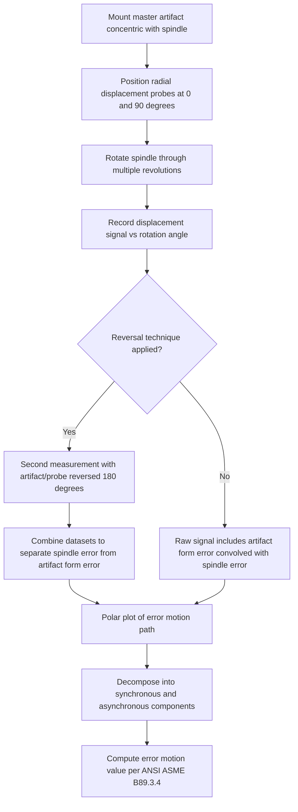

## Spindle Error Analysis

### Fundamental Principle

Spindle error analysis characterizes the deviation of a rotating spindle's actual axis of rotation from an ideal, perfectly fixed rotational axis. Because the spindle is the element that directly holds either the cutting tool (machine tools) or the workpiece (in turning, grinding, or rotational metrology applications), spindle error propagates directly into machined or measured part geometry — affecting roundness, cylindricity, surface finish, and dimensional accuracy. Spindle error analysis is distinct from linear axis geometric error (positioning, straightness, angular — see related chapter items) in that it deals with rotational motion and synchronous/asynchronous radial and axial displacement of the spindle centerline itself.

### Error Motion Components

**Key Points**

- Spindle error motion is decomposed into radial error motion (in the plane perpendicular to the rotation axis) and axial error motion (along the rotation axis), plus tilt/angular error motion of the axis of rotation.
- **Radial error motion**: displacement of the actual axis of rotation from the ideal axis, measured in a plane perpendicular to the nominal rotation axis, typically at a specified axial location (e.g., near the spindle nose where tooling is mounted).
- **Axial error motion**: displacement of the spindle along its nominal rotation axis during rotation, relevant particularly for facing operations and axial-sensitive processes.
- **Tilt error motion**: angular wobble of the rotation axis, which combined with an axial offset (Abbe-type effect) produces amplified radial displacement at points away from the measurement plane.

### Synchronous vs. Asynchronous Error Motion

**Key Points**

- **Synchronous error motion**: the component of error motion that repeats identically every revolution — arising from fixed geometric imperfections such as bearing raceway out-of-roundness, unbalance, or fixed asymmetry in the spindle assembly. This is the dominant contributor to systematic, repeatable part-to-part geometric error.
- **Asynchronous error motion**: the component that does not repeat identically from one revolution to the next — arising from random or non-periodic sources such as bearing ball/roller variation (in rolling-element bearings), fluid film instability (in hydrodynamic/hydrostatic bearings), or external disturbances. This is the primary limiting factor for surface finish and roundness repeatability.
- The ANSI/ASME B89.3.4 standard (Axes of Rotation) provides the internationally referenced framework and terminology for decomposing and reporting these error motion components.

### Measurement Techniques

#### Precision Capacitive/Inductive Displacement Probes with Master Artifact

**Key Points**

- A high-precision, extremely round reference sphere or cylinder (a "master ball" or "master artifact," manufactured to sub-micrometer or better roundness) is mounted concentrically on the spindle; non-contact capacitive or inductive displacement probes are positioned around the artifact to sense radial (and separately, axial) displacement as the spindle rotates.
- Two probes oriented 90° apart in the radial plane allow separation of true spindle error motion from artifact form error and enable polar plotting of the error motion path over one or more revolutions.
- This is the standard method specified in ANSI/ASME B89.3.4 for rigorous, quantitative spindle error motion characterization.

#### Reversal Techniques (Donaldson Reversal)

**Key Points**

- Because a single measurement with a real (imperfect) master artifact conflates artifact roundness error with true spindle error motion, the **reversal technique** (commonly attributed to Donaldson) separates the two by taking a second measurement with the artifact or probe rotated/reversed 180° relative to the first setup, then mathematically combining the two datasets to isolate spindle error motion from artifact form error.
- This technique enables spindle error motion characterization at accuracy levels significantly better than the roundness of the master artifact itself, which is essential since manufacturing an artifact rounder than the spindle error being measured can be impractical or extremely costly.

#### Laser-Based and Capacitive Non-Contact Methods

- Laser displacement sensors or laser Doppler-based systems offer non-contact alternatives to capacitive probes in some specialized high-speed spindle characterization setups, particularly where contact or close-proximity capacitive probing is impractical.

#### Runout Measurement (Simplified Indicator-Based Methods)

- Dial indicator or simple displacement probe measurements against a rotating reference surface provide a basic, lower-cost estimate of total indicated runout (TIR), which combines true spindle error motion with artifact/surface form error without the separation rigor of the reversal technique — adequate for basic shop-floor verification but not for rigorous error motion characterization.

### Error Motion Analysis and Polar Plotting

### Error Motion Value Computation

**Key Points**

- Per ANSI/ASME B89.3.4, error motion is typically quantified from the polar plot as the radial width of the smallest annular region (bounded by two concentric circles) that contains the entire error motion path over the measured revolution(s) — analogous in concept to roundness deviation measures.
- Synchronous error motion value is derived from a single-revolution-averaged (or filtered) representation of the polar plot, isolating the repeatable component.
- Total (synchronous + asynchronous) error motion value reflects the full unfiltered error motion path and represents the worst-case contribution to part geometric error from spindle rotation alone.

### Sources of Spindle Error

**Key Points**

- **Bearing imperfections**: raceway out-of-roundness, waviness, and rolling element (ball/roller) size variation are primary sources of synchronous error motion in rolling-element bearing spindles.
- **Bearing preload variation**: incorrect or thermally-varying preload alters stiffness and can introduce both synchronous and thermally-drifting error motion contributions.
- **Unbalance**: residual mass imbalance in the spindle-tool-holder-tool assembly produces synchronous radial error motion proportional to rotational speed squared, motivating balancing procedures particularly critical at high spindle speeds.
- **Fluid film bearing dynamics**: in hydrodynamic or hydrostatic bearing spindles, fluid film thickness variation and instability can introduce both synchronous (eccentricity-related) and asynchronous (fluid instability-related) error motion.
- **Thermal growth**: spindle bearing heating causes both axial and radial thermal growth over the warm-up period (see related thermal error chapter content), which, while technically a thermal error, directly manifests as apparent spindle position/error motion drift if not distinguished in the measurement protocol.
- **Drive mechanism effects**: belt-driven spindles can exhibit additional synchronous error motion related to belt/pulley eccentricity, generally absent in direct-drive spindle configurations.

### Impact on Part Quality

**Key Points**

- Synchronous radial error motion directly produces out-of-roundness (lobing) in turned, bored, or ground cylindrical features, with the specific lobing pattern often diagnostic of the underlying error source (e.g., characteristic lobe counts associated with specific bearing element counts).
- Axial error motion directly affects flatness and perpendicularity of faced surfaces.
- Asynchronous error motion is a primary contributor to surface finish degradation (increased roughness) independent of the nominal/programmed toolpath, since it introduces non-repeatable radial tool-workpiece displacement.
- Tilt error motion combined with tool overhang length (an Abbe-type offset) amplifies effective radial error at the cutting point, analogous to angular error amplification in linear axes.

### Standards Framework

**Key Points**

- **ANSI/ASME B89.3.4** ("Axes of Rotation: Methods for Specifying and Testing") is the primary standard defining terminology, measurement methods, and reporting requirements for spindle and rotary axis error motion.
- Related standards address rotary table and rotary axis accuracy more broadly (relevant to multi-axis machine tools and rotary metrology instruments), often referencing similar error motion decomposition principles.

### Comparative Summary

| Measurement Method | Separates Artifact Error? | Typical Use Case |
| --- | --- | --- |
| Single-probe/master artifact | No | Basic characterization, artifact-limited accuracy |
| Reversal technique (Donaldson) | Yes | Rigorous, high-accuracy spindle error motion per B89.3.4 |
| Dial indicator runout | No | Basic shop-floor verification, not rigorous error motion |
| Laser-based non-contact | Depends on setup | Specialized high-speed or non-contact applications |

### Practical Considerations

**Key Points**

- Selection and quality of the master artifact (roundness, concentricity mounting) directly bounds achievable measurement accuracy unless the reversal technique is employed to mathematically remove artifact form error.
- Measurement should be performed at (or scaled to) the actual operating speed of interest where practical, since error motion — particularly asynchronous components tied to fluid film or dynamic bearing behavior — can be speed-dependent. [Behavior may vary by bearing type and spindle design; low-speed characterization may not fully represent high-speed operational error motion.]
- Thermal state of the spindle at the time of measurement should be controlled or recorded, since thermally-driven axial/radial growth during warm-up can be conflated with rotational error motion if measurements are taken before thermal stabilization.
- Spindle error analysis results feed directly into machine tool acceptance testing, periodic maintenance/health monitoring programs, and root-cause diagnosis of part quality issues traced to rotational error sources.

**Related Topics**

- ANSI/ASME B89.3.4 error motion terminology and polar plot analysis
- Donaldson reversal technique mathematical formulation
- Rolling-element bearing vs. hydrostatic/hydrodynamic bearing error motion characteristics
- Dynamic balancing procedures for high-speed spindles
- Roundness and cylindricity measurement principles
- Thermal growth characterization of spindle assemblies