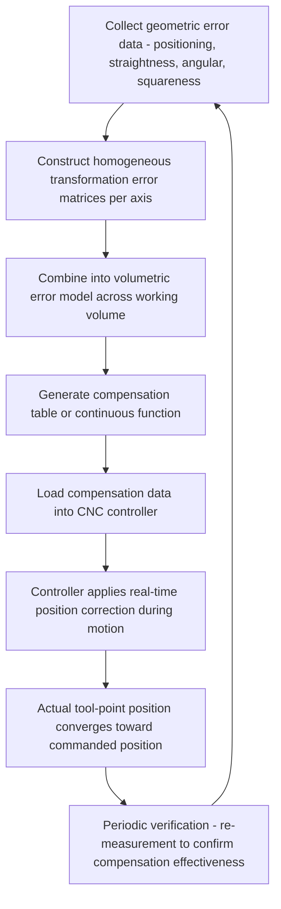

## Volumetric Error Mapping and Compensation

### Fundamental Principle

Volumetric error mapping and compensation integrates the individual geometric error components of a multi-axis machine — positioning, straightness, angular (roll/pitch/yaw), and squareness errors (see related chapter items) — into a unified mathematical model that predicts the total positional error of the tool point anywhere within the machine's three-dimensional working volume, and then applies corrective adjustments (software compensation) to counteract that predicted error in real time. This represents the synthesis step of machine tool geometric metrology: rather than treating each error component in isolation, volumetric mapping combines them via rigid-body kinematics to characterize and correct the machine's actual achievable accuracy throughout its full working envelope, not merely along individual axis travel lines.

### Rigid-Body Error Model

**Key Points**

- The standard volumetric error model treats each machine axis as a rigid body whose position and orientation error relative to its ideal, nominal motion is fully described by the 6 error components per axis (1 positioning, 2 straightness, 3 angular), plus squareness errors between axis pairs — for a three-axis machine, 21 independent error parameters (see related geometric error source chapter content).
- These individual error component functions (each typically characterized as a function of position along its respective axis via laser interferometry, per related chapter items) are combined using **homogeneous transformation matrices (HTMs)**, a standard robotics/kinematics formalism that represents the combined translation and rotation error at each axis as a $4\times4$ matrix.
- The total tool-point position error is obtained by multiplying the sequence of HTMs representing the kinematic chain from machine base through each axis to the tool point, capturing how errors at each axis propagate and combine (including Abbe-amplified contributions from angular errors acting over structural offsets).

$$T_{actual} = T_{ideal} \cdot E_1 \cdot E_2 \cdots E_n$$

where $T_{ideal}$ is the nominal (commanded) kinematic transformation and each $E_i$ is an error transformation matrix for axis $i$, incorporating its measured positioning, straightness, and angular error functions.

### Error Mapping Process

#### Data Collection

**Key Points**

- Comprehensive volumetric mapping requires collecting positioning, straightness, and angular error data for each linear axis (typically via sequential laser interferometer setups) plus squareness measurements between each axis pair — a measurement campaign that can be time-consuming, particularly for larger machines with long travel ranges.
- Alternative, faster mapping approaches exist to reduce measurement time, including laser tracker-based volumetric measurement (using a laser tracker to directly measure tool-point position at a grid of locations throughout the working volume) and multilateration techniques, which characterize combined volumetric error more directly without requiring separate per-axis-per-component measurement sequences.
- Grid density (number and spacing of measured/interpolated points throughout the volume) affects both mapping accuracy and measurement time; interpolation between measured points is used to estimate error at arbitrary locations within the volume.

#### Direct Volumetric Measurement Methods

**Key Points**

- **Laser tracker multilateration**: multiple length measurements from a laser tracker (or multiple trackers) to a retroreflector target at the tool point, taken from different tracker positions, allow direct 3D position determination without relying on the tracker's angular encoders — offering high accuracy less dependent on angular measurement uncertainty compared to single-tracker polar measurement.
- **Laser tracker single-station measurement**: uses both the tracker's distance and angular encoder measurements to determine 3D position at each grid point; simpler setup than multilateration but subject to angular encoder accuracy limitations.
- **Telescoping ballbar (multi-position/volumetric extensions)**: while primarily used for rapid circular interpolation diagnostic testing, extended ballbar test sequences at multiple positions and orientations can contribute diagnostic data toward volumetric error characterization, complementing but not replacing dedicated volumetric measurement systems.
- **Double ballbar / grid encoder systems**: specialized planar or volumetric grid encoder devices provide dense, rapid error mapping over a defined measurement plane or volume, used particularly in machine tool research and high-precision calibration contexts.

### Compensation Implementation

**Key Points**

- Most modern CNC controllers implement volumetric compensation via **lookup tables** indexed by axis position, storing correction values (typically for positioning error, and in more advanced implementations, for straightness and angular-derived contributions as well) that are interpolated and applied in real time as the machine moves.
- Some advanced controllers support full **volumetric compensation** incorporating cross-axis coupling terms (e.g., how X-axis position affects Y-axis error due to squareness or straightness coupling), rather than simpler per-axis-only compensation that corrects each axis independently without accounting for cross-axis geometric coupling.
- Compensation is fundamentally a *correction of known, characterized, repeatable geometric error* — it does not address thermal or dynamic errors (see related chapter item), which require separate compensation strategies (real-time thermal models, servo tuning) since they are not static, position-only-dependent quantities.

### Verification and Validation

**Key Points**

- After compensation is applied, verification measurement (repeating positioning accuracy tests, ballbar tests, or volumetric grid measurement) confirms that the compensated machine achieves improved accuracy compared to the uncompensated baseline, and quantifies residual error after compensation.
- Residual error after compensation reflects the combination of: mapping/interpolation limitations, measurement uncertainty in the original characterization, and any error sources (thermal, dynamic, wear-related drift since characterization) not captured by the static geometric compensation model.
- Periodic re-verification and re-mapping is necessary since geometric errors can drift over time due to mechanical wear, component replacement, collision damage, or foundation settling — meaning volumetric compensation is not a permanent one-time correction but requires a maintenance/recalibration cycle appropriate to the machine's usage intensity and accuracy requirements.

### Standards Framework

**Key Points**

- **ISO 230-1** and related parts of the ISO 230 series provide geometric test method foundations that feed into volumetric characterization, though volumetric mapping/compensation methodology itself is addressed through a combination of standards, manufacturer-specific implementations, and research literature rather than a single unified international volumetric compensation standard.
- **ASME B5.54** similarly provides machining center performance evaluation methodology relevant to the underlying geometric data used in volumetric models.
- Laser tracker-based volumetric measurement practices draw on relevant coordinate measuring system standards (e.g., ASME B89.4.19 for laser trackers) for measurement uncertainty characterization of the mapping instrument itself.

### Comparative Summary of Mapping Approaches

| Approach | Data Collected | Relative Speed | Key Strength |
| --- | --- | --- | --- |
| Sequential per-axis laser interferometry | Positioning, straightness, angular per axis | Slower (multiple setups) | High accuracy per component, standard traceable method |
| Laser tracker single-station | Direct 3D position at grid points | Moderate-fast | Direct volumetric data, fewer setups |
| Laser tracker multilateration | Direct 3D position, reduced angular dependency | Moderate | Higher accuracy than single-station, reduced angular encoder sensitivity |
| Ballbar (diagnostic/multi-position) | Combined error indication (not full decomposition) | Fast | Rapid health check, not a substitute for full mapping |

### Sources of Residual Uncertainty After Compensation

**Key Points**

- **Interpolation error**: error between measured/characterized grid points is estimated via interpolation, introducing residual uncertainty that depends on grid density relative to the spatial frequency of the actual error variation.
- **Non-rigid-body effects**: the standard 21-term model assumes rigid-body behavior; structural compliance, backlash nonlinearity, and load-dependent deflection are generally not captured by static geometric volumetric compensation and require separate consideration.
- **Thermal and dynamic error contamination**: if thermal or dynamic errors were present (and not adequately controlled/separated) during the original characterization measurements, they can bias the resulting static compensation model, since the model assumes the measured error is purely geometric/repeatable.
- **Compensation table resolution and controller interpolation method**: the granularity and interpolation algorithm used by the CNC controller to apply the compensation table itself introduces a bound on achievable correction fidelity.

### Practical Considerations

**Key Points**

- Volumetric compensation is most valuable for machines used across their full working volume with demanding accuracy requirements (e.g., aerospace structural machining, precision mold/die manufacturing); machines used repeatedly in a small, localized working region may derive most practical benefit from more targeted, localized calibration rather than full-volume characterization.
- The time and cost investment of comprehensive volumetric mapping must be weighed against the accuracy improvement achieved and the compensation capability of the specific CNC controller in use — some lower-end controllers support only simple per-axis linear compensation, limiting the practical benefit of a full 21-term characterization.
- Establishing a recalibration interval appropriate to machine usage, environmental stability, and accuracy criticality is an essential complement to the initial mapping and compensation implementation, since compensation effectiveness degrades as the underlying geometric errors drift from their characterized state over time.

**Next Steps**

- Homogeneous transformation matrix formulation for multi-axis kinematic error chains
- Laser tracker multilateration measurement principles and uncertainty analysis
- CNC controller compensation table implementation and interpolation methods
- Recalibration interval determination based on usage and environmental factors
- Integration of volumetric compensation with real-time thermal error compensation
- ASME B89.4.19 laser tracker performance evaluation standard