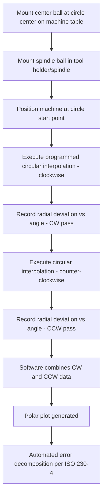

## Ballbar Testing

### Fundamental Principle

Ballbar testing is a rapid diagnostic technique for machine tool geometric and dynamic error characterization, using a telescoping precision-length sensor with a precision ball at each end to constrain the machine's tool point to move along a circular (or partial-arc) path while a linear displacement transducer inside the bar continuously records deviation from the nominal circular radius. Developed primarily to complement the slower, more comprehensive but setup-intensive laser interferometer-based axis-by-axis characterization methods (see related chapter items), ballbar testing captures a combined signature of multiple simultaneous error sources — including squareness, backlash, servo mismatch, and certain dynamic effects — in a single, fast test cycle, making it a widely adopted tool for routine machine health monitoring, acceptance testing, and troubleshooting.

### System Architecture

**Key Points**

- A telescoping ballbar consists of two precision spheres (balls) connected by a telescoping shaft containing a linear displacement transducer (typically a linear variable differential transformer, LVDT, or equivalent high-resolution linear encoder).
- One ball is mounted on a magnetic kinematic socket fixed to the machine table (center of the programmed circular path); the other ball is mounted in a magnetic kinematic socket attached to the machine spindle/tool holder.
- As the machine executes a programmed circular interpolation move (typically a full or near-full circle in a chosen plane — XY, XZ, or YZ), any deviation of the actual tool-point radius from the ideal, constant radius defined by the ballbar length is captured as a linear displacement signal within the ballbar, recorded continuously (often synchronized with rotational angle) throughout the test.
- Wireless or tethered data transmission to a computer running dedicated ballbar analysis software is standard in modern systems, enabling real-time visualization and automated error decomposition.

### Test Procedure

**Key Points**

- Standard practice includes both **clockwise (CW)** and **counter-clockwise (CCW)** circular passes, since comparing the two directions allows separation of certain error types — notably backlash and servo mismatch — that manifest differently depending on direction of travel.
- Tests are typically performed in each of the three principal planes (XY, YZ, XZ) to characterize error behavior across different axis pairings, since squareness and axis-specific errors differ by plane.
- Multiple ballbar radii and/or feed rates may be tested to separate radius-independent (geometric) effects from radius-dependent or feed-rate-dependent (servo/dynamic) effects.

### Error Signatures Detectable via Ballbar

#### Squareness Error

Manifests as an elliptical distortion of the polar plot, oriented along the diagonal axes relative to the machine's coordinate axes, with the ellipticity magnitude proportional to the squareness deviation between the two axes tested.

#### Backlash

**Key Points**

- Appears as a characteristic step discontinuity in the polar plot at the points where one or more axes reverse direction during the circular path (typically at the quadrant boundaries aligned with the machine axes).
- Comparing CW and CCW polar plots isolates backlash, since the direction-dependent step shifts oppositely between the two rotational directions.

#### Servo Mismatch (Gain Mismatch)

**Key Points**

- Occurs when the servo control loop gains of the two axes involved in the circular interpolation are not perfectly matched, causing one axis to lag or lead the other during the contouring motion.
- Produces a characteristic oval/elliptical distortion oriented along the machine's coordinate axes (X-Y aligned), distinguishable from squareness-induced ellipticity (which is diagonally oriented) by its orientation relative to the machine axes.

#### Cyclic (Periodic) Error

Small-amplitude periodic ripple in the polar plot, often associated with ball screw pitch error periodicity, encoder/scale periodic error, or coupling/belt-related periodicity, manifesting at a spatial frequency related to the mechanical component's periodicity.

#### Stick-Slip and Friction-Related Effects

Localized, often sharp deviations near axis reversal points, distinct from clean backlash steps, associated with friction nonlinearity (stiction) in guideways or drive mechanisms — often termed "quadrant glitches" or "quadrant bumps."

#### Vibration and Dynamic Effects

High-frequency noise or oscillation superimposed on the polar plot, potentially indicating structural resonance excited during the circular motion, particularly at higher feed rates or specific frequencies coinciding with machine natural modes.

### Automated Error Decomposition and Reporting

**Key Points**

- Ballbar analysis software (following methodology aligned with **ISO 230-4**, "Circular tests for numerically controlled machine tools") automatically fits the recorded polar data to known error signature models, decomposing the combined signal into estimated contributions from squareness, backlash (per axis), servo mismatch, scale/encoder error, and other recognized error types.
- Standard summary metrics include **circularity deviation** (the radial width of the minimum annular region bounding the polar plot, analogous to roundness measurement) and individual decomposed error magnitudes for each identified error type.
- Software typically compares results against user-defined or machine-specification tolerance limits, flagging out-of-tolerance conditions for maintenance attention.

### Standards Framework

**Key Points**

- **ISO 230-4** ("Circular tests for numerically controlled machine tools") is the primary international standard defining ballbar test methodology, circular path programming requirements, and error decomposition terminology.
- Ballbar testing is often used as a practical screening and trending tool alongside, but not as a full replacement for, the more comprehensive laser interferometer-based geometric characterization (ISO 230-1/230-2) required for full volumetric error mapping (see related chapter item) — the two methods are complementary rather than interchangeable.

### Applications

**Key Points**

- **Acceptance testing**: rapid verification of new machine tool circular interpolation performance against manufacturer specification at installation.
- **Periodic health monitoring / trend analysis**: repeated ballbar tests over time (e.g., monthly or quarterly) track machine condition, enabling early detection of developing mechanical issues (bearing wear, backlash increase, servo drift) before they manifest as part quality problems.
- **Post-maintenance verification**: confirming that repair or adjustment work (e.g., backlash compensation adjustment, servo tuning) achieved the intended correction.
- **Rapid troubleshooting**: when a part quality issue is observed, a ballbar test can quickly help distinguish whether the root cause is geometric (squareness), control-related (servo mismatch), or mechanical (backlash/stick-slip), narrowing the diagnostic path before more time-intensive laser-based investigation.

### Comparative Summary

| Aspect | Ballbar Testing | Laser Interferometer Testing |
| --- | --- | --- |
| Test duration | Minutes per plane | Hours (full multi-axis, multi-component) |
| Error types captured | Combined/coupled (squareness, backlash, servo, some dynamic) | Individual, decomposed per axis and component |
| Setup complexity | Low (single fixture, quick mounting) | Higher (multiple optic setups per component) |
| Primary use case | Rapid health check, trending, troubleshooting | Full volumetric characterization, formal calibration/compensation |
| Standard | ISO 230-4 | ISO 230-1 / ISO 230-2 |

### Sources of Measurement Uncertainty

**Key Points**

- Ballbar length calibration (the precise center-to-center distance between the two balls) must itself be traceable and periodically verified, since it directly defines the nominal radius against which deviation is measured.
- Thermal expansion of the ballbar itself during testing can introduce apparent radius drift if not compensated (many systems include temperature sensing and compensation for the ballbar's own thermal coefficient).
- Mounting repeatability of the magnetic kinematic sockets affects measurement repeatability; contamination or wear of the socket/ball interfaces can introduce spurious signal.
- Because ballbar testing produces a *combined* error signature, definitive root-cause attribution of a detected anomaly sometimes requires follow-up with more targeted diagnostic methods (e.g., dedicated laser squareness measurement) when the automated decomposition is ambiguous or when multiple error sources overlap in their polar plot signature.

### Practical Considerations

**Key Points**

- Ballbar testing's speed and relative ease of setup make it well suited to frequent, routine use as part of a preventive maintenance and quality assurance program, in contrast to the more resource-intensive full laser-based volumetric characterization typically reserved for initial calibration, major maintenance events, or periodic formal recertification.
- Selecting an appropriate test radius and feed rate should reflect the typical operating conditions and part sizes relevant to the machine's actual production use, since some error contributions (particularly dynamic/servo-related effects) can be radius- and feed-rate-dependent.
- Trending ballbar results over time (rather than relying on a single snapshot test) provides significantly greater diagnostic value for predictive maintenance, since gradual degradation patterns are often more actionable than a single absolute measurement against a static tolerance.

**Related Topics**

- ISO 230-4 circular test methodology and error decomposition algorithms
- Backlash compensation and servo gain matching in CNC controllers
- Squareness measurement via diagonal displacement and optical square methods
- Stick-slip friction and quadrant glitch mitigation in servo-controlled axes
- Preventive maintenance program design using trend-based machine health metrics
- Complementary use of ballbar and laser interferometer testing in calibration workflows