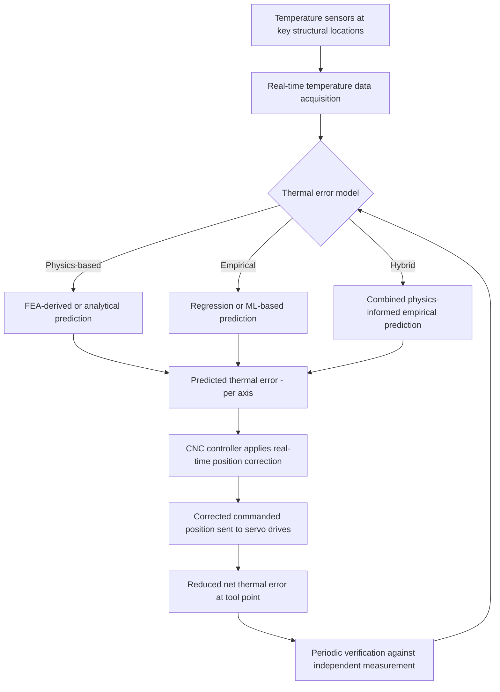

## Thermal Error Compensation

### Fundamental Principle

Thermal error compensation is the active correction of machine tool positional error caused by temperature-induced structural distortion, applied in real time through the CNC controller based on measured or predicted thermal state. Because thermal errors evolve continuously over warm-up transients and production cycles (unlike the largely static geometric errors addressed by volumetric compensation, see related chapter item), thermal compensation requires a fundamentally different approach: rather than a fixed, position-indexed lookup table, it depends on temperature-based models that update predicted error dynamically as the machine's thermal state changes. Given that thermal errors are frequently cited as the largest single contributor to total machine tool inaccuracy in uncompensated systems, effective thermal compensation is one of the highest-value interventions available for improving practical machining and measurement accuracy without capital investment in new machine structure.

### Thermal Error Modeling Approaches

#### Physics-Based (Analytical/FEA) Models

**Key Points**

- Uses finite element analysis (FEA) or analytical heat transfer models of the machine structure, incorporating known heat sources (spindle bearing friction, motor losses, ambient boundary conditions) to predict temperature distribution and resulting thermal deformation from first principles.
- Offers the advantage of physical interpretability and potential extrapolation beyond the specific conditions used for model development, but requires detailed knowledge of the machine's thermal properties, heat source characteristics, and boundary conditions — information not always readily available, particularly for machines not designed with thermal modeling in mind.
- Computationally intensive for real-time implementation unless significantly simplified or reduced-order modeling techniques are applied to make the model tractable for real-time controller execution.

#### Empirical (Data-Driven) Models

**Key Points**

- Built from measured correlation between temperature sensor readings at selected structural locations and simultaneously measured thermal error (typically via displacement probes or periodic laser interferometer verification) across representative operating conditions (varying spindle speed, duty cycle, ambient conditions).
- Common empirical modeling techniques include multiple linear regression relating error to a weighted combination of temperature sensor readings, and more recently, machine learning approaches (neural networks, support vector regression) capable of capturing nonlinear and time-lagged thermal relationships. [Inference — specific ML architecture choices are vendor- and application-specific and continue to evolve; the general trend toward ML-based thermal compensation is well documented in the machine tool literature.]
- Empirical models are generally faster to develop and computationally lighter for real-time execution than full physics-based models, but their accuracy is limited to the range of conditions represented in the training/calibration dataset, with reduced reliability under conditions outside that envelope (extrapolation risk).

#### Hybrid Models

Combine physics-based structural understanding (informing sensor placement and model structure) with empirical calibration (fitting model parameters to measured data), aiming to balance interpretability/robustness against development speed and computational practicality.

### Temperature Sensing Strategy

**Key Points**

- Sensor placement is critical: temperature sensors must be positioned at locations that provide strong correlation with the actual thermal deformation affecting tool-point accuracy — often near major heat sources (spindle housing, ball screw nuts, motor mounts) and at structurally significant reference locations.
- Sensor count involves a trade-off: more sensors can improve model accuracy and robustness to varying heat source combinations, but increase cost, wiring complexity, and model complexity; practical systems typically use a limited number (often single digits to low tens) of carefully selected sensor locations rather than exhaustive instrumentation.
- Common sensor types include thermocouples, resistance temperature detectors (RTDs), and thermistors, selected based on required accuracy, response time, and installation constraints.

### Compensation System Architecture

### Model Development Process

**Key Points**

- Model development typically begins with a designed thermal characterization test: the machine is run through representative duty cycles (varying spindle speed, axis motion patterns, dwell periods) while simultaneously logging temperature sensor data and reference thermal error (measured via laser interferometer, capacitive displacement probes against a reference artifact, or touch-probe measurement of a reference sphere/artifact at intervals).
- The resulting dataset is used to fit model parameters (regression coefficients, neural network weights, or FEA boundary condition calibration), followed by validation against an independent test dataset not used in model fitting, to assess predictive accuracy and generalization.
- Model robustness across different seasons (varying ambient shop temperature), different operational patterns (light vs. heavy duty cycles), and machine-to-machine variation (for models intended to be applied across a product line rather than a single specific machine) are important considerations affecting practical deployment success.

### Compensation Application Methods

**Key Points**

- **Real-time position offset**: the most common implementation — the controller continuously adjusts the commanded axis position by the model-predicted thermal error, transparent to the part program (no G-code modification required).
- **Periodic re-zeroing / offset update**: simpler systems may apply thermal compensation as periodically updated offset values (e.g., updated every few minutes) rather than continuous real-time adjustment, trading some responsiveness for reduced computational/communication overhead.
- **Spindle growth compensation**: a frequently implemented specific case, since spindle thermal growth (axial and radial displacement of the spindle nose) is often the single largest and most well-characterized thermal error source in machining centers; many controllers offer dedicated spindle thermal compensation as a standard feature distinct from broader structural thermal compensation.

### Complementary Passive Thermal Management

**Key Points**

- Thermal error compensation is most effective when combined with, not substituted for, passive thermal management strategies: thermally symmetric structural design, forced cooling/chilling of major heat sources (spindle bearings, ball screws), and environmental control of ambient shop temperature.
- Reducing the magnitude of thermal variation through passive design and environmental control reduces the burden on the compensation model, improving both achievable accuracy and model robustness (since smaller thermal excursions are generally easier to model accurately than large ones).
- Some high-precision machines incorporate thermally stable materials (e.g., low-expansion-coefficient structural elements, or actively temperature-controlled coolant circulating through structural members) as a complementary strategy to software compensation.

### Sources of Residual Uncertainty

**Key Points**

- **Model extrapolation error**: empirical models applied under operating conditions (duty cycle, ambient temperature range) outside their original calibration envelope can produce degraded or unreliable compensation accuracy.
- **Sensor drift and calibration**: temperature sensor accuracy and calibration directly affect model input quality; sensor drift over time (without periodic verification) can introduce systematic compensation error.
- **Non-repeatable thermal transients**: unusual operating sequences (e.g., extended idle periods followed by sudden heavy cutting) may produce thermal transients not well represented in the training data, challenging model prediction accuracy during those specific conditions.
- **Coupling with dynamic and geometric errors**: thermal expansion can alter effective squareness or backlash (through bearing preload changes), meaning thermal compensation models calibrated in isolation from geometric compensation may not fully capture these interaction effects. [Behavior may vary by specific machine design; the degree of thermal-geometric coupling is machine-dependent.]

### Verification and Maintenance

**Key Points**

- Periodic re-verification of thermal compensation effectiveness (comparing compensated machine performance against independent reference measurement across representative thermal cycles) is necessary, since model accuracy can degrade over time due to mechanical wear, sensor drift, or changes in machine usage patterns.
- Recalibration/retraining of the thermal model may be required after significant maintenance events (bearing replacement, major repair) that could alter the machine's thermal response characteristics from those captured in the original model.

### Comparative Summary

| Model Type | Development Effort | Computational Cost | Extrapolation Robustness | Interpretability |
| --- | --- | --- | --- | --- |
| Physics-based (FEA) | High | High (unless reduced-order) | Better outside calibrated range | High |
| Empirical (regression/ML) | Moderate | Low | Limited outside training envelope | Lower (especially for ML) |
| Hybrid | Moderate-high | Moderate | Improved over pure empirical | Moderate |

### Practical Considerations

**Key Points**

- The value of investing in thermal compensation should be weighed against the machine's accuracy requirements and operating environment stability — a machine in a well-controlled, stable-temperature environment may derive less benefit than one subject to significant ambient or duty-cycle-driven thermal variation.
- Sensor installation and wiring should be planned for durability and serviceability given the industrial shop-floor environment, including protection from coolant, chips, and mechanical damage.
- Thermal compensation model development benefits from close coordination between machine tool builders (who understand the structural thermal behavior) and end users (who understand actual operating duty cycles), since models developed under generic test conditions may not fully represent a specific facility's actual thermal loading patterns.

**Next Steps**

- Finite element analysis (FEA) methods for machine tool thermal-structural modeling
- Machine learning approaches to thermal error prediction (neural networks, regression trees)
- Spindle thermal growth characterization and dedicated compensation strategies
- Sensor placement optimization for thermal error model development
- Integration of thermal compensation with volumetric geometric compensation
- Passive thermal design strategies (symmetric structures, forced cooling, low-expansion materials)