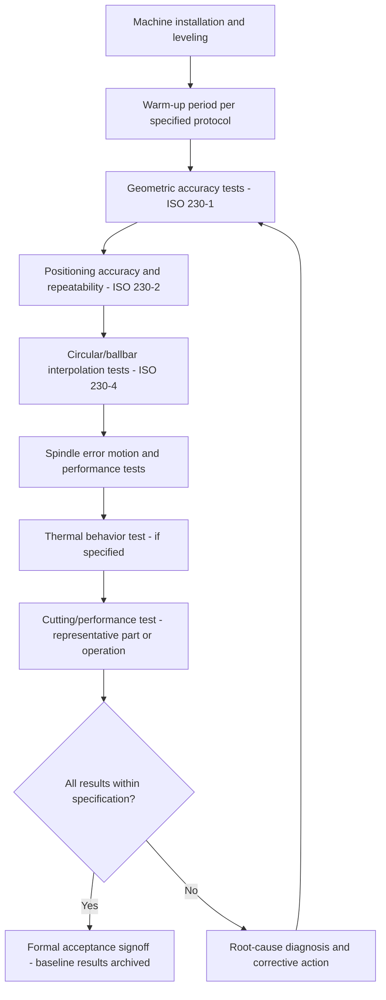

## Machine Tool Acceptance Testing

### Fundamental Principle

Machine tool acceptance testing is the formal, standardized verification process performed at machine installation (or following major rebuild/relocation) to confirm that a machine tool meets its specified geometric, positioning, and performance requirements before formal handover from builder to purchaser. Acceptance testing synthesizes the individual measurement techniques covered elsewhere in this chapter — geometric accuracy testing, positioning and straightness measurement, squareness and angular error measurement, spindle error analysis, ballbar testing, and thermal behavior assessment — into a structured, contractually referenced test protocol whose results form the basis for commercial acceptance, warranty terms, and the baseline reference for all future machine health monitoring.

### Test Categories

#### Geometric Accuracy Tests

**Key Points**

- Verifies static geometric relationships within the machine structure — straightness, flatness, parallelism, perpendicularity (squareness), and alignment of key reference surfaces and axes — typically performed with the machine at rest or under quasi-static conditions per **ISO 230-1**.
- Uses instruments including precision levels, straightedges, test mandrels, dial indicators, autocollimators, and laser interferometer angular/straightness optics, often building directly on techniques detailed in related chapter items (positioning/straightness measurement, squareness/angular measurement).
- Establishes the fundamental structural integrity and assembly correctness of the machine, independent of the numerical control system's software compensation.

#### Positioning Accuracy and Repeatability Tests

**Key Points**

- Verifies that each numerically controlled axis achieves specified positioning accuracy ($A$) and repeatability ($R$) per **ISO 230-2**, typically via laser interferometer measurement across the full travel range with bidirectional target approaches (see related positioning/straightness chapter item for full methodology).
- Results are compared directly against the machine builder's published specification or contractually agreed acceptance criteria, forming one of the most commonly disputed or scrutinized elements of acceptance testing given its direct, quantitative pass/fail nature.

#### Circular/Interpolation Tests

**Key Points**

- Ballbar testing per **ISO 230-4** (see related chapter item) is commonly included in acceptance protocols as a rapid, standardized check of combined squareness, backlash, and servo-matching performance across relevant machine planes.
- Circular interpolation tests validate that the coordinated multi-axis contouring performance meets specification, complementing the single-axis focus of positioning accuracy tests.

#### Spindle Performance Tests

Spindle error motion characterization (per **ANSI/ASME B89.3.4**, see related chapter item), along with spindle speed accuracy, power/torque verification, and thermal growth behavior, confirms that the spindle — often the most critical rotating element for part quality — meets specification.

#### Thermal Behavior Tests

**Key Points**

- Some acceptance protocols include a defined thermal test sequence (e.g., running the machine through a specified duty cycle or warm-up period while monitoring positional drift) to characterize thermal error behavior and, where applicable, verify the effectiveness of any thermal compensation system (see related chapter item) under realistic operating conditions.
- Thermal testing is less universally standardized in scope and pass/fail criteria compared to geometric and positioning tests, often negotiated specifically between builder and purchaser based on the criticality of thermal stability for the intended application.

#### Cutting/Performance Tests

**Key Points**

- Practical machining tests — cutting a defined test part or performing specified material removal operations — verify real-world performance including surface finish, dimensional accuracy of machined features, and process stability (absence of chatter) under representative cutting conditions.
- These tests bridge the gap between idealized no-load geometric/positioning metrics and actual production capability, capturing effects (cutting force deflection, chip evacuation, coolant delivery adequacy) not addressed by no-load geometric testing alone.

### Acceptance Testing Sequence

**Key Points**

- Test sequence order matters: geometric and positioning tests are typically performed before cutting/performance tests, since underlying geometric or positioning deficiencies should be resolved before performance results (which depend on the geometric foundation) can be meaningfully interpreted.
- Environmental conditions (ambient temperature, humidity, vibration isolation from surrounding shop activity) must be documented and, where required by the acceptance specification, controlled within defined tolerances, since test results are only meaningful and comparable when the measurement conditions are known and appropriate.

### Standards and Specification Framework

**Key Points**

- **ISO 230 series** (parts 1, 2, and 4 most directly relevant, alongside other parts addressing specific test types such as thermal effects in ISO 230-3) provides the internationally recognized foundation for acceptance test methodology and terminology.
- **ASME B5.54** provides an analogous, widely used North American standard specifically for machining center performance evaluation, often referenced in acceptance contracts for machines sold into that market.
- Machine-type-specific standards exist for particular machine categories (e.g., specific standards for grinding machines, turning centers, gear-cutting machines) that adapt the general test principles to the particular geometric and functional characteristics relevant to that machine type.
- Contractual acceptance criteria are typically negotiated based on, but may deviate from, the referenced standard's default test conditions and tolerance values — purchase specifications often include customer-specific tolerance requirements tighter than a manufacturer's general published specification, particularly for precision-critical applications.

### Documentation and Baseline Establishment

**Key Points**

- Acceptance test results are formally documented and archived, serving not only as the basis for commercial acceptance but as the **baseline reference dataset** against which all future periodic health monitoring, ballbar trending, and recalibration verification are compared.
- Complete documentation typically includes: raw measurement data, environmental conditions during testing, instrument calibration certificates (ensuring traceability of the acceptance measurement itself), and the specific software/firmware version and machine configuration at the time of test, since subsequent configuration changes could otherwise confound future comparison against the baseline.
- This baseline is particularly valuable for warranty dispute resolution and for distinguishing genuine machine degradation from measurement variability in future comparative testing.

### Roles and Responsibilities

**Key Points**

- Acceptance testing is typically performed jointly by machine builder representatives and purchaser (or purchaser's designated third-party metrology service), with agreed-upon test procedures, instruments, and pass/fail criteria established in advance — often specified in the original purchase contract or a separately negotiated acceptance test plan.
- Independent third-party verification (using a metrology service provider not affiliated with the machine builder) is sometimes employed for high-value or precision-critical machine purchases to provide impartial confirmation of specification compliance.
- Instrument traceability and calibration currency for all measurement equipment used in acceptance testing (laser interferometer, ballbar, spindle error analyzer) must itself be verified and documented, since the acceptance result is only as credible as the calibration status of the instruments used to obtain it.

### Common Sources of Acceptance Testing Disputes

**Key Points**

- **Environmental condition mismatches**: results obtained under different ambient temperature or vibration conditions than specified can produce disputed results, particularly for thermally sensitive machines or precision-critical positioning specifications.
- **Warm-up state differences**: whether the machine was tested "cold" versus after a specified warm-up period significantly affects results for machines with substantial thermal error contribution, making warm-up protocol specification a common point requiring clear contractual definition.
- **Instrument and methodology discrepancies**: differences in the specific instrument, setup methodology, or even software algorithm version used to compute derived metrics (e.g., positioning accuracy statistics) between builder and purchaser measurement teams can produce apparently conflicting results from nominally the same underlying machine condition.
- **Ambiguous specification language**: contractual specifications that do not clearly reference a specific standard version, test condition set, or statistical treatment method can lead to differing interpretations of what constitutes a passing result.

### Comparative Summary of Test Categories

| Test Category | Primary Standard | What It Verifies |
| --- | --- | --- |
| Geometric accuracy | ISO 230-1 | Static structural alignment, straightness, squareness |
| Positioning accuracy/repeatability | ISO 230-2 | Axis positioning performance under NC control |
| Circular/interpolation | ISO 230-4 | Combined coordinated multi-axis contouring performance |
| Spindle error motion | ANSI/ASME B89.3.4 | Rotational accuracy of spindle |
| Thermal behavior | ISO 230-3 (where applicable) | Thermally-induced drift and compensation effectiveness |
| Cutting/performance | Custom/negotiated | Real-world part-making capability under load |

### Practical Considerations

**Key Points**

- Clear, unambiguous specification of test conditions (environmental, warm-up state, instrument type, statistical treatment) in the purchase contract or acceptance test plan substantially reduces the risk of post-test disputes and rework.
- Allowing adequate time in the acceptance schedule for potential corrective action and re-testing (rather than a single pass/fail attempt) is prudent given the complexity of multi-axis machine tool systems and the possibility of legitimate, resolvable issues discovered during testing.
- The acceptance test baseline's long-term value for ongoing machine health monitoring is maximized when the same or comparable measurement methodology (instruments, procedures) is used for both the initial acceptance test and subsequent periodic verification testing, preserving direct comparability over the machine's service life.

**Related Topics**

- ISO 230-1, 230-2, 230-3, and 230-4 detailed test methodology
- ASME B5.54 machining center performance evaluation
- Warranty and contractual specification drafting for machine tool procurement
- Instrument calibration traceability requirements for acceptance testing
- Baseline data management for long-term machine health trending
- Third-party metrology verification services for precision machine acceptance