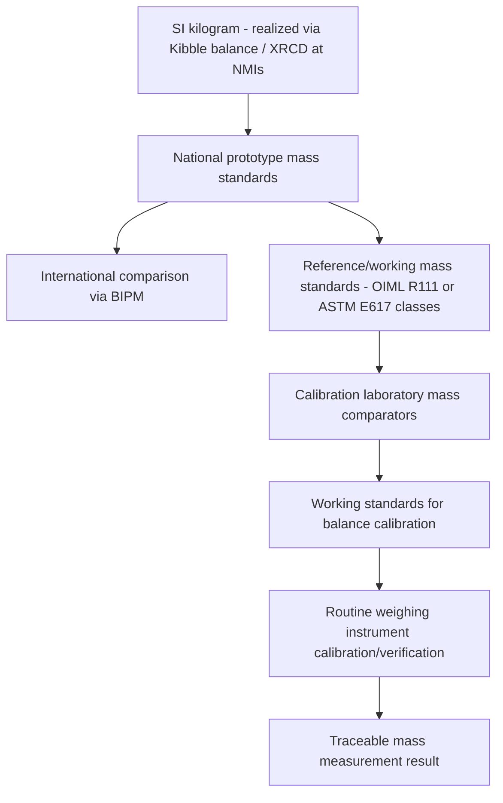

## Mass Metrology and Weighing Instruments

### Fundamental Principle

Mass metrology is the science of accurately determining mass through comparison against traceable reference standards, ultimately linked to the SI definition of the kilogram. Since the 2019 SI redefinition, the kilogram is defined by fixing the numerical value of the Planck constant $h$ at $6.62607015 \times 10^{-34}\ \text{J·s}$, realized in practice through primary methods such as the Kibble balance (relating mass to electrical and mechanical quantities) or the X-ray crystal density (XRCD) method (relating mass to the Avogadro constant via a silicon sphere). For nearly all practical mass measurement, however, traceability flows through a hierarchical chain of physical mass standards and comparator weighing instruments rather than direct primary realization, which remains the province of national metrology institutes (NMIs).

### The SI Kilogram Realization

**Key Points**

- **Kibble balance (watt balance)**: measures mass by electromechanically balancing gravitational force against an electromagnetic force, relating mass to the Planck constant, electrical quantities (via the Josephson and quantum Hall effects), and local gravitational acceleration.
- **X-ray crystal density (XRCD) method**: determines the Avogadro constant (and hence mass) using a nearly perfect single-crystal silicon sphere of accurately known volume, atomic spacing, and isotopic composition.
- Multiple independent primary realizations (Kibble balances and XRCD spheres at various NMIs worldwide) are compared and averaged to establish the internationally accepted value, providing redundancy and cross-validation of the kilogram's physical realization.
- These primary methods achieve relative uncertainties on the order of parts in $10^8$, but are research-grade realizations performed at a small number of NMIs — not the method by which everyday mass calibration is performed.

### Mass Standards Hierarchy

**Key Points**

- **Primary/prototype mass standards**: national kilogram prototypes maintained by NMIs, periodically compared against primary realizations (Kibble balance/XRCD results) and against each other via international comparisons coordinated by the BIPM (International Bureau of Weights and Measures).
- **Reference/working standards**: precision mass sets (typically stainless steel or other stable alloys, often in OIML or ASTM defined classes) used within calibration laboratories, disseminated down through successive comparison steps from NMI-level standards.
- **Class designations**: internationally recognized classification systems — notably **OIML R111** (classes E1, E2, F1, F2, M1, M2, M3) and **ASTM E617** (classes 0 through 7) — define tolerance limits, material, and construction requirements for mass standards at each accuracy level, enabling clear specification of required standard accuracy for a given calibration or weighing application.

### Weighing Instrument Types

#### Mechanical Balances

**Key Points**

- **Equal-arm balances**: historically the primary precision weighing instrument, comparing an unknown mass against a reference standard via a symmetric lever mechanism, with sensitivity dependent on beam geometry and knife-edge fulcrum quality; largely superseded by electronic instruments for routine use but still referenced in metrological principle discussions and retained in some specialized high-precision comparator applications.
- **Analytical mechanical balances** (historical): used sensitive beam mechanisms with optical or vernier readout; now largely obsolete in favor of electronic instruments.

#### Electronic Balances

**Key Points**

- **Electromagnetic force restoration (EMFR) balances**: the dominant modern precision weighing technology, in which the load is balanced by an electromagnetic force generated by a current-carrying coil in a magnetic field; the current required to restore mechanical equilibrium is precisely measured and directly related to the applied mass/weight — the working principle in most analytical and precision laboratory balances today.
- **Strain gauge load cells**: measure the deformation of an elastic element (typically a metal beam or column) under load via bonded strain gauges in a Wheatchtone bridge configuration; widely used in industrial and higher-capacity weighing applications (platform scales, truck scales) where extreme precision is secondary to robustness and range.
- **Capacitive and other electronic sensing principles**: less common alternative sensing mechanisms used in specific specialized weighing instrument designs.

#### Mass Comparators

**Key Points**

- Specialized high-precision instruments designed specifically for direct comparison between two (or more) mass standards of very similar nominal value, rather than general-purpose weighing of arbitrary objects — used in calibration laboratories for mass standard dissemination and verification.
- Achieve extremely high resolution and repeatability (often resolving differences at the microgram level or better, depending on comparator class and nominal mass), since the comparison design (near-identical nominal masses) allows many systematic effects to largely cancel.

### Weighing Uncertainty Sources

#### Air Buoyancy

**Key Points**

- Because weighing is performed in air rather than vacuum, the measured apparent mass differs from true mass due to the buoyant force of displaced air, which depends on the density of air (itself a function of temperature, pressure, humidity, and $CO_2$ content) and the density of the object being weighed relative to the reference standard's density.
- Air buoyancy correction is particularly significant when comparing objects of substantially different density (e.g., comparing a low-density object against a stainless steel reference standard), and is a standard, well-established correction in precision mass metrology.

$$m_{true} = m_{apparent} + m_{apparent}\left(\frac{\rho_{air}}{\rho_{standard}} - \frac{\rho_{air}}{\rho_{object}}\right)$$

approximately, where $\rho_{air}$, $\rho_{standard}$, and $\rho_{object}$ are the densities of air, the reference standard, and the object under test respectively (the exact form depends on the specific comparison configuration).

#### Environmental Factors

**Key Points**

- **Air currents/drafts**: even small air movement across a balance pan can introduce significant weighing instability, motivating draft shields and controlled-airflow weighing rooms for high-precision applications.
- **Temperature gradients**: thermal gradients between the object being weighed and the balance mechanism/environment can cause convective air currents and thermal expansion effects that introduce measurement drift.
- **Electrostatic charge**: particularly relevant for lightweight, non-conductive samples, static charge can produce spurious electrostatic forces that bias weighing results; mitigated through ionization or grounding measures.
- **Magnetic effects**: samples with residual magnetism can interact with the balance's internal mechanism (particularly relevant for EMFR balances with internal magnetic components), introducing measurement bias requiring magnetic susceptibility screening for sensitive applications.
- **Vibration**: mechanical vibration transmitted through the supporting surface can degrade balance reading stability, particularly for high-resolution analytical and microbalances, motivating vibration-isolated weighing table installations.

#### Instrument-Specific Effects

- **Off-center loading (corner load) error**: deviation in reading when a load is placed off the balance pan's geometric center, arising from mechanical linkage geometry; characterized and specified as part of balance performance verification.
- **Linearity and hysteresis**: deviation of the balance's response from a perfectly linear relationship across its measurement range, and any difference in reading depending on whether a given load is approached from above or below.
- **Drift**: gradual change in zero-point or sensitivity over time, requiring periodic internal or external calibration/adjustment.

### Calibration and Traceability Workflow

### Weighing Procedures and Best Practices

**Key Points**

- **Substitution weighing**: a comparison method in which the unknown mass and a reference standard are alternately placed on the same balance position, canceling certain systematic balance errors (e.g., arm-length inequality in mechanical balances) that would otherwise bias a simple simultaneous comparison.
- **ABBA weighing sequences**: a standard protocol (reference-unknown-unknown-reference, or similar patterns) used in mass comparator measurements to average out linear drift in the balance's zero point over the course of a measurement sequence.
- **Thermal equilibration**: objects being weighed, particularly reference standards, should be allowed to reach thermal equilibrium with the weighing environment before measurement, since temperature differences can introduce convective and buoyancy-related errors.
- **Handling protocols**: use of forceps, gloves, or other non-contact handling tools for precision mass standards to avoid contamination from skin oils and to prevent surface mass changes over time.

### Standards Framework

**Key Points**

- **OIML R111** (International Organization of Legal Metrology) defines internationally harmonized weight classes (E1, E2, F1, F2, M1, M2, M3), specifying maximum permissible error, material, and construction requirements.
- **ASTM E617** provides an analogous classification system (classes 0–7) widely referenced in North American mass metrology practice.
- **OIML R76** and national legal metrology regulations govern non-automatic weighing instruments used in legal-for-trade applications (commercial scales), including type approval and verification requirements distinct from laboratory calibration standards.

### Comparative Summary

| Instrument/Standard Type | Typical Application | Key Characteristic |
| --- | --- | --- |
| Kibble balance / XRCD | Primary SI kilogram realization | NMI-level, research-grade, parts-in-$10^8$ uncertainty |
| Mass comparator | Standard-to-standard calibration | Extremely high resolution for near-identical nominal masses |
| EMFR electronic balance | Laboratory/analytical weighing | High precision, direct electronic readout |
| Strain gauge load cell | Industrial/high-capacity weighing | Robust, wide range, lower relative precision |
| OIML R111 / ASTM E617 class weights | Reference standards at all levels | Defines tolerance and material requirements by class |

### Practical Considerations

**Key Points**

- Selection of appropriate mass standard class and balance resolution should match the actual accuracy requirement of the application — over-specifying precision equipment for routine, non-critical weighing introduces unnecessary cost and calibration burden.
- Environmental control (temperature stability, draft protection, vibration isolation) becomes increasingly critical as required weighing precision increases, with the most demanding applications (microbalance and comparator work) requiring dedicated, environmentally controlled weighing rooms.
- Routine internal calibration checks (using an in-situ reference standard) between full external calibration cycles help detect balance drift or malfunction promptly, complementing rather than replacing periodic full traceable calibration.

**Next Steps**

- Kibble balance operating principle and quantum electrical standard integration
- Air buoyancy correction calculation methodology in detail
- OIML R111 and ASTM E617 weight class specifications
- Mass comparator ABBA weighing sequence design and drift correction
- Legal metrology requirements for commercial weighing instruments (OIML R76)
- Uncertainty budget construction for precision mass calibration