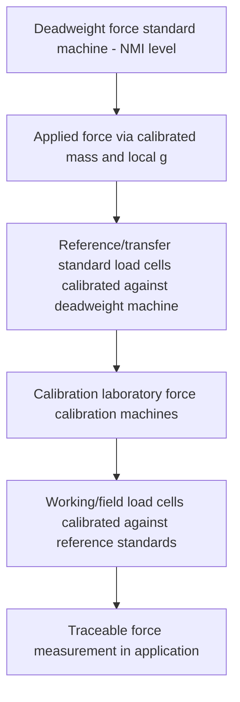

## Force Measurement and Load Cells

### Fundamental Principle

Force measurement quantifies the mechanical push or pull acting on a system, traceable to the SI derived unit of the newton, defined via the base units of mass, length, and time ($1\ \text{N} = 1\ \text{kg·m/s}^2$). Because force cannot be measured as directly as mass (there is no primary force artifact analogous to a mass standard), force metrology relies fundamentally on **deadweight force standard machines**, which generate known force by applying calibrated masses under precisely known local gravitational acceleration, providing the primary traceability link for essentially all force-measuring transducers, most commonly load cells.

### Primary Force Realization

**Key Points**

- **Deadweight force machines**: apply force via calibrated mass stacks acted upon by local gravitational acceleration, with the applied force computed as $F = mg$, where $g$ is the precisely known local gravitational acceleration (which varies by geographic location and must be determined or corrected for the specific calibration site).
- **Hydraulic amplification / lever-amplified deadweight machines**: used to extend deadweight force realization to higher force ranges than practical with direct mass stacking alone, using calibrated lever or hydraulic amplification of a smaller directly-applied deadweight force.
- Deadweight machines at national metrology institutes achieve the lowest uncertainty force realization and serve as the top of the force traceability pyramid, analogous to the role of mass comparators in mass metrology.

### Load Cell Sensing Technologies

#### Strain Gauge Load Cells

**Key Points**

- The dominant load cell technology: force applied to an elastic structural element (commonly a column, beam, ring, or shear-web configuration) produces a proportional mechanical strain, measured by bonded metallic foil or semiconductor strain gauges arranged in a Wheatstone bridge circuit.
- The Wheatstone bridge configuration (typically a full bridge of four active gauges) provides temperature compensation and maximizes sensitivity to the intended strain component while rejecting common-mode effects (including many forms of off-axis loading and thermal expansion).
- Output is a small differential voltage proportional to applied force, typically requiring precision signal conditioning (amplification, analog-to-digital conversion) for practical use.
- Various elastic element geometries (S-beam, single-point/off-center load cells, shear beam, canister/column-type, double-ended shear beam) are selected based on the specific application's loading configuration, capacity, and environmental requirements.

#### Piezoelectric Load Cells

**Key Points**

- Use piezoelectric crystal elements (typically quartz) that generate an electrical charge proportional to applied force via the direct piezoelectric effect; the resulting charge is measured via a charge amplifier.
- Offer very high stiffness, wide dynamic range, and excellent high-frequency response, making them well suited to dynamic force measurement (impact testing, high-speed force transients) rather than static/long-duration measurement, since the generated charge tends to leak/decay over time (charge leakage), limiting static measurement stability.

#### Hydraulic and Pneumatic Load Cells

Force applied to a diaphragm or piston generates a corresponding pressure change in a hydraulic or pneumatic fluid, measured via a pressure sensor; robust and suited to certain industrial applications (e.g., tank/hopper weighing) but generally offering lower precision than strain gauge technology for laboratory-grade force metrology.

#### Capacitive Load Cells

Force-induced displacement changes the gap (and thus capacitance) between two plates; offers high resolution and low hysteresis in certain specialized designs, though less common than strain gauge technology for general-purpose force measurement.

### Traceability Chain for Force Measurement

### Load Cell Calibration

**Key Points**

- Load cells are calibrated by applying a sequence of known forces (typically from a deadweight machine or a calibrated reference/transfer standard load cell traceable to one) across the cell's rated capacity, recording output at each applied force point in both increasing and decreasing sequences to characterize hysteresis.
- Standard calibration protocols (such as those defined in **ASTM E74** in North America or equivalent international standards) specify the number of load points, repetition requirements, and statistical treatment for deriving the load cell's calibration equation (relating output signal to applied force) and associated uncertainty.
- Load cell performance is characterized by parameters including nonlinearity, hysteresis, repeatability, creep (output drift under sustained constant load), and temperature sensitivity (both zero-point shift and sensitivity shift with temperature) — each contributing to the overall calibration uncertainty and rated accuracy class.

### Sources of Measurement Uncertainty

**Key Points**

- **Off-axis loading (side load, eccentric load, bending moment)**: most load cells are designed to measure force along a specific intended axis; loading with any off-axis component (lateral force, moment, or eccentric application point) introduces error unless the specific cell design incorporates compensation for such effects.
- **Temperature effects**: strain gauge material properties (gauge factor) and elastic modulus of the load cell's structural element both vary with temperature, requiring either careful thermal control during precision measurement or a load cell design incorporating temperature compensation circuitry.
- **Creep**: viscoelastic behavior of the load cell's structural element and adhesive bonding of strain gauges can cause output drift under sustained constant load, particularly relevant for long-duration static force measurement applications.
- **Installation effects**: mounting hardware, connecting rod alignment, and load introduction geometry in the actual application can introduce error not present during the load cell's isolated calibration, motivating in-situ system-level verification where practical for critical applications.
- **Local gravitational acceleration variation**: since deadweight force realization depends on local $g$, force standards and load cells calibrated in one geographic location carry an implicit dependence on the calibration site's gravitational acceleration, requiring correction if extremely high accuracy transfer between significantly different-latitude/altitude locations is required. [Unverified — the practical significance of this effect depends heavily on the required accuracy level and specific application; for most industrial force measurement it is negligible.]

### Force Standards and Classification

**Key Points**

- **ASTM E74** ("Standard Practice for Calibration and Load Verification of Universal Testing Machines") governs force verification/calibration practice widely used in North America for materials testing machine force measurement.
- **ISO 376** provides an internationally recognized standard for calibration of force-proving instruments (including load cells) used for verifying uniaxial testing machines, defining accuracy classes based on demonstrated performance criteria (including reproducibility, interpolation error, and zero return).
- Load cells and force transducers are often classified by accuracy class per these standards, enabling clear specification of required transducer performance for a given testing or measurement application.

### Applications

**Key Points**

- **Materials testing machines**: tensile, compression, and fatigue testing machines rely on load cells as the primary force-measuring element, with calibration traceability directly affecting the validity of resulting material property measurements (yield strength, ultimate tensile strength, elastic modulus).
- **Industrial process weighing and force monitoring**: platform scales, tank/hopper weighing systems, and process force monitoring in manufacturing (e.g., press force monitoring, torque-to-force conversion in fastening applications).
- **Structural and geotechnical monitoring**: load cells embedded or installed in structural elements (bridges, foundations, anchors) for long-term force/load monitoring, often requiring different design considerations (long-term stability, environmental sealing) than laboratory-grade cells.
- **Aerospace and automotive testing**: high-precision force measurement in component and structural testing, crash testing, and engine thrust measurement, often requiring dynamic response characteristics beyond static accuracy alone.

### Comparative Summary

| Technology | Typical Application | Key Strength | Key Limitation |
| --- | --- | --- | --- |
| Strain gauge | General-purpose static/quasi-static force measurement | Wide range of designs, good accuracy, mature technology | Temperature sensitivity, creep |
| Piezoelectric | Dynamic/impact force measurement | Excellent high-frequency response, high stiffness | Charge leakage limits static measurement |
| Hydraulic/pneumatic | Industrial process weighing | Robust, simple | Lower precision than strain gauge |
| Capacitive | Specialized high-resolution applications | Low hysteresis, high resolution | Less common, more specialized |

### Practical Considerations

**Key Points**

- Load cell selection should match not only the required force range and accuracy class but also the specific loading geometry (axial, shear, eccentric) and environmental conditions (temperature range, presence of side loads, dynamic vs. static loading) of the intended application.
- Periodic recalibration intervals should reflect usage intensity, environmental exposure, and the criticality of the measurements relying on the load cell, consistent with general metrological equipment management practice.
- System-level verification (calibrating the complete measurement chain — load cell, signal conditioning, and readout/data acquisition system together) provides more representative accuracy assessment than load cell calibration alone, since signal conditioning and data acquisition components contribute their own uncertainty to the overall measurement result.

**Related Topics**

- ASTM E74 and ISO 376 force calibration standards in detail
- Deadweight force standard machine design and hydraulic amplification methods
- Wheatstone bridge circuit design for strain gauge signal conditioning
- Torque measurement and its relationship to force metrology
- Dynamic force measurement techniques for impact and high-speed testing
- Structural health monitoring using embedded load cells