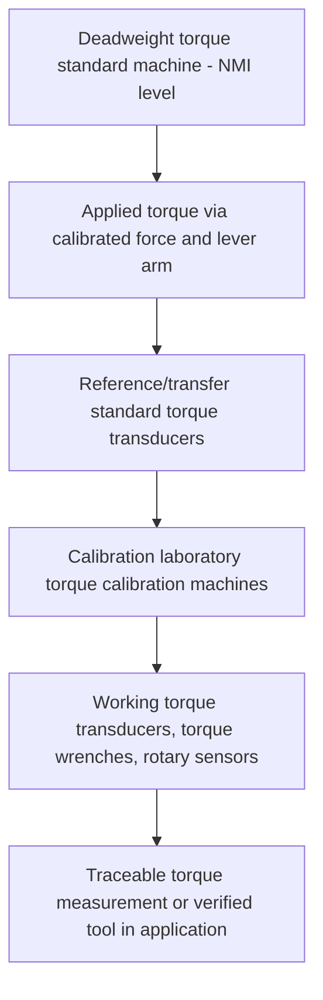

## Torque Measurement and Calibration

### Fundamental Principle

Torque measurement quantifies the rotational analog of force — a moment tending to produce rotation about an axis — traceable to the SI derived unit of the newton-meter ($\text{N·m}$), defined as the product of an applied force and the perpendicular distance (lever arm) from the axis of rotation to the line of action of that force. Torque metrology shares conceptual foundations with force metrology (see related chapter item) but introduces distinct measurement challenges related to the geometric lever-arm relationship, rotational dynamics, and the wide variety of practical torque-generating and torque-sensing configurations encountered in industrial and laboratory applications, from fastener tightening verification to rotating machinery power/torque measurement.

$$\tau = F \times r$$

where $\tau$ is torque, $F$ is applied force, and $r$ is the perpendicular lever arm distance (more generally, $\vec{\tau} = \vec{r} \times \vec{F}$ as a vector cross product).

### Primary Torque Realization

**Key Points**

- **Deadweight torque standard machines**: the primary reference method, applying a precisely known force (via calibrated deadweight masses acted upon by local gravitational acceleration, analogous to deadweight force machines) at a precisely known, calibrated lever arm length, yielding torque via $\tau = F \times r$.
- Lever arm length calibration and force application perpendicularity (ensuring the applied force vector remains truly perpendicular to the lever arm throughout any small angular deflection during measurement) are critical precision requirements for deadweight torque machine accuracy.
- National metrology institutes maintain deadweight torque standard machines across a range of capacities, serving as the top of the torque traceability pyramid, analogous to the role of deadweight force machines in force metrology.

### Torque Transducer Sensing Technologies

#### Strain Gauge Torque Transducers

**Key Points**

- The dominant torque sensing technology: strain gauges bonded to a shaft or structural element (commonly at 45° to the shaft axis, aligned with the principal strain directions produced by pure torsional loading) measure the shear strain proportional to applied torque, arranged in a Wheatstone bridge configuration for signal output and temperature compensation.
- **Reaction (static) torque transducers**: measure torque in a non-rotating shaft or fixture, commonly used for fastener/bolt torque verification and static torque wrench calibration, where the transducer itself does not rotate during measurement.
- **Rotary (in-line) torque transducers**: measure torque in a continuously rotating shaft, requiring a method to transmit the strain gauge signal from the rotating element to stationary signal conditioning electronics — historically via slip rings, and in modern designs increasingly via rotary transformers or wireless (RF/inductive) telemetry, which offer improved reliability and reduced maintenance compared to contact-based slip ring systems.

#### Surface Acoustic Wave (SAW) Torque Sensors

Use the shift in acoustic wave propagation characteristics on a piezoelectric substrate (bonded to or integrated with the rotating shaft) induced by torsional strain, enabling passive, wireless torque sensing particularly suited to compact rotating shaft applications where slip rings or telemetry power supplies are impractical.

#### Magnetoelastic Torque Sensors

Exploit the change in magnetic permeability of certain materials under mechanical stress (the magnetoelastic or Villari effect) to sense shaft torque non-contact, via a sensing coil detecting the stress-induced permeability change without requiring bonded strain gauges or slip contact — used in some automotive and industrial rotating shaft applications.

### Torque Wrench and Hand Tool Verification

**Key Points**

- **Click-type torque wrenches**: mechanical wrenches that produce a tactile/audible "click" signal upon reaching a preset torque value, calibrated by verifying the actual applied torque at the click point against a reference torque transducer or deadweight standard across the wrench's rated range.
- **Dial/beam-type torque wrenches**: provide continuous torque reading via a calibrated deflection mechanism (dial indicator or beam deflection with pointer), calibrated similarly by comparison against a reference standard at multiple points across the range.
- **Electronic torque wrenches**: incorporate integrated strain gauge sensing and digital display/data logging, calibrated using the same fundamental comparison methodology as mechanical wrenches but with electronic output enabling more detailed data capture and traceability documentation.
- Torque wrench calibration standards (such as **ASME B107.300** in North America or **ISO 6789** internationally) define calibration procedures, required number of test points, and maximum permissible error criteria by accuracy class.

### Torque Calibration Workflow

### Sources of Measurement Uncertainty

**Key Points**

- **Bending moment and axial force sensitivity**: torque transducers are designed to respond specifically to torsional (shear) strain; any superimposed bending moment or axial force from misalignment in the test setup can introduce cross-sensitivity error unless the transducer design incorporates adequate rejection of these off-axis loads.
- **Angular velocity effects (rotary transducers)**: for rotating torque measurement, signal transmission method (slip ring contact noise, telemetry signal integrity) and any speed-dependent mechanical effects (bearing friction changes, dynamic balance) can introduce measurement uncertainty not present in static/reaction torque measurement.
- **Coupling and fixture compliance**: flexible or improperly aligned couplings between the torque source and the transducer under calibration can introduce measurement artifacts, particularly for dynamic or rapidly applied torque.
- **Friction in torque wrench mechanisms**: mechanical click-type wrenches are subject to internal friction effects that can vary with wrench angle, application rate, and mechanism wear, contributing to the wrench's inherent accuracy limitations independent of the calibration process itself.
- **Temperature effects**: as with strain gauge force transducers, temperature-dependent gauge factor and elastic modulus variation affect torque transducer output, requiring thermal compensation or controlled calibration environment for precision applications.

### Static vs. Dynamic Torque Measurement

**Key Points**

- **Static torque measurement**: torque applied under quasi-steady, non-rotating (or very slowly rotating) conditions — the standard configuration for fastener torque verification, torque wrench calibration, and most deadweight-machine-based primary calibration.
- **Dynamic torque measurement**: torque measured during continuous rotation under load, relevant to rotating machinery applications (engine/motor torque, drivetrain testing, power measurement via torque × angular velocity), introducing additional considerations of signal transmission from the rotating element and potential dynamic/vibrational effects not present in static measurement.
- Power calculation from dynamic torque measurement follows $P = \tau \omega$, where $\omega$ is angular velocity in radians per second, linking torque metrology directly to power/energy measurement in rotating machinery testing.

### Standards Framework

**Key Points**

- **ISO 6789** (two-part standard) specifies requirements and calibration methodology for hand-operated torque tools (wrenches and screwdrivers), including both minimum requirements (Part 1) and calibration method/uncertainty determination (Part 2).
- **ASME B107.300** provides an analogous North American standard for torque wrench performance requirements and testing.
- **DIN 51309** and related standards address calibration of torque measuring devices (transducers) more broadly, including deadweight torque standard machine practices, particularly referenced in European metrology practice.
- Torque transducer accuracy classification (analogous to force transducer classes per ISO 376) defines permissible interpolation error, reproducibility, and related performance criteria used to specify required transducer performance for a given calibration or measurement application.

### Applications

**Key Points**

- **Fastener/bolt torque verification**: ensuring critical fastener joints (automotive, aerospace, structural, pressure vessel) are tightened to specified torque values, directly affecting joint integrity and safety, making torque wrench calibration traceability a safety-critical metrological function in many industries.
- **Engine and drivetrain testing**: dynamic torque measurement on dynamometers for engine/motor performance characterization, combined with rotational speed measurement to derive power output.
- **Manufacturing process monitoring**: torque monitoring in automated fastening/assembly processes (e.g., production line torque-controlled tightening systems) for quality assurance and traceable production records.
- **Material testing**: torsional testing machines for material shear modulus and torsional strength characterization rely on calibrated torque measurement analogous to the role of load cells in tensile/compression testing.

### Comparative Summary

| Sensing Technology | Configuration | Key Application |
| --- | --- | --- |
| Strain gauge (reaction) | Static, non-rotating | Torque wrench calibration, static fastener verification |
| Strain gauge (rotary, slip ring/telemetry) | Dynamic, rotating | Engine/drivetrain testing, rotating machinery power measurement |
| Surface acoustic wave (SAW) | Dynamic, rotating, passive/wireless | Compact rotating shaft applications |
| Magnetoelastic | Dynamic, rotating, non-contact | Automotive and industrial shaft torque sensing |

### Practical Considerations

**Key Points**

- Selection between static (reaction) and rotary torque transducer configurations should be driven by the actual application requirement — using a rotary transducer for a fundamentally static verification task (e.g., simple torque wrench calibration) introduces unnecessary complexity and potential additional uncertainty sources compared to a purpose-built static reference standard.
- Proper alignment and coupling design between the torque source and the transducer/tool under test is essential to avoid bending moment and axial force cross-sensitivity errors, particularly for high-accuracy calibration applications.
- Calibration interval and verification frequency for torque wrenches used in safety-critical fastening applications should reflect usage frequency and the criticality of the joints being torqued, consistent with applicable industry quality and safety standards.

**Next Steps**

- ISO 6789 Part 1 and Part 2 detailed calibration methodology
- Deadweight torque standard machine design and lever arm calibration
- Rotary torque transducer telemetry and slip ring signal transmission methods
- Power measurement via combined torque and rotational speed sensing
- Bolted joint torque-tension relationship and fastener verification practices
- Torsional material testing and shear modulus determination