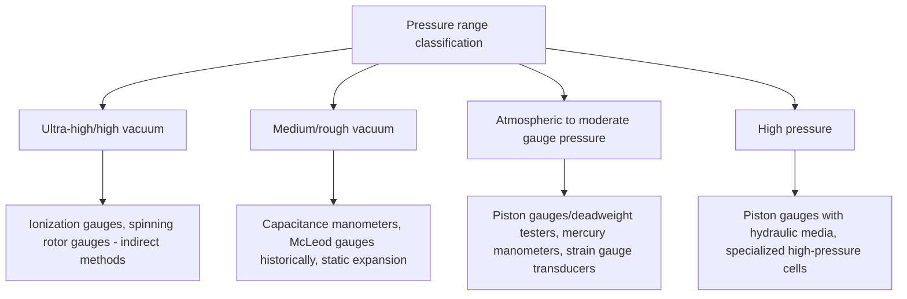

## Pressure Measurement and Calibration

### Fundamental Principle

Pressure measurement quantifies force distributed over an area, traceable to the SI derived unit of the pascal ($1\ \text{Pa} = 1\ \text{N/m}^2$), and is fundamentally realized through the same primary mechanism as force metrology: known force applied over a precisely defined area. Pressure metrology encompasses an exceptionally wide dynamic range — from ultra-high vacuum (below $10^{-10}\ \text{Pa}$) through atmospheric pressure to extreme high pressure (gigapascal range in specialized applications) — with distinct primary standards, instrumentation, and calibration methods appropriate to different regions of this range.

$$P = \frac{F}{A}$$

### Primary Pressure Realization

#### Piston Gauges (Deadweight Testers)

**Key Points**

- The primary reference standard across the low-to-high gauge/absolute pressure range: a precisely machined piston-cylinder assembly, onto which calibrated masses are applied, generates a known pressure equal to the applied force (mass × local gravitational acceleration) divided by the piston's effective area.
- Effective area (accounting for slight elastic distortion of the piston-cylinder assembly under pressure, and any small clearance-gap flow effects) must be precisely characterized, typically via dimensional measurement and cross-comparison against other primary standards, as this directly determines the achievable calibration uncertainty.
- Piston gauges achieve relative uncertainties competitive with or exceeding other primary methods across much of the practical pressure range and serve as the workhorse primary/reference standard in most pressure calibration laboratories and NMIs.

#### Mercury and Liquid Column Manometers

**Key Points**

- A column of liquid (traditionally mercury, due to its high density and low vapor pressure) balances the pressure being measured against the hydrostatic pressure of the liquid column height, providing a fundamentally direct realization via $P = \rho g h$, where $\rho$ is the liquid density, $g$ is local gravitational acceleration, and $h$ is the column height.
- Historically the primary pressure standard, particularly for lower pressure ranges and vacuum metrology; still used as a primary/reference standard in some NMI applications, though increasingly supplemented or replaced by piston gauges and other methods due to mercury's toxicity and handling concerns, along with practical column-height limitations at higher pressures.

#### Vacuum-Range Primary Standards

**Key Points**

- **Static expansion systems**: generate known low pressures by expanding a precisely known initial gas quantity/pressure into a precisely known larger volume, computing the resulting pressure from the known volume ratio and gas laws — a primary method for vacuum-range calibration.
- **McLeod gauges**: a specialized mercury-based instrument that compresses a known volume of gas at unknown (low) pressure into a much smaller volume, amplifying the resulting mercury column height to a measurable range, historically important as a primary/reference vacuum standard though largely superseded by other methods in routine modern practice due to mercury handling and gas condensation limitations for certain gas species.

### Pressure Sensor/Transducer Technologies

#### Strain Gauge Pressure Transducers

Applied pressure deforms a diaphragm or Bourdon-tube-like elastic element, with bonded or diffused (piezoresistive) strain gauges measuring the resulting strain in a Wheatstone bridge configuration — conceptually analogous to strain gauge force and torque transducers, widely used across industrial and laboratory pressure measurement applications.

#### Capacitive Pressure Sensors

**Key Points**

- Pressure-induced diaphragm deflection changes the capacitance between the diaphragm and a fixed reference electrode, offering high resolution and good stability, widely used in precision instrumentation and particularly common in capacitance manometers for vacuum and low-pressure measurement due to their combination of high accuracy and gas-species independence.

#### Piezoelectric Pressure Sensors

Similar in principle to piezoelectric force sensors, generating charge proportional to applied pressure; well suited to dynamic pressure measurement (combustion pressure, blast/shock pressure, acoustic pressure) due to excellent high-frequency response, but generally unsuitable for static pressure measurement due to charge leakage over time.

#### Resonant Pressure Sensors

Pressure-induced strain alters the resonant frequency of a vibrating element (often a quartz crystal or silicon microstructure); the frequency shift, rather than an analog voltage, provides the pressure signal, offering excellent long-term stability and resolution in high-precision applications.

#### Bourdon Tube and Mechanical Gauges

A curved, flattened tube that straightens proportionally under internal pressure, mechanically linked to a pointer/dial readout; a long-established, robust, low-cost technology widely used for industrial process pressure indication, though generally offering lower accuracy than electronic transducer technologies.

### Pressure Range Classification and Appropriate Methods

**Key Points**

- At very low (vacuum) pressures, direct mechanical force-per-area methods become impractical, requiring indirect measurement principles: **ionization gauges** infer pressure from ion current generated by gas molecules ionized in an electric field, and **spinning rotor gauges** infer pressure from the gas-molecular-drag-induced deceleration rate of a magnetically levitated spinning ball — both requiring calibration against a primary standard (e.g., static expansion system) since their output depends on gas species and requires empirical calibration constants.
- Different gas species affect vacuum gauge readings differently (composition dependence), a significant practical calibration consideration absent in most higher-pressure liquid/mechanical primary methods.

### Pressure Calibration Workflow

**Key Points**

- Calibration compares the pressure indicated by the unit under test against the pressure generated/realized by the primary or reference standard (piston gauge, manometer, or vacuum primary standard as appropriate to the range) at a series of pressure points spanning the device's rated range, in both increasing and decreasing sequences to characterize hysteresis.
- **Cross-floating**: a comparison technique between two piston gauges (or a piston gauge and another pressure standard) in which the two are connected to the same pressure medium and allowed to reach mechanical equilibrium, with any residual imbalance measured to determine the effective area ratio or calibration relationship between the two instruments.
- Environmental corrections — including local gravitational acceleration (affecting deadweight-based standards), air buoyancy on the piston/mass system, gas or liquid density/thermal expansion, and ambient temperature effects on the piston-cylinder assembly's effective area — are applied following methodology similar in spirit to mass and force metrology corrections.

### Sources of Measurement Uncertainty

**Key Points**

- **Effective area uncertainty**: for piston gauges, uncertainty in the precisely characterized effective area of the piston-cylinder assembly directly propagates into pressure calibration uncertainty, requiring careful dimensional characterization and periodic verification.
- **Local gravitational acceleration**: as with mass and force deadweight standards, the local value of $g$ at the calibration site must be known and applied for accurate deadweight-based pressure realization.
- **Temperature effects**: thermal expansion of the piston-cylinder assembly, and temperature-dependent density of the pressure-transmitting fluid, both introduce temperature-sensitive corrections necessary for precision calibration.
- **Gas species dependence (vacuum gauges)**: ionization and other indirect vacuum gauges require gas-species-specific calibration factors, since their fundamental sensing mechanism (ionization efficiency, molecular drag) varies by gas composition.
- **Elastic distortion under pressure**: at high pressures, elastic distortion of the piston-cylinder assembly itself becomes a more significant fraction of the effective area, requiring pressure-dependent effective area correction models for high-accuracy high-pressure calibration.
- **Head height corrections**: for both liquid manometers and piston gauges, the vertical height difference between the reference plane of the standard and the device under test introduces a hydrostatic pressure offset that must be corrected, particularly significant for gas-media systems at higher pressures or for any liquid-media height differences.

### Standards Framework

**Key Points**

- International and national standards (including guidance documents from organizations such as EURAMET and NIST) provide calibration methodology, uncertainty evaluation guidance, and best-practice procedures for piston gauge and pressure transducer calibration, though pressure metrology practice draws on a somewhat more distributed body of NMI guidance documents and international comparison protocols compared to the more singular standard numbers seen in mass or force metrology. [Unverified — specific standard document numbers vary by region and application; consult current national/international metrology institute guidance for the specific pressure range and application in question.]
- Industrial process pressure instrumentation is additionally subject to relevant national/international instrumentation standards governing accuracy classes, safety, and installation practice specific to the application (process industry, medical, aerospace).

### Applications

**Key Points**

- **Process industry instrumentation**: pressure transmitters and gauges for monitoring and control across chemical, oil and gas, power generation, and manufacturing processes, where calibration traceability supports both process quality and safety-critical protection system function.
- **Barometric and meteorological measurement**: atmospheric pressure measurement for weather monitoring, aviation altimetry reference, and scientific applications.
- **Vacuum process monitoring**: semiconductor fabrication, thin-film deposition, and analytical instrumentation (mass spectrometry, electron microscopy) requiring precisely known and controlled vacuum levels.
- **Medical and pharmaceutical applications**: blood pressure measurement calibration, medical gas system pressure verification, and pharmaceutical process pressure control.
- **Dynamic pressure measurement**: combustion engine cylinder pressure, ballistics/blast testing, and acoustic pressure measurement relying on piezoelectric sensor technology's high-frequency response capability.

### Comparative Summary

| Method/Instrument | Pressure Range | Key Strength | Key Limitation |
| --- | --- | --- | --- |
| Piston gauge (deadweight tester) | Low gauge through high pressure | Primary standard, high accuracy | Requires mass handling, effective area characterization |
| Liquid column manometer | Low to moderate pressure, vacuum | Fundamentally direct realization | Mercury handling concerns, height limitations |
| Static expansion system | Vacuum range | Primary vacuum standard | Complex, NMI-level equipment |
| Ionization/spinning rotor gauge | High/ultra-high vacuum | Only practical method at very low pressure | Gas species dependent, requires calibration |
| Strain gauge/piezoresistive transducer | Wide industrial range | Robust, widely available, good accuracy | Requires calibration against primary standard |
| Piezoelectric sensor | Dynamic pressure | Excellent high-frequency response | Charge leakage limits static measurement |

### Practical Considerations

**Key Points**

- Selection of calibration method and reference standard should match both the pressure range and the required accuracy of the device under test, recognizing that vacuum-range calibration in particular requires gas-species-aware methodology distinct from higher-pressure liquid/mechanical approaches.
- Environmental control (temperature stability, vibration isolation, and for gas-media systems, careful attention to gas purity and moisture content) supports achieving the full accuracy potential of primary pressure standards.
- For dynamic pressure applications, static calibration accuracy alone is insufficient; frequency response characterization (relevant particularly to piezoelectric sensors) should be considered when the application involves rapidly varying pressure signals.

**Related Topics**

- Piston gauge effective area determination and cross-floating methodology
- Vacuum gauge calibration and gas species correction factors
- Static expansion system design for primary vacuum standard realization
- Dynamic pressure sensor frequency response characterization
- Head height and hydrostatic correction methodology in pressure calibration
- Local gravitational acceleration determination for deadweight-based standards