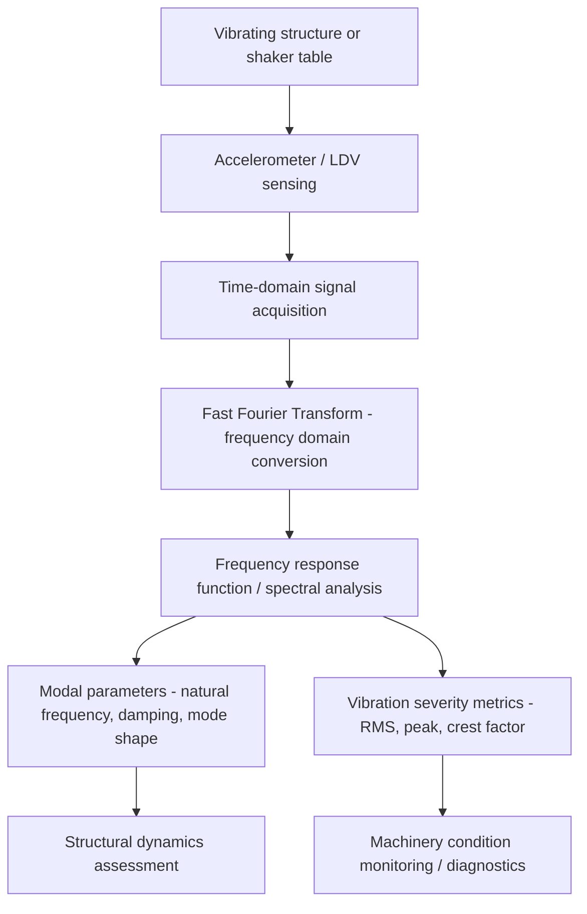

## Vibration and Acceleration Measurement

### Fundamental Principle

Vibration and acceleration measurement quantifies time-varying mechanical motion — displacement, velocity, or acceleration — traceable to the SI derived unit of the meter per second squared ($\text{m/s}^2$) for acceleration, ultimately grounded in the base units of length and time. Unlike the largely static quantities addressed by mass, force, torque, and pressure metrology, vibration measurement is inherently dynamic, requiring instrumentation and calibration methods that characterize frequency-dependent response rather than a single static accuracy figure. Vibration metrology underpins structural health monitoring, machinery condition monitoring, product qualification testing, seismic measurement, and human exposure assessment.

### Primary Vibration Realization

#### Laser Interferometer-Based Primary Calibration

**Key Points**

- The primary reference method for accelerometer calibration: a laser interferometer (typically employing a frequency-stabilized laser source, see related interferometry chapter content) directly measures the displacement of a vibrating shaker table or calibration exciter as a function of time, from which velocity and acceleration are derived by differentiation.
- This method provides the fundamental, most accurate traceability path for vibration transducer calibration, performed at national metrology institutes and top-tier calibration laboratories, since it directly links the mechanical motion to the SI meter via laser wavelength.
- Sinusoidal excitation at a defined frequency and amplitude allows precise characterization of an accelerometer's sensitivity (output signal per unit acceleration) at that specific frequency, with calibration typically performed across a range of frequencies to characterize the device's frequency response.

#### Back-to-Back Comparison Calibration

A reference (previously calibrated) accelerometer is mounted rigidly back-to-back (or side-by-side under controlled conditions) with the accelerometer under test on a common shaker table, and the sensitivity of the test accelerometer is determined by direct comparison against the reference accelerometer's known response — a widely used secondary calibration method offering good accuracy with less specialized equipment than primary laser interferometric calibration.

### Vibration/Acceleration Sensor Technologies

#### Piezoelectric Accelerometers

**Key Points**

- The most widely used accelerometer technology for general vibration measurement: a seismic mass is coupled to a piezoelectric crystal element, and the inertial force of the mass under acceleration generates a proportional electrical charge (or, in built-in-electronics designs, a proportional voltage) via the direct piezoelectric effect.
- Offer wide frequency range (from a few Hz to tens of kHz in typical designs), good linearity, and robust construction, making them the standard choice for machinery condition monitoring, modal testing, and general-purpose vibration measurement.
- **Charge-output** designs require a charge amplifier for signal conditioning, offering flexibility for high-temperature or specialized applications; **IEPE (Integrated Electronics Piezoelectric)** designs incorporate built-in signal conditioning electronics within the sensor housing, providing a simpler low-impedance voltage output at the cost of temperature range limitations imposed by the internal electronics.
- Cannot measure true DC (zero-frequency/static) acceleration due to the fundamental charge-generation mechanism, which inherently responds only to changing (dynamic) force/acceleration.

#### MEMS (Micro-Electromechanical Systems) Accelerometers

**Key Points**

- Capacitive or piezoresistive sensing elements fabricated using semiconductor microfabrication techniques, typically consisting of a suspended proof mass whose displacement under acceleration changes capacitance (capacitive MEMS) or induces strain in an integrated piezoresistive element.
- Capable of true DC response (unlike piezoelectric designs), making them well suited to applications requiring both static (tilt, gravity-referenced orientation) and dynamic acceleration measurement, though generally offering lower frequency range and dynamic range than high-end piezoelectric accelerometers for demanding vibration testing applications.
- Widely deployed in consumer electronics, automotive systems, and increasingly in industrial condition monitoring due to small size, low cost, and integration potential with digital signal processing electronics.

#### Piezoresistive Accelerometers

Use strain-gauge-like piezoresistive elements (often in a Wheatstone bridge configuration) bonded to or integrated with a seismic mass suspension; capable of DC response similar to MEMS designs, often used in shock and high-amplitude transient measurement applications due to robust construction and wide dynamic range.

#### Laser Doppler Vibrometry (LDV)

**Key Points**

- A non-contact optical technique measuring surface velocity via the Doppler frequency shift of laser light reflected from a vibrating surface, providing calibration-grade or direct measurement capability without the mass-loading effects inherent to contact accelerometers (a particular advantage for lightweight or delicate structures, such as MEMS devices, small components, or thin panels, where a mounted accelerometer's own mass could measurably alter the vibration behavior being measured).
- Offers excellent frequency response and is increasingly used both as a primary/reference calibration method and as a direct measurement tool in applications ranging from structural dynamics testing to disk drive and MEMS resonator characterization (see related chapter items on MEMS dynamic metrology).

### Signal and Frequency Domain Characterization

**Key Points**

- Vibration data is typically analyzed in both time domain (raw waveform, peak/RMS levels) and frequency domain (via Fast Fourier Transform, FFT), since frequency-domain analysis reveals the specific frequency content associated with particular fault mechanisms (bearing defects, gear mesh frequencies, imbalance, misalignment) in machinery condition monitoring applications.
- **Modal analysis** (using accelerometers or LDV combined with controlled excitation, such as an impact hammer or electrodynamic shaker) extracts natural frequencies, damping ratios, and mode shapes of a structure, informing structural design validation and providing baseline data referenced elsewhere in this document for machine tool dynamic error characterization (see related chapter item).

### Calibration Standards and Methodology

**Key Points**

- **ISO 16063 series** provides the internationally recognized standard framework for vibration and shock transducer calibration methods, including primary calibration by laser interferometry (ISO 16063-11) and secondary/comparison calibration methods (ISO 16063-21), among other parts addressing specific calibration scenarios.
- Calibration results are typically reported as **sensitivity** (output per unit acceleration, e.g., mV/g or pC/g) as a function of frequency, along with associated measurement uncertainty, since accelerometer sensitivity is generally not perfectly flat across the full usable frequency range.
- **Transverse sensitivity** — the accelerometer's unwanted response to acceleration perpendicular to its intended sensing axis — is also characterized during calibration, as excessive transverse sensitivity can introduce measurement error in applications involving multi-axis or complex vibration environments.

### Sources of Measurement Uncertainty

**Key Points**

- **Mounting effects**: the method of attaching an accelerometer to the test structure (stud mounting, adhesive, magnetic base) affects the achievable frequency response, with different mounting methods exhibiting different resonance/coupling characteristics that can limit the usable frequency range, particularly at higher frequencies.
- **Mass loading**: the accelerometer's own mass can measurably alter the vibration behavior of lightweight structures, introducing a systematic measurement artifact distinct from sensor accuracy per se — a key motivation for non-contact methods like laser Doppler vibrometry in mass-sensitive applications.
- **Cable/connector effects**: for charge-output piezoelectric accelerometers, cable capacitance and triboelectric noise (charge generation from cable flexing) can introduce signal artifacts, particularly relevant in high-vibration or long-cable-run industrial installations.
- **Temperature effects**: piezoelectric material properties and MEMS structural element behavior both exhibit temperature-dependent sensitivity, requiring temperature compensation or controlled calibration/measurement environment for precision applications.
- **Cross-axis/transverse sensitivity**: as noted above, imperfect rejection of off-axis acceleration can bias measurement results in complex multi-directional vibration environments if not adequately characterized and, where necessary, corrected for.

### Applications

**Key Points**

- **Machinery condition monitoring and predictive maintenance**: vibration signature analysis for early detection of bearing wear, gear defects, imbalance, and misalignment in rotating machinery, forming a core industrial reliability engineering practice.
- **Product qualification and environmental testing**: shaker table vibration testing verifies product/component durability against specified vibration profiles (per standards such as MIL-STD-810 or various industry-specific qualification standards), relevant to automotive, aerospace, and electronics product development.
- **Structural health monitoring**: long-term vibration monitoring of bridges, buildings, and other infrastructure to detect changes in structural dynamic behavior indicative of damage or degradation.
- **Seismic measurement**: earthquake and ground motion monitoring using specialized seismometer and strong-motion accelerometer instrumentation, sharing foundational sensing principles with industrial accelerometers but optimized for very low-frequency, low-amplitude, or very high-amplitude transient signals respectively.
- **Human vibration exposure assessment**: occupational health measurement of hand-transmitted and whole-body vibration exposure per relevant occupational health standards, using specialized accelerometer configurations and frequency-weighting methods appropriate to human physiological response.

### Comparative Summary

| Sensor Technology | Frequency Response | DC Capable | Typical Application |
| --- | --- | --- | --- |
| Piezoelectric (charge/IEPE) | Wide (Hz to tens of kHz) | No | General vibration, machinery monitoring, modal testing |
| MEMS capacitive/piezoresistive | Moderate (DC to several kHz typical) | Yes | Consumer/automotive, tilt + dynamic, condition monitoring |
| Piezoresistive (bonded) | Wide, robust for shock | Yes | Shock and high-amplitude transient measurement |
| Laser Doppler vibrometry | Wide, non-contact | Velocity-based, effectively DC-capable in some configurations | Lightweight/delicate structures, calibration reference |

### Practical Considerations

**Key Points**

- Sensor selection should account for the required frequency range, whether true DC response is needed, expected amplitude range, mounting constraints, and environmental conditions (temperature, presence of magnetic fields affecting certain mounting methods) of the specific application.
- Mounting method selection directly affects achievable measurement bandwidth and should be matched to the frequency range of interest — a mounting method adequate for low-frequency machinery monitoring may be inadequate for high-frequency modal testing or shock measurement.
- Periodic recalibration per ISO 16063 methodology, with attention to the specific frequency range and amplitude levels relevant to the sensor's actual service use, ensures continued measurement traceability appropriate to the application's accuracy requirements.

**Next Steps**

- ISO 16063 series calibration methodology in detail (primary and secondary methods)
- Modal analysis techniques and frequency response function extraction
- Machinery fault diagnosis via vibration frequency signature analysis
- Laser Doppler vibrometry principles and application to MEMS characterization
- Human vibration exposure standards and frequency-weighting methods
- Shaker table testing standards for product qualification (e.g., MIL-STD-810 methodology)