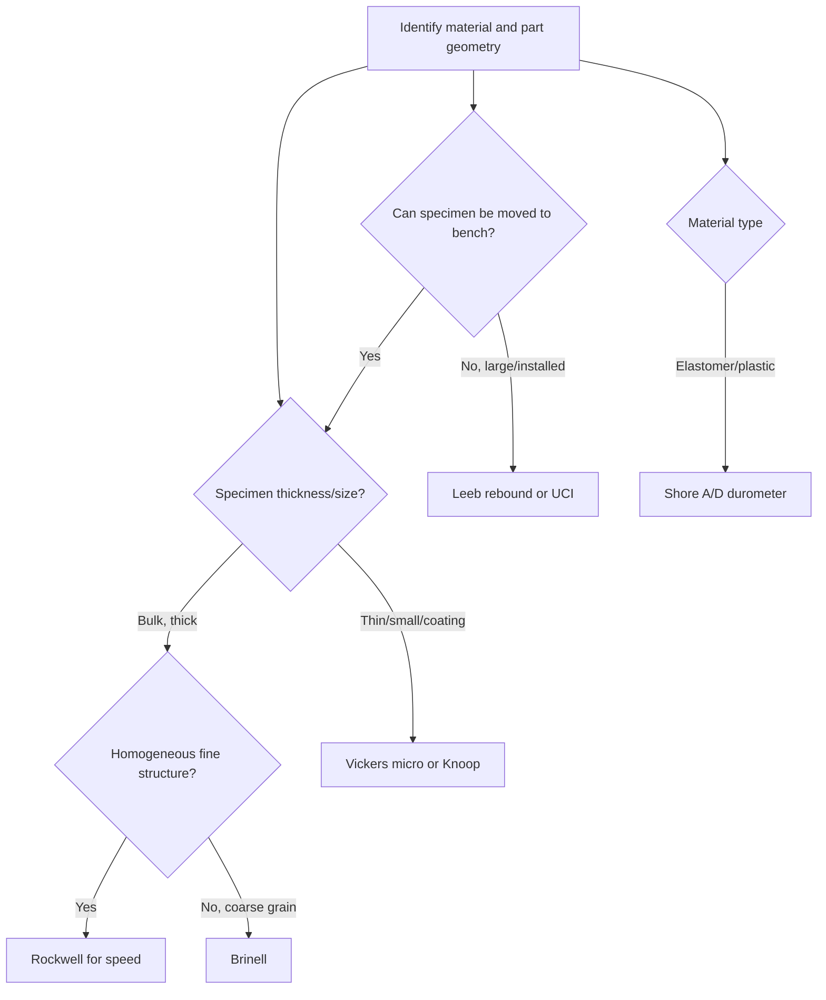

## Hardness Testing Methods

### Definition and Purpose

Hardness is a material's resistance to localized plastic deformation, typically induced by indentation, scratching, or rebound. It is not a fundamental physical property but an empirical, test-dependent measure — the numerical result depends on the indenter geometry, applied load, and test method used. Hardness testing is used for quality control, material selection, heat-treatment verification, and as an indirect estimate of other mechanical properties such as tensile strength and wear resistance.

### Key Points

- Hardness values are only meaningful within the scale they were measured on; cross-scale comparisons require conversion tables or empirical correlations, which carry inherent uncertainty.
- Hardness correlates approximately with ultimate tensile strength for many steels ($UTS \approx 3.45 \times HB$ in MPa), but this relationship is empirical and material-dependent [Inference — the constant varies by alloy and condition].
- Test selection depends on material hardness range, specimen thickness, surface finish, and whether the test must be non-destructive or near-non-destructive.
- Indentation hardness tests fall into two broad categories: **macro-hardness** (Brinell, Rockwell, Vickers at high loads) and **micro-hardness** (Vickers, Knoop at loads below ~1 kgf).

### Brinell Hardness Test (HB)

**Principle**: A hardened steel or tungsten carbide ball (typically 10 mm diameter) is pressed into the test surface under a specified load (500–3000 kgf), held for a dwell time, then removed. The diameter of the resulting indentation is measured optically, and hardness is calculated from the ratio of applied load to the curved surface area of the indentation.

$$HB = \frac{2P}{\pi D \left( D - \sqrt{D^2 - d^2} \right)}$$

Where $P$ is the applied load (kgf), $D$ is the ball diameter (mm), and $d$ is the measured indentation diameter (mm).

**Standards**: ASTM E10, ISO 6506.

**Key Points**:

- Suited to coarse-grained or heterogeneous materials (castings, forgings) because the large indentation averages out local microstructural variation.
- Minimum specimen thickness is generally at least 10× the indentation depth to avoid substrate/anvil influence.
- Indentation is large and visibly damages the surface, so it is not suitable for finished parts or thin sections.
- Ball diameter/load ratio must be held constant (per the $0.102 \times P/D^2$ relationship) for results to be comparable across different load-ball combinations.

**Example**: A 3000 kgf load with a 10 mm ball producing a 4.5 mm indentation diameter yields an HB value calculated from the formula above; results are reported as e.g. "235 HBW 10/3000" (W denotes tungsten carbide ball, followed by ball diameter/load).

### Rockwell Hardness Test (HR)

**Principle**: A minor load (typically 10 kgf) is applied first to seat the indenter and establish a baseline, followed by a major load (60, 100, or 150 kgf depending on scale). Hardness is derived directly from the difference in indentation depth between the minor and major load, read directly off the instrument dial or digital display — no optical measurement or calculation is required.

**Standards**: ASTM E18, ISO 6508.

**Common Scales**:

| Scale | Indenter | Major Load | Typical Use |
| --- | --- | --- | --- |
| HRC | 120° diamond cone (Brale) | 150 kgf | Hardened steels, high-hardness alloys |
| HRB | 1/16" steel/carbide ball | 100 kgf | Softer steels, brass, aluminum alloys |
| HRA | 120° diamond cone | 60 kgf | Thin steel, carbide, shallow case-hardened parts |
| HR15N/30N/45N | Diamond cone (superficial) | 15/30/45 kgf | Thin or small parts |

**Key Points**:

- Fastest and simplest indentation method — direct readout, minimal operator skill required for basic testing, high throughput.
- Scale selection depends on expected hardness range and part thickness; using the wrong scale (e.g., HRB on a very hard material) produces invalid or nonsensical readings.
- Surface preparation is less critical than for Vickers/Brinell, but surface roughness, curvature, and specimen support still affect accuracy.
- Depth-based measurement is more sensitive to elastic recovery effects than area-based methods, which can introduce scale-dependent bias on certain materials [Inference].

### Vickers Hardness Test (HV)

**Principle**: A pyramidal diamond indenter with a 136° angle between opposite faces is pressed into the surface under a chosen load (1 gf to 120 kgf, spanning both micro- and macro-hardness ranges). The two diagonals of the resulting square indentation are measured optically and averaged.

$$HV = \frac{1.8544 \, P}{d^2}$$

Where $P$ is the applied load (kgf) and $d$ is the mean diagonal length (mm).

**Standards**: ASTM E92 (macro), ASTM E384 (micro), ISO 6507.

**Key Points**:

- Single indenter geometry covers the entire hardness range of virtually all metals, allowing direct comparison across a very wide scale — a major advantage over Rockwell/Brinell.
- Requires a well-polished, flat surface and optical measurement, making it slower and more operator-dependent than Rockwell.
- Widely used for case-depth profiling, weld/heat-affected-zone (HAZ) hardness mapping, and thin coatings due to the ability to use very low loads.
- Indentation diagonal measurement accuracy directly drives result accuracy since $d$ is squared in the formula — small measurement errors are amplified.

### Knoop Hardness Test (HK)

**Principle**: An elongated rhombic-based pyramidal diamond indenter produces a shallow, narrow indentation. Only the long diagonal is measured, since the short diagonal recovers elastically after load removal.

$$HK = \frac{14.229 \, P}{d^2}$$

**Standards**: ASTM E384, ISO 4545.

**Key Points**:

- Preferred over Vickers for very thin coatings, brittle materials (ceramics, glass), and case-depth measurement near a surface, because the shallow indentation reduces risk of cracking or substrate influence.
- Elongated shape allows closer spacing of indentations, useful for fine hardness gradient profiling (e.g., carburized case profiles).
- More sensitive to surface preparation defects than Vickers due to the smaller indentation depth.

### Shore (Durometer) Hardness Test

**Principle**: A spring-loaded indenter (needle-like for Shore A/D) is pressed against the material, and hardness is read as the depth of indentation resisted, on a scale of 0–100.

**Standards**: ASTM D2240, ISO 868.

**Key Points**:

- Primarily used for elastomers, rubbers, and plastics, not metals.
- **Shore A** for soft/flexible rubbers; **Shore D** for harder plastics and rigid rubbers.
- Portable and non-destructive relative to indentation tests on metals, suitable for field use.
- Readings are influenced by specimen thickness and viscoelastic time-dependent recovery, so standardized dwell time before reading is required.

### Portable / Field Hardness Testing

**Leeb Rebound Hardness (HL)**:

- **Principle**: An indenter (impact body) with a tungsten carbide ball tip is spring/impact-driven into the surface; rebound velocity is measured via induction coil and compared to impact velocity.

  $$HL = 1000 \times \frac{v_{rebound}}{v_{impact}}$$
- **Standard**: ASTM A956, ISO 16859.
- Widely used for large, heavy, or installed components (pressure vessels, castings, rolls) where the part cannot be brought to a bench-mounted tester.
- Sensitive to specimen mass, surface curvature, and coupling — requires minimum specimen mass/thickness and proper support to avoid erroneous readings.

**Ultrasonic Contact Impedance (UCI)**:

- **Principle**: A Vickers diamond mounted on a vibrating rod is pressed into the surface; the resonant frequency shift of the rod correlates to the contact area (and hence hardness) as the indenter penetrates.
- Portable, useful for in-situ testing of welds, HAZs, and installed equipment; correlates well with Vickers hardness on homogeneous fine-grained materials.
- Less reliable on coarse-grained castings or highly anisotropic materials due to sensitivity to elastic modulus variation [Inference].

### Comparative Summary

| Method | Indenter | Load Range | Best For | Destructive |
| --- | --- | --- | --- | --- |
| Brinell | Steel/WC ball | 500–3000 kgf | Castings, forgings, coarse structures | Yes (large mark) |
| Rockwell | Diamond cone / ball | 15–150 kgf | Production QC, general metals | Minor mark |
| Vickers | Diamond pyramid | 1 gf–120 kgf | Wide-range, thin sections, HAZ mapping | Minor/micro mark |
| Knoop | Elongated diamond | 1 gf–1 kgf | Coatings, brittle materials, case depth | Micro mark |
| Shore | Spring indenter | N/A | Elastomers, plastics | Non-destructive |
| Leeb | Impact ball | Impact energy | Field testing, large components | Minor mark |
| UCI | Vibrating Vickers rod | Low | Field/in-situ, welds | Minor mark |

### Hardness Conversion

Conversion between scales (e.g., HRC to HB, HV to HRC) is possible only through empirical correlation tables (ASTM E140) developed for specific material classes, primarily steels. These conversions are approximate and should not be used as a substitute for direct testing when precision matters. [Inference — actual conversion accuracy varies with alloy composition, heat treatment, and microstructure, and published tables explicitly caveat their applicability range.]

### Test Selection Workflow (svg_diagram)

### Common Sources of Error

- **Indentation too close to edge or to another indent**: violates minimum spacing rules (typically 2.5–3× indent diameter), causing artificially low readings due to material flow toward the free edge.
- **Insufficient specimen thickness**: substrate effects inflate hardness readings when the indentation depth approaches the specimen thickness; general rule is specimen thickness ≥ 10× indentation depth.
- **Surface preparation**: scale, oxide layers, decarburization, or work-hardened surface layers (from grinding/machining) can significantly skew readings, particularly for shallow micro-hardness tests.
- **Curvature**: convex or concave surfaces distort the indentation and require correction factors or specialized fixtures.
- **Calibration drift**: indenter wear (especially diamond chipping) and load-cell calibration drift require routine verification with certified reference blocks.
- **Temperature**: hardness is temperature-dependent for many materials; testing should be performed at controlled ambient conditions unless elevated/cryogenic hardness is specifically being evaluated.

### Calibration and Traceability

Hardness testing machines require periodic verification using certified reference (test) blocks traceable to national metrology institutes (NIST, PTB, NPL). Direct verification checks the indenter geometry, load application, and depth/optical measurement system; indirect verification uses reference blocks of known hardness across the working range. Standards such as ASTM E18 (Rockwell), E10 (Brinell), and E92/E384 (Vickers/Knoop) specify verification intervals, permissible error, and reference block requirements.

**Next Steps**:

- Surface roughness and preparation standards for metrology (ISO 4287, ISO 21920)
- Tensile testing and stress-strain analysis
- Case-depth and heat-treatment verification techniques
- Non-destructive testing (NDT) methods overview
- Metallurgical microstructure examination and its correlation with hardness
- Coordinate measuring machines (CMM) for dimensional metrology
- Measurement uncertainty analysis (GUM methodology) in mechanical testing