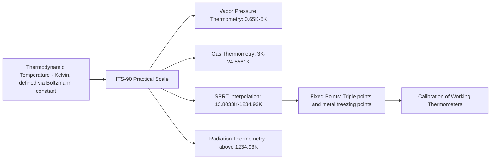

## Temperature Scales and Fixed Points

### Definition and Purpose

Temperature is a fundamental thermodynamic quantity indicating the degree of "hotness" of a system, defined rigorously through the zeroth and second laws of thermodynamics. Because temperature cannot be measured directly (unlike length or mass), practical temperature metrology relies on defined scales anchored to reproducible physical phenomena — fixed points — that occur at precisely known, invariant temperatures. This underpins traceability for all thermal measurement, from industrial process control to scientific research.

### Thermodynamic Basis

**Zeroth Law of Thermodynamics**: If two systems are each in thermal equilibrium with a third system, they are in thermal equilibrium with each other. This law establishes temperature as a well-defined, transitive property and justifies the use of thermometers.

**Thermodynamic Temperature**: Defined via the Carnot cycle efficiency, independent of any specific working substance:

$$\frac{T_1}{T_2} = \frac{Q_1}{Q_2}$$

Where $Q_1$ and $Q_2$ are heat exchanged with reservoirs at temperatures $T_1$ and $T_2$. This thermodynamic definition is conceptually pure but impractical to realize directly, which is why practical scales exist.

### Common Temperature Scales

**Kelvin (K) — SI Base Unit**:

- Since the 2019 redefinition of the SI, the kelvin is defined by fixing the numerical value of the Boltzmann constant $k = 1.380649 \times 10^{-23}$ J/K exactly, linking temperature to energy at the microscopic level.
- Absolute scale; 0 K represents absolute zero, the theoretical state of minimum thermal energy.
- No degree symbol is used with kelvin (written as "K", not "°K").

**Celsius (°C)**:

- Defined by the relation $T(\degree C) = T(K) - 273.15$.
- Widely used in scientific and everyday contexts internationally; anchored to the kelvin rather than independently defined fixed points since the SI redefinition.

**Fahrenheit (°F)**:

- Conversion: $T(\degree F) = T(\degree C) \times \frac{9}{5} + 32$.
- Retained primarily in the United States for everyday use; rarely used in scientific/engineering metrology internationally.

**Rankine (°R)**:

- Absolute scale using Fahrenheit-sized degrees: $T(\degree R) = T(\degree F) + 459.67$.
- Occasionally used in US engineering thermodynamics (e.g., some HVAC and aerospace contexts).

### Key Points

- Absolute scales (Kelvin, Rankine) have a true zero point representing the absence of thermal energy; relative scales (Celsius, Fahrenheit) do not, and their zero points are arbitrary historical references.
- Only Kelvin and Celsius (via its fixed offset from Kelvin) are recognized in the SI system for scientific and most engineering metrology.
- Prior to 2019, the kelvin was defined using the triple point of water as a fixed reference (273.16 K exactly); the redefinition decoupled the unit from this single point, instead fixing $k$, which slightly changed how the triple point of water is realized (now measured rather than defined) [Inference — practical impact on most calibration labs is negligible at current measurement uncertainties].

### The International Temperature Scale of 1990 (ITS-90)

Because thermodynamic temperature cannot be measured directly with sufficient practicality or precision across the full range, the **International Temperature Scale of 1990 (ITS-90)** provides a practical, internationally agreed approximation to thermodynamic temperature. It defines a set of fixed points and specified interpolating instruments/equations between them, ensuring that any properly calibrated thermometer gives consistent, traceable readings worldwide.

**Structure of ITS-90**:

- Spans from 0.65 K to the highest temperatures practically measurable.
- Divided into sub-ranges, each with a specified interpolating instrument:
  - **0.65 K – 5 K**: Vapor pressure thermometry (helium-3, helium-4)
  - **3 K – 24.5561 K**: Helium gas thermometry
  - **13.8033 K – 1234.93 K**: Platinum resistance thermometry (SPRTs)
  - **Above 1234.93 K (silver point)**: Radiation thermometry (Planck's law), referenced to the freezing point of silver, gold, or copper

### ITS-90 Defining Fixed Points (Selected)

| Fixed Point | State | Temperature (K) | Temperature (°C) |
| --- | --- | --- | --- |
| Triple point of hydrogen | Triple point | 13.8033 | −259.3467 |
| Triple point of neon | Triple point | 24.5561 | −248.5939 |
| Triple point of oxygen | Triple point | 54.3584 | −218.7916 |
| Triple point of argon | Triple point | 83.8058 | −189.3442 |
| Triple point of mercury | Triple point | 234.3156 | −38.8344 |
| **Triple point of water** | Triple point | 273.16 | 0.01 |
| Melting point of gallium | Melting point | 302.9146 | 29.7646 |
| Freezing point of indium | Freezing point | 429.7485 | 156.5985 |
| Freezing point of tin | Freezing point | 505.078 | 231.928 |
| Freezing point of zinc | Freezing point | 692.677 | 419.527 |
| Freezing point of aluminum | Freezing point | 933.473 | 660.323 |
| Freezing point of silver | Freezing point | 1234.93 | 961.78 |
| Freezing point of gold | Freezing point | 1337.33 | 1064.18 |
| Freezing point of copper | Freezing point | 1357.77 | 1084.62 |

**Key Points**:

- A **triple point** is the unique temperature and pressure at which the solid, liquid, and vapor phases of a substance coexist in equilibrium — it is a single, invariant point (unlike melting/boiling points, which depend on pressure), making it exceptionally reproducible for calibration.
- The **triple point of water** (273.16 K, 611.657 Pa) is realized in practice using a sealed glass triple-point cell, providing one of the most reproducible fixed points achievable and historically served as the sole defining point of the kelvin.
- Freezing points of pure metals (indium, tin, zinc, aluminum, silver, gold, copper) are used because pure metal freezing plateaus are highly reproducible and provide well-spaced calibration points across the industrial temperature range.

### Fixed-Point Realization in Practice

**Triple Point Cells**: Sealed, evacuated glass cells containing ultra-pure substance (e.g., water, mercury, argon) are used to realize the triple point. The cell is conditioned by partially freezing the substance to form an ice mantle (for water) around a thermometer well, and the thermometer is inserted to read the equilibrium temperature directly.

**Metal Freezing-Point Cells**: A crucible of ultra-high-purity metal is heated above its melting point, then allowed to cool. During solidification, the temperature remains constant (a "freezing plateau") as latent heat is released, providing a stable reference during that plateau for calibrating a standard platinum resistance thermometer (SPRT) inserted into a thermometer well in the crucible.

### Comparative Diagram (svg_diagram)

### Interpolating Instruments

- **Standard Platinum Resistance Thermometer (SPRT)**: The primary interpolating instrument across the largest span of ITS-90 (13.8033 K to 1234.93 K), owing to its excellent stability, reproducibility, and well-characterized resistance-temperature relationship (via Callendar-Van Dusen or ITS-90 reference functions).
- **Radiation (Optical) Pyrometers**: Used above the silver point, based on Planck's radiation law, comparing spectral radiance of the unknown source to that of a blackbody at a defined fixed point.
- **Gas Thermometers**: Used in the cryogenic sub-ranges where resistance thermometry becomes less practical; based on the pressure-temperature relationship of a real gas approaching ideal behavior at low pressure.

### Practical Calibration Hierarchy

**Example**: A typical industrial calibration traceability chain:

1. National metrology institute (NMI) realizes ITS-90 fixed points using triple-point and freezing-point cells.
2. SPRTs are calibrated directly against these fixed points, becoming primary/secondary standards.
3. Working standard thermometers (RTDs, thermocouples) are calibrated against the SPRTs in a controlled comparison bath or furnace.
4. Industrial process thermometers are calibrated against the working standards, completing the traceability chain back to the SI kelvin.

### Common Sources of Error

- **Fixed-point cell impurity**: trace impurities in the triple-point or freezing-point substance depress or broaden the equilibrium temperature (freezing-point depression), a well-known effect requiring high-purity (typically 99.9999%) materials.
- **Hydrostatic head effects**: the depth of thermometer immersion in a fixed-point cell affects the local pressure and thus the realized temperature, requiring correction for the thermometer's immersion depth.
- **Self-heating in resistance thermometry**: excessive measurement current through an SPRT causes resistive self-heating, biasing readings high if not corrected via extrapolation to zero current.
- **Inadequate conditioning of freezing-point cells**: an improperly formed freezing plateau (e.g., insufficient mantle thickness in metal cells) leads to a non-flat or short plateau, reducing measurement confidence.
- **Radiation losses and immersion errors in industrial thermometry**: sensors not sufficiently immersed in the process medium are subject to conductive heat loss along the sensor stem, causing systematic underreading.

### Non-ITS-90 Temperature Scales (Historical/Specialized Context)

- **International Practical Temperature Scale of 1968 (IPTS-68)**: Predecessor to ITS-90, superseded due to improved fixed-point realizations and reduced measurement uncertainty in the later scale.
- **Provisional Low Temperature Scale (PLTS-2000)**: Extends practical temperature realization below 1 K (down to approximately 0.9 mK), used in ultra-low-temperature physics research, based on the melting curve of helium-3.

### Conclusion

Temperature scales and fixed points form the metrological backbone connecting the abstract SI definition of the kelvin to practical, everyday thermometry. ITS-90's system of reproducible fixed points and specified interpolating instruments ensures that thermometers calibrated anywhere in the world — from cryogenic research to industrial furnaces — report consistent, traceable values, which is essential for quality control, scientific comparability, and regulatory compliance across all temperature-sensitive processes.

**Related Topics**:

- Thermocouples, RTDs, and thermistors: principles and calibration
- Radiation and infrared (non-contact) thermometry
- Uncertainty budgets in temperature calibration (GUM methodology)
- Humidity and dew-point metrology
- Pressure metrology and fixed-point pressure standards
- Blackbody radiation sources for radiometric calibration
- Cryogenic metrology and ultra-low-temperature scales (PLTS-2000)