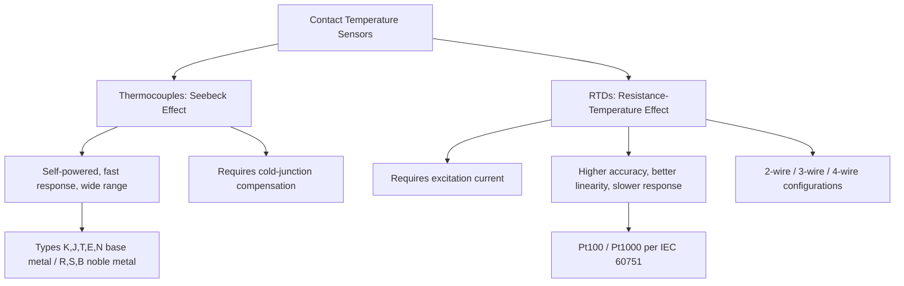

## Thermocouples and Resistance Thermometers

### Definition and Purpose

Thermocouples and resistance thermometers are the two most widely used classes of contact electrical temperature sensors in industrial and scientific metrology. Both convert temperature into an electrical signal, but they operate on fundamentally different physical principles — thermoelectric effects versus temperature-dependent electrical resistance — resulting in different accuracy, range, response time, and cost characteristics suited to different applications.

### Thermocouples

**Principle**: Thermocouples operate on the **Seebeck effect** — when two dissimilar metal conductors are joined at two junctions held at different temperatures, a small voltage (electromotive force, EMF) is generated proportional to the temperature difference between the junctions. This voltage is measured at the "cold junction" (reference junction) while the "hot junction" (measurement junction) is placed at the point of interest.

$$V = \int_{T_{ref}}^{T} (S_A(T) - S_B(T)) \, dT$$

Where $S_A$ and $S_B$ are the Seebeck coefficients of the two dissimilar metals, which are temperature-dependent, making the overall relationship non-linear.

**Key Points**:

- The measured EMF depends on the *difference* between the hot and cold junction temperatures, not on absolute temperature directly — accurate measurement requires either physical cold-junction compensation (an ice bath at 0°C) or electronic cold-junction compensation (a local temperature sensor at the reference terminals correcting the reading in real time).
- Thermocouples generate their own signal (self-powered) and require no excitation current, unlike RTDs.
- Response time is generally fast, particularly for fine-wire or exposed-junction thermocouples, making them suitable for dynamic temperature measurement.
- Non-linearity of the EMF-temperature relationship requires reference tables or polynomial approximations (per ITS-90-based reference functions, standardized in IEC 60584) for accurate conversion.

**Common Thermocouple Types**:

| Type | Materials (+/-) | Range (°C, typical) | Notes |
| --- | --- | --- | --- |
| K | Nickel-chromium / Nickel-alumel | −200 to 1260 | Most common general-purpose type; good linearity |
| J | Iron / Constantan | −40 to 750 | Higher output than K; iron leg oxidizes above ~750°C |
| T | Copper / Constantan | −200 to 350 | Excellent stability at low/cryogenic temperatures |
| E | Nickel-chromium / Constantan | −200 to 900 | Highest EMF output of base-metal types |
| N | Nicrosil / Nisil | −200 to 1300 | Improved stability and oxidation resistance over Type K |
| R | Platinum-13%Rhodium / Platinum | 0 to 1480 | Noble metal; high accuracy, used as interpolating standard |
| S | Platinum-10%Rhodium / Platinum | 0 to 1480 | Similar to R; historically used to realize ITS-90 gold point |
| B | Platinum-30%Rhodium / Platinum-6%Rhodium | 0 to 1700 | No cold-junction compensation needed near 0°C (low EMF there) |

**Example**: A Type K thermocouple measuring a furnace at 800°C produces approximately 33.28 mV relative to a 0°C reference junction, per the NIST/IEC 60584 reference tables; the actual measured voltage must be corrected for the true (non-zero) reference junction temperature using cold-junction compensation before converting to a temperature reading.

**Junction Configurations**:

- **Grounded junction**: Hot junction is welded directly to the protective sheath, giving fast response but less electrical isolation.
- **Ungrounded junction**: Junction is isolated from the sheath, offering electrical isolation but slower response.
- **Exposed junction**: Junction protrudes from the sheath directly into the medium, giving the fastest response but no protection from the environment.

### Resistance Temperature Detectors (RTDs)

**Principle**: RTDs exploit the predictable, repeatable increase in electrical resistance of pure metals with increasing temperature. A precision resistance element (most commonly platinum) is excited with a small, known measurement current, and the resulting voltage drop is used to calculate resistance, which is then converted to temperature via a standardized reference function.

**Key Points**:

- Platinum is the dominant RTD element material due to its high chemical stability, resistance to oxidation, wide usable temperature range, and highly linear and repeatable resistance-temperature relationship.
- **Pt100** (100 Ω at 0°C) and **Pt1000** (1000 Ω at 0°C) are the most common types, standardized under IEC 60751.
- Requires an external excitation current, and the flow of this current causes resistive self-heating, a systematic error that must be minimized or corrected.
- Significantly more linear than thermocouples over their working range and generally offer higher accuracy and long-term stability, but at higher cost and with slower response time due to typically larger thermal mass.

**Callendar-Van Dusen Equation** (standard reference function for platinum RTDs):

For $T \geq 0\degree C$:

$$R(T) = R_0 \left[ 1 + AT + BT^2 \right]$$

For $T < 0\degree C$:

$$R(T) = R_0 \left[ 1 + AT + BT^2 + C(T - 100)T^3 \right]$$

Where $R_0$ is the resistance at 0°C, and $A$, $B$, $C$ are constants defined by IEC 60751 for standard platinum RTDs.

**RTD Wiring Configurations**:

| Configuration | Lead Wires | Accuracy Impact |
| --- | --- | --- |
| 2-wire | 2 | Lead resistance directly adds to measured resistance; lowest accuracy, only suitable for short leads or low-precision applications |
| 3-wire | 3 | Compensates for lead resistance assuming matched lead lengths/resistances; most common industrial configuration |
| 4-wire | 4 | Kelvin (four-terminal) sensing fully eliminates lead resistance error; used for laboratory-grade and reference-standard measurements |

**Example**: A Pt100 RTD in a 2-wire configuration with 5 Ω of total lead resistance introduces an apparent temperature error of roughly 12.8°C at typical sensitivity (~0.385 Ω/°C near 0°C), illustrating why 2-wire configurations are avoided for precision work over any appreciable lead length. [Inference — exact error depends on the specific sensitivity curve at the measurement temperature and actual lead resistance.]

### Standard Platinum Resistance Thermometers (SPRTs)

A specialized, high-precision subclass of RTD constructed with strain-free platinum wire, used as the designated interpolating instrument for ITS-90 between 13.8033 K and 1234.93 K. SPRTs achieve far higher accuracy and stability than industrial RTDs but are fragile, expensive, and used primarily in calibration laboratories rather than industrial process environments.

### Comparative Diagram (svg_diagram)

### Comparison Summary

| Characteristic | Thermocouple | RTD |
| --- | --- | --- |
| Principle | Seebeck effect (self-generated EMF) | Resistance vs. temperature |
| Typical range | −270°C to 1800°C (type dependent) | −200°C to 850°C (Pt) |
| Accuracy | Moderate (±0.5–2°C typical) | High (±0.1–0.5°C typical) |
| Linearity | Non-linear, requires reference tables | Highly linear (Pt) |
| Response time | Fast | Slower (larger thermal mass) |
| Excitation required | No | Yes |
| Cost | Lower | Higher |
| Long-term stability/drift | Lower (junction degradation over time) | Higher |

### Calibration Methods

- **Fixed-point calibration**: Comparison against ITS-90 triple-point or freezing-point cells for highest-accuracy calibration of reference-grade RTDs and thermocouples.
- **Comparison calibration**: The sensor under test and a calibrated reference standard are placed together in a controlled temperature bath, dry-block calibrator, or furnace, and readings are compared across the operating range.
- **Cold-junction compensation verification**: For thermocouples, calibration must also verify the accuracy of the cold-junction reference temperature measurement, since errors there propagate directly into the final reading.

### Common Sources of Error

- **Thermocouple wire inhomogeneity**: mechanical strain, contamination, or oxidation along the thermocouple wire length creates localized EMF sources unrelated to the actual junction temperature, causing drift that cannot be corrected by recalibration at the junction alone.
- **Decalibration from extended high-temperature exposure**: prolonged use at high temperature can alter the metallurgical composition of thermocouple wires (e.g., chromium depletion in Type K "green rot"), gradually shifting the EMF-temperature relationship.
- **RTD self-heating error**: excessive excitation current causes the element to heat above the true process temperature; minimized by using low excitation currents (typically ≤1 mA) and appropriate power dissipation constants.
- **Lead wire resistance (RTD)**: particularly significant in 2-wire configurations over long cable runs; mitigated using 3-wire or 4-wire configurations.
- **Poor thermal contact / stem conduction**: inadequate immersion depth in either sensor type allows heat conduction along the sensor body to bias readings, especially in fast-changing or small-mass process media.
- **Cold-junction compensation error (thermocouples)**: an inaccurate or poorly located reference-junction temperature sensor introduces a direct offset error into every reading.

### Signal Conditioning and Instrumentation

- Thermocouples require amplification (typically to millivolt-level signals) and linearization, commonly performed by dedicated thermocouple transmitters or DAQ modules with built-in reference tables per IEC 60584.
- RTDs require a stable, low-noise excitation current source and precision resistance measurement, often implemented via a Wheatstone bridge configuration or direct current-excitation with voltage measurement in modern digital transmitters.
- Both sensor types benefit from shielded, twisted-pair wiring to minimize electromagnetic interference, particularly in industrial environments with variable-frequency drives or high-power equipment nearby.

### Conclusion

Thermocouples and RTDs serve complementary roles in mechanical and thermal metrology: thermocouples offer wide temperature range, fast response, and low cost at moderate accuracy, while RTDs offer superior accuracy, linearity, and long-term stability at higher cost and slower response. Selection depends on the required accuracy, temperature range, response time, environmental conditions, and budget of the specific application, with SPRTs reserved for the highest-precision calibration laboratory work underpinning the ITS-90 traceability chain.

**Related Topics**:

- Temperature scales and fixed points (ITS-90)
- Thermistors and semiconductor temperature sensors
- Radiation and infrared (non-contact) thermometry
- Signal conditioning and data acquisition for sensor networks
- Uncertainty analysis in temperature measurement (GUM methodology)
- Calibration bath, dry-block, and furnace comparison techniques
- Sensor drift, stability, and recalibration interval determination