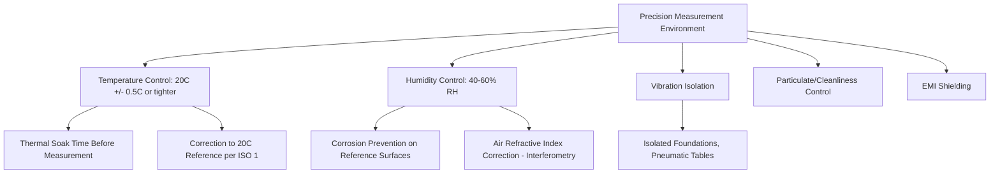

## Environmental Control in Precision Measurement

### Definition and Purpose

Environmental control in precision measurement refers to the deliberate management of ambient conditions — temperature, humidity, vibration, air pressure, contamination, and electromagnetic interference — to minimize their influence on measurement accuracy and repeatability. As measurement tolerances shrink toward micrometer and sub-micrometer levels, environmental effects that were once negligible become dominant sources of uncertainty, making environmental control a core discipline within dimensional and mechanical metrology.

### Key Points

- Most engineering materials expand and contract measurably with temperature change; at tight tolerances, thermal effects on both the workpiece and the measuring instrument can exceed the tolerance being verified.
- The internationally recognized reference temperature for dimensional metrology is **20°C (68°F)**, standardized in ISO 1 — all critical dimensional measurements are ideally referenced to, or corrected to, this temperature.
- Environmental control is not limited to temperature; humidity, vibration, cleanliness, and even barometric pressure (for certain optical and gauge block interferometry applications) all contribute to overall measurement uncertainty.
- The required level of environmental control scales with the precision of the measurement being performed — a caliper reading to 0.02 mm has far less stringent requirements than a coordinate measuring machine (CMM) verifying sub-micrometer geometric tolerances.

### Thermal Effects

**Principle**: All solid materials undergo dimensional change with temperature according to their coefficient of thermal expansion (CTE):

$$\Delta L = L_0 \, \alpha \, \Delta T$$

Where $L_0$ is the original length, $\alpha$ is the linear coefficient of thermal expansion (per °C), and $\Delta T$ is the temperature change.

**Example**: A 500 mm steel part ($\alpha \approx 11.5 \times 10^{-6}$/°C) measured at 25°C instead of the 20°C reference temperature will have expanded by approximately $500 \times 11.5\times10^{-6} \times 5 = 0.029$ mm — nearly 29 micrometers, which can exceed the entire tolerance band on a precision-machined component.

**Key Points**:

- Both the workpiece and the measuring instrument are subject to thermal expansion; if both are made of similar materials and at the same (even if non-standard) temperature, thermal errors partially cancel — a principle exploited in comparative gauging.
- **Differential thermal expansion** occurs when the workpiece and instrument have different CTEs (e.g., an aluminum part measured with a steel micrometer), and this cannot be cancelled by temperature matching alone — it requires correction calculations or matched-material fixturing.
- Thermal gradients (spatial temperature variation across a part or instrument, not just an absolute temperature shift) are often more damaging than uniform offsets, since they distort geometry non-uniformly and are harder to correct computationally.
- Operator body heat, direct sunlight, HVAC vents, and nearby machinery are common uncontrolled heat sources that must be isolated from precision measurement areas.
- **Thermal soak time**: parts and instruments brought into a controlled environment from a different temperature require a stabilization period before measurement; soak time depends on part mass, material thermal conductivity, and the temperature differential involved. [Inference — required soak duration is highly application- and geometry-specific, so it is generally determined empirically or per lab procedure rather than from a universal formula.]

### Metrology Laboratory Environmental Standards

**Temperature**:

- High-precision metrology labs (e.g., gauge block calibration, CMM rooms) typically maintain 20°C ± 0.5°C or tighter, with some primary standards laboratories controlling to ±0.1°C or better.
- Rate of temperature change is often as important as absolute stability — many standards specify a maximum permissible drift rate (e.g., °C per hour) in addition to the absolute tolerance band.

**Humidity**:

- Relative humidity is typically controlled in the range of 40–60% RH in precision measurement environments.
- **Key Points**:
  - Excessive humidity promotes corrosion on ferrous gauge blocks, precision slideways, and other bare-metal reference surfaces.
  - Excessively low humidity increases static electricity risk, which can affect sensitive electronic measurement instruments and attract airborne particulate contamination to optical surfaces.
  - Humidity affects the refractive index of air, which is a direct input to the correction equations used in laser interferometry (e.g., the Edlén equation), making humidity control critical for the highest-precision length metrology.

**Vibration**:

- Ambient vibration from foot traffic, nearby machinery, HVAC equipment, or building resonance can introduce measurement noise or artifacts, particularly for high-magnification optical, interferometric, and probing-based measurements (CMMs, profilometers, AFMs).
- **Mitigation**: Pneumatic isolation tables, dedicated foundations isolated from the building structure, and location selection away from vibration sources (elevators, HVAC plant rooms, forklift traffic) are standard countermeasures.

**Cleanliness / Particulate Contamination**:

- Airborne dust and particulates can lodge on precision reference surfaces (gauge blocks, optical flats) causing false high readings, or contaminate optical paths in laser-based systems.
- Cleanroom classifications (per ISO 14644-1) may be specified for the most demanding applications (e.g., semiconductor metrology), while general precision labs typically rely on filtered HVAC and controlled access rather than full cleanroom protocols.

**Electromagnetic Interference (EMI)**:

- Sensitive electronic measurement instruments (capacitive sensors, strain gauges, high-resolution encoders) can be affected by EMI from variable-frequency drives, welding equipment, or high-power switching nearby, requiring shielding, filtering, or physical separation.

### Environmental Correction Techniques

- **Direct temperature correction**: Measured dimensions are mathematically corrected back to the 20°C reference using the known CTE of the workpiece material — standard practice per ISO 1 when measurement cannot occur exactly at 20°C.
- **Comparative measurement**: Using a reference standard of matched or known material alongside the workpiece, measured under identical (even if non-ideal) conditions, so that common-mode environmental errors largely cancel.
- **Environmental data logging**: Continuous monitoring and logging of temperature, humidity, and sometimes barometric pressure alongside measurement data, enabling post-hoc correction or uncertainty budget documentation, and providing an audit trail for quality system compliance.
- **Air refractive index correction (interferometry)**: For laser interferometric length measurement, real-time compensation using the Edlén equation (or simplified variants) accounts for air temperature, pressure, humidity, and CO2 content, all of which affect the wavelength of light in air and therefore the measured length.

### Environmental Control Architecture (svg_diagram)

### Instrument-Specific Environmental Sensitivity

| Instrument Type | Primary Environmental Sensitivity | Typical Control Requirement |
| --- | --- | --- |
| Gauge blocks / length standards | Temperature (CTE mismatch), humidity (corrosion) | 20°C ± 0.1–0.5°C, 40–60% RH |
| Coordinate measuring machines (CMM) | Temperature gradients, vibration | 20°C ± 0.5–1°C, vibration-isolated foundation |
| Laser interferometers | Air temperature, pressure, humidity, CO2 (refractive index) | Real-time environmental compensation |
| Optical flats / interferometric surface testing | Vibration, dust, temperature gradients | Vibration isolation, cleanroom-adjacent conditions |
| Force/mass balances (analytical) | Air currents, temperature drift, vibration | Draft shields, isolated benches |
| Surface roughness testers (profilometers) | Vibration, dust | Vibration isolation, filtered air |

### Uncertainty Contribution of Environmental Factors

In a formal measurement uncertainty budget (per the GUM methodology), environmental factors are typically included as explicit uncertainty components, such as:

$$u_{temp} = \frac{\alpha \, L \, \Delta T}{\sqrt{3}}$$

(assuming a rectangular distribution for temperature uncertainty within a stated tolerance band), combined in quadrature with other contributors (instrument resolution, calibration uncertainty, operator repeatability, etc.) to determine the combined and expanded uncertainty of the overall measurement result. [Inference — the specific distribution assumption (rectangular vs. normal) and divisor depend on the nature of the temperature uncertainty source and should be justified per the specific uncertainty budget.]

### Common Sources of Error

- **Measuring immediately after part machining**: parts fresh from machining processes (cutting, grinding) are often significantly above ambient temperature and require soak time before accurate measurement.
- **Handling with bare hands**: direct hand contact transfers body heat (typically 37°C) to precision workpieces and gauge blocks, introducing localized thermal expansion; gloves or handling tools are standard practice in high-precision labs.
- **Placing instruments near heat sources**: sunlight through windows, proximity to machinery, or even the heat generated by the instrument's own electronics can create localized thermal gradients.
- **Ignoring rate-of-change effects**: a lab within its temperature tolerance band but experiencing rapid fluctuation can still introduce significant errors if the workpiece and instrument respond to temperature changes at different rates (differential thermal lag).
- **Neglecting barometric pressure in interferometry**: for the most precise optical length measurements, failing to account for barometric pressure changes (which affect air's refractive index) introduces systematic error.

### Conclusion

Environmental control is a foundational discipline underpinning all high-precision measurement, since even well-calibrated, high-quality instruments cannot deliver accurate results if ambient conditions are uncontrolled or unaccounted for. Systematic management of temperature (referenced to the ISO 1 standard of 20°C), humidity, vibration, cleanliness, and electromagnetic interference — combined with rigorous documentation and, where necessary, mathematical correction — is essential to achieving traceable, repeatable measurement results at the tolerances demanded by modern manufacturing and scientific applications.

**Related Topics**:

- Temperature scales and fixed points (ITS-90)
- Coordinate measuring machines (CMM) and their environmental requirements
- Laser interferometry and the Edlén equation
- Measurement uncertainty analysis (GUM methodology)
- Gauge blocks and length standards
- Cleanroom classification and contamination control (ISO 14644)
- Vibration isolation techniques for precision instrumentation