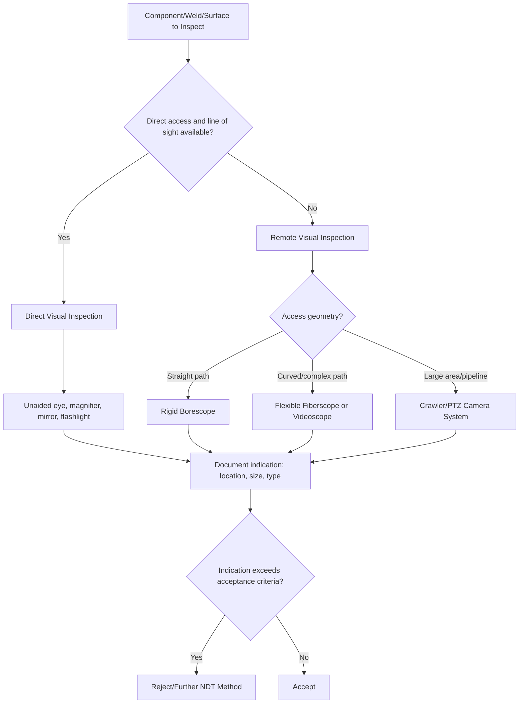

## Visual Inspection Methods

### Definition and Purpose

Visual inspection (VT) is the oldest and most widely applied nondestructive testing (NDT) method, relying on the human eye — aided or unaided — to detect surface discontinuities, dimensional irregularities, corrosion, wear, and other conditions indicative of quality or degradation. Despite its simplicity relative to other NDT methods, visual inspection is often the first line of defense in quality control and is frequently a prerequisite before applying other NDT methods, since surface conditions revealed visually can influence which subsequent method is appropriate.

### Key Points

- Visual inspection is generally the fastest, lowest-cost NDT method and requires the least specialized equipment, but it is limited to surface and near-surface conditions visible to the inspector.
- Effectiveness depends heavily on lighting conditions, inspector visual acuity, surface accessibility, and inspector training/certification — making human factors a significant source of variability.
- Standards such as ASNT SNT-TC-1A and ASTM E1316 (terminology) govern personnel qualification and standard terminology for visual and other NDT methods in many industries.
- Visual inspection is categorized as **direct** (unaided or lightly aided, direct line of sight) or **remote/indirect** (using optical or electronic aids when direct access is impossible).

### Direct Visual Inspection

**Principle**: The inspector directly observes the test surface, either with the unaided eye or with simple aids such as a magnifying glass, mirror, or flashlight, provided there is adequate access and line of sight (typically within about 24 inches / 600 mm of the surface, with an angle of view not less than 30° from the surface, per common industry guidance).

**Common Tools**:

- **Magnifying glasses/loupes**: Typically 2x–10x magnification for closer examination of suspected indications.
- **Inspection mirrors**: Extend line of sight around corners or into recesses without requiring disassembly.
- **Flashlights/inspection lamps**: Provide supplemental or angled lighting to reveal surface texture, reflectivity differences, or shadow-cast defects.
- **Straightedges, weld gauges, and pit gauges**: Used alongside visual inspection to quantify observed irregularities (weld profile, pitting depth, misalignment).

**Key Points**:

- Lighting is critical: both illumination intensity (commonly specified as a minimum lux/foot-candle level in codes) and lighting angle affect defect visibility — raking (low-angle) light often reveals surface texture and shallow indications better than direct overhead lighting.
- Direct visual inspection is used extensively for weld inspection (surface porosity, undercut, cracking, spatter), surface finish assessment, corrosion/pitting evaluation, and general condition monitoring.

### Remote Visual Inspection (RVI)

**Principle**: When direct access or line of sight is not possible — due to confined spaces, hazardous environments, or internal geometries — remote visual inspection tools extend the inspector's vision using optical or electronic instruments.

**Common Tools**:

**Borescopes**:

- Rigid or flexible optical devices inserted into confined spaces (pipe interiors, engine cylinders, turbine blades) to visually inspect otherwise inaccessible areas.
- **Rigid borescopes**: Use a series of lenses or rod-lens optical systems; provide excellent image quality but require a straight line of access.
- **Flexible borescopes (fiberscopes)**: Use coherent fiber-optic bundles to transmit the image around bends; more versatile but generally lower resolution than rigid types.
- **Videoscopes**: Modern digital variant using a CCD/CMOS sensor at the tip with electronic image transmission, offering higher resolution, image capture/recording capability, articulation control, and often measurement features (stereo/shadow measurement for sizing indications).

**Fiberscopes vs. Videoscopes**: Fiberscopes transmit an optical image through glass fiber bundles to an eyepiece, while videoscopes digitize the image at the tip and transmit it electronically to a display, generally providing superior image quality, digital recording, and remote measurement capability, though at higher cost.

**Pan-Tilt-Zoom (PTZ) Cameras and Crawler Systems**: Used for large-scale remote inspection (pipelines, tanks, confined industrial spaces), often mounted on robotic crawlers for internal pipe or duct inspection, or on drones for external structural inspection of towers, bridges, and tanks.

**Key Points**:

- Modern videoscopes often include **measurement capabilities** (stereoscopic, shadow, or comparison measurement) allowing quantitative sizing of observed indications (e.g., crack length, pit depth) directly through the remote optic — a significant advantage over qualitative-only direct visual inspection.
- Articulation (tip steering) range and insertion tube diameter/length are key selection criteria based on the geometry of the component being inspected.

### Enhanced Visual Inspection Techniques

**Dye Penetrant-Assisted Visual (context-dependent)**: While liquid penetrant testing (PT) is technically a separate NDT method, the final indication interpretation step is fundamentally a visual inspection task, often under UV-A (black light) illumination for fluorescent penetrant systems.

**Ultraviolet (UV) Aided Inspection**: UV-A light sources are used in conjunction with fluorescent penetrant or magnetic particle testing to enhance the visibility of indications that fluoresce, requiring darkened conditions and specific UV intensity levels per governing standards (e.g., ASTM E3022).

**Digital Image Enhancement**: Modern videoscope and camera-based systems may incorporate image processing (contrast enhancement, edge detection, zoom) to improve defect detectability beyond raw optical capability.

### Visual Inspection Workflow (svg_diagram)

### Personnel Qualification

Visual inspection, despite its apparent simplicity, requires formal training and certification in most industrial quality systems, typically structured in three levels per ASNT SNT-TC-1A or equivalent employer-based certification programs:

- **Level I**: Qualified to perform specific calibrations, tests, and evaluations per detailed written instructions, under supervision.
- **Level II**: Qualified to set up and calibrate equipment, interpret results against applicable codes/standards, organize and report results, and provide direction to Level I personnel.
- **Level III**: Qualified to develop, qualify, and approve procedures; interpret codes and standards; and train/examine Level I and II personnel.

Additional near-vision and color-vision acuity testing (e.g., Jaeger eye chart, Ishihara color test) is commonly required and periodically re-verified for visual inspection personnel, given the direct reliance on the inspector's own visual capability.

### Acceptance Criteria and Documentation

**Key Points**:

- Acceptance criteria for visual indications are governed by the applicable code or standard for the specific industry and application (e.g., AWS D1.1 for structural welding, ASME Boiler and Pressure Vessel Code Section V for pressure vessel welds, API standards for pipelines).
- Documentation typically includes the location, size, orientation, and classification of any indications found, along with photographic or video evidence where remote visual tools are used.
- Reference standards such as **visual weld acceptance criteria charts** or comparison samples are frequently used to standardize interpretation across inspectors, reducing the subjectivity inherent in visual assessment.

### Comparison with Other NDT Methods

| Aspect | Visual Inspection (VT) | Other NDT Methods (PT, MT, UT, RT) |
| --- | --- | --- |
| Detection capability | Surface, open-to-surface only | Surface (PT, MT) or subsurface/volumetric (UT, RT) |
| Cost/complexity | Lowest | Moderate to high |
| Speed | Fastest | Slower (setup, processing, interpretation) |
| Equipment needs | Minimal to moderate (RVI tools) | Method-specific, often significant |
| Typical role | First-line/prerequisite screening | Follow-up or code-required supplemental testing |

### Common Sources of Error

- **Inadequate lighting**: insufficient intensity or poor lighting angle can cause indications to be missed entirely, particularly shallow surface defects that rely on shadow contrast for visibility.
- **Limited access angle/distance**: viewing at angles or distances outside recommended guidelines (e.g., beyond 24 inches or less than 30° viewing angle) reduces the probability of detection for small indications.
- **Inspector fatigue and visual acuity degradation**: prolonged inspection sessions can reduce detection reliability; periodic vision testing and inspection duration limits help mitigate this.
- **Surface contamination**: dirt, paint, rust, or scale obscuring the surface being inspected can mask relevant indications; surface preparation (cleaning) is often a prerequisite step.
- **Subjectivity in interpretation**: without reference standards or comparison samples, different inspectors may classify borderline indications differently, introducing inter-inspector variability.
- **Borescope/videoscope calibration for measurement functions**: remote measurement features rely on proper calibration of the optical system; uncalibrated or improperly configured measurement modes can produce inaccurate sizing results. [Inference — specific calibration procedures and drift characteristics vary by manufacturer and model.]

### Conclusion

Visual inspection remains foundational to nondestructive testing programs across virtually every industry, serving both as a standalone qualitative and semi-quantitative inspection method and as the essential first step and interpretive component underlying other NDT techniques such as liquid penetrant and magnetic particle testing. While limited to surface-visible conditions, its speed, low cost, and the significant advances in remote visual technology (videoscopes, robotic crawlers, digital measurement) continue to expand its capability and reliability within a comprehensive quality assurance program.

**Related Topics**:

- Liquid penetrant testing (PT)
- Magnetic particle testing (MT)
- Ultrasonic testing (UT) fundamentals
- Radiographic testing (RT) fundamentals
- NDT personnel certification (ASNT SNT-TC-1A)
- Weld inspection acceptance criteria (AWS D1.1, ASME Section V)
- Robotic and drone-based remote inspection systems