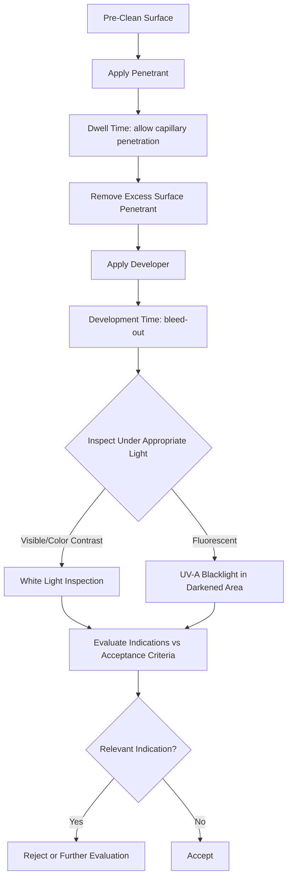

## Liquid Penetrant Testing

### Definition and Purpose

Liquid penetrant testing (PT), also called dye penetrant inspection (DPI) or LPI, is a nondestructive testing method used to detect surface-breaking discontinuities in non-porous materials. It works by applying a liquid with low viscosity and high capillary action to a cleaned surface, allowing the liquid to seep into surface-connected flaws, then removing excess surface penetrant and applying a developer to draw the trapped penetrant back out, creating a visible indication larger and more detectable than the actual flaw.

### Key Points

- PT can only detect discontinuities that are **open to the surface** — it cannot detect subsurface or fully internal flaws, unlike ultrasonic (UT) or radiographic (RT) testing.
- Applicable to a wide range of non-porous materials: metals (ferrous and non-ferrous), ceramics, some plastics, and glass — notably including non-magnetic materials where magnetic particle testing (MT) is not viable.
- Relies fundamentally on **capillary action**: the tendency of a liquid to be drawn into narrow spaces without external force, driven by surface tension and the liquid's wetting properties (low contact angle) relative to the test material.
- Governed by standards such as ASTM E1417, ASME Boiler and Pressure Vessel Code Section V (Article 6), and AMS 2644 (aerospace-specific penetrant materials specification).

### Physical Principle: Capillary Action

**Principle**: Capillary action depends on the penetrant's surface tension, viscosity, and its wetting ability (contact angle) with the test surface. A liquid with low surface tension and low contact angle will readily wet and penetrate fine surface openings such as cracks, laps, porosity, and cold shuts.

$$h = \frac{2 \gamma \cos\theta}{\rho g r}$$

Where $h$ is the capillary rise height, $\gamma$ is the liquid's surface tension, $\theta$ is the contact angle, $\rho$ is liquid density, $g$ is gravitational acceleration, and $r$ is the effective radius of the capillary (flaw opening). This relationship illustrates why penetrant formulation (low surface tension, good wetting) directly governs sensitivity to fine discontinuities.

### The Five-Step PT Process

**1. Pre-Cleaning**:

- The surface must be thoroughly cleaned of oil, grease, paint, scale, corrosion products, and prior coatings, since any contamination can block penetrant entry into flaws or produce false indications.
- Common cleaning methods include solvent cleaning, vapor degreasing, alkaline cleaning, and mechanical methods (light grit blasting where permitted), followed by thorough drying to remove residual cleaning fluid from within discontinuities.

**2. Penetrant Application**:

- Penetrant is applied by spraying, brushing, or dipping, and allowed to remain on the surface for a specified **dwell time** (typically 5–60 minutes depending on penetrant type, material, and expected flaw size) to allow capillary action to draw the penetrant into any surface-breaking discontinuities.
- Dwell time is temperature-dependent; standards typically specify minimum dwell times and acceptable temperature ranges (commonly 10°C–52°C / 50°F–125°F).

**3. Excess Penetrant Removal**:

- Excess surface penetrant is removed carefully — enough to eliminate background penetrant that would mask indications, but not so aggressively as to remove penetrant that has entered actual flaws.
- Removal method depends on penetrant system type (see classification below): water-washable, solvent-removable, or post-emulsifiable systems each require different removal procedures and equipment.

**4. Developer Application**:

- A thin, uniform layer of developer (typically a fine white powder, either dry or suspended in a liquid carrier) is applied to the surface.
- The developer acts by capillary/blotting action, drawing trapped penetrant back out of the discontinuity to the surface, where it spreads and creates a visible indication larger than the actual flaw width — this "bleed-out" effect is central to PT's high sensitivity.
- A **development time** (typically 10–30 minutes minimum) is required to allow adequate bleed-out before inspection.

**5. Inspection and Evaluation**:

- Indications are visually inspected under appropriate lighting — white light for visible (color contrast) penetrant systems, or UV-A (black light, typically 365 nm) in a darkened area for fluorescent penetrant systems.
- Indication characteristics (length, width, pattern, location) are compared against applicable acceptance criteria to determine relevant vs. non-relevant indications and accept/reject the part.

### PT Process Flow (svg_diagram)

### Penetrant System Classification

**By Dye Type**:

| Type | Description | Inspection Condition |
| --- | --- | --- |
| Type I — Fluorescent | Dye fluoresces brightly under UV-A light | Darkened area, UV-A illumination |
| Type II — Visible (color contrast) | Typically red dye against white developer background | Ambient white light, no darkroom needed |

**By Removal Method**:

| Method | Description | Sensitivity | Notes |
| --- | --- | --- | --- |
| Method A — Water-washable | Penetrant contains built-in emulsifier; rinses directly with water | Lower to moderate | Fast, simple, but risk of over-washing (removing penetrant from wide/shallow flaws) |
| Method B — Post-emulsifiable, lipophilic | Oil-based emulsifier applied as separate step after dwell | High | Excellent sensitivity control; emulsification time is critical |
| Method C — Solvent-removable | Excess penetrant removed by wiping with solvent-dampened cloth | Variable, often used for local/spot checks | Common for field/portable inspection |
| Method D — Post-emulsifiable, hydrophilic | Water-based emulsifier/remover applied after dwell | High | Faster emulsification than lipophilic; used for high-production applications |

**Sensitivity Levels** (per AMS 2644, primarily aerospace context): Penetrants are further classified into sensitivity levels (½, 1, 2, 3, 4 — from low to ultra-high sensitivity), with higher sensitivity levels detecting finer discontinuities but also being more prone to producing non-relevant or false indications from minor surface irregularities.

### Developer Types

- **Dry powder developer**: Applied as a fine, loose powder; provides good sensitivity for fluorescent penetrant systems, simple to apply, but not ideal for very rough surfaces.
- **Aqueous developer (wet, water-suspendible or water-soluble)**: Sprayed or dipped as a liquid, then dried, forming a thin coating; commonly used in production-line PT systems.
- **Non-aqueous wet developer**: Solvent-based suspension sprayed directly onto the surface, commonly used with solvent-removable (Method C) systems for portable/field inspection; provides excellent sensitivity and fast development due to solvent action assisting bleed-out.

### Applications and Examples

**Example**: Inspection of a cast aluminum aerospace bracket for surface-breaking porosity or hairline cracks post-machining, using a Method C (solvent-removable), Type I (fluorescent) penetrant system for portability and high sensitivity, viewed under UV-A illumination in a darkened booth per ASTM E1417.

**Typical industries**: Aerospace component manufacturing, automotive casting inspection, weld inspection (surface cracking, porosity), pressure vessel and piping fabrication, and general machined-part quality control.

### Common Sources of Error

- **Inadequate pre-cleaning**: residual oil, grease, or prior penetrant/developer contamination blocks capillary action into genuine flaws or creates false/non-relevant indications.
- **Insufficient dwell time**: prevents penetrant from fully penetrating fine or tight discontinuities, reducing detection sensitivity for small flaws.
- **Over-washing during excess removal**: aggressive rinsing (especially with water-washable systems) can remove penetrant from shallow or wide discontinuities, causing false negatives.
- **Excessive time between penetrant removal and developer application**: allows surface-trapped penetrant to dry or migrate, degrading indication quality.
- **Surface roughness**: excessively rough surfaces can trap background penetrant, producing generalized fluorescence/coloring ("background") that masks true indications; may require surface preparation before PT is viable.
- **Temperature extremes**: penetrant viscosity and capillary behavior are temperature-dependent; testing outside the manufacturer's/standard's specified temperature range can reduce sensitivity or invalidate results.
- **UV-A light intensity/ambient light contamination**: insufficient UV-A intensity or excessive ambient white light during fluorescent inspection reduces indication visibility and detection probability; standards specify minimum UV-A intensity and maximum ambient light levels at the inspection surface.

### Advantages and Limitations

| Advantages | Limitations |
| --- | --- |
| Detects fine surface-breaking flaws across many material types | Surface-breaking flaws only — no subsurface detection |
| Relatively low cost and simple equipment | Requires non-porous surface (porous materials trap penetrant, causing false indications) |
| Portable for field use (aerosol kits) | Surface must be clean and accessible |
| High sensitivity achievable (fluorescent, high-sensitivity systems) | Multi-step process; slower than simple visual inspection |
| No major geometric limitations (complex shapes inspectable) | Chemical handling, disposal, and ventilation considerations |

### Personnel Qualification and Documentation

As with other NDT methods, PT personnel are typically certified per ASNT SNT-TC-1A or an equivalent employer-based written practice, at Level I, II, or III competency. Documentation typically records penetrant system/batch used, dwell and development times, lighting conditions verified (UV-A intensity, ambient light), and detailed indication mapping (location, length, orientation) against the governing acceptance code.

### Conclusion

Liquid penetrant testing is a versatile, cost-effective, and highly sensitive method for detecting surface-breaking discontinuities across a broad range of non-porous materials, making it one of the most widely applied NDT methods in manufacturing quality control. Its effectiveness depends critically on strict process control across all five steps — cleaning, penetrant application, excess removal, development, and inspection — with deviations at any stage capable of causing missed flaws (false negatives) or spurious indications (false positives).

**Next Steps**:

- Magnetic particle testing (MT)
- Visual inspection methods
- Ultrasonic testing (UT) fundamentals
- Radiographic testing (RT) fundamentals
- NDT personnel certification (ASNT SNT-TC-1A)
- Surface preparation methods for NDT
- Weld and casting acceptance criteria standards