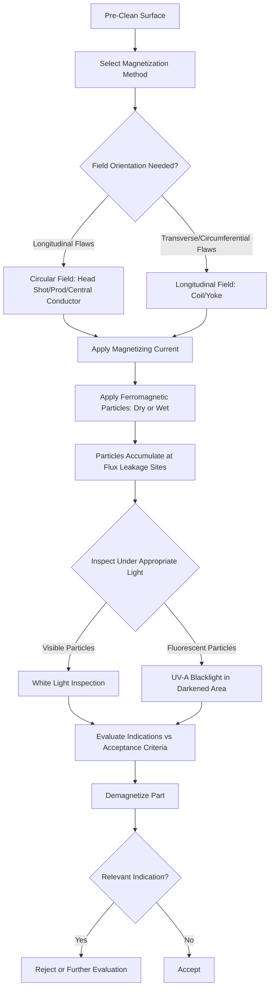

## Magnetic Particle Testing

### Definition and Purpose

Magnetic particle testing (MT), also called magnetic particle inspection (MPI), is a nondestructive testing method used to detect surface and near-surface discontinuities in ferromagnetic materials. It works by inducing a magnetic field in the test piece and applying fine ferromagnetic particles to the surface; at locations where a discontinuity disrupts the magnetic field, particles are attracted and accumulate to form a visible indication.

### Key Points

- MT is restricted to **ferromagnetic materials** (iron, nickel, cobalt, and their alloys) — it cannot be used on non-magnetic materials such as austenitic stainless steel, aluminum, or most non-ferrous alloys, where liquid penetrant testing is typically substituted instead.
- Detects both **surface-breaking** and **near-surface (slightly subsurface)** discontinuities, giving it an advantage over liquid penetrant testing for certain flaw types (e.g., subsurface inclusions close to the surface).
- Most effective for **linear discontinuities oriented perpendicular to the magnetic field** — flaws parallel to the field lines produce minimal field disruption and may go undetected, making magnetic field direction control essential.
- Governed by standards such as ASTM E1444, ASME Boiler and Pressure Vessel Code Section V (Article 7), and AMS 2641 (aerospace magnetic particle materials specification).

### Physical Principle: Flux Leakage

**Principle**: When a ferromagnetic material is magnetized, magnetic flux lines flow through the material. At a surface-breaking or near-surface discontinuity (crack, lap, inclusion), the flux lines are forced to detour around or through the air gap of the flaw, since air has far lower magnetic permeability than the base metal. This detouring causes flux to "leak" out of the surface at the discontinuity location — this leakage field attracts and holds the applied ferromagnetic particles, forming a visible indication.

**Key Points**:

- The strength of the leakage field, and therefore indication visibility, depends on the discontinuity's depth, width, orientation relative to the field, and the magnetizing field strength applied.
- Discontinuities oriented within roughly 45°–90° to the magnetic field lines produce strong, detectable indications; those oriented nearly parallel to the field (roughly within 0°–15°) may produce little to no detectable leakage field.
- Because flaw orientation relative to field direction is critical, most MT procedures require magnetizing the part in **two roughly perpendicular directions** to ensure detection of discontinuities in various orientations.

### Magnetization Methods

**Direct Magnetization**: Electrical current is passed directly through the test part itself, generating a circular magnetic field around the current path (per the right-hand rule).

- **Head shot (contact method)**: The part is clamped between two electrodes on a stationary MT bench unit, and current is passed axially through the part.
- **Prod method**: Portable hand-held electrodes ("prods") are pressed against the part surface at two points, and current flows between them, creating a localized circular field — commonly used for large or field-installed components.

**Indirect Magnetization**: A magnetic field is induced in the part without passing current directly through it.

- **Coil shot / solenoid method**: The part is placed inside or wrapped with a coil carrying current, inducing a longitudinal magnetic field along the part's length via electromagnetic induction — used to detect transverse (circumferentially-oriented) discontinuities.
- **Yoke method**: A portable electromagnetic yoke is placed in contact with the part, inducing a localized magnetic field between its two poles — widely used for field inspection of welds and localized areas due to portability and no direct electrical contact requirement.
- **Central conductor method**: A conductive bar is passed through a hollow part (e.g., a pipe or ring), and current through the bar induces a circular field in the surrounding part — useful for inspecting the bore surfaces of hollow/tubular components.

**Field Type Produced**:

| Method | Field Type | Best Detects |
| --- | --- | --- |
| Head shot / prod (direct current through part) | Circular | Longitudinal discontinuities |
| Coil / solenoid | Longitudinal | Circumferential/transverse discontinuities |
| Yoke | Longitudinal (localized, between poles) | Discontinuities perpendicular to pole spacing |
| Central conductor | Circular | Longitudinal discontinuities on bore/ID surfaces |

### Current Type

- **Alternating Current (AC)**: Due to the skin effect, AC concentrates near the surface, making it well-suited for detecting **surface-breaking** discontinuities only.
- **Direct Current (DC) / Half-Wave Rectified (HWDC)**: Penetrates more deeply into the material, making DC/HWDC better suited for detecting **subsurface (near-surface)** discontinuities in addition to surface flaws.
- **Full-Wave Rectified (FWDC)**: Provides smoother, more continuous current than HWDC, commonly used in stationary MT bench units for reliable, deep-penetrating fields.

### Particle Types and Application

**By Visibility Type**:

- **Visible (non-fluorescent) particles**: Typically red, black, or gray colored iron oxide/iron particles, viewed under adequate white light; used where UV-A darkroom conditions are impractical (field inspection).
- **Fluorescent particles**: Coated with a fluorescent dye, viewed under UV-A (black light) in a darkened area; generally provide higher sensitivity and easier detection of fine indications than visible particles.

**By Application Medium**:

- **Dry method**: Fine dry particles are applied (typically by a puffer/blower or shaker) directly onto the surface while the magnetizing current is applied; commonly used for field inspection on rough or large surfaces, and effective for detecting subsurface discontinuities with DC magnetization.
- **Wet method**: Particles are suspended in a liquid carrier (water or specially formulated oil) and applied by flowing, spraying, or dipping the part; provides better particle mobility, generally higher sensitivity for fine surface cracks, and is the standard method for fluorescent particle systems and stationary bench-unit inspection.

### MT Process Flow (svg_diagram)

### Field Strength Verification

**Key Points**:

- Adequate magnetizing field strength is essential — too weak a field fails to produce detectable leakage at flaws, while excessive field strength can cause "furring" (non-relevant particle buildup obscuring the surface) and mask true indications.
- Field strength adequacy is commonly verified using a **pie gauge (magnetic field indicator)** or **Hall-effect gauge (tangential field meter)**, placed on the surface during magnetization to confirm sufficient and properly oriented field strength.
- The **Burmah-Castrol / ketos ring** or similar reference standard can be used to periodically verify overall system sensitivity and central conductor technique performance.

### Demagnetization

After MT inspection, ferromagnetic parts typically retain **residual magnetism**, which must be removed (demagnetized) if it could interfere with subsequent manufacturing processes (e.g., machining, causing chip adherence), assembly, service function (e.g., near sensitive instrumentation), or corrosion (residual magnetism can attract ferrous particulate contamination in service). Demagnetization is typically performed by subjecting the part to a gradually decreasing alternating magnetic field, and verified using a gaussmeter to confirm residual field is below the specified threshold (commonly 2–3 gauss for many applications).

### Applications and Examples

**Example**: Inspection of a forged steel crankshaft for surface and near-surface fatigue cracking, using wet fluorescent particles with full-wave rectified DC magnetization via head-shot (circular field) followed by a coil shot (longitudinal field) to detect flaws of any orientation, per ASTM E1444, with final demagnetization and gaussmeter verification before release.

**Typical industries**: Automotive and aerospace forgings/castings, weld inspection (structural steel, pressure vessels, pipelines), railway component inspection (axles, wheels), and in-service inspection of ferromagnetic components subject to fatigue loading.

### Comparison: MT vs. PT

| Aspect | Magnetic Particle (MT) | Liquid Penetrant (PT) |
| --- | --- | --- |
| Material applicability | Ferromagnetic materials only | Any non-porous material |
| Flaw detection depth | Surface and near-surface | Surface-breaking only |
| Sensitivity to orientation | Highly orientation-dependent (needs multi-directional fields) | Orientation-independent |
| Post-inspection steps | Demagnetization often required | None (beyond cleaning) |
| Typical speed | Fast | Fast, but multi-step (clean, penetrate, develop) |

### Common Sources of Error

- **Incorrect field orientation**: failing to magnetize in at least two roughly perpendicular directions risks missing discontinuities oriented parallel to a single applied field.
- **Insufficient field strength**: produces weak or absent leakage fields at flaws, leading to false negatives; verified using pie gauges or Hall-effect meters.
- **Excessive field strength**: causes non-relevant particle accumulation ("furring") that obscures true indications, particularly at sharp geometric transitions (fillets, keyways) that naturally concentrate flux even without a flaw present.
- **Inadequate pre-cleaning**: surface contamination (oil, scale, paint) can prevent proper particle mobility and flux leakage detection.
- **Using AC for subsurface flaw detection**: AC's skin effect limits penetration, making it unsuitable for detecting flaws below the immediate surface; DC or rectified current should be used when subsurface detection is required.
- **Incomplete demagnetization**: residual magnetism left in a part can cause downstream manufacturing or service issues, particularly chip/particulate adherence during subsequent machining operations.
- **Improper particle concentration (wet method)**: too dilute or too concentrated a particle bath reduces indication clarity; bath concentration is periodically verified via settling test (e.g., ASTM-specified centrifuge tube settling volume).

### Conclusion

Magnetic particle testing is a fast, sensitive, and widely used NDT method for ferromagnetic materials, capable of detecting both surface and near-surface discontinuities that may be missed by liquid penetrant testing's surface-only detection. Its effectiveness depends critically on proper magnetization method and direction selection, adequate field strength verification, correct particle system selection, and thorough post-inspection demagnetization, making procedural rigor essential to reliable flaw detection.

**Related Topics**:

- Liquid penetrant testing (PT)
- Visual inspection methods
- Ultrasonic testing (UT) fundamentals
- Eddy current testing fundamentals
- NDT personnel certification (ASNT SNT-TC-1A)
- Weld and forging acceptance criteria standards
- Ferromagnetism and magnetic field theory fundamentals