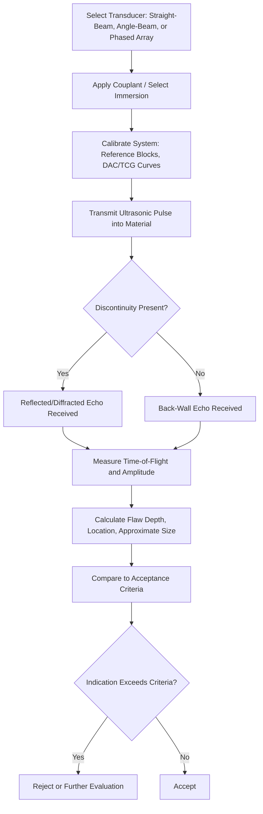

## Ultrasonic Testing

### Definition and Purpose

Ultrasonic testing (UT) is a nondestructive testing method that uses high-frequency sound waves (typically 0.5–25 MHz, well above the human audible range) to detect internal discontinuities, measure material thickness, and characterize material properties. A transducer converts electrical energy into mechanical sound waves that propagate through the test material; reflections from internal features (flaws, back walls, geometric boundaries) are received and analyzed to determine flaw location, size, and depth. UT is uniquely capable of detecting subsurface and volumetric discontinuities deep within a material, distinguishing it from surface-limited methods like PT and MT.

### Key Points

- UT can detect internal discontinuities at significant depth within a material, and can also measure remaining wall thickness in corrosion/erosion monitoring applications — capabilities not available with visual, PT, or MT methods.
- Requires **acoustic coupling** between the transducer and the test surface (via a couplant medium, or immersion in a liquid) since sound energy does not transmit efficiently across an air gap.
- Applicable to a wide range of materials, including metals, composites, plastics, and ceramics, provided the material's grain structure and attenuation characteristics allow adequate sound propagation.
- Governed by standards such as ASTM E164, ASTM E317, ASME Boiler and Pressure Vessel Code Section V (Article 4/5), and AWS D1.1 (structural weld UT acceptance criteria).

### Physical Principles

**Sound Wave Propagation**: Ultrasonic waves travel through a material at a velocity determined by the material's elastic modulus and density:

$$v = \sqrt{\frac{E}{\rho}}$$

(simplified form for longitudinal waves in a bulk solid, where $E$ is the elastic modulus and $\rho$ is density) — actual velocity equations for longitudinal and shear waves in solids account for Poisson's ratio as well.

**Wave Modes**:

- **Longitudinal (compression) waves**: Particle motion parallel to the direction of wave travel; the most common mode for general UT, capable of traveling through solids, liquids, and gases.
- **Shear (transverse) waves**: Particle motion perpendicular to wave travel direction; travel at roughly half the velocity of longitudinal waves in the same material, and cannot propagate through liquids or gases (no shear strength) — used in angle-beam weld inspection.
- **Surface (Rayleigh) waves**: Travel along a material's surface with limited penetration depth; useful for detecting very shallow surface/near-surface discontinuities.
- **Lamb (plate) waves**: Occur in thin plates/sheets where wave behavior is governed by the plate's thickness relative to wavelength, used in specialized thin-material inspection.

**Acoustic Impedance and Reflection**: At any boundary between two materials of differing acoustic impedance ($Z = \rho v$), a portion of the sound energy reflects while the remainder transmits. Larger impedance mismatches (e.g., metal-to-air at a crack or void) produce near-total reflection, which is the fundamental mechanism enabling flaw detection — a crack or void filled with air reflects almost all incident sound energy back toward the transducer.

$$R = \left( \frac{Z_2 - Z_1}{Z_2 + Z_1} \right)^2$$

Where $R$ is the fraction of incident energy reflected, and $Z_1$, $Z_2$ are the acoustic impedances of the two media.

### UT Equipment and Transducers

**Pulser-Receiver/Flaw Detector**: Generates the electrical pulse that excites the transducer, and receives/amplifies/displays the returning echo signal, typically as an A-scan waveform (amplitude vs. time-of-flight).

**Transducers**:

- **Straight-beam (normal incidence) transducers**: Generate longitudinal waves perpendicular to the surface; used for thickness measurement and detecting flaws parallel to the surface (laminations).
- **Angle-beam transducers**: Mounted on a wedge to introduce shear waves at a specified refracted angle (commonly 45°, 60°, or 70°); used extensively for weld inspection to detect flaws oriented at various angles relative to the surface.
- **Dual-element transducers**: Contain separate transmitting and receiving elements, reducing near-surface "dead zone" effects, useful for thin-material or near-surface flaw detection.
- **Phased array transducers**: Contain multiple small elements that can be individually pulsed with controlled timing (phasing) to electronically steer and focus the beam without physically moving the transducer — a major advancement enabling rapid sectorial scanning and complex geometry inspection.

### Coupling Methods

- **Contact method**: A liquid couplant (gel, oil, or water-based) is applied between the transducer and test surface to eliminate the air gap and enable efficient sound transmission; simple and portable but sensitive to surface roughness and coupling consistency.
- **Immersion method**: The part (and often the transducer) is submerged in a liquid (typically water) tank, providing highly consistent, uniform coupling and enabling automated scanning; common in production-line and laboratory UT.

### Common UT Techniques

**Pulse-Echo Method**: A single transducer both transmits the ultrasonic pulse and receives the reflected echo; the most widely used technique, providing flaw depth (via time-of-flight) and relative size information from a single-sided access point.

**Through-Transmission Method**: Separate transmitting and receiving transducers are placed on opposite sides of the test piece; a discontinuity is detected as a reduction (or complete loss) in transmitted signal amplitude rather than by a reflected echo. Requires two-sided access but is effective for detecting flaws that produce poor reflections.

**Time-of-Flight Diffraction (TOFD)**: Uses diffracted (rather than reflected) sound energy from the tips of a discontinuity to precisely size and locate flaws, particularly effective for weld inspection and providing more accurate through-wall sizing than conventional pulse-echo.

**Phased Array Ultrasonic Testing (PAUT)**: Uses electronically controlled multi-element transducers to steer and focus the beam across a range of angles without mechanical movement, producing sectorial (S-scan) images that provide a cross-sectional view of the inspected volume — increasingly standard in weld and complex-geometry inspection due to speed and data richness.

### UT Process Flow (svg_diagram)

### Display Modes (Scan Types)

| Scan Type | Description | Typical Use |
| --- | --- | --- |
| A-scan | Amplitude vs. time-of-flight, single beam position | Manual flaw detection, thickness gauging |
| B-scan | Cross-sectional profile view as transducer moves along a line | Depth profiling along a scan path |
| C-scan | Plan (top-down) view showing flaw distribution across an area | Automated/immersion scanning, composite inspection |
| S-scan (sectorial) | Cross-sectional image from phased array beam steering across multiple angles | Weld inspection, complex geometry (PAUT) |

### Calibration and Reference Standards

- **IIW (International Institute of Welding) block**: A standardized calibration block used to verify beam angle, index point, and system sensitivity for angle-beam weld inspection.
- **Distance-Amplitude Correction (DAC) curves**: Account for the natural decrease in echo amplitude with increasing sound path distance due to beam spread and material attenuation, ensuring flaws of equal size produce comparable amplitude readings regardless of depth.
- **Time-Corrected Gain (TCG)**: An alternative to DAC that electronically compensates gain in real time based on time-of-flight, achieving a similar normalization effect directly in the displayed signal.
- **Reference reflectors**: Flat-bottom holes (FBH), side-drilled holes (SDH), and notches machined into calibration blocks of known material and geometry, used to establish system sensitivity and response curves relative to known reflector sizes.

### Applications and Examples

**Example**: Inspection of a girth weld on a cross-country pipeline using angle-beam UT with a 60° shear-wave transducer, calibrated against an IIW block and DAC curve, to detect and size lack-of-fusion or incomplete penetration defects per API 1104 acceptance criteria — increasingly performed using automated PAUT systems for higher throughput and more consistent sizing data.

**Typical industries**: Pressure vessel and piping weld inspection, pipeline girth weld inspection, aerospace composite and forging inspection, storage tank floor/shell corrosion mapping, and railway rail inspection.

### Advantages and Limitations

| Advantages | Limitations |
| --- | --- |
| Detects subsurface/volumetric flaws at significant depth | Requires couplant/immersion; surface access needed |
| Provides flaw depth and sizing information | Coarse-grained materials (some castings, austenitic welds) cause high attenuation/scattering, limiting detectability |
| Single-sided access possible (pulse-echo) | Requires skilled interpretation, particularly for manual A-scan analysis |
| No ionizing radiation hazard (unlike RT) | Complex/irregular geometries may create difficult sound paths or dead zones |
| Portable equipment available for field use | Surface finish and preparation significantly affect coupling and result quality |

### Common Sources of Error

- **Inadequate couplant application**: air gaps between transducer and surface, even microscopic, severely attenuate signal transmission and can mask real indications.
- **Incorrect calibration**: improper DAC/TCG curve setup or reference block mismatch to the actual test material leads to inaccurate flaw sizing and inconsistent sensitivity.
- **Beam spread and near-field effects**: measurements taken too close to the transducer (within the near field/Fresnel zone) can produce inconsistent amplitude readings; standards specify minimum near-field distances for reliable measurement.
- **Attenuation in coarse-grained materials**: austenitic stainless steel welds, some castings, and certain composites scatter sound energy significantly, requiring lower frequency transducers or alternative techniques (e.g., TOFD) for reliable results. [Inference — the degree of attenuation is highly material- and grain-structure-dependent and should be assessed per application.]
- **Surface roughness/condition**: excessive roughness or coating thickness variation can distort coupling efficiency and beam entry point, requiring surface preparation before scanning.
- **Misinterpretation of geometric reflectors**: part geometry features (weld root, counterbores, surface irregularities) can produce echoes resembling flaw indications, requiring skilled interpretation and, where needed, supplementary techniques to distinguish geometric from flaw-related reflections.

### Conclusion

Ultrasonic testing provides unmatched capability among common NDT methods for detecting and sizing subsurface and volumetric discontinuities, along with precise thickness measurement, making it indispensable for weld inspection, pressure equipment integrity assessment, and corrosion monitoring. Advances such as phased array and TOFD have significantly improved detection reliability, sizing accuracy, and inspection speed over traditional manual A-scan methods, though proper calibration, coupling, and skilled interpretation remain essential to reliable results.

**Related Topics**:

- Radiographic testing (RT) fundamentals
- Phased array ultrasonic testing (PAUT) in depth
- Time-of-flight diffraction (TOFD) technique
- Eddy current testing fundamentals
- Weld inspection acceptance criteria (AWS D1.1, API 1104, ASME Section V)
- NDT personnel certification (ASNT SNT-TC-1A)
- Acoustic emission testing