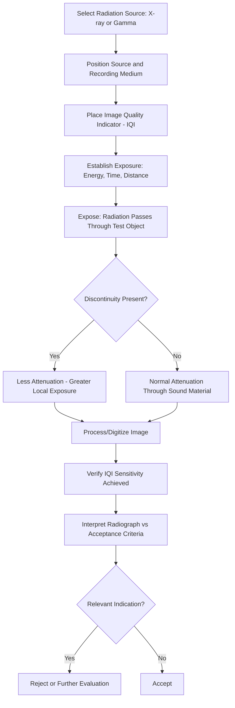

## Radiographic Testing

### Definition and Purpose

Radiographic testing (RT) is a nondestructive testing method that uses penetrating ionizing radiation — X-rays or gamma rays — to detect internal discontinuities and provide a permanent visual record (radiograph) of a material's internal structure. Radiation passes through the test object and is differentially absorbed based on material thickness, density, and composition; the resulting variation in transmitted radiation intensity is captured on film, a digital detector, or a phosphor imaging plate, producing an image where discontinuities appear as density/contrast variations.

### Key Points

- RT is uniquely capable of detecting **volumetric discontinuities** (porosity, inclusions, voids) and produces a **permanent, archivable record** of the inspection — a significant advantage over UT for documentation and later re-review purposes.
- Unlike UT, RT is generally less sensitive to planar discontinuities (cracks, lack of fusion) unless they are favorably oriented nearly parallel to the radiation beam, making method selection and orientation planning critical.
- Involves ionizing radiation, requiring strict radiation safety protocols, exclusion zones, personnel dosimetry, and regulatory compliance (e.g., NRC or state regulatory agency licensing in the US, IAEA guidance internationally).
- Governed by standards such as ASTM E94, ASTM E1032, ASME Boiler and Pressure Vessel Code Section V (Article 2), and API 1104 (pipeline girth weld radiography).

### Physical Principles

**Radiation Attenuation**: As radiation passes through material, its intensity decreases following an approximately exponential attenuation relationship:

$$I = I_0 \, e^{-\mu x}$$

Where $I_0$ is the initial radiation intensity, $I$ is the transmitted intensity, $\mu$ is the material's linear attenuation coefficient (dependent on material density, atomic number, and radiation energy), and $x$ is the material thickness traversed.

**Image Formation**: At a discontinuity (void, crack, inclusion of lower-density material), less material is present along the radiation path, resulting in less attenuation and therefore greater transmitted radiation reaching the film/detector at that location — producing a darker area on the developed film (or corresponding contrast difference on a digital image), since more radiation exposure corresponds to greater film darkening.

### Radiation Sources

**X-ray Generators**:

- Produce X-rays via a controlled electrical process (accelerating electrons against a target anode within an evacuated tube), allowing the radiation output to be switched on/off and its energy (kVp) adjusted.
- Provide better image quality/contrast control than gamma sources for a given application, and can be optimized (energy, exposure time) for the specific material thickness and type being inspected.
- Require electrical power and are generally larger/less portable than gamma sources, making them more common in fixed production/laboratory settings, though portable X-ray units exist for field use.

**Gamma-Ray Sources (Radioisotopes)**:

- Common isotopes: **Iridium-192** (Ir-192, moderate energy, most widely used for typical steel thicknesses), **Cobalt-60** (Co-60, higher energy, used for very thick sections), and **Selenium-75** (Se-75, lower energy, used for thinner materials).
- Continuously emit radiation (cannot be switched off) and decay over time per each isotope's characteristic half-life, requiring source strength recalculation/exposure time adjustment as the source ages and eventual source replacement.
- Highly portable (no external power required) and well-suited to field applications (pipeline welds, remote sites) where X-ray generator power or size is impractical, though they carry more stringent regulatory/security requirements due to the source being a sealed radioactive material at all times.

### Recording Media

**Industrial Film Radiography**:

- Traditional method using photographic film, developed chemically to produce a permanent radiographic image, viewed on an illuminated viewer (film viewer/light box).
- Provides excellent, well-established image quality and resolution, but requires chemical processing, film storage, and handling of consumable materials.

**Digital Radiography (DR)**:

- Uses electronic flat-panel or linear detector arrays to capture the radiation image directly, displaying it immediately on a computer screen without chemical processing.
- Offers faster cycle time, immediate image availability, and digital storage/enhancement capability, and is increasingly standard in production environments. [Inference — specific equipment sensitivity and resolution vary significantly by system, so applicability to a given code's sensitivity requirements should be verified against the specific system's qualification.]

**Computed Radiography (CR)**:

- Uses a reusable phosphor imaging plate that is exposed similarly to film, then scanned by a laser reader to digitize the latent image, combining some of film's exposure flexibility with digital image handling and storage.

### RT Process Flow (svg_diagram)

### Image Quality Indicators (IQI)

**Purpose**: IQIs (also called penetrameters) are standardized reference objects of known material and geometry placed on the source side (or occasionally film side, per procedure) of the test object during exposure, providing a measurable indicator of the radiograph's sensitivity — i.e., its ability to reveal small discontinuities.

**Common Types**:

- **Hole-type IQI (ASTM design)**: A rectangular plaque of material similar to the test piece, containing three holes of specified diameters relative to the plaque thickness; the smallest visible hole determines the achieved sensitivity level.
- **Wire-type IQI (DIN/ISO design)**: A set of wires of progressively decreasing diameter embedded in a plastic holder; the smallest visible wire indicates the sensitivity achieved.

**Key Points**: A radiograph is only considered valid for interpretation if the specified IQI sensitivity (per the governing code, e.g., 2-2T for ASME hole-type IQI) is demonstrably achieved and visible on the developed/digitized image — this is a mandatory quality verification step, not merely optional documentation.

### Exposure Geometry and Techniques

**Single-Wall Single-Image (SWSI)**: Radiation source and film are positioned on opposite sides of a single wall thickness, producing a single clear image of that wall — the standard geometry for plates and accessible single-wall components.

**Double-Wall Single-Image (DWSI)**: Used for pipe/tubular welds where access to only one side is possible; radiation passes through both walls, but geometry is arranged so only the near-side (source-side) wall weld is clearly imaged.

**Double-Wall Double-Image (DWDI)**: Used for small-diameter pipe welds; the source is offset so radiation passes through both walls at an angle, projecting both the near and far weld images side-by-side (elliptically) on a single film for simultaneous evaluation.

**Panoramic Exposure**: For circumferential welds on pipe/vessels, the source is placed at the center of the pipe/vessel with film wrapped around the entire outer circumference, allowing the full weld to be imaged in a single exposure — highly efficient for pipeline and vessel girth welds.

### Applications and Examples

**Example**: Radiographic inspection of a pipeline girth weld using an Iridium-192 source in a panoramic (center-shot) exposure geometry, with a wire-type IQI placed per procedure, to verify absence of porosity, slag inclusion, or lack of fusion per API 1104 acceptance criteria, with the resulting film archived as a permanent quality record.

**Typical industries**: Pressure vessel and piping weld inspection, pipeline construction, aerospace castings and composite structures, structural steel weld verification, and casting porosity/inclusion inspection in foundry quality control.

### Radiation Safety

**Key Points**:

- RT requires establishing a controlled/restricted exclusion zone around the exposure area during radiographic operations, calculated based on source activity/energy, shielding, and applicable dose limits, to protect personnel and the public from radiation exposure.
- Personnel dosimetry (film badges, TLD, or electronic dosimeters) is mandatory for radiographers to monitor cumulative occupational radiation exposure against regulatory limits.
- Gamma-ray sources require secure storage, transport, and inventory control under applicable regulatory licensing, given their continuous emission and security sensitivity as sealed radioactive sources.
- ALARA (As Low As Reasonably Achievable) principles govern radiation safety practice — minimizing exposure time, maximizing distance from the source, and using shielding wherever practical.

### Advantages and Limitations

| Advantages | Limitations |
| --- | --- |
| Detects volumetric discontinuities (porosity, inclusions, voids) reliably | Less sensitive to planar flaws unless favorably oriented |
| Produces a permanent, reviewable image record | Requires two-sided access in most configurations |
| Effective across a very wide range of material types and thicknesses | Ionizing radiation hazard requires strict safety protocols |
| Well-established, highly standardized interpretation criteria | Generally slower and more resource-intensive than UT for large-scale scanning |
| Digital radiography enables rapid, storable, enhanceable images | Equipment (especially gamma sources) subject to significant regulatory control |

### Common Sources of Error

- **Inadequate IQI sensitivity**: if the required IQI hole/wire is not visible on the developed image, the radiograph does not meet minimum sensitivity requirements and must be considered invalid for acceptance/rejection decisions.
- **Incorrect source-to-film distance (SFD)**: insufficient SFD relative to source size and film distance increases geometric unsharpness, blurring fine discontinuity images.
- **Improper exposure time/energy selection**: underexposure or overexposure produces film density outside the acceptable range for reliable interpretation, requiring re-exposure.
- **Poor film processing (traditional film RT)**: inconsistent development chemistry, time, or temperature can introduce artifacts or degrade image quality independent of the actual exposure.
- **Radiation scatter**: backscatter or side-scatter radiation not properly shielded can fog the film or degrade image contrast, often mitigated with lead screens or backing.
- **Misorientation relative to planar flaws**: cracks or lack-of-fusion defects oriented at unfavorable angles to the radiation beam may produce little to no detectable image, potentially requiring supplementary UT for reliable detection of such flaw types.

### Conclusion

Radiographic testing remains one of the most powerful NDT methods for detecting volumetric internal discontinuities and providing a permanent, code-recognized inspection record, making it indispensable for weld and casting quality verification across pressure equipment, pipeline, and structural applications. Its effectiveness depends on correct source and technique selection, rigorous IQI-verified sensitivity, and strict radiation safety practice, while its relative insensitivity to unfavorably oriented planar flaws often makes it complementary to, rather than a replacement for, ultrasonic testing in a comprehensive inspection program.

**Related Topics**:

- Ultrasonic testing (UT) fundamentals
- Radiation safety and dosimetry principles
- Digital and computed radiography systems
- Image quality indicators (IQI) and sensitivity verification
- Weld inspection acceptance criteria (API 1104, ASME Section V)
- NDT personnel certification (ASNT SNT-TC-1A)
- Computed tomography (CT) for industrial inspection