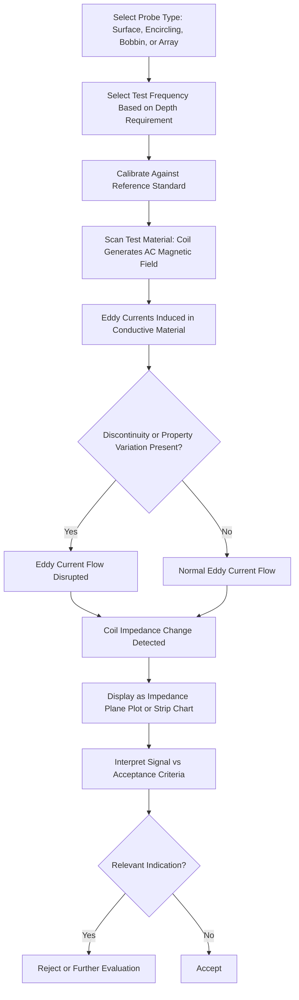

## Eddy Current Testing

### Definition and Purpose

Eddy current testing (ECT) is a nondestructive testing method that uses electromagnetic induction to detect surface and near-surface discontinuities, measure material thickness and coating thickness, sort materials by conductivity/alloy composition, and assess heat-treatment condition in electrically conductive materials. A coil carrying alternating current generates a changing magnetic field, which induces circulating "eddy currents" within the conductive test material; these eddy currents in turn generate their own opposing magnetic field, and any disruption to the eddy current flow (caused by a discontinuity, conductivity change, or geometric variation) alters the coil's impedance, which is measured and analyzed to characterize the material condition.

### Key Points

- ECT requires the test material to be **electrically conductive** — it cannot be used on non-conductive materials such as most plastics, ceramics, or composites without a conductive fiber structure.
- Provides rapid, non-contact or minimal-contact inspection, often requiring no couplant, consumables, or surface preparation beyond basic cleanliness, and is well suited to high-speed automated inspection (e.g., tube/bar production lines).
- Highly sensitive to near-surface discontinuities but has **limited penetration depth** compared to UT or RT, governed by the skin effect, making it primarily a surface/near-surface method.
- Governed by standards such as ASTM E426, ASTM E243 (tubing inspection), ASTM E1004 (conductivity measurement), and ASME Boiler and Pressure Vessel Code Section V (Article 8, tubing).

### Physical Principles

**Electromagnetic Induction**: An alternating current in the test coil generates a time-varying primary magnetic field. When brought near a conductive material, this field induces circulating eddy currents within the material (per Faraday's law of electromagnetic induction), which in turn generate a secondary magnetic field opposing the primary field (per Lenz's law). The coil's electrical impedance changes in response to this secondary field, and this impedance change is the measured signal.

**Skin Effect and Depth of Penetration**: Eddy currents are strongest near the material surface and decrease exponentially with depth, described by the standard depth of penetration:

$$\delta = \sqrt{\frac{1}{\pi f \mu \sigma}}$$

Where $\delta$ is the standard depth of penetration (depth at which eddy current density falls to $1/e$, approximately 37%, of its surface value), $f$ is the test frequency, $\mu$ is the material's magnetic permeability, and $\sigma$ is its electrical conductivity.

**Key Points**:

- Higher test frequency produces shallower penetration depth but greater sensitivity to small surface discontinuities; lower frequency increases penetration depth at the cost of surface sensitivity and resolution — frequency selection is therefore a critical trade-off in procedure development.
- Ferromagnetic materials (high magnetic permeability) exhibit much shallower penetration depth than non-ferromagnetic materials of similar conductivity at the same frequency, often requiring magnetic saturation techniques to achieve usable penetration in ferromagnetic tubing inspection.

### Eddy Current Coil (Probe) Configurations

**Surface Probes (Pancake/Absolute Coils)**: A single coil is scanned across a flat or contoured surface; response is compared against an absolute reference (air or a known-good reference standard), commonly used for surface crack detection on plate, welds, and general components.

**Differential Coils**: Two coils are wound in electrical opposition and compared against each other rather than an absolute reference, making the response sensitive to local discontinuities and abrupt changes while inherently rejecting slow, gradual variations (e.g., general dimensional or conductivity drift) — useful for improving signal-to-noise ratio in certain applications.

**Encircling Coils**: The test coil surrounds the entire circumference of a bar, tube, or wire as it passes through, providing high-speed, full-circumference inspection well suited to production-line tube and bar testing.

**Bobbin/Internal Coils**: Inserted inside a tube's bore for internal inspection (e.g., heat exchanger and steam generator tubing), commonly used extensively in power generation and process industry tube inspection programs.

**Array Probes**: Multiple small coil elements arranged in a matrix, enabling simultaneous multi-channel data collection across a wider inspection footprint, improving coverage speed and often enabling C-scan-like imaging similar to phased array UT.

### ECT Process Flow (svg_diagram)

### Signal Display and Interpretation

**Impedance Plane Display**: The most common ECT display format, plotting the resistive (real) and reactive (imaginary) components of coil impedance on X-Y axes; different flaw types, conductivity variations, and lift-off (probe-to-surface distance) changes produce characteristic signal trajectories/"signatures" that trained analysts learn to distinguish.

**Key Points**:

- **Lift-off**: The variation in coil impedance caused by changes in probe-to-surface distance (rather than an actual material discontinuity); lift-off produces a characteristic signal direction on the impedance plane distinct from most flaw signals, and is a critical variable to control or compensate for during inspection.
- **Phase analysis**: The phase angle of the impedance signal relative to a reference is often used to distinguish flaw depth or type, since different discontinuity depths and types produce characteristically different phase responses.

### Applications and Examples

**Conductivity Sorting/Alloy Verification**: ECT can rapidly verify material conductivity to sort mixed alloy lots or confirm correct material grade was used in fabrication, since different alloys and heat-treatment conditions exhibit measurably different electrical conductivity.

**Heat Exchanger and Steam Generator Tube Inspection**: Bobbin-coil ECT is standard practice for in-service inspection of non-ferromagnetic (and specially adapted ferromagnetic) heat exchanger and steam generator tubing, detecting wall thinning, pitting, and cracking from the tube interior without removing the tube bundle.

**Aircraft Skin and Structure Inspection**: Surface probe ECT is widely used for fatigue crack detection around fastener holes and on aircraft skin surfaces, often without requiring paint/coating removal, making it valuable for in-service aircraft maintenance inspection.

**Coating Thickness Measurement**: ECT (and the related magnetic induction method for ferrous substrates) is commonly used to non-destructively measure the thickness of non-conductive coatings on conductive substrates, based on the predictable lift-off-like response as coating thickness increases.

**Example**: Inspection of aluminum aircraft wing skin around rivet holes using a surface probe at approximately 100–400 kHz to detect fatigue cracks initiating at fastener holes, with the probe scanned in a rotating pattern around each hole and signal response compared against a reference standard containing a known EDM (electrical discharge machined) notch of specified depth.

### Comparison with Other Surface/Near-Surface NDT Methods

| Aspect | Eddy Current (ECT) | Magnetic Particle (MT) | Liquid Penetrant (PT) |
| --- | --- | --- | --- |
| Material applicability | Conductive materials (any) | Ferromagnetic materials only | Any non-porous material |
| Contact requirement | Non-contact or minimal contact | Direct contact/particle application | Direct contact, multi-step process |
| Surface preparation | Minimal | Moderate (cleaning) | Extensive (cleaning, dwell, develop) |
| Coating penetration | Can inspect through thin coatings | Requires bare/thin coating | Requires bare surface |
| Automation suitability | Excellent (high-speed scanning) | Limited | Limited |
| Depth capability | Surface/near-surface only | Surface/near-surface only | Surface-breaking only |

### Calibration and Reference Standards

Reference standards containing known artificial discontinuities — typically EDM notches or drilled holes of specified dimensions in a material matching the test piece — are used to calibrate probe response and establish acceptance thresholds. Calibration must account for the specific probe, frequency, and material combination being used, since eddy current response is highly sensitive to all three factors simultaneously.

### Common Sources of Error

- **Uncompensated lift-off variation**: inconsistent probe-to-surface distance during scanning (e.g., from surface roughness or operator technique) can produce signals that mimic or mask genuine flaw indications if not properly recognized and compensated.
- **Incorrect frequency selection**: too high a frequency limits penetration depth below what is needed to detect subsurface flaws of interest; too low a frequency reduces sensitivity and resolution for near-surface discontinuities.
- **Edge effects**: eddy current flow is disrupted near part edges, geometric transitions, and fastener holes independent of any actual flaw, producing signals that must be distinguished from true discontinuity indications — often requiring specialized edge-effect-compensating probe designs or scan patterns.
- **Conductivity/permeability variation unrelated to flaws**: material property variations from heat treatment, cold working, or alloy composition differences can produce signals resembling flaw indications, requiring careful reference standard matching and operator experience to distinguish.
- **Probe wear or damage**: physical degradation of the probe coil or wear-face can alter calibration and response characteristics over time, requiring periodic recalibration and probe condition verification.
- **Temperature effects**: electrical conductivity is temperature-dependent, so significant temperature differences between calibration and inspection can introduce systematic error if not accounted for. [Inference — the magnitude of this effect varies by material and is generally only significant for larger temperature excursions or highly precise conductivity measurement applications.]

### Conclusion

Eddy current testing offers fast, largely non-contact inspection of conductive materials for surface and near-surface discontinuities, conductivity-based sorting, and thickness measurement, with strong suitability for automated, high-speed production and in-service inspection applications such as tubing and aircraft structure. Its effectiveness is governed by the fundamental trade-off between test frequency, penetration depth, and sensitivity, along with careful management of lift-off, edge effects, and material property variables that can complicate signal interpretation.

**Related Topics**:

- Magnetic particle testing (MT)
- Liquid penetrant testing (PT)
- Ultrasonic testing (UT) fundamentals
- Electromagnetic theory fundamentals (Faraday's and Lenz's laws)
- Coating thickness measurement methods
- NDT personnel certification (ASNT SNT-TC-1A)
- Tube and heat exchanger inspection programs