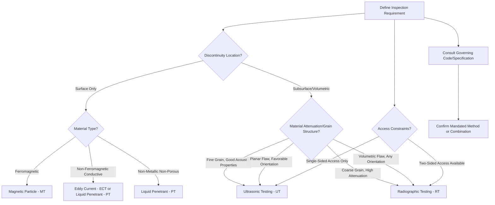

## Selecting NDT Methods by Application

### Definition and Purpose

Selecting an NDT method by application is the systematic process of matching the most suitable nondestructive testing technique(s) to a given inspection requirement, based on the material type, discontinuity type and location, component geometry, accessibility, required sensitivity, and applicable code or contractual requirements. Because no single NDT method detects all flaw types in all materials, effective method selection — often involving a combination of complementary methods — is central to designing a robust quality assurance program.

### Key Points

- No single NDT method is universally superior; each has fundamental physical limitations that determine which discontinuity types, materials, and geometries it can reliably inspect.
- Method selection is driven primarily by four factors: **material properties** (conductive/ferromagnetic/porous), **discontinuity characteristics** (surface vs. subsurface, planar vs. volumetric, orientation), **component geometry/accessibility**, and **governing code or specification requirements**.
- Multiple methods are frequently used **in combination** (e.g., UT for subsurface sizing plus MT for surface verification) to achieve comprehensive coverage, since methods are often complementary rather than substitutable.
- Applicable codes (ASME Section V, AWS D1.1, API 1104, aerospace specifications) often mandate specific methods or combinations for particular applications, removing selection discretion in regulated/coded work.

### Primary Selection Criteria

**Material Type**:

- **Ferromagnetic materials** (carbon/low-alloy steel): MT is typically preferred for surface/near-surface detection due to speed and sensitivity; PT remains viable but MT is generally favored when the material allows it.
- **Non-ferromagnetic conductive materials** (aluminum, austenitic stainless steel, titanium, copper alloys): PT for surface flaws; ECT for surface/near-surface flaws and conductivity-based sorting; UT/RT for subsurface.
- **Non-conductive/non-metallic materials** (some plastics, composites, ceramics): PT (if non-porous) for surface flaws; UT (with appropriate frequency/technique) and RT remain viable for internal inspection; ECT is not applicable.
- **Coarse-grained or highly attenuative materials** (certain castings, austenitic welds): UT sensitivity is degraded by scattering/attenuation, often favoring RT or specialized UT techniques (e.g., TOFD, lower frequency) instead.

**Discontinuity Location**:

- **Surface-breaking only**: Visual inspection, PT, MT (ferromagnetic), and ECT (conductive) are all viable, with selection driven by material and required sensitivity.
- **Near-surface**: MT (DC/rectified current) and ECT can detect near-surface flaws in addition to surface-breaking ones; UT is also effective if near-surface "dead zone" limitations are managed (e.g., via dual-element or delay-line transducers).
- **Subsurface/volumetric (deep within the material)**: UT and RT are the primary options, since PT, MT, and ECT are fundamentally limited to surface or near-surface detection.

**Discontinuity Orientation and Type**:

- **Planar flaws parallel to the surface or radiation beam** (laminations, lack of fusion parallel to beam): UT is generally more sensitive than RT, since RT relies on a thickness/density change along the beam path.
- **Volumetric flaws** (porosity, inclusions, voids): RT is generally highly effective, since these produce a clear, easily interpretable density change regardless of orientation; UT can also detect them but sizing/characterization may be less definitive for irregular volumetric flaws.
- **Tight, planar cracks favorably oriented to the inspection beam**: UT (angle-beam) is typically the most sensitive method for weld cracking and similar tight planar defects.

**Component Geometry and Access**:

- **Complex geometry, limited access, or single-sided access only**: UT (pulse-echo) and PT/MT (where accessible) are generally more practical than RT, which often benefits from or requires two-sided access.
- **Thin sections**: RT is well suited; UT can be challenging due to near-surface dead-zone effects, though specialized transducers mitigate this.
- **Tubing (internal inspection)**: ECT (bobbin coil) is the dominant method for in-service heat exchanger/steam generator tube inspection due to its ability to inspect from the tube interior efficiently.

### Method Selection Diagram (svg_diagram)

### Method Selection Summary Table

| Discontinuity/Requirement | Preferred Method(s) | Notes |
| --- | --- | --- |
| Surface cracks in ferromagnetic steel | MT | Fast, sensitive, requires demagnetization after |
| Surface cracks in non-ferromagnetic material | PT or ECT | PT for general use; ECT for conductive, coated, or high-speed applications |
| Subsurface porosity/inclusions | RT | Excellent for volumetric flaws; produces permanent record |
| Weld lack-of-fusion/cracking | UT (angle-beam/PAUT) | More sensitive than RT for planar, favorably-oriented flaws |
| Wall thickness/corrosion monitoring | UT (straight-beam) | Direct thickness measurement capability |
| Heat exchanger tube wall loss/cracking | ECT (bobbin coil) | Internal access, high-speed automated scanning |
| General surface condition/dimensional check | Visual (VT), often remote (borescope) | First-line, prerequisite to other methods |
| Alloy sorting/conductivity verification | ECT | Rapid, non-destructive material verification |
| Coating thickness | ECT (non-ferrous substrate) or magnetic induction (ferrous substrate) | Non-destructive thickness measurement |
| Complex/inaccessible internal geometry | RVI (borescope/videoscope) or UT (creative transducer geometry) | Access-driven selection |

### Combining Complementary Methods

**Key Points**:

- **VT + PT/MT**: Visual inspection is almost always performed first (and often continuously) alongside or before other surface methods, since gross surface conditions guide where more sensitive testing should focus.
- **UT + RT**: Commonly specified together on critical welds (e.g., nuclear, high-pressure piping) to combine UT's superior planar-flaw sensitivity with RT's excellent volumetric-flaw detection and permanent record — providing more comprehensive coverage than either method alone.
- **MT/PT + UT**: Surface methods confirm surface condition and near-surface flaws while UT verifies subsurface integrity, a common combination for critical forgings and castings.
- **ECT + UT**: In tubing inspection programs, ECT provides rapid full-length screening while UT may be used for more precise sizing/confirmation of indications found by ECT.

### Governing Codes and Specifications

Method selection in regulated or coded work is frequently **not discretionary** — it is dictated by the applicable code, specification, or contract requirements:

- **ASME Boiler and Pressure Vessel Code (Section V)**: Specifies required NDT methods by component type, material, and service category for pressure vessels and piping.
- **AWS D1.1 (Structural Welding Code — Steel)**: Specifies acceptance criteria and permits/requires specific methods (commonly UT and/or RT) for structural weld categories based on loading and criticality.
- **API 1104 (Pipeline Welding)**: Specifies RT and/or UT requirements for pipeline girth welds based on service and diameter/thickness.
- **Aerospace specifications (AMS, NAS, company-specific)**: Often mandate specific method, sensitivity level, and personnel certification requirements tailored to flight-critical component criticality.

**Key Points**: When a specific method is mandated by governing code, engineering judgment about "the best" method for a given flaw type does not override the code requirement — deviations require documented engineering justification and, typically, formal code variance/approval.

### Cost, Speed, and Practicality Considerations

| Factor | Fast/Low-Cost | Slower/Higher-Cost |
| --- | --- | --- |
| Setup complexity | VT, PT (portable), MT (yoke) | RT (radiation safety setup), immersion UT |
| Equipment cost | VT, basic PT/MT kits | Phased array UT, digital RT, robotic RVI systems |
| Result availability | UT (immediate), ECT (immediate) | RT (film processing, unless digital) |
| Automation potential | ECT, UT (high) | PT, MT (moderate, requires more manual steps) |
| Consumables | RT (film), PT (chemicals) | UT, ECT, MT (minimal consumables, mainly couplant/particles) |

### Practical Selection Workflow (Summary)

1. **Identify the discontinuity type of concern** (based on process history — casting, welding, forging, service degradation mechanism) to anticipate likely flaw types and locations.
2. **Determine material properties** (ferromagnetic vs. non-ferromagnetic, conductive vs. non-conductive, grain structure) to eliminate inapplicable methods.
3. **Assess accessibility and geometry** (single vs. double-sided access, confined space, in-service vs. shop environment).
4. **Consult the governing code or specification** to confirm mandated methods, sensitivity levels, and acceptance criteria — this often resolves the selection directly.
5. **Consider combining complementary methods** where code allows or requires enhanced confidence, particularly for critical/high-consequence components.
6. **Evaluate practical constraints**: cost, schedule, radiation safety logistics (for RT), and available qualified personnel.

### Conclusion

Selecting the appropriate NDT method (or combination of methods) is a critical engineering and quality decision governed by material properties, discontinuity characteristics, component geometry, and — very often — binding code or specification requirements rather than open engineering discretion. A sound understanding of each method's underlying physical principles and inherent limitations, summarized across visual, liquid penetrant, magnetic particle, ultrasonic, radiographic, and eddy current testing, is essential to building an inspection program that reliably detects the discontinuities most likely to occur for a given material, process, and service condition.

**Related Topics**:

- Visual inspection methods
- Liquid penetrant testing (PT)
- Magnetic particle testing (MT)
- Ultrasonic testing (UT) fundamentals
- Radiographic testing (RT) fundamentals
- Eddy current testing fundamentals
- NDT personnel certification (ASNT SNT-TC-1A)
- Acceptance criteria across welding and casting codes