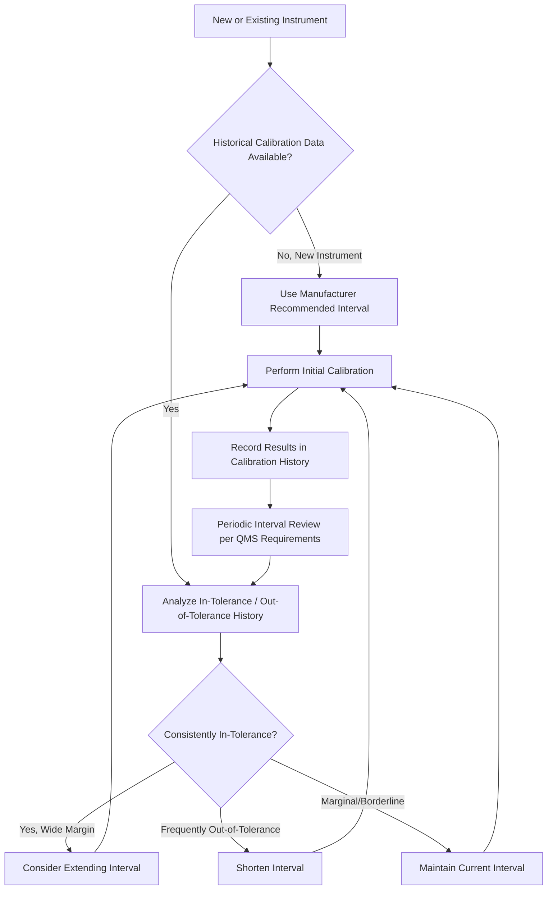

## Calibration Program Planning and Intervals

### Definition and Purpose

Calibration program planning is the systematic process of establishing which measuring instruments require calibration, how frequently, against what standards, and under what procedures, to ensure ongoing measurement accuracy and traceability throughout an organization. Calibration intervals are the time periods (or usage-based triggers) between successive calibrations of an instrument, established to balance measurement risk against the cost and downtime of calibration activities. A well-designed calibration program is foundational to a functioning quality management system and to maintaining metrological traceability to national/international standards.

### Key Points

- Calibration programs are typically mandated by quality management system standards such as **ISO/IEC 17025** (testing and calibration laboratories), **ISO 9001** (general quality management), and industry-specific requirements (e.g., AS9100 for aerospace, IATF 16949 for automotive).
- Calibration intervals are not arbitrary — they should be based on documented risk assessment, historical calibration data, manufacturer recommendations, usage severity, and the criticality of the measurements the instrument supports.
- A calibration program encompasses more than scheduling: it includes equipment identification/inventory, standard selection and traceability, procedure development, out-of-tolerance handling, and record-keeping.
- Poorly designed intervals carry two opposing risks: **too long** an interval increases the risk of undetected drift causing nonconforming measurements; **too short** an interval wastes resources and increases instrument downtime without proportional benefit.

### Equipment Inventory and Identification

**Key Points**:

- Every instrument requiring calibration must be uniquely identified (asset tag, serial number, or equivalent) and entered into a calibration management system or register, recording its description, range, accuracy class, location, and calibration status.
- Instruments should be classified by **criticality** — distinguishing measurement-critical instruments (whose accuracy directly affects product conformance decisions) from indicating-only or reference-only devices (which may require less rigorous or no formal calibration).
- A **calibration status label** (indicating calibration date, due date, and/or unique identifier linking to calibration records) should be physically applied to or clearly associated with each instrument, allowing users to verify calibration currency before use.

### Calibration Interval Determination Methods

**Manufacturer Recommendation**: The simplest starting point — using the instrument manufacturer's recommended calibration interval, particularly appropriate when historical performance data does not yet exist (e.g., newly acquired instruments).

**Fixed/Time-Based Intervals**: A predetermined interval (e.g., annual, semi-annual) applied uniformly to an instrument class, simple to administer but not optimized to actual instrument drift behavior or usage patterns.

**Usage-Based Intervals**: Calibration triggered by cumulative usage (number of measurements, operating hours, or cycles) rather than elapsed time alone — appropriate for instruments whose drift correlates more strongly with use than with time (e.g., mechanical devices subject to wear).

**Condition-Based / Reliability-Based Methods**: Interval adjustment based on statistical analysis of historical calibration results, such as:

- **In-tolerance/out-of-tolerance history**: If successive calibrations consistently find the instrument well within tolerance, the interval may be extended; if instruments are frequently found out of tolerance, the interval should be shortened.
- **Renewal Time Analysis Method (as used in methodologies like NCSLI RP-1)**: Statistical analysis of historical calibration data across a population of similar instruments to determine an interval that achieves a target reliability level (i.e., a target probability of remaining in tolerance throughout the interval).

**Key Points**: [Inference — the specific statistical method and target reliability level (commonly 95% in many industry practices) used for interval optimization varies by organization, industry standard, and the criticality of the measurements involved, so organizations should establish and document their own defensible methodology.]

### Calibration Interval Decision Flow (svg_diagram)

### Factors Influencing Interval Selection

**Key Points**:

- **Criticality of the measurement**: Instruments supporting safety-critical, regulatory, or high-consequence measurements typically warrant shorter, more conservative intervals regardless of historical stability.
- **Usage frequency and severity**: Instruments used continuously in harsh environments (temperature extremes, vibration, contamination) generally require shorter intervals than lightly used instruments in controlled environments.
- **Instrument type and inherent stability**: Some instrument technologies (e.g., gauge blocks, certain mechanical standards) are inherently more stable over time than others (e.g., electronic sensors subject to component drift), influencing baseline interval expectations.
- **Environmental exposure**: Instruments regularly subjected to temperature extremes, shock, vibration, or chemical exposure typically warrant shorter intervals due to accelerated drift or damage risk.
- **Consequence of failure**: The cost and risk associated with an out-of-tolerance instrument going undetected (e.g., product recalls, safety incidents, regulatory non-compliance) should weigh heavily in interval determination, independent of the instrument's inherent stability.

### Calibration Program Elements

**1. Master Equipment List / Calibration Register**: A comprehensive, controlled record of all instruments subject to calibration, including identification, current status, interval, and due dates.

**2. Calibration Procedures**: Documented, standardized methods for performing each type of calibration, specifying reference standards to use, environmental conditions required, measurement points, acceptance criteria, and uncertainty considerations.

**3. Traceability Chain**: Each calibration must be traceable through an unbroken chain of comparisons to national or international measurement standards (e.g., via NIST in the US, or other National Metrology Institutes internationally), typically documented through calibration certificates from accredited providers or in-house calibrations against traceable reference standards.

**4. Out-of-Tolerance (OOT) Handling Procedure**: A defined process for when an instrument is found out of tolerance during calibration, including:

- Assessment of the potential impact on measurements/products made using the instrument since its last known-good calibration.
- Notification to affected stakeholders (e.g., customers, if nonconforming product may have resulted).
- Root cause investigation and corrective action, potentially including interval adjustment.

**5. Calibration Records and Certificates**: Documented evidence of each calibration performed, including as-found and as-left data, uncertainty of measurement, environmental conditions, standards used (with their own traceability), and the technician/laboratory performing the work.

**6. Interval Review Process**: A periodic (e.g., annual) review of calibration intervals based on accumulated historical performance data, ensuring intervals remain appropriate over time rather than being set once and never revisited.

### Make-or-Buy Decision: In-House vs. Outsourced Calibration

| Factor | In-House Calibration | Outsourced (External/Accredited Lab) |
| --- | --- | --- |
| Control over scheduling | High (internal control) | Dependent on external provider capacity |
| Initial investment | High (standards, equipment, trained personnel) | Low (pay per calibration) |
| Traceability documentation | Requires internal accreditation or documented traceability | Typically provided via accredited certificate (e.g., ISO/IEC 17025) |
| Suitable for | High-volume, specialized, or proprietary equipment | Low-volume, highly specialized, or where accreditation is required |
| Turnaround time | Potentially faster (no shipping/logistics) | Dependent on external lab queue and shipping |

### ISO/IEC 17025 Considerations

For laboratories seeking or maintaining ISO/IEC 17025 accreditation, calibration program requirements include additional rigor:

- Formal **uncertainty budgets** must be established and documented for each calibration performed, per the GUM (Guide to the Expression of Uncertainty in Measurement) methodology.
- **Measurement traceability** must be demonstrated through an unbroken chain to SI units, typically via accredited calibration certificates from providers holding recognized accreditation.
- Regular **participation in proficiency testing or interlaboratory comparisons** may be required to demonstrate ongoing competence and measurement equivalence with other laboratories.
- **Equipment used for calibration** (the calibration laboratory's own reference standards) must itself be calibrated and controlled with documented traceability, forming a complete unbroken chain.

### Example Calibration Interval Table (Illustrative)

| Instrument Type | Typical Starting Interval | Adjustment Basis |
| --- | --- | --- |
| Gauge blocks (reference grade) | 1–5 years | Usage frequency, handling care, environmental storage |
| Dial/digital calipers (working standard) | 6–12 months | Usage frequency, historical OOT rate |
| Torque wrenches | 3–12 months (or per-use-count) | Usage cycles, criticality of application |
| Pressure gauges (process) | 6–12 months | Criticality, environmental severity |
| Temperature sensors (RTD/thermocouple, process) | 6–12 months | Process temperature severity, criticality |
| CMMs (coordinate measuring machines) | 12 months (with interim checks) | Usage volume, environmental stability of installation |

**Key Points**: These figures are illustrative starting points only — actual intervals should always be established per the organization's own documented risk assessment, historical performance data, applicable industry standards, and any customer/regulatory requirements, since appropriate intervals vary considerably by specific instrument model, application severity, and organizational risk tolerance. [Inference — the table values represent commonly seen industry starting points rather than universally mandated figures.]

### Common Pitfalls in Calibration Program Design

- **Applying a single fixed interval to all equipment regardless of criticality or usage**: fails to account for the wide variation in drift behavior and consequence-of-failure across different instrument types and applications.
- **Never reviewing or adjusting intervals based on historical data**: intervals set once at program inception without periodic review can become significantly misaligned with actual instrument behavior over time.
- **Inadequate out-of-tolerance impact assessment**: failing to assess and document the potential impact on prior measurements when an instrument is found out of tolerance can result in undetected nonconforming product remaining in the field.
- **Insufficient traceability documentation**: gaps in the traceability chain (e.g., using uncalibrated "reference" standards internally) undermine the validity of the entire calibration program regardless of how well intervals are managed.
- **Treating calibration as a purely administrative/compliance task**: disconnecting calibration planning from actual measurement risk and criticality analysis can result in either excessive cost (over-calibration) or inadequate quality assurance (under-calibration).

### Conclusion

Effective calibration program planning balances measurement risk, cost, and operational practicality through a structured, data-driven approach to interval determination — starting with manufacturer recommendations for new equipment, then refining intervals based on historical in-tolerance/out-of-tolerance performance, usage severity, and measurement criticality. Combined with rigorous traceability, documented procedures, and defined out-of-tolerance handling, a well-managed calibration program provides the metrological foundation necessary for reliable quality control and regulatory/customer confidence.

**Related Topics**:

- Measurement traceability and the SI system
- Measurement uncertainty analysis (GUM methodology)
- ISO/IEC 17025 laboratory accreditation requirements
- Out-of-tolerance investigation and corrective action
- Gauge blocks and length standards
- Environmental control in precision measurement
- Statistical process control in quality management