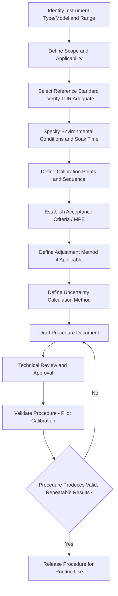

## Calibration Procedures and Records

### Definition and Purpose

Calibration procedures are documented, standardized methods that define how a specific instrument or instrument class is calibrated, ensuring consistency, repeatability, and technical validity regardless of which technician performs the work. Calibration records are the documented evidence generated from performing that procedure, providing traceable proof of measurement performance, supporting quality system compliance, and enabling historical trend analysis. Together, procedures and records form the operational backbone of any calibration program, translating interval planning and traceability requirements into consistent, auditable practice.

### Key Points

- A calibration procedure defines **what** to measure, **how** to measure it, **against what standard**, **under what conditions**, and **what constitutes acceptable performance** — removing ambiguity and operator-dependent variability from the calibration process.
- Calibration records must capture sufficient detail to allow **reconstruction and verification** of the calibration event after the fact, including as-found and as-left data, not merely a pass/fail statement.
- ISO/IEC 17025 and similar quality management frameworks impose specific minimum content requirements for both procedures and records, particularly around traceability, uncertainty, and environmental conditions.
- Well-designed procedures and thorough records directly support **out-of-tolerance impact investigations**, since the historical as-found data of a failed instrument is the primary evidence used to assess what measurements may have been affected.

### Calibration Procedure Content

**Scope and Applicability**: Defines which specific instrument model(s), ranges, and accuracy classes the procedure applies to, ensuring the correct procedure is selected for a given instrument.

**Reference Standards Required**: Specifies the exact reference standard(s) or standard class needed to perform the calibration, including required accuracy/uncertainty ratio relative to the unit under test (commonly a **Test Uncertainty Ratio, TUR, of at least 4:1**, meaning the reference standard's uncertainty should be at most one-quarter of the tolerance being verified, though specific required ratios vary by industry and application) [Inference — TUR requirements vary by governing standard, industry practice, and risk tolerance, so the specific minimum ratio should be confirmed against the applicable procedure or standard].

**Environmental Conditions**: Specifies required ambient temperature, humidity, and other environmental parameters (and acceptable tolerance bands) under which the calibration must be performed, along with any required stabilization/soak time for the unit under test.

**Calibration Points and Sequence**: Defines the specific test points across the instrument's range (e.g., 0%, 25%, 50%, 75%, 100% of full scale) and the sequence of application (commonly including both ascending and descending measurement sequences to detect hysteresis).

**Acceptance Criteria**: States the maximum permissible error (MPE) or tolerance at each test point, against which the as-found and as-left readings are evaluated to determine pass/fail status.

**Adjustment Procedure**: Where the instrument is adjustable, specifies the method for making adjustments and the requirement to re-verify performance (as-left data) after adjustment.

**Uncertainty Calculation Method**: Specifies how measurement uncertainty for the calibration itself is calculated and expressed, typically per the GUM (Guide to the Expression of Uncertainty in Measurement) methodology.

### Calibration Procedure Development Flow (svg_diagram)

### As-Found and As-Left Data

**As-Found Data**: The instrument's measured performance **before** any adjustment or repair is made, representing its actual condition and accuracy as it existed during the period since its previous calibration — this is the critical data set for out-of-tolerance impact assessment, since it reflects what the instrument's true error was during its in-service period.

**As-Left Data**: The instrument's measured performance **after** any adjustment, repair, or correction has been applied, confirming the instrument is within tolerance before being returned to service.

**Key Points**: Recording only a final pass/fail result without preserving distinct as-found and as-left data is a significant deficiency in calibration record-keeping, since it eliminates the ability to assess the true historical performance of the instrument and any potential impact on measurements made prior to calibration.

### Minimum Calibration Record Content

A complete calibration record (or certificate) typically includes:

- **Unique identification** of the instrument (make, model, serial number, asset ID) and of the calibration record/certificate itself.
- **Date of calibration** and, where relevant, the next due date per the established interval.
- **Identification of the reference standard(s)** used, including their own calibration status/traceability and certificate numbers.
- **As-found and as-left measurement data** at each test point, including the reference standard's reading, the unit-under-test's reading, and the resulting error/deviation.
- **Stated measurement uncertainty** for the calibration, calculated per the applicable methodology.
- **Environmental conditions** during the calibration (temperature, humidity) and confirmation they were within procedure-specified limits.
- **Pass/fail determination** against the applicable acceptance criteria/tolerance.
- **Identification of the technician** performing the calibration and, typically, an approving/reviewing authority.
- **Reference to the calibration procedure** used (procedure number/revision), ensuring traceability of methodology as well as of physical standards.

### Calibration Certificate vs. Internal Calibration Record

| Aspect | Calibration Certificate (External/Accredited) | Internal Calibration Record |
| --- | --- | --- |
| Issued by | Accredited third-party or accredited internal lab | In-house calibration technician/department |
| Formal accreditation mark | Often includes accreditation body logo/scope reference | Not applicable unless internally accredited |
| Legal/contractual weight | Often required for customer or regulatory submission | Generally sufficient for internal quality system use |
| Content requirements | Governed by accreditation body requirements (e.g., ISO/IEC 17025) | Governed by internal quality procedures |

### Traceability Documentation Within Records

**Key Points**:

- Each calibration record must reference the specific reference standard(s) used, and that standard's own calibration certificate must be traceable further up the chain, ultimately to a National Metrology Institute or equivalent recognized standard.
- A **traceability statement** on a calibration certificate typically identifies the specific standards used and their own calibration source, allowing an auditor to follow the complete chain of comparisons back to SI units.
- Loss or gaps in this documented chain — for example, using an internal "reference" instrument with no calibration record of its own — breaks traceability for every calibration performed using that reference, regardless of how well the downstream procedure was executed.

### Record Retention

**Key Points**:

- Calibration records must be retained for a defined period, driven by applicable quality standards, regulatory requirements, and organizational policy — commonly for the life of the instrument plus some additional period, or per specific industry/regulatory mandates (e.g., aerospace, medical device, or nuclear industry retention requirements often exceed general industrial practice).
- Records should be stored in a manner that protects against loss, damage, or unauthorized alteration, whether physical (secure filing) or electronic (access-controlled calibration management software with audit trail/version control).
- Retrievability matters as much as retention: records must be readily accessible for audit, customer review, or out-of-tolerance investigation purposes within a reasonable timeframe.

### Calibration Management Systems

Modern calibration programs, particularly at scale, are typically supported by dedicated **calibration management software (CMS)**, which:

- Maintains the master equipment list/register and automatically tracks due dates.
- Stores digital calibration records and certificates, often integrated with the reference standard's own traceability records.
- Automates scheduling notifications and can support interval optimization analysis based on historical data.
- Provides audit trail functionality, recording who performed and approved each calibration and when records were created/modified — a key requirement for ISO/IEC 17025 and similar accredited environments.

[Inference — specific software platforms, features, and capabilities vary significantly across commercial and custom-built calibration management systems, so functionality should be verified against the specific system in use.]

### Handling Deviations and Nonconformances

**Key Points**:

- When a calibration reveals an instrument is out of tolerance (as-found), the procedure should define a clear escalation path: notification of relevant stakeholders, assessment of potential impact on prior measurements/products, and initiation of a nonconformance/corrective action record per the quality management system.
- If a calibration cannot be completed per the standard procedure (e.g., equipment malfunction, environmental conditions out of range), this deviation must itself be documented, along with any compensating actions taken or the decision to abort and reschedule the calibration.
- Records of nonconformances and corrective actions related to calibration should be cross-referenced with the calibration record itself, providing a complete audit trail from initial detection through resolution.

### Common Pitfalls in Procedures and Records

- **Vague or missing acceptance criteria**: procedures lacking explicit maximum permissible error values at each test point leave pass/fail determination to technician judgment, undermining consistency and defensibility.
- **Recording only pass/fail without quantitative data**: prevents trend analysis, interval optimization, and proper out-of-tolerance impact assessment, since the actual magnitude and direction of error is not preserved.
- **Failing to document environmental conditions**: without recorded environmental data, it is impossible to verify the calibration was performed within the conditions the procedure and uncertainty budget assume.
- **Inadequate reference standard identification**: recording only "calibrated micrometer" rather than the specific identified standard (with serial number and calibration status) breaks the ability to trace or investigate if that standard is later found to be in error.
- **Procedures not kept current with instrument firmware/model revisions**: outdated procedures may reference calibration points, tolerances, or methods no longer appropriate for updated instrument versions, requiring periodic procedure review and revision control.
- **Uncontrolled procedure documents**: using outdated or unapproved procedure revisions due to inadequate document control undermines the consistency the procedure was meant to ensure.

### Conclusion

Calibration procedures and records together transform a calibration program's interval planning and traceability requirements into consistent, defensible, and auditable practice. Rigorous procedures ensure every calibration is performed identically regardless of technician, while complete records — capturing as-found and as-left data, uncertainty, environmental conditions, and full traceability — provide the documented evidence necessary for quality system compliance, customer/regulatory confidence, and effective out-of-tolerance impact investigation when instruments are found to have drifted beyond acceptable limits.

**Next Steps**:

- Calibration program planning and intervals
- Measurement traceability and the SI system
- Measurement uncertainty analysis (GUM methodology)
- ISO/IEC 17025 laboratory accreditation requirements
- Out-of-tolerance investigation and corrective action
- Document control within quality management systems
- Gauge blocks and length standards