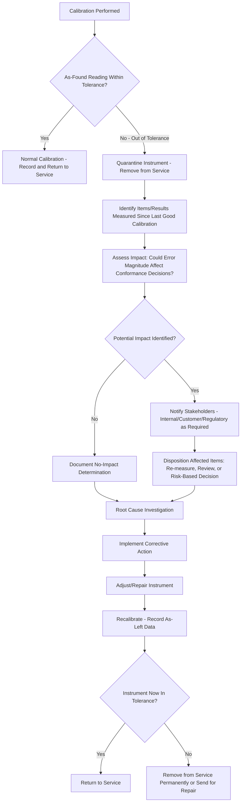

## Out of Tolerance Handling

### Definition and Purpose

Out of tolerance (OOT) handling is the systematic process an organization follows when a calibration reveals that an instrument's as-found performance falls outside its specified acceptance criteria. Because an out-of-tolerance instrument may have been producing inaccurate measurements throughout its entire period of use since the previous calibration, OOT handling is not merely about correcting the instrument — it is fundamentally a **backward-looking impact investigation** aimed at determining whether any product, process decision, or reported result was affected by the instrument's undetected drift.

### Key Points

- An OOT condition triggers an investigation into the **potential impact on all measurements made with that instrument since its last known-good (in-tolerance) calibration**, not just a simple repair-and-recalibrate response.
- The severity of response should be proportional to the **magnitude of the deviation**, the **criticality of the measurements affected**, and the **number/scope of items potentially impacted** — a minor deviation on a low-criticality gauge warrants a different response than a significant deviation on an instrument used for safety-critical acceptance testing.
- OOT handling is a mandatory element of ISO/IEC 17025 and most quality management system frameworks (ISO 9001, AS9100, IATF 16949), which require documented procedures for managing the use of nonconforming equipment and its consequences.
- Effective OOT handling depends critically on having **complete as-found calibration data and traceable usage records** — without knowing what the instrument's actual error was and which items it measured, meaningful impact assessment is not possible.

### The OOT Handling Process

**1. Detection**: An OOT condition is identified during a scheduled or unscheduled calibration when the as-found reading exceeds the instrument's specified maximum permissible error (MPE) at one or more test points.

**2. Quarantine/Removal from Service**: The instrument is immediately tagged as out-of-tolerance/quarantined and removed from active use to prevent further potentially inaccurate measurements while the investigation proceeds.

**3. Impact Assessment (Backward Investigation)**: The core of OOT handling — determining what was measured using the instrument since its last known-good calibration, and assessing whether the specific magnitude and direction of the found error could have caused any of those measurements to be reported incorrectly (i.e., whether a genuinely conforming item might have been measured as conforming when it was actually out of spec, or vice versa).

**4. Notification**: Where the impact assessment indicates potentially affected products, results, or customer deliverables, relevant internal stakeholders (quality, engineering, operations) and, where required, external stakeholders (customers, regulatory bodies) must be notified per the organization's documented procedures and any contractual/regulatory obligations.

**5. Disposition of Affected Items**: Items identified as potentially affected are evaluated — which may include re-measurement with a known-good instrument, engineering review, or, where re-measurement is not possible (e.g., destructive testing already performed, product shipped), a documented risk-based disposition decision.

**6. Root Cause Investigation**: Determining why the instrument went out of tolerance (normal drift, damage, misuse, environmental exposure, inadequate interval) to inform corrective action.

**7. Corrective Action**: Actions to prevent recurrence, which may include interval adjustment, procedural changes, operator retraining, or instrument replacement.

**8. Instrument Disposition**: The instrument itself is either adjusted/repaired and recalibrated (with both as-found and as-left data documented), or removed from service permanently if it cannot be brought within tolerance or is deemed unsuitable for continued use.

### OOT Handling Process Flow (svg_diagram)

### Impact Assessment Methodology

**Key Points**:

- Impact assessment requires knowing **when** the instrument was last confirmed in-tolerance, **what** was measured with it during the intervening period, and the **actual magnitude and direction** of the as-found error — this is why traceable usage logs (or, at minimum, a defined assumption of "used continuously since last calibration") are essential inputs.
- The assessment should consider whether the specific error found is large enough, relative to the tolerance of the items being measured, to have plausibly caused an incorrect accept/reject decision — a small OOT deviation relative to a generous product tolerance may result in a documented "no significant impact" conclusion, while a similar deviation against a tight tolerance may require full re-inspection.
- Where the specific items measured cannot be identified (e.g., no traceable link between calibration records and production/inspection records), a **conservative, worst-case assumption** is generally applied — treating all items measured during the uncertain period as potentially affected until proven otherwise. [Inference — the specific conservatism applied varies by organizational risk tolerance and the criticality of the application, so this should be governed by documented procedure rather than ad hoc judgment.]

### Example Impact Assessment

**Example**: A digital caliper used to verify a critical dimension with a tolerance of ±0.05 mm is found, at its scheduled annual calibration, to have an as-found error of +0.08 mm at the relevant measurement point (i.e., exceeding its own stated tolerance). Impact assessment would review all parts measured and accepted using that caliper since its previous calibration date, focusing especially on any parts recorded as passing close to the lower tolerance limit (since the caliper's positive bias could have caused a truly undersized part to appear acceptable), potentially requiring re-inspection of those borderline-accepted parts with a verified instrument.

### Determining the "Last Known Good" Reference Point

**Key Points**:

- The impact assessment window begins at the **most recent calibration where the instrument was confirmed in-tolerance** — not simply the most recent calibration event, since the current calibration is the one that revealed the OOT condition.
- If an instrument has a history of interim checks (e.g., periodic verification against a reference standard between full calibrations), these interim check results can help narrow the impact window more precisely than relying solely on the full calibration interval.
- In the absence of interim checks, the entire period since the last full in-tolerance calibration is generally treated as the window of potential impact, which is one reason shorter calibration intervals reduce the potential scope (and cost) of any future OOT investigation.

### Documentation Requirements

A complete OOT investigation record typically includes:

- **Identification of the instrument**, the OOT calibration event, and the as-found deviation details (magnitude, direction, affected test points).
- **The determined impact assessment window** (last known-good calibration date to OOT detection date).
- **List or description of items/measurements potentially affected**, and the method used to identify them.
- **The impact conclusion** (no impact, limited impact requiring specific re-inspection, or broader impact requiring wider corrective action) with supporting rationale.
- **Notification records**, where applicable, documenting who was informed and when.
- **Root cause analysis** and corrective action taken to prevent recurrence.
- **Final instrument disposition** (returned to service with as-left data, or removed from service).

### Notification Obligations

**Key Points**:

- Internal notification typically follows the organization's nonconformance/corrective action procedure, routing findings to quality, engineering, and operations stakeholders responsible for affected products or processes.
- External (customer) notification is often contractually or regulatorily required when an OOT condition is determined to have potentially affected product already delivered, particularly in regulated industries (aerospace, medical device, nuclear, automotive) where customer flow-down requirements frequently mandate prompt disclosure.
- Regulatory notification may be required in certain regulated sectors where the affected measurements relate to safety, environmental compliance, or regulatory submissions — specific obligations depend heavily on the applicable regulatory framework and should be confirmed against current requirements for the specific industry and jurisdiction.

### Risk-Based Response Scaling

| OOT Severity | Example Scenario | Typical Response Scope |
| --- | --- | --- |
| Minor deviation, low-criticality instrument | Slightly OOT general-purpose gauge, non-critical dimension | Document, recalibrate, monitor trend; limited/no re-inspection |
| Minor deviation, high-criticality instrument | Slightly OOT reference standard used for other calibrations | Broader investigation given downstream traceability impact |
| Significant deviation, low-criticality instrument | Large OOT on a rarely-used, non-critical tool | Targeted review of recent use; corrective action on instrument |
| Significant deviation, high-criticality instrument | Large OOT on safety-critical acceptance test equipment | Full impact investigation, likely re-inspection/customer notification, formal corrective action |

### Common Pitfalls in OOT Handling

- **Treating OOT as purely an equipment problem**: focusing only on repairing/recalibrating the instrument while neglecting the backward-looking impact assessment misses the core risk that OOT handling exists to address.
- **Inadequate usage traceability**: without records linking specific instruments to specific measurements/products, impact assessment becomes guesswork or requires overly broad (and costly) conservative assumptions.
- **Delayed quarantine**: continuing to use an instrument after an OOT condition is suspected (but before formal confirmation) extends the potential impact window unnecessarily.
- **Inconsistent severity scaling**: applying the same investigation depth to every OOT event regardless of deviation magnitude or criticality wastes resources on trivial cases while potentially under-investigating serious ones if not governed by a clear, risk-based procedure.
- **Failure to adjust calibration intervals after OOT trends**: repeated OOT findings on the same instrument or instrument class should trigger interval review and shortening, not just repeated individual corrective actions without addressing the underlying pattern.
- **Poor documentation of the "no impact" conclusion**: even when an investigation concludes there was no meaningful impact, this conclusion and its supporting rationale must be documented — an undocumented judgment call is not defensible in an audit.

### Conclusion

Out of tolerance handling is a critical risk-management process that extends far beyond simply fixing a drifted instrument — it requires a disciplined, documented backward investigation into what may have been measured incorrectly, proportional notification of affected stakeholders, and root cause-driven corrective action to prevent recurrence. The rigor and traceability built into an organization's calibration procedures and records directly determine how effectively it can conduct this investigation when an OOT condition inevitably occurs, making strong procedures, records, and interval management the best defense against costly, poorly-bounded OOT investigations.

**Related Topics**:

- Calibration procedures and records
- Calibration program planning and intervals
- Measurement traceability and the SI system
- ISO/IEC 17025 laboratory accreditation requirements
- Corrective and preventive action (CAPA) systems
- Measurement uncertainty analysis (GUM methodology)
- Nonconforming product control in quality management systems