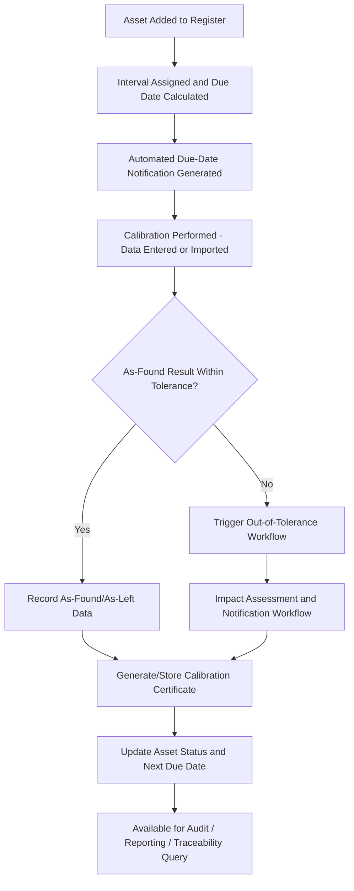

## Calibration and Asset Management Software

### Definition and Purpose

Calibration and asset management software (also called calibration management software, CMS, or asset calibration management systems) is a class of digital tools that automates the administration of a calibration program — tracking equipment inventories, scheduling due dates, storing calibration records and certificates, managing out-of-tolerance events, and maintaining the traceability documentation required by quality standards such as ISO/IEC 17025 and ISO 9001. As calibration programs scale beyond a handful of instruments, purpose-built software replaces manual spreadsheets and paper records with a structured, auditable, and often automated system of record.

### Key Points

- Calibration management software is generally categorized alongside or as a module within broader **computerized maintenance management systems (CMMS)** and **enterprise asset management (EAM)** platforms, since calibration is one form of scheduled equipment maintenance activity used to reduce maintenance costs, improve uptime, and reduce incidents caused by malfunctioning equipment, and is most beneficial for maintenance teams in asset-intensive industries such as manufacturing or construction. [g2](https://www.g2.com/categories/calibration?page=3)
- Calibration software can be delivered as a standalone product or as a part of CMMS or EAM software, and often integrates with quality management (QMS) software, reflecting the close relationship between calibration tracking and the broader quality system it supports. [g2](https://www.g2.com/categories/calibration?page=3)
- Typical calibration management solutions offer remote access to measurement readings, out-of-tolerance notifications, preventative maintenance scheduling, and the ability to track work in progress for instruments and equipment under repair. [capterra](https://www.capterra.co.uk/directory/30214/calibration-management/deployment-options/windows/software)
- Core qualifying capabilities generally expected of this software category include the ability to provide tests for different types of calibration such as manual or automatic, schedule calibration tasks at various frequencies for each fixed asset, comply with industry standards for calibration such as ISO 17025, compare test results to industry standards to identify discrepancies, and provide certificates and other documents on the condition of instruments. [g2](https://www.g2.com/categories/calibration?page=3)

### Core Functional Modules

**Asset Inventory / Master Equipment Register**: A centralized digital record of every instrument subject to calibration, capturing identification (asset ID, serial number, manufacturer/model), location, ownership, criticality classification, and current calibration status — functioning as the digital equivalent of the master equipment list described in calibration program planning.

**Scheduling and Due-Date Tracking**: Automated tracking of calibration intervals per instrument, generating advance notifications as due dates approach and flagging overdue equipment, reducing reliance on manual tracking that is prone to oversight as fleet size grows.

**Calibration Record and Certificate Management**: Digital storage of as-found/as-left data, uncertainty calculations, environmental conditions, and generated or uploaded calibration certificates, typically searchable and linked directly to the specific asset record.

**Out-of-Tolerance (OOT) Workflow Support**: Automated flagging of OOT results and often structured workflows to support the impact assessment, notification, and corrective action process described in out-of-tolerance handling procedures.

**Procedure and Standards Library**: Storage of controlled calibration procedures, with version control ensuring technicians always use the current approved revision, and linkage between procedures and the specific asset types they apply to.

**Traceability Management**: Tracking of reference standards used for each calibration, including their own calibration status, linking every calibration performed back through an unbroken, documented chain — a core requirement for ISO/IEC 17025 compliance.

**Reporting and Analytics**: Dashboards and reports supporting interval optimization analysis, audit preparation, compliance status overviews, and historical trend review across the equipment fleet.

### Calibration Software Workflow (svg_diagram)

### Deployment Models

| Model | Description | Considerations |
| --- | --- | --- |
| On-premise | Software installed and hosted on the organization's own servers | Greater IT control and data residency; higher internal maintenance burden |
| Cloud-based (SaaS) | Hosted by the vendor, accessed via web browser or app | Lower upfront infrastructure cost, easier remote/multi-site access, dependent on vendor uptime |
| Hybrid | Combination of local data capture with cloud synchronization | Balances offline capability (e.g., field calibration) with centralized reporting |

Some vendors explicitly support both models; for example, IndySoft is described as offering on-premise and web-based calibration and asset management. [capterra](https://www.capterra.ca/alternatives/172598/4sight2-calibration-asset-management)

### Notable Product Categories in the Current Market

Based on current vendor listings, calibration and asset management software spans several positioning tiers:

**ISO/IEC 17025-focused calibration platforms**: Products explicitly marketed around accreditation compliance, such as Metquay, described as an ISO 17025 compliant calibration management system, and Calibration Studio, described as ISO/IEC 17025 compliant calibration management software that interfaces with a wide range of gauges, instruments, and devices. Metquay is also positioned as a combined calibration, testing, and asset management system with an inbuilt procedure and worksheet engine allowing users to create and manage calibration procedures and worksheets themselves, and automated certificate generation with version numbering and tracking to minimize quality risks and errors. [www.capterra.ae +3](https://www.capterra.ae/directory/30214/calibration-management/pricing/free/software)

**General calibration/gauge tracking platforms**: Products such as GageList, marketed as intuitive calibration management for ISO 9001 and FDA compliance with unlimited users and mobile apps for Android and iOS with a multi-site dashboard. [capterra](https://www.capterra.ae/directory/30214/calibration-management/pricing/free/software)

**Broader asset management platforms with calibration modules**: Products such as Asset Infinity, which provides calibration management software with iOS and Android apps to help organizations enhance asset performance, and Asset Infinity more generally described as a cloud-based asset management and tracking tool to manage all types of assets and keep a record of all maintenance activities and asset possession throughout their lifetime. [capterra](https://www.capterra.ae/directory/30214/calibration-management/pricing/free/software)[getapp](https://www.getapp.com/operations-management-software/calibration-management/f/asset-management/)

**QMS-integrated calibration/compliance suites**: Products such as Momentum QMS, positioned as quality and safety software with no user license fees, providing an ISO 17025 management solution with an intuitive interface, customizable workflows, and powerful analytics tools, and CodonLIMS, a web-based solution for quality control/research labs in the manufacturing sector to manage samples and lab informatics. [getapp](https://www.getapp.com/operations-management-software/calibration-management/f/asset-management/)[capterra](https://www.capterra.com.sg/directory/30214/calibration-management/software?page=3)

**Established/legacy enterprise calibration systems**: Longer-standing products such as Beamex CMX, described as an advanced yet easy-to-use calibration software solution that helps document and manage instrument calibrations, and CompuCal, which helps manage calibration and reduce costs with the option of cloud service or server installation. [capterra](https://www.capterra.ca/alternatives/172598/4sight2-calibration-asset-management)[capterra](https://www.capterra.co.uk/directory/30214/calibration-management/deployment-options/windows/software)

**Newer/lightweight entrants**: Emerging products such as Gaugify, described as a modern calibration management and tracking software built to simplify how businesses track and manage their equipment, allowing users to schedule calibrations and store certificates, and Tego, which provides a plug-and-play calibration management solution that captures data directly on tools, kits, and components. [g2](https://www.g2.com/categories/calibration?page=3)[capterra](https://www.capterra.com.sg/directory/30214/calibration-management/software?page=3)

[Unverified — this list reflects vendor self-descriptions and directory listings current as of this search and should not be treated as an exhaustive or independently benchmarked comparison; specific feature sets, pricing, and accreditation-support capabilities should be verified directly with each vendor before selection.]

### Selection Criteria

**Key Points**:

- **Regulatory/accreditation alignment**: Organizations pursuing or maintaining ISO/IEC 17025 accreditation should prioritize platforms with explicit support for uncertainty budgets, traceability chain documentation, and audit trail functionality, rather than general-purpose asset trackers lacking calibration-specific rigor.
- **Fleet size and complexity**: Small equipment fleets may be adequately served by simpler, lower-cost tools, while large, multi-site organizations typically benefit from platforms offering multi-site dashboards, role-based access control, and enterprise-level reporting.
- **Integration needs**: Organizations with existing QMS, ERP, or CMMS platforms should evaluate integration/API capability to avoid duplicate data entry and maintain a single source of truth across systems.
- **Mobile and field capability**: Organizations performing calibration in the field (as opposed to a fixed lab) benefit from platforms offering mobile apps or offline data capture capability.
- **Data ownership and export**: Given the long retention periods often required for calibration records, organizations should evaluate how easily data can be exported or migrated if they later change software vendors.

### Benefits of Digital Calibration Management

- **Reduced administrative burden**: Automated scheduling and notification substantially reduce the manual effort of tracking due dates across large equipment populations compared to spreadsheet-based tracking.
- **Improved audit readiness**: Centralized, searchable digital records with built-in traceability linkage simplify demonstrating compliance during internal or external (accreditation body, customer) audits.
- **Reduced risk of overdue/missed calibrations**: Automated alerting reduces the risk that an instrument continues in service past its due date undetected.
- **Data-driven interval optimization**: Centralized historical calibration data makes statistical interval review (as discussed in calibration program planning) practically feasible at scale, which is difficult to sustain manually across large fleets.
- **Consistent out-of-tolerance handling**: Structured OOT workflows help ensure the impact assessment and notification steps are not skipped or inconsistently applied across different technicians or sites.

### Common Pitfalls in Software Adoption

- **Selecting software without confirming accreditation-relevant capability**: choosing a general asset-tracking tool that lacks proper uncertainty, traceability, and audit-trail features can leave gaps relative to ISO/IEC 17025 requirements.
- **Incomplete data migration**: transitioning from legacy paper or spreadsheet records without fully and accurately migrating historical calibration history undermines the ability to perform interval optimization and OOT impact investigations going forward.
- **Inadequate user training/adoption**: even well-featured software fails to deliver its intended benefits if technicians continue informal parallel record-keeping due to insufficient training or poor workflow fit.
- **Underestimating configuration effort**: mapping existing procedures, tolerance classes, and reporting formats into a new system often requires significant upfront configuration, which is frequently underestimated during vendor selection and implementation planning.
- **Neglecting the software's own validation**: where calibration software performs calculations (e.g., uncertainty, pass/fail determination), the software itself should be validated to confirm it produces correct results, consistent with general software validation expectations within a quality management system. [Inference — the specific validation rigor expected varies by accreditation body and application criticality.]

### Conclusion

Calibration and asset management software provides the operational infrastructure that turns calibration program planning, procedures, records, and out-of-tolerance handling into a scalable, auditable practice, particularly as equipment fleets grow beyond what manual tracking can reliably support. Selection should be driven by the organization's accreditation requirements, fleet size and complexity, integration needs, and field-work requirements, with careful attention to accreditation-relevant capabilities, data migration integrity, and user adoption to realize the efficiency and compliance benefits these platforms are designed to provide.

**Related Topics**:

- Calibration program planning and intervals
- Calibration procedures and records
- Out of tolerance handling
- Measurement traceability and the SI system
- ISO/IEC 17025 laboratory accreditation requirements
- Enterprise asset management (EAM) and CMMS systems
- Document control within quality management systems