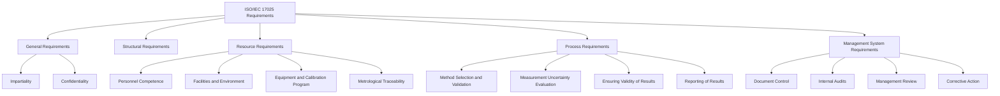

## ISO/IEC 17025 Accreditation Requirements

### Definition and Purpose

ISO/IEC 17025 is the international standard specifying the general requirements for the competence, impartiality, and consistent operation of testing and calibration laboratories. Accreditation to this standard, granted by a recognized national accreditation body, provides formal, third-party-verified assurance that a laboratory is technically competent and capable of producing valid, traceable results. It is the primary global framework underpinning confidence in calibration certificates and test reports across industry, regulatory, and international trade contexts.

### Key Points

- ISO/IEC 17025 applies to **all laboratories performing tests and/or calibrations**, regardless of the number of personnel or the scope of testing/calibration activities, and is applicable to all organizations performing laboratory activities, regardless of size.
- Accreditation is granted by a **national accreditation body** (e.g., A2LA or ANAB in the US, UKAS in the UK, national bodies elsewhere, typically operating under the mutual recognition framework of ILAC — the International Laboratory Accreditation Cooperation) rather than by ISO itself.
- The standard is structured around two broad categories of requirements: **general requirements** (impartiality and confidentiality) and requirements addressing **structural, resource, process, and management system** elements.
- Accreditation is scope-specific: a laboratory is accredited for particular tests, calibrations, or measurement types (its "scope of accreditation"), not as a blanket organizational certification covering everything the laboratory might do.

### Structure of ISO/IEC 17025

The standard is organized into five main clauses beyond the introductory/scope sections:

**1. General Requirements**:

- **Impartiality**: The laboratory must identify risks to its impartiality on an ongoing basis and demonstrate how it manages or mitigates them, ensuring laboratory activities are undertaken impartially and are not influenced by commercial, financial, or other undue pressures.
- **Confidentiality**: The laboratory must have policies and procedures to protect confidential information and proprietary rights of clients.

**2. Structural Requirements**: Defines requirements for the laboratory's legal identity, organizational structure, management responsibilities, and the identification of personnel with authority and responsibility for key laboratory functions.

**3. Resource Requirements**: Covers personnel competence, facilities and environmental conditions, equipment, metrological traceability, and externally provided products and services.

**4. Process Requirements**: Covers the technical activities of the laboratory — review of requests/tenders/contracts, method selection and validation, sampling, handling of test/calibration items, technical records, evaluation of measurement uncertainty, ensuring the validity of results, reporting of results, complaints, and control of nonconforming work.

**5. Management System Requirements**: Covers the laboratory's management system, whether structured per the requirements embedded directly in the standard (Option A) or aligned with ISO 9001 principles (Option B), including document control, risk management, internal audits, and management review.

### Personnel Competence Requirements

**Key Points**:

- The laboratory must ensure the competence of all personnel who operate equipment, perform tests/calibrations, evaluate results, and sign test reports or calibration certificates.
- Competence requirements are based on appropriate education, training, experience, and demonstrated skills, and must be documented — commonly through defined competence criteria, monitoring, and periodic reassessment.
- Personnel must be authorized to perform specific laboratory activities, and this authorization should be formally documented and controlled.

### Facilities and Environmental Conditions

**Key Points**:

- The laboratory must have facilities appropriate for correct performance of laboratory activities, with environmental conditions (temperature, humidity, vibration, electromagnetic disturbances, dust, etc.) monitored, controlled, and recorded where they could invalidate results or adversely affect the required quality of a result.
- Access to areas affecting laboratory activities must be controlled based on assessed impact on laboratory operations, and measures should be taken to prevent cross-contamination or interference between incompatible activities.
- This directly connects to environmental control in precision measurement practices, since ISO/IEC 17025 formalizes the requirement that such environmental controls be documented and demonstrably effective.

### Equipment Requirements

**Key Points**:

- Equipment (including hardware, software, measurement standards, reference materials, and consumables) used for laboratory activities must be shown to achieve the required measurement accuracy and comply with specified requirements.
- Equipment must be calibrated (or verified) before being put into service, and a **calibration program** must be established and reviewed, connecting directly to calibration program planning and interval determination.
- Equipment status must be clearly identifiable, including calibration status, to prevent inadvertent use of equipment that is overdue, damaged, or otherwise unsuitable.

### Metrological Traceability

**Key Points**:

- Laboratories must establish and maintain metrological traceability of their measurement results by means of a documented unbroken chain of calibrations, each contributing to the measurement uncertainty, linking ultimately to an appropriate reference — typically the **International System of Units (SI)**.
- Where traceability to SI units is not technically possible, the laboratory must demonstrate traceability to an appropriate reference, such as certified reference materials, or results from reference measurement procedures, specified methods, or consensus standards.
- Traceability must generally be established through calibrations performed by laboratories that can demonstrate their own competence, measurement capability, and metrological traceability (typically accredited calibration laboratories).

### Measurement Uncertainty

**Key Points**:

- Laboratories performing calibrations, and applicable testing laboratories, must evaluate measurement uncertainty for all calibrations, using an appropriate method of analysis, consistent with internationally recognized methodology such as the GUM (Guide to the Expression of Uncertainty in Measurement).
- Uncertainty evaluation must identify all contributing components and give a reasonable estimation, ensuring the reported result and its associated uncertainty are consistent with the required measurement capability and the intended use of the result.
- This requirement directly connects the accreditation standard to the detailed uncertainty budget practices used in calibration procedures and records.

### ISO/IEC 17025 Requirement Structure (svg_diagram)

### Ensuring the Validity of Results

**Key Points**:

- Laboratories must monitor the validity of results through activities such as regular use of certified reference materials, participation in **interlaboratory comparisons or proficiency testing**, replicate testing/calibration using the same or different methods, retesting of retained items, and correlation of results for different characteristics of an item.
- **Proficiency testing (PT)** and interlaboratory comparisons provide external, independent verification that a laboratory's results are consistent with those of other competent laboratories measuring the same or similar items, serving as an important ongoing competence check beyond internal quality control alone.

### Reporting of Results

**Key Points**:

- Calibration certificates and test reports must include specific required content, generally including: a unique identification, laboratory and client identification, identification of the method used, description/identification/condition of the item calibrated or tested, date of calibration/testing, results with associated units of measurement, the measurement uncertainty (for calibration results, and for test results where relevant to the validity or application of results), and a statement of metrological traceability.
- Reports must be clear, unambiguous, objective, and issued in accordance with any specific requirements in the methods used, avoiding any content or presentation likely to mislead the reader.

### The Accreditation Process

**1. Application and Documentation Review**: The laboratory applies to a recognized accreditation body, submitting its quality management system documentation, scope of accreditation requested, and supporting technical records for initial review.

**2. On-Site Assessment**: Accreditation body assessors conduct an on-site evaluation of the laboratory's facilities, equipment, personnel competence, and management system implementation, including witnessing actual calibration/testing activities where practical.

**3. Corrective Action for Findings**: Any nonconformances identified during assessment must be addressed with documented corrective action before accreditation is granted.

**4. Accreditation Decision and Scope Issuance**: Upon satisfactory resolution of findings, the accreditation body grants accreditation with a defined, specific scope listing the exact tests, calibrations, or measurement parameters and ranges covered.

**5. Ongoing Surveillance**: Accredited laboratories are subject to periodic surveillance assessments (commonly annual) and full reassessment (commonly every 2–4 years, per the specific accreditation body's cycle) to maintain accredited status. [Inference — specific surveillance and reassessment cycles vary by accreditation body and should be confirmed against the specific body's published policy.]

### Accreditation vs. Certification

| Aspect | ISO/IEC 17025 Accreditation | ISO 9001 Certification |
| --- | --- | --- |
| Focus | Technical competence to produce valid, traceable results | General quality management system effectiveness |
| Granting body | Recognized national accreditation body (peer-evaluated, ILAC framework) | Certification body (broader market of certifying organizations) |
| Scope specificity | Highly specific — defined tests/calibrations/ranges | General organizational scope |
| Applicability | Testing and calibration laboratories specifically | Any organization, any sector |
| Common relationship | Laboratories may hold both; 17025 embeds relevant QMS elements | Does not by itself confirm technical measurement competence |

### Benefits of Accreditation

- **Customer and regulatory confidence**: Accredited calibration certificates and test reports are widely recognized and often required by customers, regulators, or contractual specifications as evidence of valid, traceable measurement.
- **International recognition**: Through the ILAC Mutual Recognition Arrangement (MRA), accredited results from one member accreditation body's laboratories are generally recognized in other member countries, reducing the need for re-testing across international borders.
- **Structured continuous improvement**: The standard's requirements for internal audit, management review, and corrective action drive ongoing evaluation and improvement of laboratory technical and management practices.
- **Competitive differentiation**: Accreditation can serve as a market differentiator, particularly in industries (aerospace, medical device, pharmaceutical, nuclear) where accredited calibration/testing is often a baseline expectation or explicit requirement.

### Common Pitfalls in Pursuing or Maintaining Accreditation

- **Underestimating uncertainty evaluation rigor**: laboratories new to formal uncertainty budgeting often underestimate the technical depth and documentation required to satisfy assessor expectations for GUM-based uncertainty analysis.
- **Inadequate traceability documentation**: gaps in the documented chain linking working standards back to SI units (e.g., undocumented internal "reference" instruments) are a common source of assessment findings.
- **Scope creep beyond accredited capability**: performing or reporting calibrations/tests outside the laboratory's formally accredited scope, or failing to clearly distinguish accredited from non-accredited work on reports, is a significant compliance risk.
- **Treating accreditation as a one-time achievement**: neglecting the ongoing requirements for internal audits, management review, proficiency testing participation, and surveillance assessment preparation can jeopardize continued accredited status.
- **Insufficient personnel competence records**: failing to maintain clear, current documentation of how each individual's competence was established and is being monitored is a frequently cited assessment finding.
- **Impartiality risk gaps**: not formally identifying and documenting how potential impartiality risks (e.g., a laboratory calibrating equipment for its own sister production department) are managed.

### Conclusion

ISO/IEC 17025 accreditation provides a rigorous, internationally recognized framework for demonstrating a laboratory's technical competence and the validity of its calibration and testing results, extending well beyond a general quality management system to address the specific technical elements — traceability, uncertainty, personnel competence, and environmental control — that underpin trustworthy measurement. For calibration laboratories in particular, the standard formalizes and extends many of the same principles found in calibration program planning, procedures and records, and out-of-tolerance handling into a comprehensively assessed and independently verified management and technical system.

**Related Topics**:

- Calibration program planning and intervals
- Calibration procedures and records
- Measurement uncertainty analysis (GUM methodology)
- Measurement traceability and the SI system
- Out of tolerance handling
- Proficiency testing and interlaboratory comparisons
- Environmental control in precision measurement