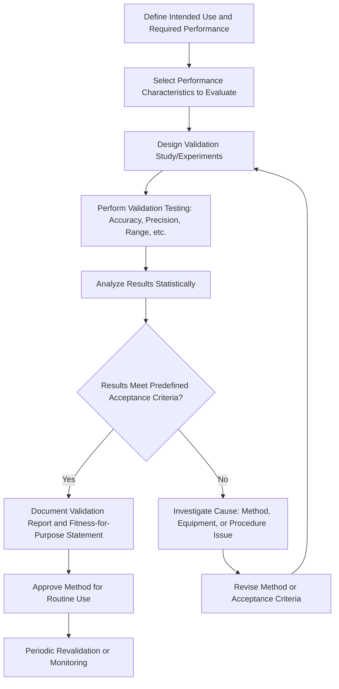

## Method Validation

### Definition and Purpose

Method validation is the documented process of confirming that a measurement, test, or calibration method is fit for its intended purpose, by demonstrating through objective evidence that the method meets specified performance requirements. Within precision metrology and quality control, method validation ensures that a chosen procedure — whether a standard method applied under modified conditions, a laboratory-developed method, or a non-standard method — produces results that are accurate, reliable, and defensible before it is relied upon for conformance decisions, calibration, or reporting.

### Key Points

- Method validation is distinct from **method verification**: validation establishes that a method is suitable for its intended use in the first instance (often required for non-standard, laboratory-developed, or modified standard methods), while verification confirms that a laboratory can correctly perform an already-validated standard method to its published performance claims.
- ISO/IEC 17025 requires laboratories to validate **non-standard methods, laboratory-developed methods, and standard methods used outside their intended scope**, and to verify that they can properly perform standard methods before introducing them into routine use.
- The extent of validation should be **proportional to the need and risk** associated with the method's application — a method used for critical safety decisions warrants more extensive validation than one used for low-consequence internal screening.
- Validation results must be documented in sufficient detail to demonstrate the method meets the requirements, including the validation procedure used, the criteria for acceptance, and a statement on the fitness of the method for its intended use.

### When Method Validation Is Required

| Method Type | Validation vs. Verification Required |
| --- | --- |
| Standard method used exactly as published, within its documented scope | Verification (confirm the laboratory can achieve the published performance) |
| Standard method used outside its documented scope (different range, matrix, or conditions) | Validation |
| Laboratory-developed (in-house) method | Full validation |
| Modified standard method | Validation of the modification's impact on performance |

### Method Performance Characteristics

Validation typically involves evaluating one or more of the following performance characteristics, selected based on the method's intended application:

**Accuracy**: The closeness of agreement between a measured value and a true or accepted reference value, typically evaluated using certified reference materials, reference standards, or comparison with an established reference method.

**Precision (Repeatability and Reproducibility)**:

- **Repeatability**: Variation in results obtained under the same conditions (same operator, equipment, location, short time interval).
- **Reproducibility**: Variation in results obtained under changed conditions (different operators, equipment, laboratories, or over an extended time period).
- Both are typically quantified statistically, commonly expressed as a standard deviation or coefficient of variation across repeated measurements.

**Measurement Range / Linearity**: The range over which the method produces results proportional to (or with a known, well-characterized relationship to) the true value, established by testing across the full intended operating range and confirming the response follows the expected relationship (commonly assessed via linear regression and residual analysis).

**Limit of Detection (LOD) and Limit of Quantitation (LOQ)**: The lowest value a method can reliably distinguish from background/noise (LOD) and the lowest value that can be quantified with acceptable accuracy and precision (LOQ) — most relevant to methods approaching a lower measurement boundary.

**Measurement Uncertainty**: Validation should feed directly into establishing a robust measurement uncertainty budget for the method, since the repeatability, reproducibility, and bias data gathered during validation are often direct inputs to the uncertainty analysis.

**Robustness**: The method's capacity to remain unaffected by small, deliberate variations in method parameters (e.g., minor environmental fluctuations, slight procedural timing variations), providing an indication of its reliability during normal, everyday use.

**Selectivity/Specificity**: Where relevant, the method's ability to produce a result that is specific to the property or characteristic intended to be measured, unaffected by other influences (more commonly emphasized in chemical/analytical testing contexts than in pure dimensional/mechanical metrology, but relevant where interference effects are plausible).

### Method Validation Process Flow (svg_diagram)

### Method Verification (for Standard Methods)

**Key Points**:

- Verification confirms that a laboratory, with its specific personnel, equipment, and environment, can achieve the performance already established and published for a standard method — it does not require re-establishing the method's fundamental performance characteristics from scratch, since these are already defined by the standard itself.
- Verification is typically demonstrated through a smaller-scale study than full validation: for example, confirming repeatability and bias against a known reference value using a limited number of replicate measurements, compared against the published method's stated performance.
- Verification should be repeated whenever there is a significant change in equipment, personnel, or conditions that could affect the laboratory's ability to continue meeting the standard method's published performance.

### Statistical Approaches Used in Validation

**Repeatability/Reproducibility Studies**: Multiple replicate measurements are taken under defined conditions, and statistical analysis (standard deviation, coefficient of variation, ANOVA for multi-factor studies such as Gauge R&R) quantifies the variation attributable to the method itself versus other sources.

**Bias/Trueness Assessment**: Comparison of the method's average result (from repeated measurements) against a certified or accepted reference value, often expressed as a percentage bias or an absolute offset, sometimes evaluated for statistical significance using a t-test against the reference value.

**Linearity Assessment**: Measurements taken at multiple points across the intended range, with results plotted against known reference values; linear regression analysis (slope, intercept, correlation coefficient, and residual pattern) evaluates whether the method's response remains proportionally consistent across the range.

**Uncertainty Budget Development**: Validation data (repeatability, reproducibility, bias) is combined with other identified uncertainty contributors following the GUM methodology to produce a documented measurement uncertainty estimate for the validated method.

### Gauge Repeatability and Reproducibility (Gauge R&R)

**Key Points**: Gauge R&R studies are a specific, widely used statistical method for validating measurement system performance in manufacturing quality control contexts, evaluating the proportion of total measurement variation attributable to the **measurement device** (repeatability, or equipment variation) versus the **operator/appraiser** (reproducibility, or appraiser variation), typically using multiple operators each measuring multiple parts multiple times. Results are commonly expressed as a percentage of tolerance or total variation consumed by measurement system variation, with generally accepted industry guidance suggesting under roughly 10% is acceptable, 10–30% may be acceptable depending on application criticality, and above 30% is generally considered unacceptable. [Inference — specific acceptance thresholds vary by industry standard (e.g., AIAG MSA methodology in automotive) and application criticality, so the applicable threshold should be confirmed against the governing quality system requirement.]

### Documentation Requirements for Validation Records

A complete method validation record typically includes:

- **Statement of intended use and scope** of the method being validated (materials, range, expected accuracy requirements).
- **Description of the validation design**, including which performance characteristics were evaluated and why.
- **Raw and summarized data** from the validation experiments, including statistical analysis performed.
- **Comparison against predefined acceptance criteria**, established before the validation study began (to avoid post-hoc criteria adjustment).
- **Formal conclusion/statement of fitness for intended use**, explicitly addressing whether the method meets the requirements for its intended application.
- **Approval record**, documenting the technical review and authorization to place the method into routine use.
- **Revalidation triggers and schedule**, where applicable, defining conditions (equipment change, significant procedural modification, extended non-use) that would require revalidation.

### Revalidation Triggers

**Key Points**: A validated method is not necessarily valid indefinitely without review — revalidation (full or partial) is generally warranted when:

- Significant changes are made to the method, equipment, or environmental conditions under which it is performed.
- The method is extended to a new range, material type, or application beyond its originally validated scope.
- Ongoing quality control data (e.g., control charts, proficiency testing results) indicates a shift in method performance.
- A significant period of non-use has elapsed, particularly for methods sensitive to equipment drift or procedural skill retention.

### Common Pitfalls in Method Validation

- **Confusing verification with validation**: applying only a brief verification-style check to a genuinely novel or modified method, when full validation (establishing performance characteristics from first principles) is actually required.
- **Setting acceptance criteria after seeing results**: defining or adjusting acceptance criteria based on the validation data obtained, rather than establishing them beforehand based on the intended application's actual requirements, undermines the objectivity and defensibility of the validation.
- **Insufficient sample size/replication**: drawing statistical conclusions (particularly about precision) from too few repeated measurements, leading to unreliable estimates of the method's true variability.
- **Neglecting the full intended range**: validating a method only at a single point or narrow range when it will be applied across a broader operating range in practice, missing potential non-linearity or range-dependent performance issues.
- **Failing to link validation results to the uncertainty budget**: treating validation as a standalone pass/fail exercise without feeding the resulting repeatability, reproducibility, and bias data into the method's formal measurement uncertainty evaluation.
- **No defined revalidation trigger**: allowing a validated method to remain in unreviewed use indefinitely despite significant equipment, personnel, or environmental changes that could invalidate the original validation conclusions.

### Conclusion

Method validation provides the documented, objective evidence that a measurement or calibration method genuinely performs as required for its intended application, forming a critical bridge between raw measurement capability and defensible, traceable quality decisions. Distinguishing clearly between full validation (for novel, modified, or out-of-scope methods) and simpler verification (for standard methods used as published), and rigorously linking validation results into the laboratory's measurement uncertainty framework, ensures that method performance claims are both statistically sound and properly integrated into the broader calibration and quality management system.

**Related Topics**:

- ISO/IEC 17025 accreditation requirements
- Measurement uncertainty analysis (GUM methodology)
- Calibration procedures and records
- Statistical process control in quality management
- Gauge repeatability and reproducibility (Gauge R&R) studies
- Proficiency testing and interlaboratory comparisons
- Measurement traceability and the SI system