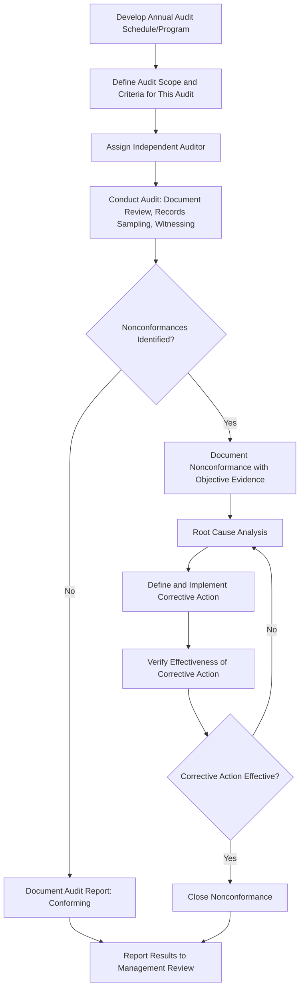

## Internal Audits of Calibration Systems

### Definition and Purpose

Internal audits of calibration systems are systematic, independent examinations conducted by an organization's own personnel to determine whether its calibration program continues to conform to planned arrangements, documented procedures, applicable standards (such as ISO/IEC 17025), and regulatory or customer requirements, and whether it is being effectively implemented and maintained. Unlike external accreditation assessments performed by a third-party accreditation body, internal audits are a self-driven quality assurance mechanism intended to detect and correct weaknesses before they are found by an external assessor, a customer, or — worse — through a measurement failure with downstream consequences.

### Key Points

- Internal audits are a mandatory element of ISO/IEC 17025 and similar quality management frameworks, requiring the laboratory to conduct internal audits at planned intervals to provide information on whether the management system conforms to the laboratory's own requirements and the requirements of the standard, and is effectively implemented and maintained.
- Internal audits must be conducted by personnel who are **independent of the activity being audited** wherever practicable — auditors should not audit their own work, to preserve objectivity of the findings.
- Audits should cover **all elements** of the calibration management system over an appropriate cycle, including technical activities (procedures, records, traceability, uncertainty) and management system elements (document control, corrective action, training records).
- Findings from internal audits feed directly into corrective action processes and, ultimately, management review, forming a closed-loop continuous improvement cycle rather than a standalone compliance exercise.

### Types of Internal Audits

**System/Management Audits**: Focus on the overall management system structure — document control, record retention, personnel competence records, training programs, and adherence to defined organizational procedures and responsibilities.

**Technical/Process Audits**: Focus on the actual technical execution of calibration activities — verifying that procedures are being followed correctly, calibration data (as-found/as-left) is properly recorded, uncertainty calculations are performed correctly, and traceability documentation is complete and accurate for a sample of calibration records.

**Witnessed Audits**: Involve direct observation of a technician performing a calibration in real time, verifying that the documented procedure is actually followed in practice, not merely that the resulting paperwork appears compliant.

**Horizontal (Cross-Cutting) Audits**: Trace a single theme or requirement (e.g., traceability, or out-of-tolerance handling) across multiple instrument types, technicians, or sites to assess consistency of application throughout the organization.

**Vertical (Deep-Dive) Audits**: Follow a single calibration event from initial scheduling through execution, recording, review, and reporting/certificate issuance, verifying every step of that specific instance in detail.

### Internal Audit Process Flow (svg_diagram)

### Audit Planning and Scheduling

**Key Points**:

- An **annual audit program/schedule** should define which elements of the calibration system will be audited, when, and by whom, ensuring the entire system is covered over a defined cycle (commonly annually, though specific elements may be audited more or less frequently based on risk).
- Audit scheduling should consider the **status and importance of the processes/areas** being audited, as well as results of previous audits — areas with a history of findings or higher criticality generally warrant more frequent or in-depth audit attention.
- Audit criteria (the specific requirements against which conformance is being assessed) must be clearly defined before the audit begins, typically referencing the applicable standard clause, internal procedure, or regulatory requirement.

### Auditor Independence and Competence

**Key Points**:

- Auditors must be independent of the activity being audited — a technician cannot audit their own calibration work, and ideally audits are performed by personnel from a different department, role, or, for smaller organizations, potentially by suitably trained personnel with no direct involvement in the specific activities under review.
- Internal auditors require appropriate training in audit techniques (evidence-gathering, interviewing, objective reporting) as well as sufficient technical understanding of calibration principles, traceability, and uncertainty to meaningfully evaluate technical records and observed practices.
- For smaller organizations where full independence is difficult to achieve, documented measures to minimize bias (such as using an external contracted auditor for certain elements, or cross-auditing between similarly sized departments) may be necessary.

### Sampling Approach for Records Review

**Key Points**:

- Because reviewing every single calibration record is often impractical, internal audits typically employ a **representative sampling approach**, selecting records across different instrument types, technicians, time periods, and (where applicable) sites to provide reasonable assurance of overall system conformance.
- Sample selection should be structured to increase the likelihood of detecting systemic issues rather than being purely random — for example, deliberately including records from newer technicians, less frequently performed calibration types, or areas flagged in previous audits or customer complaints.
- The specific sample size and selection method should be documented and justified within the internal audit procedure, ensuring consistency and defensibility of the audit approach. [Inference — specific sample size determination methods vary by organizational practice and are not universally prescribed by the standard itself, so the chosen approach should be documented and risk-justified.]

### Common Areas of Focus in Calibration System Audits

| Audit Focus Area | Typical Verification Points |
| --- | --- |
| Equipment register/inventory | Completeness, accuracy of status/due dates, unique identification present |
| Calibration procedures | Current approved revision in use, technically complete, properly followed |
| Calibration records | As-found/as-left data present, uncertainty documented, correct reference standard identified |
| Traceability | Unbroken chain to SI units, reference standard certificates current and valid |
| Out-of-tolerance handling | Impact assessment performed and documented, notification records where applicable |
| Personnel competence | Training records current, authorization documentation complete |
| Environmental conditions | Monitoring records present, conditions within specified limits during calibrations |
| Document control | Only current approved procedure revisions accessible/in use; obsolete versions controlled |
| Interval review | Evidence of periodic interval review based on historical performance data |

### Nonconformance Classification

**Key Points**: Internal audit findings are often classified by severity to guide the urgency and rigor of the corrective action response:

- **Major nonconformance**: A significant failure that could compromise the validity of results, traceability, or overall system integrity (e.g., use of an uncalibrated reference standard, missing uncertainty evaluation, or a broken traceability chain).
- **Minor nonconformance**: A localized or isolated deviation from a requirement that does not, by itself, invalidate results but indicates a process weakness (e.g., a single missing signature, a minor documentation gap).
- **Observation/opportunity for improvement**: Not a nonconformance against a specific requirement, but a suggestion for enhancing efficiency, clarity, or robustness of the system.

### Corrective Action Following Internal Audit Findings

**Key Points**:

- Every documented nonconformance requires **root cause analysis** — determining the underlying reason for the deviation, rather than addressing only the immediate symptom, to prevent recurrence.
- Corrective action must be **verified for effectiveness** after implementation, typically through a follow-up review or targeted re-audit, before the nonconformance is formally closed.
- Where an internal audit finding reveals a potential impact on previously issued calibration results or certificates, this may itself trigger a form of out-of-tolerance-style impact investigation, assessing whether affected customers or stakeholders need to be notified.

### Relationship to Management Review

**Key Points**: Internal audit results are a **required input to management review**, the periodic (commonly annual) evaluation by top management of the calibration system's continuing suitability, adequacy, and effectiveness. Trends across multiple audit cycles — recurring nonconformance types, areas of consistent strength, resource adequacy — inform strategic decisions about the calibration program, such as staffing, equipment investment, procedure revision priorities, or training needs.

### Internal Audits vs. External Accreditation Assessments

| Aspect | Internal Audit | External Accreditation Assessment |
| --- | --- | --- |
| Performed by | Organization's own (independent) personnel | Accreditation body assessors |
| Frequency | Typically annual, per internal schedule | Typically annual surveillance, full reassessment every 2–4 years |
| Primary purpose | Self-detection and correction of system weaknesses | Independent verification for accreditation status |
| Consequence of major findings | Internal corrective action process | Can affect accreditation status/suspension if unresolved |
| Scope flexibility | Organization defines scope/schedule | Defined by accreditation body's assessment plan and accredited scope |

### Common Pitfalls in Internal Audit Programs

- **Auditor lack of independence**: allowing personnel to audit their own work, or work closely supervised by them, undermines the objectivity and value of the audit findings.
- **Superficial document-only review**: relying solely on reviewing paperwork without witnessing actual calibration activities can miss discrepancies between documented procedure and actual practice.
- **Inconsistent or undocumented sampling rationale**: failing to define and justify how records were selected for review weakens the defensibility of audit conclusions during external assessment.
- **Findings without effective corrective action follow-through**: identifying nonconformances but failing to verify that corrective actions were actually implemented and effective allows the same issues to recur across audit cycles.
- **Treating internal audits as a compliance formality**: conducting audits primarily to satisfy the "internal audit" checkbox requirement, rather than genuinely seeking to identify and improve system weaknesses, undermines the audit's core purpose.
- **Failing to cover the full system over the audit cycle**: focusing repeatedly on the same easy-to-audit areas while neglecting less visible or more technically complex elements (e.g., uncertainty calculation methodology) leaves systemic gaps undetected.

### Conclusion

Internal audits of calibration systems provide the essential self-check mechanism that allows an organization to detect and correct weaknesses in its calibration program before they are identified externally or, more seriously, before they result in undetected measurement error affecting product quality or customer trust. Effective internal audit programs depend on genuine auditor independence, representative and well-justified record sampling, direct witnessing of technical activities where practical, and — critically — rigorous root-cause-driven corrective action with verified effectiveness, closing the loop back into management review and continuous system improvement.

**Next Steps**:

- ISO/IEC 17025 accreditation requirements
- Calibration procedures and records
- Out of tolerance handling
- Corrective and preventive action (CAPA) systems
- Method validation
- Measurement uncertainty analysis (GUM methodology)
- Document control within quality management systems